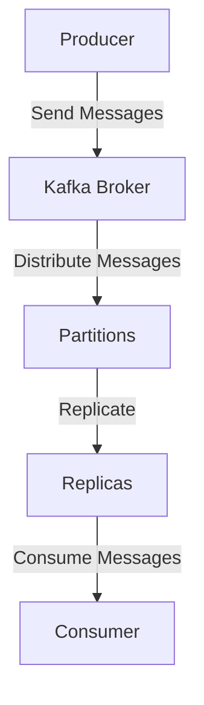

## 3.1.2 Configuration Tuning for Performance

Optimizing Apache Kafka for performance is crucial for building scalable, fault-tolerant systems that handle real-time data processing efficiently. This section delves into the key configuration parameters that influence Kafka's performance, offering expert recommendations tailored to different workload profiles. We will also explore how to monitor and adjust these configurations over time and provide insights into performance benchmarking techniques.

### Key Configuration Parameters Affecting Performance

#### Broker Configuration

1. **Log Segment Size (`log.segment.bytes`)**:
   - **Description**: Determines the size of a single log segment file.
   - **Recommendation**: Set this value based on your disk I/O capacity and the expected message size. A larger segment size can reduce the frequency of log segment creation, which can improve throughput but may increase recovery time after a failure.

2. **Log Retention (`log.retention.hours`, `log.retention.bytes`)**:
   - **Description**: Controls how long logs are retained before being deleted.
   - **Recommendation**: Adjust retention settings based on your data retention policy and storage capacity. For high-throughput systems, ensure that retention settings do not lead to excessive disk usage.

3. **Replication Factor (`replication.factor`)**:
   - **Description**: Defines the number of copies of each partition across the cluster.
   - **Recommendation**: A higher replication factor increases fault tolerance but also requires more resources. Balance between data safety and resource availability.

4. **In-Sync Replicas (`min.insync.replicas`)**:
   - **Description**: The minimum number of replicas that must acknowledge a write for it to be considered successful.
   - **Recommendation**: Set this to a value that ensures data durability while considering the trade-off with write latency.

5. **Network Threads (`num.network.threads`)**:
   - **Description**: The number of threads handling network requests.
   - **Recommendation**: Increase this value for high network traffic scenarios to improve throughput.

6. **I/O Threads (`num.io.threads`)**:
   - **Description**: The number of threads handling disk I/O.
   - **Recommendation**: Align this with the number of physical disks to optimize disk throughput.

#### Producer Configuration

1. **Batch Size (`batch.size`)**:
   - **Description**: The maximum size of a batch of records.
   - **Recommendation**: Larger batch sizes can improve throughput by reducing the number of requests but may increase latency.

2. **Linger Time (`linger.ms`)**:
   - **Description**: The time to wait before sending a batch.
   - **Recommendation**: Increase this value to allow more records to accumulate in a batch, improving throughput at the cost of latency.

3. **Compression Type (`compression.type`)**:
   - **Description**: The compression algorithm used for data.
   - **Recommendation**: Use compression (e.g., `gzip`, `snappy`) to reduce network bandwidth usage, especially for large messages.

4. **Acks (`acks`)**:
   - **Description**: The number of acknowledgments the producer requires before considering a request complete.
   - **Recommendation**: Set to `all` for maximum durability, ensuring that all replicas acknowledge the write.

#### Consumer Configuration

1. **Fetch Size (`fetch.min.bytes`, `fetch.max.bytes`)**:
   - **Description**: Controls the minimum and maximum amount of data fetched in a single request.
   - **Recommendation**: Adjust these values based on the expected message size and network capacity to optimize throughput.

2. **Max Poll Records (`max.poll.records`)**:
   - **Description**: The maximum number of records returned in a single poll.
   - **Recommendation**: Increase this value to improve throughput, especially for high-volume topics.

3. **Session Timeout (`session.timeout.ms`)**:
   - **Description**: The time a consumer can be inactive before being considered dead.
   - **Recommendation**: Set this value based on the expected processing time of messages to avoid unnecessary rebalancing.

4. **Auto Commit Interval (`auto.commit.interval.ms`)**:
   - **Description**: The frequency at which the consumer offsets are committed.
   - **Recommendation**: Increase this interval to reduce the overhead of committing offsets frequently, but ensure it aligns with your data loss tolerance.

### Recommendations for Settings Based on Workload Profiles

#### High Throughput Workloads

- **Broker**: Increase `log.segment.bytes` and `num.io.threads` to handle large volumes of data efficiently.
- **Producer**: Use larger `batch.size` and `linger.ms` to maximize throughput.
- **Consumer**: Set higher `fetch.max.bytes` and `max.poll.records` to process large batches of messages.

#### Low Latency Workloads

- **Broker**: Optimize `num.network.threads` to handle rapid network requests.
- **Producer**: Minimize `linger.ms` to reduce latency.
- **Consumer**: Decrease `fetch.min.bytes` to ensure timely message processing.

#### Fault-Tolerant Workloads

- **Broker**: Increase `replication.factor` and `min.insync.replicas` for enhanced data durability.
- **Producer**: Set `acks` to `all` to ensure all replicas acknowledge writes.
- **Consumer**: Use a higher `session.timeout.ms` to prevent premature consumer group rebalancing.

### Monitoring and Adjusting Configurations Over Time

1. **Use Metrics and Monitoring Tools**: Leverage tools like Prometheus and Grafana to monitor Kafka metrics such as throughput, latency, and error rates. Regularly review these metrics to identify performance bottlenecks.

2. **Adjust Based on Workload Changes**: As your workload evolves, revisit your configuration settings. For instance, if your message size increases, you may need to adjust `batch.size` and `fetch.max.bytes`.

3. **Conduct Regular Performance Reviews**: Schedule periodic reviews of your Kafka setup to ensure it aligns with your current performance requirements. This includes revisiting retention policies and replication factors.

### Performance Benchmarking Techniques

1. **Load Testing**: Use tools like Apache JMeter or Kafka's own performance testing scripts to simulate load and measure Kafka's performance under different configurations.

2. **Capacity Planning**: Regularly assess your Kafka cluster's capacity to handle peak loads. This involves analyzing historical data and forecasting future growth.

3. **Scenario-Based Testing**: Test Kafka's performance under various scenarios, such as network failures or disk I/O spikes, to ensure your configurations can handle unexpected events.

### Code Examples

To illustrate how configuration tuning can be applied, let's explore some code examples in Java, Scala, Kotlin, and Clojure.

#### Java Example

```java
import org.apache.kafka.clients.producer.KafkaProducer;
import org.apache.kafka.clients.producer.ProducerConfig;
import org.apache.kafka.clients.producer.ProducerRecord;
import org.apache.kafka.common.serialization.StringSerializer;

import java.util.Properties;

public class KafkaProducerExample {
    public static void main(String[] args) {
        Properties props = new Properties();
        props.put(ProducerConfig.BOOTSTRAP_SERVERS_CONFIG, "localhost:9092");
        props.put(ProducerConfig.KEY_SERIALIZER_CLASS_CONFIG, StringSerializer.class.getName());
        props.put(ProducerConfig.VALUE_SERIALIZER_CLASS_CONFIG, StringSerializer.class.getName());
        props.put(ProducerConfig.BATCH_SIZE_CONFIG, 16384); // Increase batch size for throughput
        props.put(ProducerConfig.LINGER_MS_CONFIG, 10); // Increase linger time for batching
        props.put(ProducerConfig.COMPRESSION_TYPE_CONFIG, "gzip"); // Use compression

        KafkaProducer<String, String> producer = new KafkaProducer<>(props);
        for (int i = 0; i < 100; i++) {
            producer.send(new ProducerRecord<>("my-topic", Integer.toString(i), "message-" + i));
        }
        producer.close();
    }
}
```

#### Scala Example

```scala
import org.apache.kafka.clients.producer.{KafkaProducer, ProducerConfig, ProducerRecord}
import org.apache.kafka.common.serialization.StringSerializer

import java.util.Properties

object KafkaProducerExample extends App {
  val props = new Properties()
  props.put(ProducerConfig.BOOTSTRAP_SERVERS_CONFIG, "localhost:9092")
  props.put(ProducerConfig.KEY_SERIALIZER_CLASS_CONFIG, classOf[StringSerializer].getName)
  props.put(ProducerConfig.VALUE_SERIALIZER_CLASS_CONFIG, classOf[StringSerializer].getName)
  props.put(ProducerConfig.BATCH_SIZE_CONFIG, "16384") // Increase batch size for throughput
  props.put(ProducerConfig.LINGER_MS_CONFIG, "10") // Increase linger time for batching
  props.put(ProducerConfig.COMPRESSION_TYPE_CONFIG, "gzip") // Use compression

  val producer = new KafkaProducer[String, String](props)
  for (i <- 0 until 100) {
    producer.send(new ProducerRecord[String, String]("my-topic", i.toString, s"message-$i"))
  }
  producer.close()
}
```

#### Kotlin Example

```kotlin
import org.apache.kafka.clients.producer.KafkaProducer
import org.apache.kafka.clients.producer.ProducerConfig
import org.apache.kafka.clients.producer.ProducerRecord
import org.apache.kafka.common.serialization.StringSerializer
import java.util.Properties

fun main() {
    val props = Properties().apply {
        put(ProducerConfig.BOOTSTRAP_SERVERS_CONFIG, "localhost:9092")
        put(ProducerConfig.KEY_SERIALIZER_CLASS_CONFIG, StringSerializer::class.java.name)
        put(ProducerConfig.VALUE_SERIALIZER_CLASS_CONFIG, StringSerializer::class.java.name)
        put(ProducerConfig.BATCH_SIZE_CONFIG, 16384) // Increase batch size for throughput
        put(ProducerConfig.LINGER_MS_CONFIG, 10) // Increase linger time for batching
        put(ProducerConfig.COMPRESSION_TYPE_CONFIG, "gzip") // Use compression
    }

    KafkaProducer<String, String>(props).use { producer ->
        for (i in 0 until 100) {
            producer.send(ProducerRecord("my-topic", i.toString(), "message-$i"))
        }
    }
}
```

#### Clojure Example

```clojure
(require '[clojure.java.io :as io])
(import '[org.apache.kafka.clients.producer KafkaProducer ProducerConfig ProducerRecord]
        '[org.apache.kafka.common.serialization StringSerializer])

(defn create-producer []
  (let [props (doto (java.util.Properties.)
                (.put ProducerConfig/BOOTSTRAP_SERVERS_CONFIG "localhost:9092")
                (.put ProducerConfig/KEY_SERIALIZER_CLASS_CONFIG StringSerializer)
                (.put ProducerConfig/VALUE_SERIALIZER_CLASS_CONFIG StringSerializer)
                (.put ProducerConfig/BATCH_SIZE_CONFIG 16384) ; Increase batch size for throughput
                (.put ProducerConfig/LINGER_MS_CONFIG 10) ; Increase linger time for batching
                (.put ProducerConfig/COMPRESSION_TYPE_CONFIG "gzip"))] ; Use compression
    (KafkaProducer. props)))

(defn send-messages [producer]
  (doseq [i (range 100)]
    (.send producer (ProducerRecord. "my-topic" (str i) (str "message-" i)))))

(defn -main []
  (let [producer (create-producer)]
    (send-messages producer)
    (.close producer)))
```

### Visualizing Kafka Configuration

To better understand how these configurations interact within a Kafka cluster, consider the following diagram illustrating Kafka's architecture and data flow:



**Caption**: This diagram represents the flow of data from producers to consumers in a Kafka cluster, highlighting the role of brokers, partitions, and replicas.

### References and Links

- For more detailed information on Kafka configurations, refer to the [Apache Kafka Documentation](https://kafka.apache.org/documentation/).
- To explore Kafka's performance tuning in depth, visit the [Confluent Documentation](https://docs.confluent.io/).

### Knowledge Check

To reinforce your understanding of Kafka configuration tuning, consider the following questions:

1. What is the impact of increasing the `log.segment.bytes` configuration on a Kafka broker?
2. How does the `linger.ms` setting affect producer performance?
3. Why is it important to monitor Kafka metrics regularly?
4. What are the trade-offs of setting a high replication factor in Kafka?
5. How can you use Apache JMeter for Kafka performance testing?

### Embrace the Journey

Optimizing Kafka configurations is an ongoing process that requires a deep understanding of your system's workload and performance requirements. By applying the techniques discussed in this section, you can ensure that your Kafka deployment is both efficient and resilient, capable of handling the demands of modern data processing applications.

---

## Test Your Knowledge: Advanced Kafka Configuration Tuning Quiz



### What is the primary benefit of increasing the `batch.size` in Kafka producers?

- [x] It improves throughput by reducing the number of requests.
- [ ] It decreases latency by sending messages faster.
- [ ] It reduces disk usage on the broker.
- [ ] It enhances message durability.

> **Explanation:** Increasing the `batch.size` allows more records to be sent in a single request, improving throughput by reducing the number of requests sent to the broker.

### How does the `linger.ms` configuration affect Kafka producer performance?

- [x] It allows more records to accumulate before sending, improving throughput.
- [ ] It decreases the time taken to send each message.
- [ ] It increases the durability of messages.
- [ ] It reduces the network bandwidth used.

> **Explanation:** The `linger.ms` setting allows the producer to wait for additional records to accumulate before sending a batch, which can improve throughput at the cost of increased latency.

### What is the role of `min.insync.replicas` in Kafka?

- [x] It ensures a minimum number of replicas acknowledge a write for it to be successful.
- [ ] It determines the maximum number of replicas for a partition.
- [ ] It sets the number of consumers that can read from a partition.
- [ ] It controls the retention period of messages.

> **Explanation:** The `min.insync.replicas` setting ensures that a minimum number of replicas must acknowledge a write for it to be considered successful, enhancing data durability.

### Why is it important to regularly monitor Kafka metrics?

- [x] To identify performance bottlenecks and optimize configurations.
- [ ] To increase the number of partitions automatically.
- [ ] To reduce the number of consumer groups.
- [ ] To ensure messages are sent in order.

> **Explanation:** Regularly monitoring Kafka metrics helps identify performance bottlenecks and allows for optimization of configurations to improve system performance.

### What is a potential drawback of setting a high replication factor in Kafka?

- [x] It requires more resources and can increase write latency.
- [ ] It decreases the fault tolerance of the system.
- [ ] It reduces the number of available partitions.
- [ ] It limits the number of consumer groups.

> **Explanation:** A high replication factor increases fault tolerance but requires more resources and can increase write latency due to the need for more replicas to acknowledge writes.

### Which tool can be used for load testing Kafka performance?

- [x] Apache JMeter
- [ ] Apache Spark
- [ ] Apache Flink
- [ ] Apache NiFi

> **Explanation:** Apache JMeter is a tool that can be used for load testing Kafka performance by simulating various load scenarios.

### How does increasing `fetch.max.bytes` affect Kafka consumers?

- [x] It allows consumers to fetch larger batches of messages, improving throughput.
- [ ] It decreases the time taken to process each message.
- [ ] It increases the durability of messages.
- [ ] It reduces the network bandwidth used.

> **Explanation:** Increasing `fetch.max.bytes` allows consumers to fetch larger batches of messages in a single request, which can improve throughput.

### What is the impact of setting `acks` to `all` in Kafka producers?

- [x] It ensures maximum durability by requiring all replicas to acknowledge writes.
- [ ] It decreases the time taken to send each message.
- [ ] It increases the number of partitions available.
- [ ] It reduces the network bandwidth used.

> **Explanation:** Setting `acks` to `all` ensures maximum durability by requiring all replicas to acknowledge writes before considering the request complete.

### How can Kafka's performance be tested under various scenarios?

- [x] By conducting scenario-based testing to simulate different conditions.
- [ ] By increasing the number of partitions automatically.
- [ ] By reducing the number of consumer groups.
- [ ] By ensuring messages are sent in order.

> **Explanation:** Scenario-based testing involves simulating different conditions, such as network failures or disk I/O spikes, to test Kafka's performance under various scenarios.

### True or False: Increasing `num.io.threads` in Kafka brokers can improve disk throughput.

- [x] True
- [ ] False

> **Explanation:** Increasing `num.io.threads` can improve disk throughput by allowing more threads to handle disk I/O operations, which is beneficial for high-throughput workloads.


