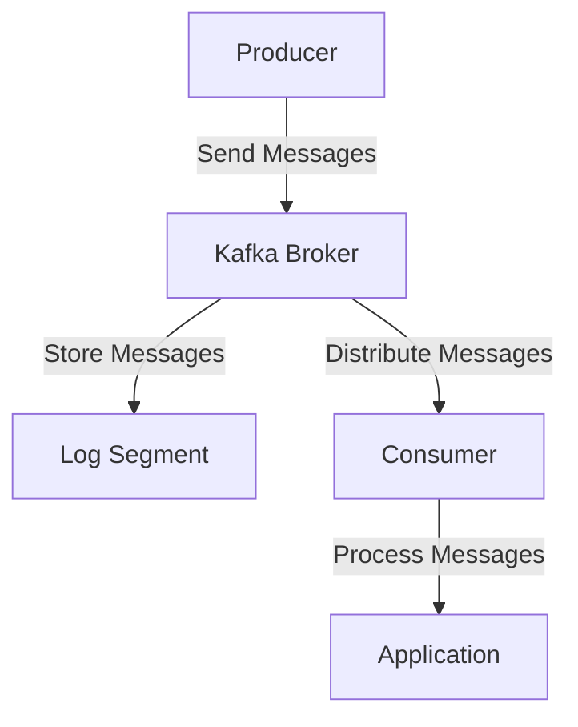

## 3.1 Installation and Configuration Best Practices

Apache Kafka is a powerful distributed event streaming platform capable of handling trillions of events a day. To harness its full potential, it's crucial to install and configure Kafka correctly, whether you're deploying it on-premises or in the cloud. This section provides a comprehensive guide to best practices for installing and configuring Kafka, ensuring optimal performance and reliability.

### Introduction to Kafka Installation

Installing Kafka involves setting up its core components: brokers, ZooKeeper (or KRaft for newer versions), and clients. The installation process varies depending on the deployment environment, such as on-premises or cloud-based solutions. 

#### Key Components

- **Kafka Broker**: The server that stores and serves data.
- **ZooKeeper**: Manages and coordinates Kafka brokers (optional with KRaft).
- **Kafka Clients**: Producers and consumers that interact with the Kafka cluster.

### Installing Kafka On-Premises

#### Prerequisites

Before installing Kafka on-premises, ensure you have the following:

- **Java Development Kit (JDK)**: Kafka requires Java 8 or later.
- **Sufficient Disk Space**: Kafka's performance heavily relies on disk I/O.
- **Network Configuration**: Ensure proper network settings for broker communication.

#### Installation Steps

1. **Download Kafka**: Obtain the latest stable version from the [Apache Kafka Downloads](https://kafka.apache.org/downloads) page.

2. **Extract Kafka**: Unzip the downloaded file to your desired directory.

3. **Configure Kafka Broker**: Edit the `server.properties` file to set broker-specific configurations.

    ```properties
    # server.properties
    broker.id=0
    listeners=PLAINTEXT://:9092
    log.dirs=/var/lib/kafka/logs
    num.partitions=3
    ```

4. **Start ZooKeeper**: If using ZooKeeper, start it using the provided script.

    ```bash
    bin/zookeeper-server-start.sh config/zookeeper.properties
    ```

5. **Start Kafka Broker**: Launch the Kafka broker.

    ```bash
    bin/kafka-server-start.sh config/server.properties
    ```

6. **Verify Installation**: Use Kafka's command-line tools to create a topic and test message production and consumption.

#### Configuration Best Practices

- **Broker ID**: Ensure each broker has a unique `broker.id`.
- **Log Directories**: Use multiple disks for log directories to improve performance.
- **Replication Factor**: Set a replication factor greater than one for fault tolerance.

### Installing Kafka in the Cloud

Cloud environments offer scalability and flexibility, making them ideal for Kafka deployments. Popular cloud providers include AWS, Azure, and Google Cloud Platform.

#### AWS Installation

1. **Amazon MSK**: Use Amazon Managed Streaming for Apache Kafka (MSK) for a fully managed Kafka service.

2. **EC2 Deployment**: Alternatively, deploy Kafka on EC2 instances for more control.

    - **Launch EC2 Instances**: Choose instances with high I/O performance.
    - **Install Kafka**: Follow the on-premises installation steps on each instance.
    - **Configure Security Groups**: Ensure proper network access between instances.

#### Azure Installation

1. **Azure Event Hubs for Kafka**: Use Azure Event Hubs with Kafka protocol support for a managed solution.

2. **AKS Deployment**: Deploy Kafka on Azure Kubernetes Service (AKS) for containerized environments.

    - **Create AKS Cluster**: Set up a Kubernetes cluster on Azure.
    - **Deploy Kafka**: Use Helm charts or Kubernetes operators to deploy Kafka.

#### Google Cloud Platform Installation

1. **GKE Deployment**: Deploy Kafka on Google Kubernetes Engine (GKE).

    - **Create GKE Cluster**: Set up a Kubernetes cluster on GCP.
    - **Deploy Kafka**: Use Kubernetes operators like Strimzi for Kafka deployment.

#### Configuration Best Practices for Cloud

- **Network Configuration**: Use Virtual Private Clouds (VPCs) for secure communication.
- **Auto-Scaling**: Leverage cloud auto-scaling features to handle variable workloads.
- **Monitoring and Logging**: Integrate with cloud-native monitoring tools for observability.

### Configuration Settings for Production Environments

Configuring Kafka for production involves tuning various parameters to ensure high availability, performance, and security.

#### Key Configuration Parameters

- **Replication Factor**: Set to at least 3 for fault tolerance.
- **Partitions**: Increase the number of partitions for parallelism.
- **Retention Policies**: Configure data retention based on business needs.

#### Performance Optimization

- **Compression**: Enable compression for messages to reduce network usage.
- **Batching**: Use larger batch sizes for producers to improve throughput.
- **Acks**: Set `acks=all` for strong durability guarantees.

#### Security Configuration

- **SSL/TLS**: Enable SSL/TLS for encrypted communication.
- **SASL Authentication**: Use SASL for secure authentication.
- **Access Control**: Implement Access Control Lists (ACLs) for fine-grained access control.

### Differences Between On-Premises and Cloud Deployments

- **Scalability**: Cloud deployments offer easier scalability compared to on-premises.
- **Cost**: On-premises may have higher upfront costs, while cloud incurs ongoing expenses.
- **Management**: Cloud providers offer managed services, reducing operational overhead.

### Tips for Optimizing Kafka Configurations

- **Monitor Performance**: Regularly monitor Kafka metrics using tools like Prometheus and Grafana.
- **Tune JVM Settings**: Adjust JVM heap size and garbage collection settings for optimal performance.
- **Disk Management**: Use SSDs for Kafka logs to improve I/O performance.

### Visualizing Kafka Architecture

To better understand Kafka's architecture and data flow, consider the following diagram:



**Caption**: This diagram illustrates the flow of messages from producers to Kafka brokers, where they are stored in log segments, and finally consumed by applications.

### Knowledge Check

To reinforce your understanding of Kafka installation and configuration, consider the following questions:

- What are the key differences between on-premises and cloud Kafka deployments?
- How does enabling compression affect Kafka performance?
- Why is it important to set a replication factor greater than one?

### Conclusion

Installing and configuring Apache Kafka requires careful consideration of the deployment environment and specific use cases. By following best practices outlined in this guide, you can ensure a robust and efficient Kafka setup, whether on-premises or in the cloud. For more detailed information on Kafka's architecture, refer to [2.1 Kafka Clusters and Brokers]( "Kafka Clusters and Brokers").

---

## Test Your Knowledge: Kafka Installation and Configuration Best Practices Quiz



### What is the primary advantage of using Amazon MSK for Kafka deployments?

- [x] It provides a fully managed Kafka service.
- [ ] It offers the lowest cost option.
- [ ] It requires no configuration.
- [ ] It is the only option for deploying Kafka on AWS.

> **Explanation:** Amazon MSK is a fully managed Kafka service, which simplifies deployment and management, allowing users to focus on application development.

### Which configuration setting is critical for ensuring message durability in Kafka?

- [x] acks=all
- [ ] num.partitions=1
- [ ] log.retention.hours=24
- [ ] compression.type=none

> **Explanation:** Setting `acks=all` ensures that all replicas acknowledge the message before it is considered successfully written, providing strong durability guarantees.

### What is the recommended replication factor for production Kafka environments?

- [x] At least 3
- [ ] 1
- [ ] 2
- [ ] 4

> **Explanation:** A replication factor of at least 3 is recommended for fault tolerance, ensuring data availability even if some brokers fail.

### How does enabling SSL/TLS benefit Kafka deployments?

- [x] It encrypts communication between clients and brokers.
- [ ] It increases message throughput.
- [ ] It reduces latency.
- [ ] It simplifies configuration.

> **Explanation:** Enabling SSL/TLS encrypts the data in transit, enhancing the security of Kafka deployments by preventing unauthorized access.

### What is the role of ZooKeeper in Kafka deployments?

- [x] It manages and coordinates Kafka brokers.
- [ ] It stores Kafka messages.
- [ ] It processes Kafka streams.
- [ ] It provides a user interface for Kafka.

> **Explanation:** ZooKeeper is used to manage and coordinate Kafka brokers, handling tasks such as leader election and configuration management.

### Which cloud provider offers Azure Event Hubs for Kafka?

- [x] Microsoft Azure
- [ ] Amazon Web Services
- [ ] Google Cloud Platform
- [ ] IBM Cloud

> **Explanation:** Azure Event Hubs is a managed service provided by Microsoft Azure that supports the Kafka protocol.

### What is a key benefit of deploying Kafka on Kubernetes?

- [x] It allows for containerized deployment and management.
- [ ] It eliminates the need for ZooKeeper.
- [ ] It provides built-in monitoring tools.
- [ ] It reduces the need for network configuration.

> **Explanation:** Deploying Kafka on Kubernetes allows for containerized deployment, which simplifies management and scaling of Kafka clusters.

### Why is it important to monitor Kafka metrics?

- [x] To identify performance bottlenecks and optimize configurations.
- [ ] To reduce the need for hardware upgrades.
- [ ] To eliminate the need for security configurations.
- [ ] To increase message retention time.

> **Explanation:** Monitoring Kafka metrics helps identify performance bottlenecks and optimize configurations, ensuring efficient operation of the Kafka cluster.

### What is the impact of using SSDs for Kafka logs?

- [x] It improves I/O performance.
- [ ] It increases message retention time.
- [ ] It reduces network latency.
- [ ] It simplifies configuration.

> **Explanation:** Using SSDs for Kafka logs improves I/O performance, which is critical for high-throughput Kafka deployments.

### True or False: Kafka can be deployed without ZooKeeper using the KRaft architecture.

- [x] True
- [ ] False

> **Explanation:** The KRaft architecture allows Kafka to be deployed without ZooKeeper, simplifying the architecture and reducing dependencies.



---
