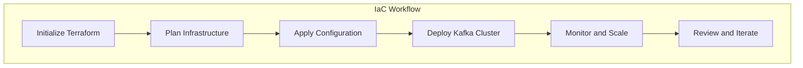

## 3.3.2 Best Practices for Infrastructure as Code

Infrastructure as Code (IaC) is a pivotal practice in modern software engineering, enabling teams to manage and provision infrastructure through code. This approach is particularly beneficial for deploying complex systems like Apache Kafka, where consistency, repeatability, and scalability are crucial. In this section, we delve into best practices for maintaining IaC codebases, focusing on version control, project structuring, testing, and collaboration strategies to ensure reliable Kafka deployments.

### Importance of Version Control for Infrastructure Code

Version control is the backbone of any software development process, and its significance extends to infrastructure code. By using version control systems (VCS) like Git, teams can track changes, collaborate effectively, and maintain a history of infrastructure configurations.

#### Key Benefits of Version Control in IaC

- **Traceability**: Every change to the infrastructure code is recorded, providing a clear history of modifications and the ability to revert to previous states if necessary.
- **Collaboration**: Multiple team members can work on the same codebase simultaneously, with mechanisms to handle conflicts and merge changes.
- **Auditability**: Version control provides an audit trail, which is essential for compliance and security purposes.
- **Disaster Recovery**: In the event of an error or failure, version control allows teams to quickly roll back to a known good state.

#### Best Practices for Version Control

1. **Use Branching Strategies**: Implement branching strategies such as Git Flow or trunk-based development to manage changes and releases effectively.
2. **Commit Frequently**: Encourage frequent commits with descriptive messages to capture the rationale behind changes.
3. **Tag Releases**: Use tags to mark stable releases of infrastructure configurations, facilitating easy rollbacks and deployments.
4. **Review and Approve Changes**: Implement a robust code review process to ensure that changes are peer-reviewed and approved before merging.

### Structuring IaC Projects

A well-structured IaC project is crucial for maintainability and scalability. Proper organization of files and directories helps teams navigate the codebase efficiently and reduces the risk of errors.

#### Tips for Structuring IaC Projects

- **Modularize Code**: Break down infrastructure code into reusable modules or components. This promotes reusability and simplifies maintenance.
- **Use Descriptive Naming Conventions**: Adopt consistent and descriptive naming conventions for files, directories, and resources to enhance readability.
- **Separate Environments**: Maintain separate configurations for different environments (e.g., development, staging, production) to prevent accidental changes across environments.
- **Document the Structure**: Provide documentation or a README file explaining the project structure and any conventions used.

#### Example Project Structure

```plaintext
kafka-iac/
├── modules/
│   ├── kafka/
│   ├── zookeeper/
│   └── network/
├── environments/
│   ├── dev/
│   ├── staging/
│   └── prod/
├── scripts/
└── README.md
```

### Testing Infrastructure Code Before Deployment

Testing is a critical component of the IaC lifecycle, ensuring that infrastructure changes do not introduce errors or downtime. Automated testing frameworks and tools can validate infrastructure configurations before deployment.

#### Types of Tests for IaC

1. **Unit Tests**: Test individual components or modules in isolation to verify their correctness.
2. **Integration Tests**: Validate the interaction between different components and ensure they work together as expected.
3. **End-to-End Tests**: Simulate real-world scenarios to test the entire infrastructure setup, including network configurations and service dependencies.

#### Tools for Testing IaC

- **Terraform**: Use `terraform plan` and `terraform apply` with `-target` to test specific resources.
- **Terratest**: A Go library that provides a framework for writing automated tests for Terraform configurations.
- **Packer**: Validate machine images before deployment using Packer's built-in testing capabilities.

#### Best Practices for Testing IaC

- **Automate Tests**: Integrate testing into the CI/CD pipeline to ensure infrastructure code is tested automatically with every change.
- **Use Mock Environments**: Create isolated test environments to validate changes without affecting production systems.
- **Test Idempotency**: Ensure that applying the same configuration multiple times results in the same infrastructure state.

### Collaboration Practices and Code Reviews

Collaboration is essential in IaC, as it involves multiple stakeholders, including developers, operations, and security teams. Effective collaboration practices and code reviews enhance the quality and reliability of infrastructure code.

#### Strategies for Effective Collaboration

- **Define Roles and Responsibilities**: Clearly define the roles and responsibilities of team members involved in IaC.
- **Use Collaboration Tools**: Leverage tools like GitHub, GitLab, or Bitbucket for code collaboration and reviews.
- **Conduct Regular Stand-ups**: Hold regular meetings to discuss ongoing work, challenges, and upcoming changes.
- **Encourage Knowledge Sharing**: Foster a culture of knowledge sharing through documentation, workshops, and peer learning sessions.

#### Code Review Best Practices

- **Establish Review Guidelines**: Define clear guidelines for code reviews, including criteria for approval and common pitfalls to avoid.
- **Focus on Quality**: Emphasize the importance of code quality, readability, and maintainability during reviews.
- **Provide Constructive Feedback**: Offer constructive feedback and suggestions for improvement, focusing on the code rather than the individual.
- **Use Automated Tools**: Implement automated code review tools to catch common errors and enforce coding standards.

### Practical Applications and Real-World Scenarios

Incorporating IaC best practices into Kafka deployments can significantly enhance the reliability and efficiency of your infrastructure. Here are some real-world scenarios where these practices are beneficial:

- **Scaling Kafka Clusters**: Use IaC to automate the scaling of Kafka clusters based on workload demands, ensuring consistent configurations across nodes.
- **Disaster Recovery**: Implement automated disaster recovery processes using IaC to quickly restore Kafka clusters in the event of a failure.
- **Compliance and Auditing**: Maintain an auditable trail of infrastructure changes to meet compliance requirements and facilitate security audits.

### Code Examples

Below are code examples illustrating some of the best practices discussed, using Terraform as the IaC tool.

#### Java Example: Using Terraform to Deploy Kafka

```java
// Example Terraform configuration for deploying a Kafka cluster

provider "aws" {
  region = "us-west-2"
}

module "kafka" {
  source = "./modules/kafka"
  cluster_name = "my-kafka-cluster"
  instance_type = "t3.medium"
  instance_count = 3
}

// Run `terraform init` to initialize the configuration
// Run `terraform plan` to preview changes
// Run `terraform apply` to deploy the infrastructure
```

#### Scala Example: Structuring IaC Projects

```scala
// Example Scala script for organizing IaC project structure

object IaCProjectStructure {
  def main(args: Array[String]): Unit = {
    println("Creating project structure...")
    val directories = List("modules/kafka", "modules/zookeeper", "environments/dev", "environments/staging", "environments/prod", "scripts")
    directories.foreach(dir => new java.io.File(dir).mkdirs())
    println("Project structure created successfully.")
  }
}

// Run the script to create the directory structure
```

#### Kotlin Example: Testing Infrastructure Code

```kotlin
// Example Kotlin script for testing infrastructure code using Terratest

fun main() {
    println("Running infrastructure tests...")
    // Use Terratest to validate Terraform configurations
    // Example: terratest.RunTerraformTest("path/to/terraform/config")
    println("Infrastructure tests completed.")
}

// Ensure Terratest is installed and configured
```

#### Clojure Example: Collaboration Practices

```clojure
;; Example Clojure script for setting up collaboration practices

(defn setup-collaboration []
  (println "Setting up collaboration tools...")
  ;; Configure GitHub repository and access controls
  ;; Example: (configure-github-repo "my-kafka-iac-repo")
  (println "Collaboration setup complete."))

;; Run the function to configure collaboration tools
(setup-collaboration)
```

### Visualizing IaC Best Practices

To enhance understanding, let's visualize the process of deploying a Kafka cluster using IaC.



**Caption**: The diagram illustrates the workflow of deploying a Kafka cluster using Infrastructure as Code, highlighting key steps such as initialization, planning, application, deployment, monitoring, and iteration.

### References and Links

- [Apache Kafka Documentation](https://kafka.apache.org/documentation/)
- [Terraform Documentation](https://www.terraform.io/docs/index.html)
- [GitHub: Infrastructure as Code](https://github.com/topics/infrastructure-as-code)
- [Terratest Documentation](https://terratest.gruntwork.io/)

### Knowledge Check

To reinforce your understanding of IaC best practices, consider the following questions and exercises:

1. **What are the key benefits of using version control for infrastructure code?**
2. **How can you structure an IaC project to enhance maintainability?**
3. **Describe the types of tests that should be conducted on infrastructure code.**
4. **What collaboration practices can improve the quality of IaC codebases?**
5. **Experiment with the provided code examples by modifying configurations and observing the outcomes.**

### Embrace the Journey

Mastering Infrastructure as Code for Kafka deployments is a journey that involves continuous learning and adaptation. By implementing the best practices outlined in this guide, you can ensure that your infrastructure is robust, scalable, and aligned with industry standards. Encourage your team to explore new tools, share knowledge, and collaborate effectively to achieve success in your IaC endeavors.

## Test Your Knowledge: Infrastructure as Code Best Practices Quiz



### What is a key benefit of using version control for infrastructure code?

- [x] It provides traceability and auditability of changes.
- [ ] It eliminates the need for testing.
- [ ] It allows for manual configuration of infrastructure.
- [ ] It reduces the need for collaboration.

> **Explanation:** Version control provides a history of changes, enabling traceability and auditability, which are essential for compliance and disaster recovery.

### Which of the following is a best practice for structuring IaC projects?

- [x] Modularize code into reusable components.
- [ ] Store all configurations in a single file.
- [ ] Avoid using descriptive naming conventions.
- [ ] Combine all environments into one configuration.

> **Explanation:** Modularizing code into reusable components enhances maintainability and scalability, making it easier to manage and update infrastructure.

### What type of test validates the interaction between different components in IaC?

- [ ] Unit Test
- [x] Integration Test
- [ ] End-to-End Test
- [ ] Smoke Test

> **Explanation:** Integration tests validate the interaction between different components, ensuring they work together as expected.

### Which tool can be used for testing Terraform configurations?

- [x] Terratest
- [ ] JUnit
- [ ] Selenium
- [ ] Mocha

> **Explanation:** Terratest is a Go library that provides a framework for writing automated tests for Terraform configurations.

### What is an effective collaboration practice for IaC?

- [x] Conduct regular code reviews.
- [ ] Allow unrestricted access to the codebase.
- [ ] Avoid using collaboration tools.
- [ ] Skip documentation.

> **Explanation:** Conducting regular code reviews ensures that changes are peer-reviewed and meet quality standards, improving the overall quality of the codebase.

### How can you ensure that infrastructure code is tested automatically with every change?

- [x] Integrate testing into the CI/CD pipeline.
- [ ] Test manually after each deployment.
- [ ] Use a separate testing environment.
- [ ] Avoid testing altogether.

> **Explanation:** Integrating testing into the CI/CD pipeline automates the testing process, ensuring that infrastructure code is validated with every change.

### What is the purpose of using tags in version control for IaC?

- [x] To mark stable releases of infrastructure configurations.
- [ ] To track individual file changes.
- [ ] To merge branches.
- [ ] To delete old configurations.

> **Explanation:** Tags are used to mark stable releases, facilitating easy rollbacks and deployments.

### Which of the following is a benefit of modularizing IaC code?

- [x] It promotes reusability and simplifies maintenance.
- [ ] It increases the complexity of the codebase.
- [ ] It makes it harder to navigate the project.
- [ ] It reduces the need for documentation.

> **Explanation:** Modularizing code promotes reusability and simplifies maintenance, making it easier to manage and update infrastructure.

### What is a common tool used for version control in IaC?

- [x] Git
- [ ] Docker
- [ ] Kubernetes
- [ ] Jenkins

> **Explanation:** Git is a widely used version control system that tracks changes and facilitates collaboration in IaC projects.

### True or False: Infrastructure as Code eliminates the need for manual configuration of infrastructure.

- [x] True
- [ ] False

> **Explanation:** Infrastructure as Code automates the provisioning and management of infrastructure, eliminating the need for manual configuration.


