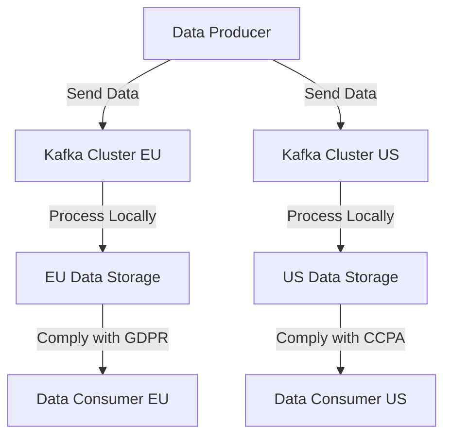

## 3.4.2 Handling Data Sovereignty and Compliance

In today's interconnected world, businesses often operate across multiple regions and countries, necessitating the handling of data sovereignty and compliance when deploying systems like Apache Kafka globally. This section delves into the legal implications of data storage and transfer across borders, strategies for keeping data within specific regions, and compliance with standards such as GDPR and CCPA. We will also provide guidance on configuring Kafka to meet these requirements.

### Understanding Data Sovereignty

**Data Sovereignty** refers to the concept that data is subject to the laws and governance structures within the nation it is collected. This means that organizations must comply with local data protection regulations when storing or processing data in different jurisdictions. Failure to comply can result in significant legal and financial repercussions.

#### Legal Implications of Cross-Border Data Transfer

When data crosses international borders, it becomes subject to the laws of the destination country. This can lead to complex legal challenges, especially when the data protection laws of the source and destination countries differ significantly. For instance, the European Union's General Data Protection Regulation (GDPR) imposes strict requirements on data transfer outside the EU, necessitating adequate safeguards to protect personal data.

**Key Considerations:**

- **Data Localization Laws**: Some countries require that data about their citizens or residents be collected, processed, and stored within their borders. This can impact how global systems are architected.
- **Cross-Border Data Transfer Agreements**: Mechanisms such as Standard Contractual Clauses (SCCs) and Binding Corporate Rules (BCRs) are often used to facilitate legal data transfers.
- **Impact on Cloud Services**: Using cloud services that store data in multiple locations can complicate compliance efforts, requiring careful selection of data center locations.

### Strategies for Regional Data Handling

To comply with data sovereignty requirements, organizations must implement strategies to ensure data remains within specific regions. This involves architectural decisions and configurations within Kafka deployments.

#### Regional Kafka Clusters

One effective strategy is to deploy Kafka clusters in each region where data needs to be localized. This ensures that data is processed and stored within the region, complying with local laws.

- **Advantages**: 
  - Simplifies compliance with local data protection laws.
  - Reduces latency for local data processing.
- **Challenges**:
  - Increased complexity in managing multiple clusters.
  - Potential data duplication and synchronization issues.

#### Data Partitioning and Replication

Kafka's architecture allows for data partitioning and replication, which can be leveraged to control where data is stored and processed.

- **Partitioning**: By partitioning data based on geographic or jurisdictional boundaries, organizations can ensure that data remains within the required region.
- **Replication**: Configuring replication factors to ensure that data copies are only stored in compliant regions.

#### Data Masking and Anonymization

For data that must be transferred across borders, data masking and anonymization techniques can be employed to protect sensitive information.

- **Data Masking**: Replacing sensitive data with anonymized values to prevent unauthorized access.
- **Anonymization**: Removing personally identifiable information (PII) to comply with privacy regulations.

### Compliance Standards: GDPR and CCPA

Compliance with data protection regulations such as the GDPR and the California Consumer Privacy Act (CCPA) is crucial for organizations operating globally.

#### General Data Protection Regulation (GDPR)

The GDPR is a comprehensive data protection regulation that applies to all organizations processing personal data of EU residents, regardless of where the organization is located.

- **Key Requirements**:
  - **Data Subject Rights**: Individuals have rights to access, rectify, and erase their data.
  - **Data Protection Impact Assessments (DPIAs)**: Required for processing activities that pose high risks to individuals' rights and freedoms.
  - **Data Breach Notifications**: Organizations must notify authorities within 72 hours of a data breach.

#### California Consumer Privacy Act (CCPA)

The CCPA grants California residents rights over their personal data and imposes obligations on businesses handling such data.

- **Key Requirements**:
  - **Right to Know**: Consumers have the right to know what personal data is being collected and how it is used.
  - **Right to Delete**: Consumers can request the deletion of their personal data.
  - **Opt-Out of Sale**: Consumers can opt-out of the sale of their personal data.

### Configuring Kafka for Compliance

Configuring Kafka to meet data sovereignty and compliance requirements involves several steps, including setting up secure data flows, managing access controls, and ensuring data encryption.

#### Secure Data Flows

Ensure that data flows within Kafka are secure by implementing encryption and access controls.

- **Encryption**: Use SSL/TLS to encrypt data in transit and at rest. This protects data from unauthorized access during transmission and storage.
- **Access Controls**: Implement fine-grained access controls to restrict who can access or modify data within Kafka.

#### Managing Access Controls

Kafka provides several mechanisms for managing access controls, including Access Control Lists (ACLs) and Role-Based Access Control (RBAC).

- **ACLs**: Define permissions for users and applications to access Kafka resources.
- **RBAC**: Assign roles to users and manage permissions based on their roles.

#### Data Encryption

Encrypting data both in transit and at rest is crucial for compliance with data protection regulations.

- **Data at Rest**: Use disk encryption to protect stored data.
- **Data in Transit**: Use SSL/TLS to encrypt data as it moves between producers, brokers, and consumers.

### Practical Applications and Real-World Scenarios

Let's explore some practical applications and real-world scenarios where these strategies can be applied.

#### Scenario 1: Multi-National E-Commerce Platform

A multi-national e-commerce platform needs to comply with GDPR and CCPA while operating in Europe and the United States. By deploying regional Kafka clusters and using data partitioning, the platform can ensure that EU customer data remains within Europe, while US data is processed locally.

#### Scenario 2: Financial Services Firm

A financial services firm operating in Asia and Europe must comply with data localization laws in China and GDPR in Europe. By implementing data masking and anonymization, the firm can transfer non-sensitive data across regions while keeping sensitive data localized.

### Code Examples

Below are code examples demonstrating how to configure Kafka for compliance with data sovereignty requirements.

#### Java Example: Configuring SSL/TLS

```java
Properties props = new Properties();
props.put("bootstrap.servers", "localhost:9092");
props.put("security.protocol", "SSL");
props.put("ssl.truststore.location", "/var/private/ssl/kafka.client.truststore.jks");
props.put("ssl.truststore.password", "test1234");
props.put("ssl.keystore.location", "/var/private/ssl/kafka.client.keystore.jks");
props.put("ssl.keystore.password", "test1234");
props.put("ssl.key.password", "test1234");

KafkaProducer<String, String> producer = new KafkaProducer<>(props);
```

#### Scala Example: Setting Up ACLs

```scala
import org.apache.kafka.clients.admin.{AdminClient, AdminClientConfig}
import java.util.Properties

val props = new Properties()
props.put(AdminClientConfig.BOOTSTRAP_SERVERS_CONFIG, "localhost:9092")

val adminClient = AdminClient.create(props)

// Define ACLs for a specific user
val acl = new AclBinding(
  new ResourcePattern(ResourceType.TOPIC, "my-topic", PatternType.LITERAL),
  new AccessControlEntry("User:alice", "*", AclOperation.READ, AclPermissionType.ALLOW)
)

adminClient.createAcls(Collections.singletonList(acl))
```

#### Kotlin Example: Data Masking

```kotlin
fun maskSensitiveData(data: String): String {
    return data.replace(Regex("[0-9]"), "*")
}

val sensitiveData = "User ID: 12345"
val maskedData = maskSensitiveData(sensitiveData)
println(maskedData) // Output: User ID: *****
```

#### Clojure Example: Data Partitioning

```clojure
(defn partition-data [data]
  (group-by :region data))

(def data [{:id 1 :region "EU" :value 100}
           {:id 2 :region "US" :value 200}
           {:id 3 :region "EU" :value 150}])

(partition-data data)
;; Output: {"EU" [{:id 1 :region "EU" :value 100} {:id 3 :region "EU" :value 150}], "US" [{:id 2 :region "US" :value 200}]}
```

### Visualizing Kafka's Role in Data Sovereignty

Below is a diagram illustrating how Kafka can be configured to handle data sovereignty and compliance.



*Caption*: This diagram shows how data producers send data to regional Kafka clusters, ensuring local processing and compliance with regional data protection laws.

### References and Links

- [Apache Kafka Documentation](https://kafka.apache.org/documentation/)
- [Confluent Documentation](https://docs.confluent.io/)
- [GDPR Official Website](https://gdpr.eu/)
- [CCPA Official Website](https://oag.ca.gov/privacy/ccpa)

### Knowledge Check

To reinforce your understanding of data sovereignty and compliance in Kafka deployments, consider the following questions and exercises.

1. **What are the key differences between GDPR and CCPA?**
2. **How can data partitioning help in complying with data sovereignty laws?**
3. **Implement a simple Kafka producer in your preferred language that uses SSL/TLS encryption.**
4. **Discuss the challenges of managing multiple regional Kafka clusters.**

### Conclusion

Handling data sovereignty and compliance in global Kafka deployments is a complex but essential task for organizations operating across multiple regions. By understanding the legal implications, implementing regional data handling strategies, and configuring Kafka appropriately, businesses can ensure compliance with data protection regulations like GDPR and CCPA.

## Test Your Knowledge: Data Sovereignty and Compliance in Kafka Quiz



### What is data sovereignty?

- [x] The concept that data is subject to the laws and governance structures within the nation it is collected.
- [ ] The ability to transfer data freely across borders.
- [ ] The requirement to encrypt data at rest.
- [ ] The process of anonymizing data.

> **Explanation:** Data sovereignty refers to the concept that data is subject to the laws and governance structures within the nation it is collected.

### Which regulation imposes strict requirements on data transfer outside the EU?

- [x] GDPR
- [ ] CCPA
- [ ] HIPAA
- [ ] PCI DSS

> **Explanation:** The GDPR imposes strict requirements on data transfer outside the EU, necessitating adequate safeguards to protect personal data.

### What is a key strategy for ensuring data remains within specific regions?

- [x] Deploying regional Kafka clusters
- [ ] Using a single global Kafka cluster
- [ ] Disabling data replication
- [ ] Encrypting data in transit

> **Explanation:** Deploying regional Kafka clusters ensures that data is processed and stored within the region, complying with local laws.

### What is the purpose of data masking?

- [x] Replacing sensitive data with anonymized values to prevent unauthorized access.
- [ ] Encrypting data at rest.
- [ ] Transferring data across borders.
- [ ] Increasing data processing speed.

> **Explanation:** Data masking involves replacing sensitive data with anonymized values to prevent unauthorized access.

### Which compliance standard grants California residents rights over their personal data?

- [x] CCPA
- [ ] GDPR
- [ ] HIPAA
- [ ] PCI DSS

> **Explanation:** The CCPA grants California residents rights over their personal data and imposes obligations on businesses handling such data.

### How can Kafka's partitioning feature be used for compliance?

- [x] By partitioning data based on geographic or jurisdictional boundaries.
- [ ] By encrypting data at rest.
- [ ] By increasing data processing speed.
- [ ] By reducing data storage costs.

> **Explanation:** Kafka's partitioning feature can be used to ensure that data remains within the required region by partitioning data based on geographic or jurisdictional boundaries.

### What is the role of SSL/TLS in Kafka deployments?

- [x] Encrypting data in transit
- [ ] Encrypting data at rest
- [ ] Increasing data processing speed
- [ ] Reducing data storage costs

> **Explanation:** SSL/TLS is used to encrypt data in transit, protecting it from unauthorized access during transmission.

### What is a potential challenge of managing multiple regional Kafka clusters?

- [x] Increased complexity in managing multiple clusters
- [ ] Reduced data processing speed
- [ ] Increased data storage costs
- [ ] Decreased compliance with data protection laws

> **Explanation:** Managing multiple regional Kafka clusters can lead to increased complexity in managing multiple clusters.

### Which of the following is a key requirement of the GDPR?

- [x] Data Subject Rights
- [ ] Right to Delete
- [ ] Opt-Out of Sale
- [ ] Data Breach Notifications

> **Explanation:** The GDPR includes key requirements such as Data Subject Rights, which allow individuals to access, rectify, and erase their data.

### True or False: Data sovereignty laws require that data about citizens or residents be collected, processed, and stored within their borders.

- [x] True
- [ ] False

> **Explanation:** Data sovereignty laws often require that data about citizens or residents be collected, processed, and stored within their borders.


