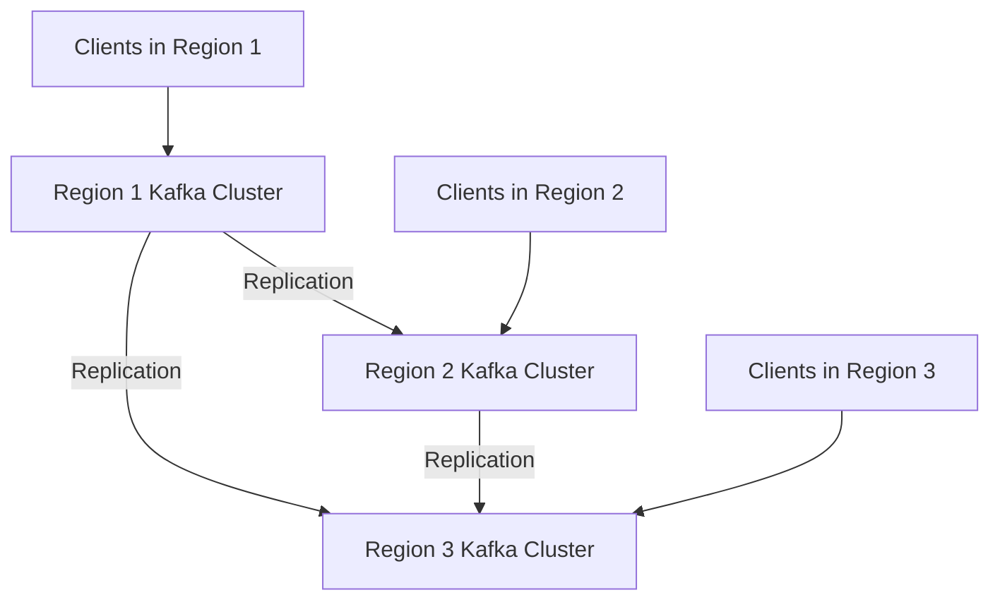

## 3.4 Multi-Region and Global Kafka Deployments

Deploying Apache Kafka across multiple regions or globally distributed environments is a complex yet rewarding endeavor. It offers significant advantages such as enhanced disaster recovery, improved data locality, and compliance with data sovereignty regulations. However, it also presents challenges like increased network latency, partition tolerance, and maintaining consistency across regions. This section delves into the strategies, architectural considerations, and best practices for successfully deploying Kafka in a multi-region or global setup.

### 3.4.1 Reasons for Multi-Region Deployments

#### Disaster Recovery

One of the primary motivations for multi-region Kafka deployments is disaster recovery. By distributing Kafka clusters across different geographical locations, organizations can ensure that their systems remain operational even if one region experiences a failure. This setup provides redundancy and enhances the resilience of the data pipeline.

#### Data Locality

Data locality is another critical factor. By deploying Kafka closer to where data is generated or consumed, organizations can reduce latency and improve performance. This is particularly important for applications that require real-time data processing and low-latency responses.

#### Compliance and Data Sovereignty

With increasing regulations around data privacy and sovereignty, organizations must ensure that data is stored and processed in compliance with local laws. Multi-region deployments allow organizations to keep data within specific geographical boundaries, thereby adhering to regulations like GDPR in Europe or CCPA in California.

### 3.4.2 Architectural Considerations

#### Network Latency and Partition Tolerance

Network latency is a significant challenge in multi-region deployments. The physical distance between regions can introduce delays in data transmission, affecting the performance of Kafka. To mitigate this, organizations must carefully design their network architecture, possibly employing dedicated network links or optimizing data paths.

Partition tolerance is another consideration. Kafka's architecture inherently supports partitioning, but in a multi-region setup, ensuring that partitions are evenly distributed and accessible can be complex. Strategies such as geo-partitioning, where data is partitioned based on geographical location, can be employed to address this.

#### Consistency Models

Consistency across regions is crucial for maintaining data integrity. Kafka provides different consistency models, such as eventual consistency and strong consistency, each with its trade-offs. Organizations must choose a model that aligns with their business requirements and application needs.

#### Replication Strategies

Replication is at the heart of multi-region Kafka deployments. Kafka's built-in replication mechanism can be extended to support cross-region replication, ensuring that data is available in multiple locations. However, this requires careful planning to balance between consistency, availability, and partition tolerance (CAP theorem).

##### Asynchronous Replication

Asynchronous replication is often used in multi-region setups to minimize latency. In this model, data is written to the local region first and then replicated to other regions. This approach improves write performance but may lead to temporary inconsistencies.

##### Synchronous Replication

Synchronous replication ensures that data is consistent across regions by waiting for acknowledgments from all regions before confirming a write. While this model provides strong consistency, it can introduce higher latency and affect performance.

### 3.4.3 Challenges in Multi-Region Deployments

#### Network Latency

Network latency is a persistent challenge in multi-region deployments. The physical distance between regions can lead to increased round-trip times, affecting the performance of Kafka. Organizations must optimize their network infrastructure and consider using technologies like Content Delivery Networks (CDNs) to reduce latency.

#### Partition Tolerance

Ensuring partition tolerance in a multi-region setup requires careful planning. Organizations must design their partitioning strategy to ensure that data is evenly distributed and accessible across regions. This may involve using geo-partitioning or other advanced partitioning techniques.

#### Data Consistency

Maintaining data consistency across regions is critical for ensuring data integrity. Organizations must choose an appropriate consistency model and implement mechanisms to handle conflicts and ensure data accuracy.

### 3.4.4 Best Practices for Designing Global Kafka Architectures

#### Use of Kafka MirrorMaker

Kafka MirrorMaker is a tool specifically designed for replicating data across Kafka clusters. It can be used to set up cross-region replication, ensuring that data is available in multiple locations. Organizations should leverage MirrorMaker to simplify the replication process and ensure data consistency.

#### Implementing a Multi-Cluster Strategy

A multi-cluster strategy involves deploying separate Kafka clusters in each region and using replication to synchronize data between them. This approach provides redundancy and enhances the resilience of the data pipeline.

#### Monitoring and Observability

Monitoring and observability are crucial for managing multi-region Kafka deployments. Organizations should implement comprehensive monitoring solutions to track performance, detect issues, and ensure the health of their Kafka clusters. Tools like Prometheus and Grafana can be used to visualize metrics and set up alerts.

#### Security and Compliance

Security is paramount in multi-region deployments. Organizations must implement robust security measures to protect data in transit and at rest. This includes using encryption, access controls, and compliance with local regulations.

### 3.4.5 Practical Applications and Real-World Scenarios

#### Global Financial Services

In the financial services industry, multi-region Kafka deployments are used to ensure high availability and low latency for trading platforms. By deploying Kafka clusters in major financial hubs, organizations can process transactions in real-time and ensure compliance with local regulations.

#### E-commerce Platforms

E-commerce platforms leverage multi-region Kafka deployments to provide a seamless shopping experience for users worldwide. By deploying Kafka closer to users, these platforms can reduce latency and improve the performance of their recommendation engines and analytics systems.

#### Internet of Things (IoT)

In IoT applications, multi-region Kafka deployments are used to collect and process data from devices distributed across the globe. This setup allows organizations to analyze data in real-time and make informed decisions based on insights from different regions.

### 3.4.6 Code Examples

To illustrate the concepts discussed, let's explore some code examples in Java, Scala, Kotlin, and Clojure for setting up a multi-region Kafka deployment.

#### Java Example

```java
import org.apache.kafka.clients.producer.KafkaProducer;
import org.apache.kafka.clients.producer.ProducerConfig;
import org.apache.kafka.clients.producer.ProducerRecord;
import org.apache.kafka.common.serialization.StringSerializer;

import java.util.Properties;

public class MultiRegionProducer {
    public static void main(String[] args) {
        Properties props = new Properties();
        props.put(ProducerConfig.BOOTSTRAP_SERVERS_CONFIG, "region1.kafka:9092,region2.kafka:9092");
        props.put(ProducerConfig.KEY_SERIALIZER_CLASS_CONFIG, StringSerializer.class.getName());
        props.put(ProducerConfig.VALUE_SERIALIZER_CLASS_CONFIG, StringSerializer.class.getName());

        KafkaProducer<String, String> producer = new KafkaProducer<>(props);

        for (int i = 0; i < 100; i++) {
            ProducerRecord<String, String> record = new ProducerRecord<>("multi-region-topic", Integer.toString(i), "Message " + i);
            producer.send(record);
        }

        producer.close();
    }
}
```

#### Scala Example

```scala
import org.apache.kafka.clients.producer.{KafkaProducer, ProducerConfig, ProducerRecord}
import org.apache.kafka.common.serialization.StringSerializer

import java.util.Properties

object MultiRegionProducer extends App {
  val props = new Properties()
  props.put(ProducerConfig.BOOTSTRAP_SERVERS_CONFIG, "region1.kafka:9092,region2.kafka:9092")
  props.put(ProducerConfig.KEY_SERIALIZER_CLASS_CONFIG, classOf[StringSerializer].getName)
  props.put(ProducerConfig.VALUE_SERIALIZER_CLASS_CONFIG, classOf[StringSerializer].getName)

  val producer = new KafkaProducer[String, String](props)

  for (i <- 0 until 100) {
    val record = new ProducerRecord[String, String]("multi-region-topic", i.toString, s"Message $i")
    producer.send(record)
  }

  producer.close()
}
```

#### Kotlin Example

```kotlin
import org.apache.kafka.clients.producer.KafkaProducer
import org.apache.kafka.clients.producer.ProducerConfig
import org.apache.kafka.clients.producer.ProducerRecord
import org.apache.kafka.common.serialization.StringSerializer

fun main() {
    val props = Properties().apply {
        put(ProducerConfig.BOOTSTRAP_SERVERS_CONFIG, "region1.kafka:9092,region2.kafka:9092")
        put(ProducerConfig.KEY_SERIALIZER_CLASS_CONFIG, StringSerializer::class.java.name)
        put(ProducerConfig.VALUE_SERIALIZER_CLASS_CONFIG, StringSerializer::class.java.name)
    }

    val producer = KafkaProducer<String, String>(props)

    for (i in 0 until 100) {
        val record = ProducerRecord("multi-region-topic", i.toString(), "Message $i")
        producer.send(record)
    }

    producer.close()
}
```

#### Clojure Example

```clojure
(ns multi-region-producer
  (:import [org.apache.kafka.clients.producer KafkaProducer ProducerConfig ProducerRecord]
           [org.apache.kafka.common.serialization StringSerializer]))

(defn create-producer []
  (let [props (doto (java.util.Properties.)
                (.put ProducerConfig/BOOTSTRAP_SERVERS_CONFIG "region1.kafka:9092,region2.kafka:9092")
                (.put ProducerConfig/KEY_SERIALIZER_CLASS_CONFIG StringSerializer)
                (.put ProducerConfig/VALUE_SERIALIZER_CLASS_CONFIG StringSerializer))]
    (KafkaProducer. props)))

(defn -main []
  (let [producer (create-producer)]
    (doseq [i (range 100)]
      (.send producer (ProducerRecord. "multi-region-topic" (str i) (str "Message " i))))
    (.close producer)))
```

### 3.4.7 Visualizing Multi-Region Kafka Architecture

To better understand the architecture of a multi-region Kafka deployment, let's visualize it using a Mermaid.js diagram.



**Diagram Description**: This diagram illustrates a multi-region Kafka deployment with three regions. Each region has its Kafka cluster, and data is replicated between the clusters to ensure consistency and availability. Clients in each region connect to their local Kafka cluster for optimal performance.

### 3.4.8 Knowledge Check

To reinforce your understanding of multi-region and global Kafka deployments, consider the following questions and exercises:

1. **What are the primary motivations for deploying Kafka across multiple regions?**
2. **Explain the difference between asynchronous and synchronous replication in a multi-region setup.**
3. **What challenges might you face when maintaining data consistency across regions?**
4. **Design a multi-region Kafka architecture for an e-commerce platform that serves users worldwide.**
5. **Experiment with the provided code examples by modifying the bootstrap server configurations to simulate a multi-region setup.**

### 3.4.9 Conclusion

Deploying Kafka in a multi-region or global environment is a complex task that requires careful planning and consideration of various factors such as network latency, data consistency, and compliance with local regulations. By understanding the challenges and best practices outlined in this section, organizations can design robust and efficient Kafka architectures that meet their business needs.

### 3.4.10 Quiz

## Test Your Knowledge: Multi-Region and Global Kafka Deployments Quiz



### What is a primary benefit of deploying Kafka across multiple regions?

- [x] Enhanced disaster recovery and data redundancy
- [ ] Reduced network latency within a single region
- [ ] Simplified data processing logic
- [ ] Increased complexity in data management

> **Explanation:** Deploying Kafka across multiple regions enhances disaster recovery and data redundancy by ensuring that data is available even if one region fails.

### Which replication strategy minimizes latency in a multi-region Kafka deployment?

- [x] Asynchronous replication
- [ ] Synchronous replication
- [ ] Geo-replication
- [ ] Cross-region replication

> **Explanation:** Asynchronous replication minimizes latency by allowing data to be written to the local region first before being replicated to other regions.

### What is a challenge associated with multi-region Kafka deployments?

- [x] Increased network latency
- [ ] Simplified data consistency
- [ ] Reduced data sovereignty concerns
- [ ] Decreased need for monitoring

> **Explanation:** Increased network latency is a challenge in multi-region deployments due to the physical distance between regions.

### How can organizations ensure data consistency across regions in a Kafka deployment?

- [x] Implementing synchronous replication
- [ ] Using only local clusters
- [ ] Avoiding data partitioning
- [ ] Disabling replication

> **Explanation:** Synchronous replication ensures data consistency by waiting for acknowledgments from all regions before confirming a write.

### What tool can be used to replicate data across Kafka clusters in different regions?

- [x] Kafka MirrorMaker
- [ ] Kafka Streams
- [ ] Kafka Connect
- [ ] Kafka REST Proxy

> **Explanation:** Kafka MirrorMaker is specifically designed for replicating data across Kafka clusters in different regions.

### Which of the following is a best practice for monitoring multi-region Kafka deployments?

- [x] Implementing comprehensive monitoring solutions
- [ ] Relying solely on manual checks
- [ ] Disabling alerts to reduce noise
- [ ] Using a single monitoring tool for all regions

> **Explanation:** Implementing comprehensive monitoring solutions is a best practice to track performance and ensure the health of Kafka clusters across regions.

### What is a key consideration when designing a multi-region Kafka architecture?

- [x] Network latency and partition tolerance
- [ ] Simplified data processing logic
- [ ] Reduced need for data replication
- [ ] Increased complexity in data management

> **Explanation:** Network latency and partition tolerance are key considerations in multi-region Kafka architectures to ensure optimal performance and data availability.

### How can organizations address data sovereignty concerns in a multi-region Kafka deployment?

- [x] Deploying Kafka clusters within specific geographical boundaries
- [ ] Using only a single global cluster
- [ ] Disabling data replication
- [ ] Avoiding compliance with local regulations

> **Explanation:** Deploying Kafka clusters within specific geographical boundaries helps organizations comply with data sovereignty regulations.

### What is the role of Kafka MirrorMaker in a multi-region deployment?

- [x] Replicating data across Kafka clusters in different regions
- [ ] Processing data streams in real-time
- [ ] Managing consumer offsets
- [ ] Simplifying producer configurations

> **Explanation:** Kafka MirrorMaker replicates data across Kafka clusters in different regions, ensuring data availability and consistency.

### True or False: Synchronous replication in a multi-region Kafka deployment can introduce higher latency.

- [x] True
- [ ] False

> **Explanation:** Synchronous replication can introduce higher latency because it waits for acknowledgments from all regions before confirming a write.



By understanding and implementing the strategies and best practices outlined in this section, you can effectively deploy Kafka across multiple regions and create a robust, scalable, and compliant data architecture.
