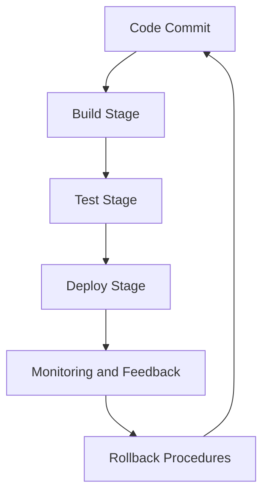

## 3.5.1 Continuous Integration and Deployment Strategies

### Introduction

Continuous Integration (CI) and Continuous Deployment (CD) are critical practices in modern software development, enabling teams to deliver updates and new features rapidly and reliably. In the context of Apache Kafka, CI/CD pipelines are essential for managing the complexities of distributed systems and ensuring that Kafka applications are robust, scalable, and fault-tolerant. This section explores the intricacies of implementing CI/CD strategies for Kafka applications, focusing on tools, automation, and best practices for secure and reliable deployments.

### Understanding CI/CD in the Context of Kafka

#### Continuous Integration (CI)

Continuous Integration is the practice of automatically integrating code changes from multiple contributors into a single software project. In the context of Kafka, CI involves:

- **Automated Testing**: Ensuring that Kafka producers, consumers, and stream processing applications are thoroughly tested with unit, integration, and end-to-end tests.
- **Code Quality Checks**: Implementing static code analysis and linting to maintain high code quality.
- **Build Automation**: Compiling and packaging Kafka applications automatically to ensure consistency and reliability.

#### Continuous Deployment (CD)

Continuous Deployment extends CI by automating the release of software changes to production environments. For Kafka applications, CD involves:

- **Automated Deployment**: Using tools like Jenkins or GitLab CI/CD to deploy Kafka applications across various environments (development, staging, production).
- **Rollback Procedures**: Implementing strategies to revert changes in case of failures, ensuring minimal downtime.
- **Monitoring and Feedback**: Continuously monitoring deployed applications to detect issues and gather feedback for improvements.

### Tools for CI/CD in Kafka Applications

#### Jenkins

Jenkins is a popular open-source automation server used to build, test, and deploy software. It is highly extensible and supports a wide range of plugins for integrating with Kafka applications.

- **Pipeline as Code**: Jenkins supports defining CI/CD pipelines as code using Jenkinsfile, enabling version control and collaboration.
- **Integration with Kafka**: Jenkins can trigger builds and deployments based on Kafka events, allowing for event-driven CI/CD workflows.

**Example Jenkins Pipeline for Kafka Application:**

```groovy
pipeline {
    agent any
    stages {
        stage('Build') {
            steps {
                // Compile and package the Kafka application
                sh 'mvn clean package'
            }
        }
        stage('Test') {
            steps {
                // Run unit and integration tests
                sh 'mvn test'
            }
        }
        stage('Deploy') {
            steps {
                // Deploy the application to the staging environment
                sh 'kubectl apply -f kafka-deployment.yaml'
            }
        }
    }
    post {
        always {
            // Archive test results and logs
            archiveArtifacts artifacts: '**/target/*.jar', fingerprint: true
            junit 'target/surefire-reports/*.xml'
        }
    }
}
```

#### GitLab CI/CD

GitLab CI/CD is a powerful tool integrated into the GitLab platform, providing seamless CI/CD capabilities for Kafka applications.

- **YAML Configuration**: GitLab CI/CD pipelines are defined using a `.gitlab-ci.yml` file, allowing for easy configuration and version control.
- **Docker Integration**: GitLab CI/CD supports Docker, enabling containerized builds and deployments for Kafka applications.

**Example GitLab CI/CD Pipeline for Kafka Application:**

```yaml
stages:
  - build
  - test
  - deploy

build:
  stage: build
  script:
    - mvn clean package
  artifacts:
    paths:
      - target/*.jar

test:
  stage: test
  script:
    - mvn test

deploy:
  stage: deploy
  script:
    - kubectl apply -f kafka-deployment.yaml
  environment:
    name: staging
```

### Automating Testing, Deployment, and Rollback Procedures

#### Automated Testing

Automated testing is crucial for ensuring the reliability of Kafka applications. It involves:

- **Unit Testing**: Testing individual components of Kafka applications, such as producers and consumers, using frameworks like JUnit or ScalaTest.
- **Integration Testing**: Testing interactions between Kafka components and external systems using tools like Testcontainers or Embedded Kafka.
- **End-to-End Testing**: Validating the entire data flow through Kafka using real-world scenarios.

**Example Unit Test for Kafka Producer in Java:**

```java
import org.apache.kafka.clients.producer.MockProducer;
import org.apache.kafka.clients.producer.ProducerRecord;
import org.junit.jupiter.api.Test;
import static org.junit.jupiter.api.Assertions.*;

class KafkaProducerTest {

    @Test
    void testSendMessage() {
        MockProducer<String, String> producer = new MockProducer<>();
        KafkaProducerService service = new KafkaProducerService(producer);

        service.sendMessage("test-topic", "key", "value");

        assertEquals(1, producer.history().size());
        ProducerRecord<String, String> record = producer.history().get(0);
        assertEquals("test-topic", record.topic());
        assertEquals("key", record.key());
        assertEquals("value", record.value());
    }
}
```

#### Automated Deployment

Automated deployment involves using CI/CD tools to deploy Kafka applications across different environments. Key practices include:

- **Environment Configuration**: Managing environment-specific configurations using tools like Helm or Kustomize.
- **Blue-Green Deployments**: Deploying new versions alongside existing ones to minimize downtime and allow for easy rollbacks.
- **Canary Releases**: Gradually rolling out changes to a subset of users to monitor impact before full deployment.

#### Rollback Procedures

Implementing rollback procedures is essential for minimizing downtime and ensuring application stability. Strategies include:

- **Version Control**: Keeping track of application versions and configurations to facilitate rollbacks.
- **Automated Rollbacks**: Using CI/CD tools to automate the rollback process in case of failures.
- **Monitoring and Alerts**: Setting up monitoring and alerting to detect issues early and trigger rollbacks automatically.

### Best Practices for Pipeline Security and Reliability

#### Security Best Practices

- **Credential Management**: Use secure methods for managing credentials and secrets, such as HashiCorp Vault or AWS Secrets Manager.
- **Access Control**: Implement role-based access control (RBAC) to restrict access to CI/CD pipelines and resources.
- **Code Scanning**: Integrate security scanning tools into CI/CD pipelines to detect vulnerabilities early.

#### Reliability Best Practices

- **Pipeline Monitoring**: Continuously monitor CI/CD pipelines to detect failures and performance issues.
- **Resilience Testing**: Regularly test the resilience of CI/CD pipelines to ensure they can handle failures gracefully.
- **Backup and Recovery**: Implement backup and recovery procedures for CI/CD pipeline configurations and artifacts.

### Visualizing CI/CD Pipelines

To better understand the flow of a CI/CD pipeline for Kafka applications, consider the following diagram:



**Diagram Description**: This diagram illustrates the flow of a CI/CD pipeline for Kafka applications, starting from code commit, followed by build, test, and deploy stages, and concluding with monitoring, feedback, and rollback procedures.

### Real-World Scenarios and Applications

#### Scenario 1: Event-Driven Microservices

In an event-driven microservices architecture, CI/CD pipelines can be used to automate the deployment of Kafka-based microservices, ensuring that updates are delivered rapidly and reliably. By integrating Kafka with CI/CD tools, teams can achieve seamless deployments and minimize downtime.

#### Scenario 2: Real-Time Data Pipelines

For real-time data pipelines, CI/CD pipelines enable continuous delivery of updates and enhancements, ensuring that data processing applications remain efficient and scalable. Automated testing and deployment reduce the risk of errors and improve overall system reliability.

### Knowledge Check and Exercises

To reinforce your understanding of CI/CD strategies for Kafka applications, consider the following questions and exercises:

1. **Question**: What are the key components of a CI/CD pipeline for Kafka applications?
2. **Exercise**: Set up a Jenkins pipeline to automate the build and deployment of a Kafka producer application.
3. **Question**: How can automated testing improve the reliability of Kafka applications?
4. **Exercise**: Implement a unit test for a Kafka consumer using MockConsumer in Java.

### Conclusion

Implementing CI/CD strategies for Kafka applications is essential for achieving rapid and reliable delivery of updates and new features. By leveraging tools like Jenkins and GitLab CI/CD, automating testing and deployment, and following best practices for security and reliability, teams can ensure that their Kafka applications are robust, scalable, and fault-tolerant.

## Test Your Knowledge: Advanced CI/CD Strategies for Kafka Applications



### What is the primary goal of Continuous Integration in Kafka applications?

- [x] To automatically integrate code changes and ensure code quality.
- [ ] To deploy applications to production environments.
- [ ] To monitor application performance.
- [ ] To manage Kafka clusters.

> **Explanation:** Continuous Integration focuses on automatically integrating code changes and ensuring code quality through automated testing and build processes.

### Which tool is commonly used for defining CI/CD pipelines as code?

- [x] Jenkins
- [ ] Apache Kafka
- [ ] Kubernetes
- [ ] Docker

> **Explanation:** Jenkins is commonly used for defining CI/CD pipelines as code using Jenkinsfile, enabling version control and collaboration.

### What is a key benefit of automated deployment in CI/CD pipelines?

- [x] It reduces the risk of human error during deployment.
- [ ] It eliminates the need for testing.
- [ ] It increases the complexity of the deployment process.
- [ ] It requires manual intervention for rollbacks.

> **Explanation:** Automated deployment reduces the risk of human error during deployment by automating the process and ensuring consistency.

### How can rollback procedures be automated in CI/CD pipelines?

- [x] By using CI/CD tools to automate the rollback process in case of failures.
- [ ] By manually tracking application versions.
- [ ] By disabling monitoring and alerts.
- [ ] By increasing deployment frequency.

> **Explanation:** Rollback procedures can be automated using CI/CD tools to revert changes in case of failures, ensuring minimal downtime.

### What is the purpose of Blue-Green Deployments?

- [x] To minimize downtime and allow for easy rollbacks.
- [ ] To increase deployment speed.
- [ ] To eliminate the need for testing.
- [ ] To reduce the number of environments.

> **Explanation:** Blue-Green Deployments minimize downtime by deploying new versions alongside existing ones, allowing for easy rollbacks if needed.

### Which practice helps in managing environment-specific configurations?

- [x] Using tools like Helm or Kustomize.
- [ ] Disabling configuration management.
- [ ] Increasing the number of environments.
- [ ] Manually editing configuration files.

> **Explanation:** Tools like Helm or Kustomize help manage environment-specific configurations, ensuring consistency across deployments.

### What is a key security best practice for CI/CD pipelines?

- [x] Implementing role-based access control (RBAC).
- [ ] Disabling security scanning tools.
- [ ] Allowing unrestricted access to pipelines.
- [ ] Storing credentials in plain text.

> **Explanation:** Implementing role-based access control (RBAC) is a key security best practice to restrict access to CI/CD pipelines and resources.

### How can resilience testing benefit CI/CD pipelines?

- [x] By ensuring pipelines can handle failures gracefully.
- [ ] By increasing the complexity of the pipeline.
- [ ] By reducing the number of tests.
- [ ] By eliminating the need for monitoring.

> **Explanation:** Resilience testing ensures that CI/CD pipelines can handle failures gracefully, improving reliability and stability.

### What is the role of monitoring in CI/CD pipelines?

- [x] To detect failures and performance issues.
- [ ] To increase deployment frequency.
- [ ] To eliminate the need for testing.
- [ ] To reduce the number of environments.

> **Explanation:** Monitoring in CI/CD pipelines helps detect failures and performance issues, enabling timely interventions and improvements.

### True or False: Continuous Deployment involves manual intervention for releasing software changes.

- [ ] True
- [x] False

> **Explanation:** Continuous Deployment automates the release of software changes to production environments, minimizing the need for manual intervention.


