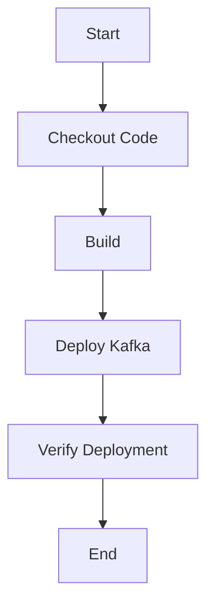

## 3.5.2 Infrastructure Automation Tools (Jenkins, GitLab CI/CD)

In the realm of modern software development, automation is key to achieving efficiency, reliability, and scalability. This is especially true for complex systems like Apache Kafka, where managing infrastructure and deployments can become cumbersome without the right tools. Jenkins and GitLab CI/CD are two powerful automation tools that can significantly streamline the process of managing Kafka environments. This section delves into how these tools can be leveraged to automate Kafka deployments, integrate infrastructure changes into CI/CD pipelines, and ensure seamless operations.

### Introduction to Jenkins and GitLab CI/CD

#### Jenkins

Jenkins is an open-source automation server that facilitates continuous integration and continuous delivery (CI/CD). It is highly extensible, with a vast library of plugins that allow it to integrate with virtually any tool in the DevOps ecosystem. Jenkins is known for its flexibility and robustness, making it a popular choice for automating complex workflows.

- **Key Features**:
  - **Extensibility**: Over 1,500 plugins available.
  - **Distributed Builds**: Supports building across multiple machines.
  - **Pipeline as Code**: Jenkinsfile allows defining build pipelines in code.
  - **Integration**: Seamlessly integrates with version control systems, build tools, and more.

For more information, visit the [Jenkins official documentation](https://www.jenkins.io/).

#### GitLab CI/CD

GitLab CI/CD is a part of the GitLab platform, offering a comprehensive suite for managing the entire DevOps lifecycle. It provides built-in CI/CD capabilities, allowing teams to automate the build, test, and deployment processes directly from their GitLab repositories.

- **Key Features**:
  - **Integrated with GitLab**: Directly tied to GitLab repositories for seamless workflow.
  - **Auto DevOps**: Automatically configures CI/CD pipelines.
  - **Kubernetes Integration**: Simplifies deployment to Kubernetes clusters.
  - **Security and Compliance**: Built-in security testing and compliance features.

For more information, visit the [GitLab CI/CD documentation](https://docs.gitlab.com/ee/ci/).

### Setting Up Automation Scripts for Kafka Deployments

Automating Kafka deployments involves scripting the setup, configuration, and management of Kafka clusters. Both Jenkins and GitLab CI/CD can be used to automate these tasks, ensuring consistency and reducing the risk of human error.

#### Jenkins Pipeline for Kafka Deployment

A Jenkins pipeline can be defined using a Jenkinsfile, which is a text file containing the pipeline script. Here's an example of a Jenkins pipeline for deploying a Kafka cluster:

```groovy
pipeline {
    agent any
    stages {
        stage('Checkout') {
            steps {
                git 'https://github.com/your-repo/kafka-deployment.git'
            }
        }
        stage('Build') {
            steps {
                sh 'mvn clean package'
            }
        }
        stage('Deploy Kafka') {
            steps {
                script {
                    def kafkaNodes = ['node1', 'node2', 'node3']
                    kafkaNodes.each { node ->
                        sh "ssh user@${node} 'docker-compose -f kafka-docker-compose.yml up -d'"
                    }
                }
            }
        }
        stage('Verify Deployment') {
            steps {
                sh 'curl -X GET http://localhost:8080/kafka/health'
            }
        }
    }
}
```

- **Explanation**:
  - **Checkout**: Clones the repository containing Kafka deployment scripts.
  - **Build**: Compiles any necessary code or configurations.
  - **Deploy Kafka**: Uses SSH to deploy Kafka on specified nodes using Docker Compose.
  - **Verify Deployment**: Checks the health of the Kafka cluster.

#### GitLab CI/CD Pipeline for Kafka Deployment

GitLab CI/CD pipelines are defined in a `.gitlab-ci.yml` file. Here's an example of a GitLab CI/CD pipeline for deploying Kafka:

```yaml
stages:
  - build
  - deploy
  - verify

build:
  stage: build
  script:
    - mvn clean package

deploy:
  stage: deploy
  script:
    - ssh user@node1 'docker-compose -f kafka-docker-compose.yml up -d'
    - ssh user@node2 'docker-compose -f kafka-docker-compose.yml up -d'
    - ssh user@node3 'docker-compose -f kafka-docker-compose.yml up -d'

verify:
  stage: verify
  script:
    - curl -X GET http://localhost:8080/kafka/health
```

- **Explanation**:
  - **Stages**: Defines the stages of the pipeline: build, deploy, and verify.
  - **Build**: Compiles the necessary code or configurations.
  - **Deploy**: Deploys Kafka on specified nodes using SSH and Docker Compose.
  - **Verify**: Checks the health of the Kafka cluster.

### Integrating Infrastructure Changes into the CI/CD Pipeline

Integrating infrastructure changes into the CI/CD pipeline ensures that any modifications to the Kafka environment are automatically tested and deployed. This integration can be achieved by incorporating infrastructure as code (IaC) tools like Terraform or Ansible into the pipeline.

#### Using Jenkins with Terraform

Terraform is an IaC tool that allows you to define and provision infrastructure using code. Here's how you can integrate Terraform with Jenkins:

1. **Install Terraform Plugin**: Install the Terraform plugin in Jenkins to enable Terraform commands.
2. **Define Infrastructure**: Create Terraform configuration files to define your Kafka infrastructure.
3. **Jenkins Pipeline**: Update the Jenkins pipeline to include Terraform commands.

```groovy
pipeline {
    agent any
    stages {
        stage('Checkout') {
            steps {
                git 'https://github.com/your-repo/kafka-infrastructure.git'
            }
        }
        stage('Terraform Init') {
            steps {
                sh 'terraform init'
            }
        }
        stage('Terraform Apply') {
            steps {
                sh 'terraform apply -auto-approve'
            }
        }
        stage('Deploy Kafka') {
            steps {
                sh 'ansible-playbook -i inventory kafka-deploy.yml'
            }
        }
    }
}
```

- **Explanation**:
  - **Terraform Init**: Initializes the Terraform configuration.
  - **Terraform Apply**: Applies the Terraform configuration to provision infrastructure.
  - **Deploy Kafka**: Uses Ansible to deploy Kafka on the provisioned infrastructure.

#### Using GitLab CI/CD with Ansible

Ansible is another IaC tool that automates the configuration and management of infrastructure. Here's how you can integrate Ansible with GitLab CI/CD:

1. **Define Playbooks**: Create Ansible playbooks to configure and deploy Kafka.
2. **GitLab CI/CD Pipeline**: Update the `.gitlab-ci.yml` file to include Ansible commands.

```yaml
stages:
  - provision
  - configure
  - deploy

provision:
  stage: provision
  script:
    - terraform init
    - terraform apply -auto-approve

configure:
  stage: configure
  script:
    - ansible-playbook -i inventory kafka-configure.yml

deploy:
  stage: deploy
  script:
    - ansible-playbook -i inventory kafka-deploy.yml
```

- **Explanation**:
  - **Provision**: Uses Terraform to provision infrastructure.
  - **Configure**: Uses Ansible to configure the Kafka environment.
  - **Deploy**: Uses Ansible to deploy Kafka on the configured infrastructure.

### Practical Applications and Real-World Scenarios

The integration of Jenkins and GitLab CI/CD with Kafka deployments offers numerous benefits in real-world scenarios:

- **Consistency**: Automation ensures that deployments are consistent across environments, reducing the risk of configuration drift.
- **Efficiency**: Automated pipelines reduce the time and effort required to deploy and manage Kafka clusters.
- **Reliability**: Continuous integration and testing catch issues early, improving the reliability of Kafka deployments.
- **Scalability**: Automated infrastructure provisioning allows for easy scaling of Kafka clusters to meet demand.

### Visualizing CI/CD Pipelines

To better understand the flow of CI/CD pipelines, consider the following diagram illustrating a typical Jenkins pipeline for Kafka deployment:



**Caption**: This diagram represents the stages of a Jenkins pipeline for deploying a Kafka cluster, from code checkout to deployment verification.

### References and Links

- [Jenkins Official Documentation](https://www.jenkins.io/)
- [GitLab CI/CD Documentation](https://docs.gitlab.com/ee/ci/)
- [Terraform Documentation](https://www.terraform.io/docs/)
- [Ansible Documentation](https://docs.ansible.com/)

### Knowledge Check

To reinforce your understanding of infrastructure automation with Jenkins and GitLab CI/CD, consider the following questions and exercises:

1. **What are the key differences between Jenkins and GitLab CI/CD?**
2. **How can Terraform be integrated into a Jenkins pipeline for Kafka deployments?**
3. **Describe a real-world scenario where CI/CD automation would benefit Kafka deployments.**
4. **Experiment with modifying the provided Jenkins and GitLab CI/CD pipeline examples to include additional stages or tools.**

### Conclusion

Mastering infrastructure automation with Jenkins and GitLab CI/CD is crucial for efficiently managing Kafka deployments. By automating the deployment process, you can ensure consistency, reliability, and scalability, ultimately enhancing the performance of your real-time data processing systems. As you continue to explore these tools, consider how they can be tailored to fit the unique needs of your organization and projects.

## Test Your Knowledge: Infrastructure Automation with Jenkins and GitLab CI/CD Quiz



### What is a primary benefit of using Jenkins for Kafka deployments?

- [x] Flexibility and extensibility through plugins
- [ ] Built-in security testing
- [ ] Direct integration with GitLab repositories
- [ ] Automatic configuration of CI/CD pipelines

> **Explanation:** Jenkins is known for its flexibility and extensibility, with a vast library of plugins that allow it to integrate with various tools and workflows.

### Which tool is directly integrated with GitLab repositories for CI/CD?

- [ ] Jenkins
- [x] GitLab CI/CD
- [ ] Terraform
- [ ] Ansible

> **Explanation:** GitLab CI/CD is part of the GitLab platform and is directly integrated with GitLab repositories, providing seamless CI/CD capabilities.

### How can Terraform be used in a Jenkins pipeline?

- [x] By installing the Terraform plugin and running Terraform commands
- [ ] By using built-in Jenkins commands
- [ ] By integrating with GitLab CI/CD
- [ ] By using Ansible playbooks

> **Explanation:** Terraform can be integrated into a Jenkins pipeline by installing the Terraform plugin and executing Terraform commands within the pipeline script.

### What is the role of Ansible in GitLab CI/CD pipelines?

- [x] Automating configuration and deployment tasks
- [ ] Managing version control
- [ ] Building Docker images
- [ ] Running unit tests

> **Explanation:** Ansible is used in GitLab CI/CD pipelines to automate configuration and deployment tasks, ensuring consistency across environments.

### Which stage in a CI/CD pipeline is responsible for compiling code?

- [x] Build
- [ ] Deploy
- [ ] Verify
- [ ] Provision

> **Explanation:** The build stage is responsible for compiling code and preparing it for deployment.

### What is the purpose of the 'Verify Deployment' stage in a Jenkins pipeline?

- [x] To check the health of the deployed Kafka cluster
- [ ] To compile code
- [ ] To provision infrastructure
- [ ] To configure the environment

> **Explanation:** The 'Verify Deployment' stage checks the health of the deployed Kafka cluster to ensure it is functioning correctly.

### How does GitLab CI/CD simplify deployment to Kubernetes clusters?

- [x] Through built-in Kubernetes integration
- [ ] By using Jenkins plugins
- [ ] By automating Terraform scripts
- [ ] By using Ansible playbooks

> **Explanation:** GitLab CI/CD simplifies deployment to Kubernetes clusters through its built-in Kubernetes integration, allowing for seamless deployment processes.

### What is a Jenkinsfile used for?

- [x] Defining build pipelines in code
- [ ] Managing GitLab repositories
- [ ] Writing Ansible playbooks
- [ ] Configuring Terraform scripts

> **Explanation:** A Jenkinsfile is used to define build pipelines in code, allowing for version control and easy modifications.

### Which tool is known for its 'Pipeline as Code' feature?

- [x] Jenkins
- [ ] GitLab CI/CD
- [ ] Terraform
- [ ] Ansible

> **Explanation:** Jenkins is known for its 'Pipeline as Code' feature, which allows users to define their build pipelines using code.

### True or False: GitLab CI/CD can automatically configure CI/CD pipelines.

- [x] True
- [ ] False

> **Explanation:** GitLab CI/CD offers an Auto DevOps feature that can automatically configure CI/CD pipelines, simplifying the setup process.


