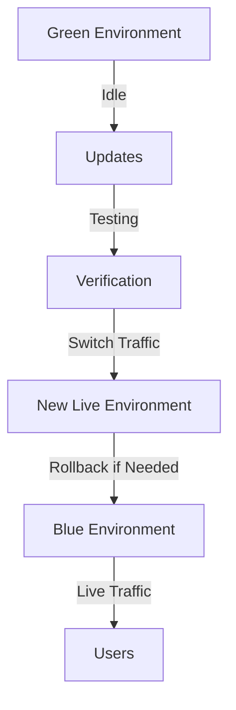
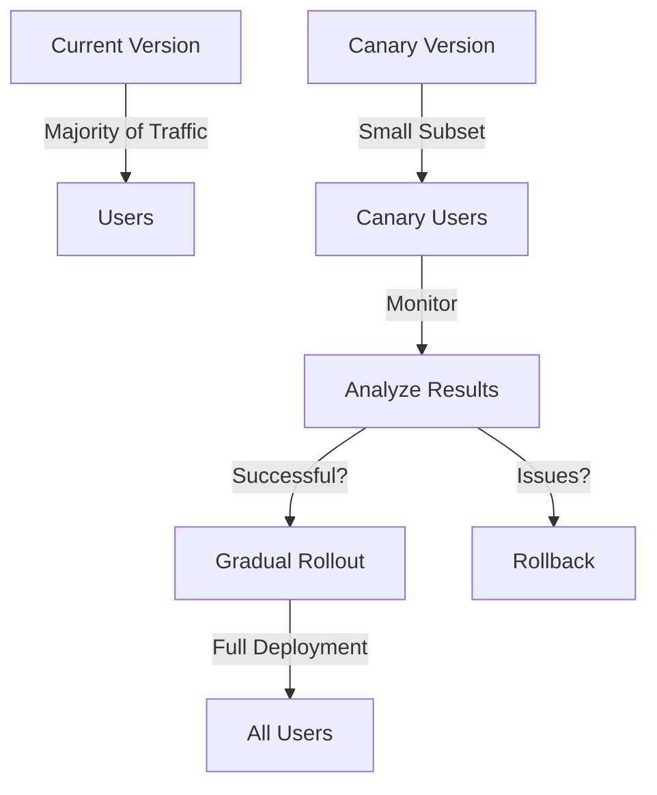

## 3.5.4 Blue-Green and Canary Deployments

### Introduction

In the realm of continuous deployment and DevOps, blue-green and canary deployments are two pivotal strategies that facilitate seamless updates and minimize risks associated with deploying new versions of applications. These strategies are particularly beneficial in the context of Apache Kafka, where maintaining high availability and minimizing downtime are critical. This section delves into the intricacies of blue-green and canary deployments, illustrating how they can be effectively applied to Kafka applications and infrastructure.

### Blue-Green Deployment Model

#### Definition

The blue-green deployment model is a technique that involves running two identical production environments, referred to as "blue" and "green." At any given time, one environment is live, serving all production traffic, while the other remains idle. This setup allows for the deployment of new application versions in the idle environment, which can then be switched to live with minimal downtime.

#### Application to Kafka

In the context of Kafka, blue-green deployments can be applied to both Kafka brokers and client applications. This approach ensures that updates or changes do not disrupt the ongoing data flow or processing.

- **Kafka Brokers**: Deploy new versions of Kafka brokers in the idle environment. Once verified, switch the traffic to the updated brokers.
- **Kafka Clients**: Update client applications (producers and consumers) in the idle environment, ensuring compatibility with the new broker version before switching.

#### Implementation Steps

1. **Environment Setup**: Establish two identical Kafka environments (blue and green) with the same configuration and data replication.
2. **Deploy Updates**: Apply updates to the idle environment (e.g., green) while the live environment (e.g., blue) continues to serve traffic.
3. **Testing and Verification**: Conduct thorough testing in the updated environment to ensure stability and performance.
4. **Switch Traffic**: Redirect traffic from the live environment to the updated environment, making it the new live environment.
5. **Rollback Plan**: Maintain the previous environment as a backup for quick rollback in case of issues.

#### Tooling and Automation

Automation is key to successful blue-green deployments. Tools like Jenkins, GitLab CI/CD, and Kubernetes can automate the deployment and traffic switching processes.

- **Jenkins**: Use Jenkins pipelines to automate the deployment of Kafka brokers and client applications.
- **Kubernetes**: Leverage Kubernetes for managing Kafka clusters, utilizing its native support for blue-green deployments through services and ingress controllers.

#### Monitoring and Validation

Monitoring is crucial to ensure the success of blue-green deployments. Implement monitoring solutions like Prometheus and Grafana to track the performance and health of Kafka environments during and after the deployment.

*Figure 1: Blue-Green Deployment Flow for Kafka*

### Canary Deployment Model

#### Definition

Canary deployment is a strategy that involves releasing a new version of an application to a small subset of users or servers before rolling it out to the entire infrastructure. This approach allows for monitoring and validating the new version's performance and stability in a real-world environment with minimal risk.

#### Application to Kafka

Canary deployments can be particularly effective for Kafka client applications, where changes can be gradually introduced and monitored.

- **Kafka Producers**: Deploy new producer versions to a small subset of instances, monitoring their performance and impact on the Kafka cluster.
- **Kafka Consumers**: Similarly, update a subset of consumer instances to the new version, ensuring they process messages correctly and efficiently.

#### Implementation Steps

1. **Select Canary Instances**: Choose a small subset of Kafka clients (producers/consumers) to receive the update.
2. **Deploy Updates**: Apply the new version to the selected canary instances.
3. **Monitor Performance**: Use monitoring tools to track the performance and behavior of the canary instances.
4. **Analyze Results**: Evaluate the impact of the update on the canary instances, checking for errors or performance degradation.
5. **Gradual Rollout**: If the canary deployment is successful, gradually roll out the update to additional instances until the entire infrastructure is updated.
6. **Rollback Plan**: Have a rollback strategy in place to revert canary instances to the previous version if issues arise.

#### Tooling and Automation

Automation tools play a crucial role in managing canary deployments. Tools like Spinnaker and Argo Rollouts provide robust support for orchestrating canary deployments.

- **Spinnaker**: Utilize Spinnaker's canary analysis capabilities to automate the deployment and monitoring of canary instances.
- **Argo Rollouts**: Leverage Argo Rollouts for Kubernetes-based canary deployments, offering features like traffic splitting and automated rollbacks.

#### Monitoring and Validation

Continuous monitoring is essential during canary deployments to detect issues early. Implement real-time monitoring solutions to track key metrics and alert on anomalies.

*Figure 2: Canary Deployment Flow for Kafka*

### Practical Applications and Real-World Scenarios

#### Use Case: Financial Services

In financial services, where real-time data processing is critical, blue-green and canary deployments can ensure that updates to Kafka-based systems do not disrupt operations. For example, a bank might use blue-green deployments to update its Kafka brokers, ensuring that transaction data continues to flow without interruption.

#### Use Case: E-commerce Platforms

E-commerce platforms can leverage canary deployments to test new features in their Kafka-based recommendation systems. By deploying updates to a small subset of users, they can validate the impact on user experience and sales before a full rollout.

### Best Practices and Considerations

- **Testing**: Conduct comprehensive testing in both blue-green and canary environments to catch issues early.
- **Monitoring**: Implement robust monitoring and alerting to quickly identify and address problems.
- **Rollback Plans**: Always have a rollback strategy in place to revert changes if necessary.
- **Automation**: Use automation tools to streamline deployment processes and reduce human error.
- **Communication**: Keep stakeholders informed about deployment plans and potential impacts.

### Conclusion

Blue-green and canary deployments are powerful strategies for minimizing risk and ensuring seamless updates to Kafka applications. By leveraging these techniques, organizations can maintain high availability and performance while continuously delivering new features and improvements. Implementing these strategies requires careful planning, robust automation, and comprehensive monitoring, but the benefits in terms of reduced downtime and increased reliability are well worth the effort.

### References and Further Reading

- [Apache Kafka Documentation](https://kafka.apache.org/documentation/)
- [Confluent Documentation](https://docs.confluent.io/)
- [Jenkins Documentation](https://www.jenkins.io/doc/)
- [Kubernetes Documentation](https://kubernetes.io/docs/)
- [Spinnaker Documentation](https://spinnaker.io/docs/)
- [Argo Rollouts Documentation](https://argoproj.github.io/argo-rollouts/)

## Test Your Knowledge: Blue-Green and Canary Deployments in Kafka



### What is the primary benefit of blue-green deployments?

- [x] They allow for seamless updates with minimal downtime.
- [ ] They reduce the need for monitoring.
- [ ] They eliminate the need for rollback plans.
- [ ] They increase the complexity of deployment processes.

> **Explanation:** Blue-green deployments enable seamless updates by maintaining two identical environments, allowing one to be updated while the other serves traffic, minimizing downtime.

### How do canary deployments minimize risk?

- [x] By deploying updates to a small subset of users or servers first.
- [ ] By eliminating the need for testing.
- [ ] By deploying updates to all users simultaneously.
- [ ] By reducing the need for monitoring.

> **Explanation:** Canary deployments minimize risk by initially deploying updates to a small subset of users or servers, allowing for monitoring and validation before a full rollout.

### Which tool is commonly used for automating blue-green deployments?

- [x] Jenkins
- [ ] Spinnaker
- [ ] Argo Rollouts
- [ ] Prometheus

> **Explanation:** Jenkins is commonly used for automating blue-green deployments through its pipeline capabilities.

### What is a key consideration when implementing blue-green deployments for Kafka?

- [x] Ensuring both environments have identical configurations and data replication.
- [ ] Deploying updates to both environments simultaneously.
- [ ] Eliminating the need for monitoring.
- [ ] Reducing the number of Kafka brokers.

> **Explanation:** It is crucial to ensure that both blue and green environments have identical configurations and data replication to facilitate seamless traffic switching.

### Which tool is specifically designed for Kubernetes-based canary deployments?

- [ ] Jenkins
- [ ] Spinnaker
- [x] Argo Rollouts
- [ ] Grafana

> **Explanation:** Argo Rollouts is specifically designed for Kubernetes-based canary deployments, offering features like traffic splitting and automated rollbacks.

### What is the role of monitoring in canary deployments?

- [x] To track the performance and behavior of canary instances.
- [ ] To eliminate the need for rollback plans.
- [ ] To increase the complexity of deployment processes.
- [ ] To reduce the need for testing.

> **Explanation:** Monitoring is essential in canary deployments to track the performance and behavior of canary instances, allowing for early detection of issues.

### What should be included in a rollback plan for canary deployments?

- [x] A strategy to revert canary instances to the previous version if issues arise.
- [ ] A plan to eliminate monitoring.
- [ ] A strategy to deploy updates to all users simultaneously.
- [ ] A plan to reduce the number of Kafka brokers.

> **Explanation:** A rollback plan should include a strategy to revert canary instances to the previous version if issues arise, ensuring minimal disruption.

### What is a common use case for blue-green deployments in Kafka?

- [x] Updating Kafka brokers without disrupting data flow.
- [ ] Eliminating the need for monitoring.
- [ ] Reducing the number of Kafka clients.
- [ ] Deploying updates to all users simultaneously.

> **Explanation:** A common use case for blue-green deployments in Kafka is updating Kafka brokers without disrupting data flow, ensuring continuous availability.

### How do blue-green deployments differ from canary deployments?

- [x] Blue-green deployments involve two identical environments, while canary deployments involve a small subset of users or servers.
- [ ] Blue-green deployments eliminate the need for rollback plans, while canary deployments require them.
- [ ] Blue-green deployments increase the complexity of deployment processes, while canary deployments simplify them.
- [ ] Blue-green deployments reduce the need for monitoring, while canary deployments increase it.

> **Explanation:** Blue-green deployments involve maintaining two identical environments, while canary deployments involve deploying updates to a small subset of users or servers first.

### True or False: Canary deployments are suitable for testing new features in Kafka-based recommendation systems.

- [x] True
- [ ] False

> **Explanation:** True. Canary deployments are suitable for testing new features in Kafka-based recommendation systems, allowing for validation before a full rollout.



---
