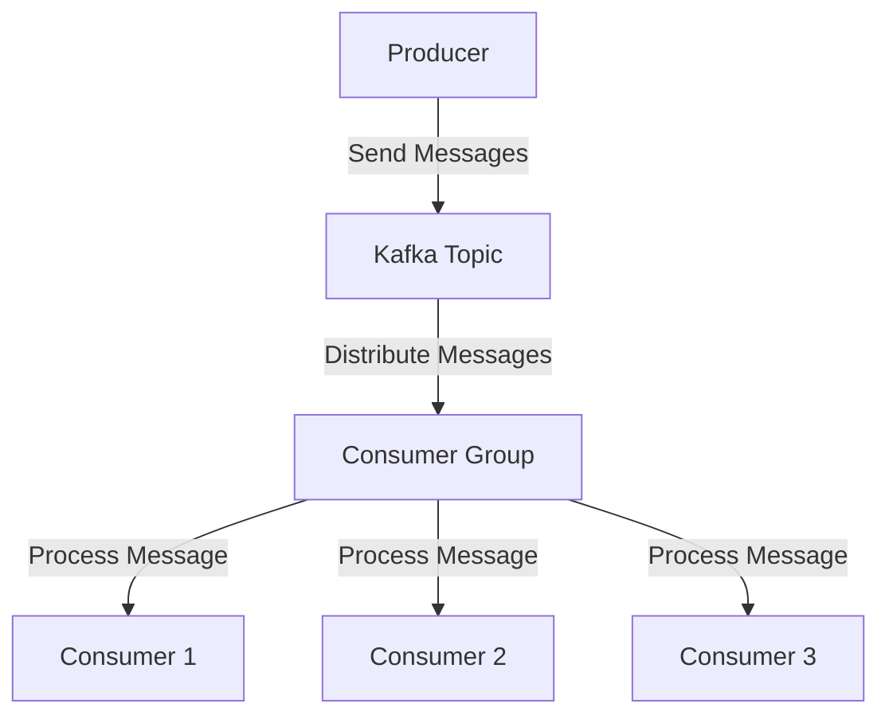
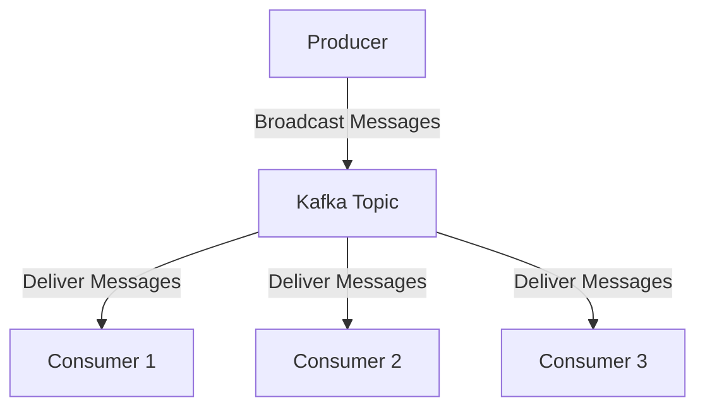

## 4.1.1 Queue vs. Publish/Subscribe Models

In the realm of distributed systems and real-time data processing, understanding the nuances between different messaging models is crucial for designing efficient and scalable architectures. Apache Kafka, a leading platform for building real-time data pipelines and streaming applications, supports two primary messaging models: Queue and Publish/Subscribe. This section delves into these models, exploring their characteristics, use cases, and implementation details within Kafka.

### Queue Model (Point-to-Point Messaging)

#### Intent

The Queue model, also known as point-to-point messaging, is designed to ensure that each message is processed by a single consumer. This model is particularly useful in scenarios where tasks need to be distributed among multiple consumers for load balancing and parallel processing.

#### Motivation

The Queue model is ideal for use cases where tasks or messages need to be processed exactly once by a single consumer. This ensures that work is evenly distributed across consumers, preventing duplication and ensuring efficient resource utilization.

#### Applicability

- **Task Distribution**: When tasks need to be distributed among multiple workers for parallel processing.
- **Load Balancing**: To balance the load across multiple consumers, ensuring that no single consumer is overwhelmed.
- **Order Processing**: In scenarios where each order or transaction must be processed exactly once.

#### Structure

In Kafka, the Queue model is implemented using consumer groups. Each consumer group subscribes to a topic, and Kafka ensures that each message is delivered to only one consumer within the group.



**Diagram**: The Queue model in Kafka, where messages from a topic are distributed among consumers in a consumer group.

#### Participants

- **Producer**: Sends messages to a Kafka topic.
- **Kafka Topic**: Acts as a buffer, storing messages until they are consumed.
- **Consumer Group**: A group of consumers that share the work of processing messages from a topic.
- **Consumers**: Individual instances that process messages from the topic.

#### Collaborations

- **Producer to Topic**: The producer sends messages to a Kafka topic.
- **Topic to Consumer Group**: The topic distributes messages to consumers within a consumer group.
- **Consumer Group to Consumers**: Each message is delivered to only one consumer within the group.

#### Consequences

- **Scalability**: The Queue model allows for horizontal scaling by adding more consumers to the consumer group.
- **Fault Tolerance**: If a consumer fails, Kafka can redistribute the messages to other consumers in the group.
- **Load Balancing**: Ensures that messages are evenly distributed across consumers.

#### Implementation

- **Java**:

    ```java
    import org.apache.kafka.clients.consumer.ConsumerConfig;
    import org.apache.kafka.clients.consumer.KafkaConsumer;
    import org.apache.kafka.clients.consumer.ConsumerRecords;
    import org.apache.kafka.clients.consumer.ConsumerRecord;

    import java.util.Collections;
    import java.util.Properties;

    public class QueueConsumer {
        public static void main(String[] args) {
            Properties props = new Properties();
            props.put(ConsumerConfig.BOOTSTRAP_SERVERS_CONFIG, "localhost:9092");
            props.put(ConsumerConfig.GROUP_ID_CONFIG, "queue-consumer-group");
            props.put(ConsumerConfig.KEY_DESERIALIZER_CLASS_CONFIG, "org.apache.kafka.common.serialization.StringDeserializer");
            props.put(ConsumerConfig.VALUE_DESERIALIZER_CLASS_CONFIG, "org.apache.kafka.common.serialization.StringDeserializer");

            KafkaConsumer<String, String> consumer = new KafkaConsumer<>(props);
            consumer.subscribe(Collections.singletonList("queue-topic"));

            while (true) {
                ConsumerRecords<String, String> records = consumer.poll(100);
                for (ConsumerRecord<String, String> record : records) {
                    System.out.printf("Consumed message: %s%n", record.value());
                }
            }
        }
    }
    ```

- **Scala**:

    ```scala
    import org.apache.kafka.clients.consumer.{ConsumerConfig, KafkaConsumer}
    import java.util.Properties
    import scala.collection.JavaConverters._

    object QueueConsumer extends App {
      val props = new Properties()
      props.put(ConsumerConfig.BOOTSTRAP_SERVERS_CONFIG, "localhost:9092")
      props.put(ConsumerConfig.GROUP_ID_CONFIG, "queue-consumer-group")
      props.put(ConsumerConfig.KEY_DESERIALIZER_CLASS_CONFIG, "org.apache.kafka.common.serialization.StringDeserializer")
      props.put(ConsumerConfig.VALUE_DESERIALIZER_CLASS_CONFIG, "org.apache.kafka.common.serialization.StringDeserializer")

      val consumer = new KafkaConsumer[String, String](props)
      consumer.subscribe(List("queue-topic").asJava)

      while (true) {
        val records = consumer.poll(100).asScala
        for (record <- records) {
          println(s"Consumed message: ${record.value()}")
        }
      }
    }
    ```

- **Kotlin**:

    ```kotlin
    import org.apache.kafka.clients.consumer.ConsumerConfig
    import org.apache.kafka.clients.consumer.KafkaConsumer
    import java.util.*

    fun main() {
        val props = Properties()
        props[ConsumerConfig.BOOTSTRAP_SERVERS_CONFIG] = "localhost:9092"
        props[ConsumerConfig.GROUP_ID_CONFIG] = "queue-consumer-group"
        props[ConsumerConfig.KEY_DESERIALIZER_CLASS_CONFIG] = "org.apache.kafka.common.serialization.StringDeserializer"
        props[ConsumerConfig.VALUE_DESERIALIZER_CLASS_CONFIG] = "org.apache.kafka.common.serialization.StringDeserializer"

        val consumer = KafkaConsumer<String, String>(props)
        consumer.subscribe(listOf("queue-topic"))

        while (true) {
            val records = consumer.poll(100)
            for (record in records) {
                println("Consumed message: ${record.value()}")
            }
        }
    }
    ```

- **Clojure**:

    ```clojure
    (require '[clojure.java.io :as io])
    (import '[org.apache.kafka.clients.consumer KafkaConsumer ConsumerConfig]
            '[java.util Properties Collections])

    (defn create-consumer []
      (let [props (doto (Properties.)
                    (.put ConsumerConfig/BOOTSTRAP_SERVERS_CONFIG "localhost:9092")
                    (.put ConsumerConfig/GROUP_ID_CONFIG "queue-consumer-group")
                    (.put ConsumerConfig/KEY_DESERIALIZER_CLASS_CONFIG "org.apache.kafka.common.serialization.StringDeserializer")
                    (.put ConsumerConfig/VALUE_DESERIALIZER_CLASS_CONFIG "org.apache.kafka.common.serialization.StringDeserializer"))]
        (KafkaConsumer. props)))

    (defn consume-messages []
      (let [consumer (create-consumer)]
        (.subscribe consumer (Collections/singletonList "queue-topic"))
        (while true
          (let [records (.poll consumer 100)]
            (doseq [record records]
              (println "Consumed message:" (.value record)))))))

    (consume-messages)
    ```

#### Sample Use Cases

- **Financial Services**: Processing transactions where each transaction must be handled exactly once.
- **E-commerce**: Order processing systems where each order is processed by a single worker.
- **Manufacturing**: Task distribution in assembly lines where each task is handled by a specific machine.

#### Related Patterns

- **Competing Consumers**: A pattern where multiple consumers compete to process messages from a queue, similar to the Queue model.
- **Load Balancing**: Ensures that work is evenly distributed across consumers.

### Publish/Subscribe Model

#### Intent

The Publish/Subscribe model allows messages to be broadcast to multiple consumers. This model is suitable for scenarios where the same message needs to be processed by multiple consumers, such as in event-driven architectures.

#### Motivation

The Publish/Subscribe model is ideal for use cases where messages need to be disseminated to multiple consumers, enabling them to react to events independently.

#### Applicability

- **Event-Driven Architectures**: When multiple services need to react to the same event.
- **Real-Time Analytics**: Broadcasting data to multiple analytics engines for processing.
- **Notification Systems**: Sending alerts or notifications to multiple subscribers.

#### Structure

In Kafka, the Publish/Subscribe model is implemented using topics. Each consumer subscribes to a topic and receives all messages published to that topic.



**Diagram**: The Publish/Subscribe model in Kafka, where messages from a topic are broadcast to all subscribed consumers.

#### Participants

- **Producer**: Sends messages to a Kafka topic.
- **Kafka Topic**: Acts as a channel, broadcasting messages to all subscribed consumers.
- **Consumers**: Instances that subscribe to a topic and receive all messages.

#### Collaborations

- **Producer to Topic**: The producer sends messages to a Kafka topic.
- **Topic to Consumers**: The topic broadcasts messages to all subscribed consumers.

#### Consequences

- **Scalability**: The Publish/Subscribe model allows for horizontal scaling by adding more consumers.
- **Decoupling**: Consumers are decoupled from producers, allowing for independent scaling and development.
- **Flexibility**: New consumers can be added without impacting existing consumers.

#### Implementation

- **Java**:

    ```java
    import org.apache.kafka.clients.consumer.ConsumerConfig;
    import org.apache.kafka.clients.consumer.KafkaConsumer;
    import org.apache.kafka.clients.consumer.ConsumerRecords;
    import org.apache.kafka.clients.consumer.ConsumerRecord;

    import java.util.Collections;
    import java.util.Properties;

    public class PubSubConsumer {
        public static void main(String[] args) {
            Properties props = new Properties();
            props.put(ConsumerConfig.BOOTSTRAP_SERVERS_CONFIG, "localhost:9092");
            props.put(ConsumerConfig.GROUP_ID_CONFIG, "pubsub-consumer-group");
            props.put(ConsumerConfig.KEY_DESERIALIZER_CLASS_CONFIG, "org.apache.kafka.common.serialization.StringDeserializer");
            props.put(ConsumerConfig.VALUE_DESERIALIZER_CLASS_CONFIG, "org.apache.kafka.common.serialization.StringDeserializer");

            KafkaConsumer<String, String> consumer = new KafkaConsumer<>(props);
            consumer.subscribe(Collections.singletonList("pubsub-topic"));

            while (true) {
                ConsumerRecords<String, String> records = consumer.poll(100);
                for (ConsumerRecord<String, String> record : records) {
                    System.out.printf("Consumed message: %s%n", record.value());
                }
            }
        }
    }
    ```

- **Scala**:

    ```scala
    import org.apache.kafka.clients.consumer.{ConsumerConfig, KafkaConsumer}
    import java.util.Properties
    import scala.collection.JavaConverters._

    object PubSubConsumer extends App {
      val props = new Properties()
      props.put(ConsumerConfig.BOOTSTRAP_SERVERS_CONFIG, "localhost:9092")
      props.put(ConsumerConfig.GROUP_ID_CONFIG, "pubsub-consumer-group")
      props.put(ConsumerConfig.KEY_DESERIALIZER_CLASS_CONFIG, "org.apache.kafka.common.serialization.StringDeserializer")
      props.put(ConsumerConfig.VALUE_DESERIALIZER_CLASS_CONFIG, "org.apache.kafka.common.serialization.StringDeserializer")

      val consumer = new KafkaConsumer[String, String](props)
      consumer.subscribe(List("pubsub-topic").asJava)

      while (true) {
        val records = consumer.poll(100).asScala
        for (record <- records) {
          println(s"Consumed message: ${record.value()}")
        }
      }
    }
    ```

- **Kotlin**:

    ```kotlin
    import org.apache.kafka.clients.consumer.ConsumerConfig
    import org.apache.kafka.clients.consumer.KafkaConsumer
    import java.util.*

    fun main() {
        val props = Properties()
        props[ConsumerConfig.BOOTSTRAP_SERVERS_CONFIG] = "localhost:9092"
        props[ConsumerConfig.GROUP_ID_CONFIG] = "pubsub-consumer-group"
        props[ConsumerConfig.KEY_DESERIALIZER_CLASS_CONFIG] = "org.apache.kafka.common.serialization.StringDeserializer"
        props[ConsumerConfig.VALUE_DESERIALIZER_CLASS_CONFIG] = "org.apache.kafka.common.serialization.StringDeserializer"

        val consumer = KafkaConsumer<String, String>(props)
        consumer.subscribe(listOf("pubsub-topic"))

        while (true) {
            val records = consumer.poll(100)
            for (record in records) {
                println("Consumed message: ${record.value()}")
            }
        }
    }
    ```

- **Clojure**:

    ```clojure
    (require '[clojure.java.io :as io])
    (import '[org.apache.kafka.clients.consumer KafkaConsumer ConsumerConfig]
            '[java.util Properties Collections])

    (defn create-consumer []
      (let [props (doto (Properties.)
                    (.put ConsumerConfig/BOOTSTRAP_SERVERS_CONFIG "localhost:9092")
                    (.put ConsumerConfig/GROUP_ID_CONFIG "pubsub-consumer-group")
                    (.put ConsumerConfig/KEY_DESERIALIZER_CLASS_CONFIG "org.apache.kafka.common.serialization.StringDeserializer")
                    (.put ConsumerConfig/VALUE_DESERIALIZER_CLASS_CONFIG "org.apache.kafka.common.serialization.StringDeserializer"))]
        (KafkaConsumer. props)))

    (defn consume-messages []
      (let [consumer (create-consumer)]
        (.subscribe consumer (Collections/singletonList "pubsub-topic"))
        (while true
          (let [records (.poll consumer 100)]
            (doseq [record records]
              (println "Consumed message:" (.value record)))))))

    (consume-messages)
    ```

#### Sample Use Cases

- **Social Media Platforms**: Broadcasting updates or notifications to multiple users.
- **Stock Market**: Distributing market data to multiple analytics engines.
- **IoT Systems**: Sending sensor data to multiple processing units for analysis.

#### Related Patterns

- **Event-Driven Architecture**: A pattern where systems react to events, often implemented using the Publish/Subscribe model.
- **Observer Pattern**: A design pattern where an object, known as the subject, maintains a list of its dependents, called observers, and notifies them of any state changes.

### Performance Considerations and Scaling Implications

#### Queue Model

- **Performance**: The Queue model can achieve high throughput by distributing messages across multiple consumers. However, it requires careful management of consumer offsets to ensure exactly-once processing.
- **Scaling**: Adding more consumers to a consumer group can improve scalability, but it may require partitioning the topic to ensure that each consumer receives a balanced workload.

#### Publish/Subscribe Model

- **Performance**: The Publish/Subscribe model can handle a large number of consumers, but each consumer receives a copy of every message, which can increase network and storage overhead.
- **Scaling**: The model scales well with the addition of new consumers, but it may require careful management of topic partitions to ensure efficient message delivery.

### Industries and Applications

#### Queue Model

- **Financial Services**: Transaction processing systems where each transaction must be handled exactly once.
- **E-commerce**: Order processing systems where each order is processed by a single worker.
- **Manufacturing**: Task distribution in assembly lines where each task is handled by a specific machine.

#### Publish/Subscribe Model

- **Social Media Platforms**: Broadcasting updates or notifications to multiple users.
- **Stock Market**: Distributing market data to multiple analytics engines.
- **IoT Systems**: Sending sensor data to multiple processing units for analysis.

### Conclusion

Understanding the differences between the Queue and Publish/Subscribe models is essential for designing efficient and scalable messaging systems with Apache Kafka. By leveraging Kafka's consumer groups and topics, developers can implement these models to meet the specific needs of their applications, whether it be task distribution, event-driven processing, or real-time analytics.

## Test Your Knowledge: Queue vs. Publish/Subscribe Models in Kafka



### What is the primary characteristic of the Queue model in Kafka?

- [x] Each message is processed by a single consumer.
- [ ] Messages are broadcast to multiple consumers.
- [ ] Messages are stored indefinitely.
- [ ] Messages are processed in parallel by all consumers.

> **Explanation:** In the Queue model, each message is processed by a single consumer within a consumer group, ensuring that tasks are distributed evenly.

### How does the Publish/Subscribe model differ from the Queue model in Kafka?

- [x] Messages are broadcast to all subscribed consumers.
- [ ] Each message is processed by a single consumer.
- [ ] Messages are stored in a queue.
- [ ] Messages are processed in a round-robin fashion.

> **Explanation:** The Publish/Subscribe model allows messages to be broadcast to all subscribed consumers, enabling multiple consumers to react to the same event.

### What role do consumer groups play in Kafka's Queue model?

- [x] They ensure that each message is processed by only one consumer within the group.
- [ ] They allow messages to be broadcast to multiple consumers.
- [ ] They store messages indefinitely.
- [ ] They manage topic partitions.

> **Explanation:** Consumer groups in Kafka's Queue model ensure that each message is processed by only one consumer within the group, facilitating load balancing.

### Which model is best suited for event-driven architectures?

- [x] Publish/Subscribe model
- [ ] Queue model
- [ ] Batch processing model
- [ ] Real-time processing model

> **Explanation:** The Publish/Subscribe model is best suited for event-driven architectures, where multiple services need to react to the same event.

### In which scenario would the Queue model be most beneficial?

- [x] Distributing tasks among multiple workers for parallel processing.
- [ ] Broadcasting notifications to multiple users.
- [ ] Sending sensor data to multiple processing units.
- [ ] Distributing market data to analytics engines.

> **Explanation:** The Queue model is beneficial for distributing tasks among multiple workers for parallel processing, ensuring that each task is handled by a single worker.

### What is a potential drawback of the Publish/Subscribe model?

- [x] Increased network and storage overhead due to message duplication.
- [ ] Messages are processed by only one consumer.
- [ ] Difficulty in scaling consumers.
- [ ] Limited to batch processing.

> **Explanation:** The Publish/Subscribe model can lead to increased network and storage overhead because each consumer receives a copy of every message.

### How can the Queue model achieve high throughput?

- [x] By distributing messages across multiple consumers.
- [ ] By broadcasting messages to all consumers.
- [ ] By storing messages indefinitely.
- [ ] By processing messages in a round-robin fashion.

> **Explanation:** The Queue model achieves high throughput by distributing messages across multiple consumers, allowing for parallel processing.

### Which model allows for decoupling of producers and consumers?

- [x] Publish/Subscribe model
- [ ] Queue model
- [ ] Batch processing model
- [ ] Real-time processing model

> **Explanation:** The Publish/Subscribe model allows for decoupling of producers and consumers, enabling independent scaling and development.

### What is a key benefit of using consumer groups in Kafka?

- [x] They facilitate load balancing by distributing messages across consumers.
- [ ] They store messages indefinitely.
- [ ] They broadcast messages to all consumers.
- [ ] They manage topic partitions.

> **Explanation:** Consumer groups facilitate load balancing by distributing messages across consumers, ensuring efficient resource utilization.

### True or False: In the Publish/Subscribe model, new consumers can be added without impacting existing consumers.

- [x] True
- [ ] False

> **Explanation:** True. In the Publish/Subscribe model, new consumers can be added without impacting existing consumers, providing flexibility and scalability.


