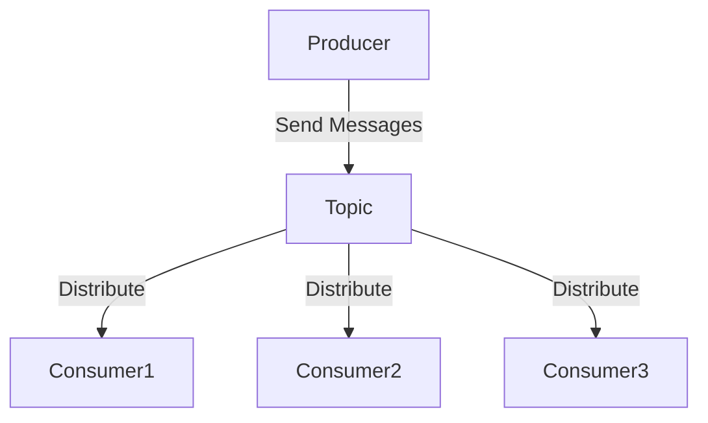
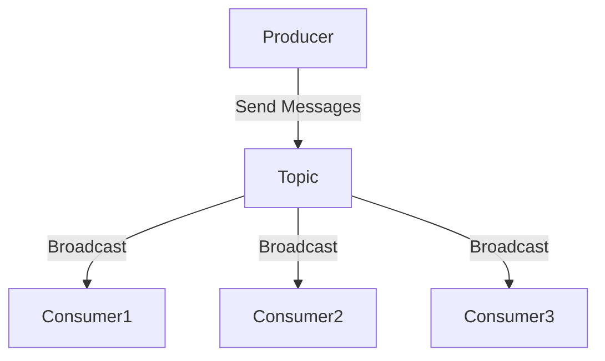
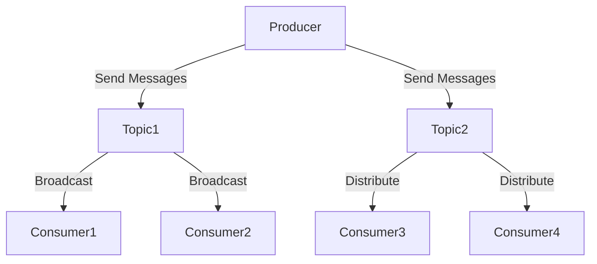

## 4.1 Messaging Patterns with Kafka

### Introduction

Apache Kafka is a distributed event streaming platform that has become a cornerstone for building real-time data pipelines and streaming applications. At its core, Kafka supports two fundamental messaging patterns: the Queue model and the Publish/Subscribe model. These patterns are essential for designing systems that require reliable, scalable, and fault-tolerant messaging capabilities. In this section, we will explore these patterns in detail, understand how Kafka's architecture supports them, and examine hybrid messaging patterns that combine elements of both models to address complex communication challenges.

### Queue Model

#### Intent

The Queue model is designed to distribute messages among multiple consumers, ensuring that each message is processed by only one consumer. This pattern is ideal for load balancing and parallel processing tasks.

#### Motivation

In scenarios where tasks need to be processed concurrently, such as order processing systems or background job execution, the Queue model provides an efficient way to distribute workload across multiple consumers.

#### Applicability

- **Load Balancing**: Distribute tasks evenly among consumers to optimize resource utilization.
- **Parallel Processing**: Enable concurrent processing of tasks to improve throughput.
- **Task Offloading**: Offload tasks from producers to consumers for asynchronous processing.

#### Structure

In the Queue model, messages are sent to a topic, and consumer instances within a consumer group read from the topic. Each message is consumed by only one consumer in the group.



**Caption**: In the Queue model, messages are distributed among consumers in a consumer group, with each message being processed by only one consumer.

#### Participants

- **Producer**: Sends messages to a Kafka topic.
- **Topic**: Acts as a message queue, storing messages for consumption.
- **Consumer Group**: A group of consumers that share the workload, with each message being processed by only one consumer in the group.

#### Collaborations

- Producers send messages to a topic.
- Consumers in a consumer group read from the topic, with Kafka ensuring that each message is delivered to only one consumer in the group.

#### Consequences

- **Scalability**: Easily scale consumers to handle increased load.
- **Fault Tolerance**: If a consumer fails, another consumer in the group can take over.
- **Load Balancing**: Distributes messages evenly across consumers.

#### Implementation

- **Java**:

    ```java
    import org.apache.kafka.clients.producer.KafkaProducer;
    import org.apache.kafka.clients.producer.ProducerRecord;
    import org.apache.kafka.clients.consumer.KafkaConsumer;
    import org.apache.kafka.clients.consumer.ConsumerRecords;
    import org.apache.kafka.clients.consumer.ConsumerConfig;
    import java.util.Properties;
    import java.util.Collections;

    public class QueueModelExample {
        public static void main(String[] args) {
            // Producer configuration
            Properties producerProps = new Properties();
            producerProps.put("bootstrap.servers", "localhost:9092");
            producerProps.put("key.serializer", "org.apache.kafka.common.serialization.StringSerializer");
            producerProps.put("value.serializer", "org.apache.kafka.common.serialization.StringSerializer");

            KafkaProducer<String, String> producer = new KafkaProducer<>(producerProps);
            producer.send(new ProducerRecord<>("queue-topic", "key", "message"));
            producer.close();

            // Consumer configuration
            Properties consumerProps = new Properties();
            consumerProps.put(ConsumerConfig.BOOTSTRAP_SERVERS_CONFIG, "localhost:9092");
            consumerProps.put(ConsumerConfig.GROUP_ID_CONFIG, "queue-group");
            consumerProps.put(ConsumerConfig.KEY_DESERIALIZER_CLASS_CONFIG, "org.apache.kafka.common.serialization.StringDeserializer");
            consumerProps.put(ConsumerConfig.VALUE_DESERIALIZER_CLASS_CONFIG, "org.apache.kafka.common.serialization.StringDeserializer");

            KafkaConsumer<String, String> consumer = new KafkaConsumer<>(consumerProps);
            consumer.subscribe(Collections.singletonList("queue-topic"));

            while (true) {
                ConsumerRecords<String, String> records = consumer.poll(100);
                records.forEach(record -> {
                    System.out.printf("Consumed message: %s%n", record.value());
                });
            }
        }
    }
    ```

- **Scala**:

    ```scala
    import org.apache.kafka.clients.producer.{KafkaProducer, ProducerRecord}
    import org.apache.kafka.clients.consumer.{KafkaConsumer, ConsumerConfig}
    import java.util.Properties
    import scala.collection.JavaConverters._

    object QueueModelExample extends App {
        // Producer configuration
        val producerProps = new Properties()
        producerProps.put("bootstrap.servers", "localhost:9092")
        producerProps.put("key.serializer", "org.apache.kafka.common.serialization.StringSerializer")
        producerProps.put("value.serializer", "org.apache.kafka.common.serialization.StringSerializer")

        val producer = new KafkaProducer[String, String](producerProps)
        producer.send(new ProducerRecord[String, String]("queue-topic", "key", "message"))
        producer.close()

        // Consumer configuration
        val consumerProps = new Properties()
        consumerProps.put(ConsumerConfig.BOOTSTRAP_SERVERS_CONFIG, "localhost:9092")
        consumerProps.put(ConsumerConfig.GROUP_ID_CONFIG, "queue-group")
        consumerProps.put(ConsumerConfig.KEY_DESERIALIZER_CLASS_CONFIG, "org.apache.kafka.common.serialization.StringDeserializer")
        consumerProps.put(ConsumerConfig.VALUE_DESERIALIZER_CLASS_CONFIG, "org.apache.kafka.common.serialization.StringDeserializer")

        val consumer = new KafkaConsumer[String, String](consumerProps)
        consumer.subscribe(List("queue-topic").asJava)

        while (true) {
            val records = consumer.poll(100).asScala
            records.foreach(record => println(s"Consumed message: ${record.value()}"))
        }
    }
    ```

- **Kotlin**:

    ```kotlin
    import org.apache.kafka.clients.producer.KafkaProducer
    import org.apache.kafka.clients.producer.ProducerRecord
    import org.apache.kafka.clients.consumer.KafkaConsumer
    import org.apache.kafka.clients.consumer.ConsumerConfig
    import java.util.Properties

    fun main() {
        // Producer configuration
        val producerProps = Properties().apply {
            put("bootstrap.servers", "localhost:9092")
            put("key.serializer", "org.apache.kafka.common.serialization.StringSerializer")
            put("value.serializer", "org.apache.kafka.common.serialization.StringSerializer")
        }

        KafkaProducer<String, String>(producerProps).use { producer ->
            producer.send(ProducerRecord("queue-topic", "key", "message"))
        }

        // Consumer configuration
        val consumerProps = Properties().apply {
            put(ConsumerConfig.BOOTSTRAP_SERVERS_CONFIG, "localhost:9092")
            put(ConsumerConfig.GROUP_ID_CONFIG, "queue-group")
            put(ConsumerConfig.KEY_DESERIALIZER_CLASS_CONFIG, "org.apache.kafka.common.serialization.StringDeserializer")
            put(ConsumerConfig.VALUE_DESERIALIZER_CLASS_CONFIG, "org.apache.kafka.common.serialization.StringDeserializer")
        }

        KafkaConsumer<String, String>(consumerProps).use { consumer ->
            consumer.subscribe(listOf("queue-topic"))
            while (true) {
                val records = consumer.poll(100)
                records.forEach { record ->
                    println("Consumed message: ${record.value()}")
                }
            }
        }
    }
    ```

- **Clojure**:

    ```clojure
    (ns queue-model-example
      (:import [org.apache.kafka.clients.producer KafkaProducer ProducerRecord]
               [org.apache.kafka.clients.consumer KafkaConsumer ConsumerConfig]
               [java.util Properties Collections]))

    (defn -main []
      ;; Producer configuration
      (let [producer-props (doto (Properties.)
                             (.put "bootstrap.servers" "localhost:9092")
                             (.put "key.serializer" "org.apache.kafka.common.serialization.StringSerializer")
                             (.put "value.serializer" "org.apache.kafka.common.serialization.StringSerializer"))
            producer (KafkaProducer. producer-props)]
        (.send producer (ProducerRecord. "queue-topic" "key" "message"))
        (.close producer))

      ;; Consumer configuration
      (let [consumer-props (doto (Properties.)
                             (.put ConsumerConfig/BOOTSTRAP_SERVERS_CONFIG "localhost:9092")
                             (.put ConsumerConfig/GROUP_ID_CONFIG "queue-group")
                             (.put ConsumerConfig/KEY_DESERIALIZER_CLASS_CONFIG "org.apache.kafka.common.serialization.StringDeserializer")
                             (.put ConsumerConfig/VALUE_DESERIALIZER_CLASS_CONFIG "org.apache.kafka.common.serialization.StringDeserializer"))
            consumer (KafkaConsumer. consumer-props)]
        (.subscribe consumer (Collections/singletonList "queue-topic"))
        (while true
          (let [records (.poll consumer 100)]
            (doseq [record records]
              (println "Consumed message:" (.value record)))))))
    ```

#### Sample Use Cases

- **Order Processing Systems**: Distribute incoming orders to multiple processing nodes for parallel handling.
- **Background Job Execution**: Offload tasks from web servers to background workers for asynchronous processing.

#### Related Patterns

- **[4.3 Consumer Scaling Patterns]( "Consumer Scaling Patterns")**: Explore techniques for scaling consumers in a Kafka-based system.

### Publish/Subscribe Model

#### Intent

The Publish/Subscribe model allows multiple consumers to receive all messages published to a topic. This pattern is ideal for broadcasting messages to multiple subscribers.

#### Motivation

In scenarios where multiple systems need to react to the same events, such as notification systems or real-time analytics, the Publish/Subscribe model ensures that all interested parties receive the necessary information.

#### Applicability

- **Broadcasting**: Send messages to multiple consumers simultaneously.
- **Event-Driven Architectures**: Enable systems to react to events in real-time.
- **Data Replication**: Distribute data changes to multiple systems.

#### Structure

In the Publish/Subscribe model, messages are sent to a topic, and all consumers subscribed to the topic receive each message.



**Caption**: In the Publish/Subscribe model, messages are broadcast to all consumers subscribed to the topic.

#### Participants

- **Producer**: Sends messages to a Kafka topic.
- **Topic**: Acts as a message broker, storing messages for broadcast.
- **Consumer**: Subscribes to the topic to receive all messages.

#### Collaborations

- Producers send messages to a topic.
- All consumers subscribed to the topic receive each message.

#### Consequences

- **Scalability**: Easily add new consumers without affecting existing ones.
- **Decoupling**: Producers and consumers are decoupled, allowing independent scaling and evolution.
- **Broadcasting**: Efficiently distribute messages to multiple consumers.

#### Implementation

- **Java**:

    ```java
    import org.apache.kafka.clients.producer.KafkaProducer;
    import org.apache.kafka.clients.producer.ProducerRecord;
    import org.apache.kafka.clients.consumer.KafkaConsumer;
    import org.apache.kafka.clients.consumer.ConsumerRecords;
    import org.apache.kafka.clients.consumer.ConsumerConfig;
    import java.util.Properties;
    import java.util.Collections;

    public class PublishSubscribeExample {
        public static void main(String[] args) {
            // Producer configuration
            Properties producerProps = new Properties();
            producerProps.put("bootstrap.servers", "localhost:9092");
            producerProps.put("key.serializer", "org.apache.kafka.common.serialization.StringSerializer");
            producerProps.put("value.serializer", "org.apache.kafka.common.serialization.StringSerializer");

            KafkaProducer<String, String> producer = new KafkaProducer<>(producerProps);
            producer.send(new ProducerRecord<>("pubsub-topic", "key", "message"));
            producer.close();

            // Consumer configuration
            Properties consumerProps = new Properties();
            consumerProps.put(ConsumerConfig.BOOTSTRAP_SERVERS_CONFIG, "localhost:9092");
            consumerProps.put(ConsumerConfig.GROUP_ID_CONFIG, "pubsub-group");
            consumerProps.put(ConsumerConfig.KEY_DESERIALIZER_CLASS_CONFIG, "org.apache.kafka.common.serialization.StringDeserializer");
            consumerProps.put(ConsumerConfig.VALUE_DESERIALIZER_CLASS_CONFIG, "org.apache.kafka.common.serialization.StringDeserializer");

            KafkaConsumer<String, String> consumer = new KafkaConsumer<>(consumerProps);
            consumer.subscribe(Collections.singletonList("pubsub-topic"));

            while (true) {
                ConsumerRecords<String, String> records = consumer.poll(100);
                records.forEach(record -> {
                    System.out.printf("Consumed message: %s%n", record.value());
                });
            }
        }
    }
    ```

- **Scala**:

    ```scala
    import org.apache.kafka.clients.producer.{KafkaProducer, ProducerRecord}
    import org.apache.kafka.clients.consumer.{KafkaConsumer, ConsumerConfig}
    import java.util.Properties
    import scala.collection.JavaConverters._

    object PublishSubscribeExample extends App {
        // Producer configuration
        val producerProps = new Properties()
        producerProps.put("bootstrap.servers", "localhost:9092")
        producerProps.put("key.serializer", "org.apache.kafka.common.serialization.StringSerializer")
        producerProps.put("value.serializer", "org.apache.kafka.common.serialization.StringSerializer")

        val producer = new KafkaProducer[String, String](producerProps)
        producer.send(new ProducerRecord[String, String]("pubsub-topic", "key", "message"))
        producer.close()

        // Consumer configuration
        val consumerProps = new Properties()
        consumerProps.put(ConsumerConfig.BOOTSTRAP_SERVERS_CONFIG, "localhost:9092")
        consumerProps.put(ConsumerConfig.GROUP_ID_CONFIG, "pubsub-group")
        consumerProps.put(ConsumerConfig.KEY_DESERIALIZER_CLASS_CONFIG, "org.apache.kafka.common.serialization.StringDeserializer")
        consumerProps.put(ConsumerConfig.VALUE_DESERIALIZER_CLASS_CONFIG, "org.apache.kafka.common.serialization.StringDeserializer")

        val consumer = new KafkaConsumer[String, String](consumerProps)
        consumer.subscribe(List("pubsub-topic").asJava)

        while (true) {
            val records = consumer.poll(100).asScala
            records.foreach(record => println(s"Consumed message: ${record.value()}"))
        }
    }
    ```

- **Kotlin**:

    ```kotlin
    import org.apache.kafka.clients.producer.KafkaProducer
    import org.apache.kafka.clients.producer.ProducerRecord
    import org.apache.kafka.clients.consumer.KafkaConsumer
    import org.apache.kafka.clients.consumer.ConsumerConfig
    import java.util.Properties

    fun main() {
        // Producer configuration
        val producerProps = Properties().apply {
            put("bootstrap.servers", "localhost:9092")
            put("key.serializer", "org.apache.kafka.common.serialization.StringSerializer")
            put("value.serializer", "org.apache.kafka.common.serialization.StringSerializer")
        }

        KafkaProducer<String, String>(producerProps).use { producer ->
            producer.send(ProducerRecord("pubsub-topic", "key", "message"))
        }

        // Consumer configuration
        val consumerProps = Properties().apply {
            put(ConsumerConfig.BOOTSTRAP_SERVERS_CONFIG, "localhost:9092")
            put(ConsumerConfig.GROUP_ID_CONFIG, "pubsub-group")
            put(ConsumerConfig.KEY_DESERIALIZER_CLASS_CONFIG, "org.apache.kafka.common.serialization.StringDeserializer")
            put(ConsumerConfig.VALUE_DESERIALIZER_CLASS_CONFIG, "org.apache.kafka.common.serialization.StringDeserializer")
        }

        KafkaConsumer<String, String>(consumerProps).use { consumer ->
            consumer.subscribe(listOf("pubsub-topic"))
            while (true) {
                val records = consumer.poll(100)
                records.forEach { record ->
                    println("Consumed message: ${record.value()}")
                }
            }
        }
    }
    ```

- **Clojure**:

    ```clojure
    (ns publish-subscribe-example
      (:import [org.apache.kafka.clients.producer KafkaProducer ProducerRecord]
               [org.apache.kafka.clients.consumer KafkaConsumer ConsumerConfig]
               [java.util Properties Collections]))

    (defn -main []
      ;; Producer configuration
      (let [producer-props (doto (Properties.)
                             (.put "bootstrap.servers" "localhost:9092")
                             (.put "key.serializer" "org.apache.kafka.common.serialization.StringSerializer")
                             (.put "value.serializer" "org.apache.kafka.common.serialization.StringSerializer"))
            producer (KafkaProducer. producer-props)]
        (.send producer (ProducerRecord. "pubsub-topic" "key" "message"))
        (.close producer))

      ;; Consumer configuration
      (let [consumer-props (doto (Properties.)
                             (.put ConsumerConfig/BOOTSTRAP_SERVERS_CONFIG "localhost:9092")
                             (.put ConsumerConfig/GROUP_ID_CONFIG "pubsub-group")
                             (.put ConsumerConfig/KEY_DESERIALIZER_CLASS_CONFIG "org.apache.kafka.common.serialization.StringDeserializer")
                             (.put ConsumerConfig/VALUE_DESERIALIZER_CLASS_CONFIG "org.apache.kafka.common.serialization.StringDeserializer"))
            consumer (KafkaConsumer. consumer-props)]
        (.subscribe consumer (Collections/singletonList "pubsub-topic"))
        (while true
          (let [records (.poll consumer 100)]
            (doseq [record records]
              (println "Consumed message:" (.value record)))))))
    ```

#### Sample Use Cases

- **Notification Systems**: Broadcast notifications to multiple user devices.
- **Real-Time Analytics**: Distribute data streams to multiple analytics engines.

#### Related Patterns

- **[4.5 Event Sourcing and CQRS with Kafka]( "Event Sourcing and CQRS with Kafka")**: Explore how the Publish/Subscribe model can be used in event sourcing and CQRS architectures.

### Hybrid Messaging Patterns

#### Intent

Hybrid messaging patterns combine elements of both the Queue and Publish/Subscribe models to address complex communication requirements, such as ensuring message delivery to multiple consumers while also balancing load.

#### Motivation

In scenarios where some messages need to be processed by multiple consumers while others require load balancing, hybrid patterns provide a flexible solution.

#### Applicability

- **Complex Workflows**: Support workflows that require both broadcasting and load balancing.
- **Selective Broadcasting**: Broadcast messages to specific groups of consumers.
- **Dynamic Consumer Behavior**: Allow consumers to switch between Queue and Publish/Subscribe modes based on message type.

#### Structure

Hybrid patterns typically involve multiple topics and consumer groups, with messages routed based on specific criteria.



**Caption**: Hybrid messaging patterns use multiple topics to combine Queue and Publish/Subscribe behaviors.

#### Participants

- **Producer**: Sends messages to multiple topics.
- **Topic**: Stores messages for either broadcast or distribution.
- **Consumer Group**: Reads from topics based on the desired messaging pattern.

#### Collaborations

- Producers send messages to different topics based on criteria.
- Consumers subscribe to topics according to their processing requirements.

#### Consequences

- **Flexibility**: Support diverse messaging requirements within a single system.
- **Complexity**: Increased complexity in managing multiple topics and consumer groups.
- **Efficiency**: Optimize resource utilization by combining patterns.

#### Implementation

- **Java**:

    ```java
    import org.apache.kafka.clients.producer.KafkaProducer;
    import org.apache.kafka.clients.producer.ProducerRecord;
    import org.apache.kafka.clients.consumer.KafkaConsumer;
    import org.apache.kafka.clients.consumer.ConsumerRecords;
    import org.apache.kafka.clients.consumer.ConsumerConfig;
    import java.util.Properties;
    import java.util.Collections;

    public class HybridMessagingExample {
        public static void main(String[] args) {
            // Producer configuration
            Properties producerProps = new Properties();
            producerProps.put("bootstrap.servers", "localhost:9092");
            producerProps.put("key.serializer", "org.apache.kafka.common.serialization.StringSerializer");
            producerProps.put("value.serializer", "org.apache.kafka.common.serialization.StringSerializer");

            KafkaProducer<String, String> producer = new KafkaProducer<>(producerProps);
            producer.send(new ProducerRecord<>("broadcast-topic", "key", "broadcast message"));
            producer.send(new ProducerRecord<>("queue-topic", "key", "queue message"));
            producer.close();

            // Consumer configuration for broadcast
            Properties broadcastConsumerProps = new Properties();
            broadcastConsumerProps.put(ConsumerConfig.BOOTSTRAP_SERVERS_CONFIG, "localhost:9092");
            broadcastConsumerProps.put(ConsumerConfig.GROUP_ID_CONFIG, "broadcast-group");
            broadcastConsumerProps.put(ConsumerConfig.KEY_DESERIALIZER_CLASS_CONFIG, "org.apache.kafka.common.serialization.StringDeserializer");
            broadcastConsumerProps.put(ConsumerConfig.VALUE_DESERIALIZER_CLASS_CONFIG, "org.apache.kafka.common.serialization.StringDeserializer");

            KafkaConsumer<String, String> broadcastConsumer = new KafkaConsumer<>(broadcastConsumerProps);
            broadcastConsumer.subscribe(Collections.singletonList("broadcast-topic"));

            // Consumer configuration for queue
            Properties queueConsumerProps = new Properties();
            queueConsumerProps.put(ConsumerConfig.BOOTSTRAP_SERVERS_CONFIG, "localhost:9092");
            queueConsumerProps.put(ConsumerConfig.GROUP_ID_CONFIG, "queue-group");
            queueConsumerProps.put(ConsumerConfig.KEY_DESERIALIZER_CLASS_CONFIG, "org.apache.kafka.common.serialization.StringDeserializer");
            queueConsumerProps.put(ConsumerConfig.VALUE_DESERIALIZER_CLASS_CONFIG, "org.apache.kafka.common.serialization.StringDeserializer");

            KafkaConsumer<String, String> queueConsumer = new KafkaConsumer<>(queueConsumerProps);
            queueConsumer.subscribe(Collections.singletonList("queue-topic"));

            while (true) {
                ConsumerRecords<String, String> broadcastRecords = broadcastConsumer.poll(100);
                broadcastRecords.forEach(record -> {
                    System.out.printf("Broadcast message: %s%n", record.value());
                });

                ConsumerRecords<String, String> queueRecords = queueConsumer.poll(100);
                queueRecords.forEach(record -> {
                    System.out.printf("Queue message: %s%n", record.value());
                });
            }
        }
    }
    ```

- **Scala**:

    ```scala
    import org.apache.kafka.clients.producer.{KafkaProducer, ProducerRecord}
    import org.apache.kafka.clients.consumer.{KafkaConsumer, ConsumerConfig}
    import java.util.Properties
    import scala.collection.JavaConverters._

    object HybridMessagingExample extends App {
        // Producer configuration
        val producerProps = new Properties()
        producerProps.put("bootstrap.servers", "localhost:9092")
        producerProps.put("key.serializer", "org.apache.kafka.common.serialization.StringSerializer")
        producerProps.put("value.serializer", "org.apache.kafka.common.serialization.StringSerializer")

        val producer = new KafkaProducer[String, String](producerProps)
        producer.send(new ProducerRecord[String, String]("broadcast-topic", "key", "broadcast message"))
        producer.send(new ProducerRecord[String, String]("queue-topic", "key", "queue message"))
        producer.close()

        // Consumer configuration for broadcast
        val broadcastConsumerProps = new Properties()
        broadcastConsumerProps.put(ConsumerConfig.BOOTSTRAP_SERVERS_CONFIG, "localhost:9092")
        broadcastConsumerProps.put(ConsumerConfig.GROUP_ID_CONFIG, "broadcast-group")
        broadcastConsumerProps.put(ConsumerConfig.KEY_DESERIALIZER_CLASS_CONFIG, "org.apache.kafka.common.serialization.StringDeserializer")
        broadcastConsumerProps.put(ConsumerConfig.VALUE_DESERIALIZER_CLASS_CONFIG, "org.apache.kafka.common.serialization.StringDeserializer")

        val broadcastConsumer = new KafkaConsumer[String, String](broadcastConsumerProps)
        broadcastConsumer.subscribe(List("broadcast-topic").asJava)

        // Consumer configuration for queue
        val queueConsumerProps = new Properties()
        queueConsumerProps.put(ConsumerConfig.BOOTSTRAP_SERVERS_CONFIG, "localhost:9092")
        queueConsumerProps.put(ConsumerConfig.GROUP_ID_CONFIG, "queue-group")
        queueConsumerProps.put(ConsumerConfig.KEY_DESERIALIZER_CLASS_CONFIG, "org.apache.kafka.common.serialization.StringDeserializer")
        queueConsumerProps.put(ConsumerConfig.VALUE_DESERIALIZER_CLASS_CONFIG, "org.apache.kafka.common.serialization.StringDeserializer")

        val queueConsumer = new KafkaConsumer[String, String](queueConsumerProps)
        queueConsumer.subscribe(List("queue-topic").asJava)

        while (true) {
            val broadcastRecords = broadcastConsumer.poll(100).asScala
            broadcastRecords.foreach(record => println(s"Broadcast message: ${record.value()}"))

            val queueRecords = queueConsumer.poll(100).asScala
            queueRecords.foreach(record => println(s"Queue message: ${record.value()}"))
        }
    }
    ```

- **Kotlin**:

    ```kotlin
    import org.apache.kafka.clients.producer.KafkaProducer
    import org.apache.kafka.clients.producer.ProducerRecord
    import org.apache.kafka.clients.consumer.KafkaConsumer
    import org.apache.kafka.clients.consumer.ConsumerConfig
    import java.util.Properties

    fun main() {
        // Producer configuration
        val producerProps = Properties().apply {
            put("bootstrap.servers", "localhost:9092")
            put("key.serializer", "org.apache.kafka.common.serialization.StringSerializer")
            put("value.serializer", "org.apache.kafka.common.serialization.StringSerializer")
        }

        KafkaProducer<String, String>(producerProps).use { producer ->
            producer.send(ProducerRecord("broadcast-topic", "key", "broadcast message"))
            producer.send(ProducerRecord("queue-topic", "key", "queue message"))
        }

        // Consumer configuration for broadcast
        val broadcastConsumerProps = Properties().apply {
            put(ConsumerConfig.BOOTSTRAP_SERVERS_CONFIG, "localhost:9092")
            put(ConsumerConfig.GROUP_ID_CONFIG, "broadcast-group")
            put(ConsumerConfig.KEY_DESERIALIZER_CLASS_CONFIG, "org.apache.kafka.common.serialization.StringDeserializer")
            put(ConsumerConfig.VALUE_DESERIALIZER_CLASS_CONFIG, "org.apache.kafka.common.serialization.StringDeserializer")
        }

        KafkaConsumer<String, String>(broadcastConsumerProps).use { broadcastConsumer ->
            broadcastConsumer.subscribe(listOf("broadcast-topic"))
            while (true) {
                val broadcastRecords = broadcastConsumer.poll(100)
                broadcastRecords.forEach { record ->
                    println("Broadcast message: ${record.value()}")
                }
            }
        }

        // Consumer configuration for queue
        val queueConsumerProps = Properties().apply {
            put(ConsumerConfig.BOOTSTRAP_SERVERS_CONFIG, "localhost:9092")
            put(ConsumerConfig.GROUP_ID_CONFIG, "queue-group")
            put(ConsumerConfig.KEY_DESERIALIZER_CLASS_CONFIG, "org.apache.kafka.common.serialization.StringDeserializer")
            put(ConsumerConfig.VALUE_DESERIALIZER_CLASS_CONFIG, "org.apache.kafka.common.serialization.StringDeserializer")
        }

        KafkaConsumer<String, String>(queueConsumerProps).use { queueConsumer ->
            queueConsumer.subscribe(listOf("queue-topic"))
            while (true) {
                val queueRecords = queueConsumer.poll(100)
                queueRecords.forEach { record ->
                    println("Queue message: ${record.value()}")
                }
            }
        }
    }
    ```

- **Clojure**:

    ```clojure
    (ns hybrid-messaging-example
      (:import [org.apache.kafka.clients.producer KafkaProducer ProducerRecord]
               [org.apache.kafka.clients.consumer KafkaConsumer ConsumerConfig]
               [java.util Properties Collections]))

    (defn -main []
      ;; Producer configuration
      (let [producer-props (doto (Properties.)
                             (.put "bootstrap.servers" "localhost:9092")
                             (.put "key.serializer" "org.apache.kafka.common.serialization.StringSerializer")
                             (.put "value.serializer" "org.apache.kafka.common.serialization.StringSerializer"))
            producer (KafkaProducer. producer-props)]
        (.send producer (ProducerRecord. "broadcast-topic" "key" "broadcast message"))
        (.send producer (ProducerRecord. "queue-topic" "key" "queue message"))
        (.close producer))

      ;; Consumer configuration for broadcast
      (let [broadcast-consumer-props (doto (Properties.)
                                       (.put ConsumerConfig/BOOTSTRAP_SERVERS_CONFIG "localhost:9092")
                                       (.put ConsumerConfig/GROUP_ID_CONFIG "broadcast-group")
                                       (.put ConsumerConfig/KEY_DESERIALIZER_CLASS_CONFIG "org.apache.kafka.common.serialization.StringDeserializer")
                                       (.put ConsumerConfig/VALUE_DESERIALIZER_CLASS_CONFIG "org.apache.kafka.common.serialization.StringDeserializer"))
            broadcast-consumer (KafkaConsumer. broadcast-consumer-props)]
        (.subscribe broadcast-consumer (Collections/singletonList "broadcast-topic"))
        (while true
          (let [records (.poll broadcast-consumer 100)]
            (doseq [record records]
              (println "Broadcast message:" (.value record))))))

      ;; Consumer configuration for queue
      (let [queue-consumer-props (doto (Properties.)
                                   (.put ConsumerConfig/BOOTSTRAP_SERVERS_CONFIG "localhost:9092")
                                   (.put ConsumerConfig/GROUP_ID_CONFIG "queue-group")
                                   (.put ConsumerConfig/KEY_DESERIALIZER_CLASS_CONFIG "org.apache.kafka.common.serialization.StringDeserializer")
                                   (.put ConsumerConfig/VALUE_DESERIALIZER_CLASS_CONFIG "org.apache.kafka.common.serialization.StringDeserializer"))
            queue-consumer (KafkaConsumer. queue-consumer-props)]
        (.subscribe queue-consumer (Collections/singletonList "queue-topic"))
        (while true
          (let [records (.poll queue-consumer 100)]
            (doseq [record records]
              (println "Queue message:" (.value record)))))))
    ```

#### Sample Use Cases

- **Complex Event Processing**: Use hybrid patterns to handle different types of events with varying processing requirements.
- **Selective Data Distribution**: Broadcast critical updates to all consumers while distributing less critical tasks among a subset.

#### Related Patterns

- **[8.5 Pattern Detection and Complex Event Processing (CEP)]( "Pattern Detection and Complex Event Processing (CEP)")**: Explore how hybrid patterns can be used in complex event processing scenarios.

### Best Practices and Pitfalls

#### Best Practices

- **Design for Scalability**: Ensure that your system can handle increased load by scaling producers and consumers independently.
- **Monitor Performance**: Use tools like Prometheus and Grafana to monitor Kafka performance and identify bottlenecks.
- **Optimize Configuration**: Tune Kafka configurations for optimal performance, such as adjusting batch sizes and compression settings.

#### Potential Pitfalls

- **Overcomplicating Design**: Avoid unnecessary complexity by choosing the simplest pattern that meets your requirements.
- **Ignoring Fault Tolerance**: Ensure that your system can recover from failures by implementing appropriate fault tolerance mechanisms.
- **Neglecting Security**: Protect your Kafka cluster with SSL/TLS encryption and proper access controls.

### Conclusion

Messaging patterns in Apache Kafka provide powerful tools for building robust, scalable, and fault-tolerant systems. By understanding and implementing the Queue, Publish/Subscribe, and Hybrid messaging patterns, you can design systems that meet a wide range of communication requirements. Remember to follow best practices and avoid common pitfalls to ensure the success of your Kafka-based applications.

## Test Your Knowledge: Advanced Kafka Messaging Patterns Quiz



### What is the primary purpose of the Queue model in Kafka?

- [x] To distribute messages among multiple consumers, ensuring each message is processed by only one consumer.
- [ ] To broadcast messages to all consumers.
- [ ] To store messages for long-term retention.
- [ ] To ensure message ordering.

> **Explanation:** The Queue model is designed to distribute messages among multiple consumers, ensuring that each message is processed by only one consumer, which is ideal for load balancing and parallel processing tasks.

### In the Publish/Subscribe model, how are messages delivered to consumers?

- [x] All consumers subscribed to the topic receive each message.
- [ ] Only one consumer receives each message.
- [ ] Messages are stored for future retrieval.
- [ ] Messages are discarded after delivery.

> **Explanation:** In the Publish/Subscribe model, messages are broadcast to all consumers subscribed to the topic, allowing multiple systems to react to the same events.

### What is a key benefit of using hybrid messaging patterns in Kafka?

- [x] They combine elements of both Queue and Publish/Subscribe models to address complex communication requirements.
- [ ] They simplify system design by using a single messaging pattern.
- [ ] They eliminate the need for consumer groups.
- [ ] They reduce the number of topics needed.

> **Explanation:** Hybrid messaging patterns combine elements of both the Queue and Publish/Subscribe models to address complex communication requirements, such as ensuring message delivery to multiple consumers while also balancing load.

### Which of the following is a potential pitfall when adopting messaging patterns in Kafka?

- [x] Overcomplicating design by choosing unnecessary complex patterns.
- [ ] Using SSL/TLS encryption for security.
- [ ] Monitoring Kafka performance with Prometheus.
- [ ] Scaling consumers independently.

> **Explanation:** Overcomplicating design by choosing unnecessary complex patterns can lead to increased system complexity and maintenance challenges. It's important to choose the simplest pattern that meets your requirements.

### What is a common use case for the Queue model in Kafka?

- [x] Order processing systems that require parallel handling of incoming orders.
- [ ] Broadcasting notifications to multiple user devices.
- [ ] Real-time analytics with multiple analytics engines.
- [ ] Data replication to multiple systems.

> **Explanation:** The Queue model is commonly used in order processing systems to distribute incoming orders to multiple processing nodes for parallel handling.

### How does Kafka ensure fault tolerance in the Queue model?

- [x] If a consumer fails, another consumer in the group can take over.
- [ ] Messages are stored indefinitely until consumed.
- [ ] Producers automatically resend failed messages.
- [ ] Consumers are notified of failures via email.

> **Explanation:** Kafka ensures fault tolerance in the Queue model by allowing another consumer in the group to take over if a consumer fails, ensuring that messages are still processed.

### What is a key characteristic of the Publish/Subscribe model in Kafka?

- [x] Producers and consumers are decoupled, allowing independent scaling and evolution.
- [ ] Messages are delivered to only one consumer.
- [ ] Consumers must acknowledge each message.
- [ ] Messages are deleted after consumption.

> **Explanation:** In the Publish/Subscribe model, producers and consumers are decoupled, allowing independent scaling and evolution, which is a key characteristic of this pattern.

### Which tool can be used to monitor Kafka performance and identify bottlenecks?

- [x] Prometheus
- [ ] Apache Spark
- [ ] Hadoop
- [ ] Jenkins

> **Explanation:** Prometheus is a tool that can be used to monitor Kafka performance and identify bottlenecks, helping to ensure optimal system performance.

### What is the role of a consumer group in the Queue model?

- [x] To share the workload among consumers, ensuring each message is processed by only one consumer.
- [ ] To broadcast messages to all consumers.
- [ ] To store messages for long-term retention.
- [ ] To ensure message ordering.

> **Explanation:** In the Queue model, a consumer group shares the workload among consumers, ensuring that each message is processed by only one consumer, which is ideal for load balancing and parallel processing tasks.

### True or False: In the Publish/Subscribe model, messages are delivered to only one consumer.

- [ ] True
- [x] False

> **Explanation:** False. In the Publish/Subscribe model, messages are broadcast to all consumers subscribed to the topic, allowing multiple systems to react to the same events.


