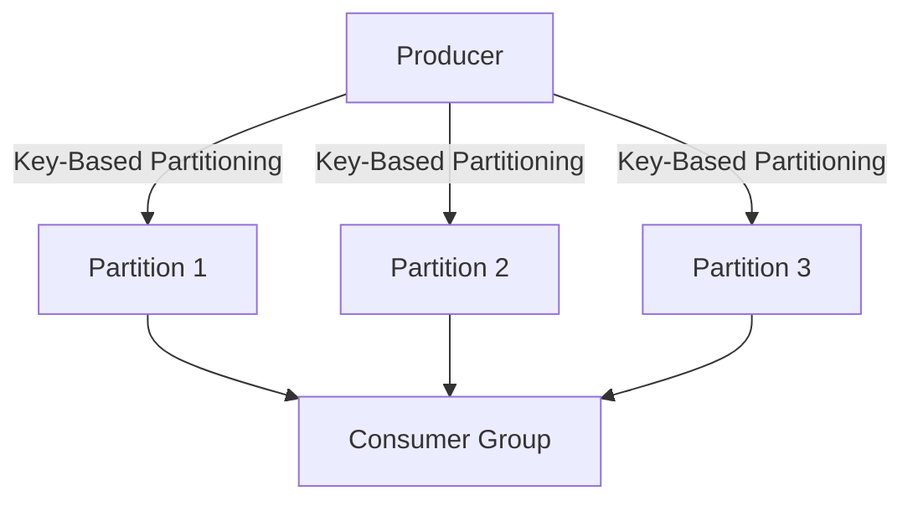

## 4.2.1 Key-Based Partitioning

### Description

Key-based partitioning is a fundamental design pattern in Apache Kafka that routes messages to specific partitions based on a message key. This approach ensures that all messages with the same key are consistently sent to the same partition, thereby maintaining the order of those messages. This section delves into the mechanics of key-based partitioning, its applications, and best practices for its implementation in real-world scenarios.

### Intent

- **Purpose**: To ensure message ordering for specific keys and optimize data distribution across partitions.
- **Problem Solved**: Maintaining order for messages with the same key, which is crucial for applications like user sessions and financial transactions.

### Motivation

In distributed systems, maintaining the order of messages is often critical. For instance, in a financial application, transactions for a specific account must be processed in the order they occur. Key-based partitioning in Kafka provides a solution by ensuring that all messages with the same key are directed to the same partition, preserving their order.

### Applicability

- **Use Cases**: Key-based partitioning is applicable in scenarios where message order is crucial, such as:
  - User session tracking
  - Transaction processing
  - Log aggregation for specific services

### Structure

#### Diagram



- **Caption**: The diagram illustrates how a producer sends messages to different partitions based on the message key, ensuring that all messages with the same key are routed to the same partition.

### Participants

- **Producers**: Send messages with keys to Kafka topics.
- **Partitions**: Store messages and ensure order for messages with the same key.
- **Consumers**: Read messages from partitions, maintaining the order for processing.

### Collaborations

- **Interactions**: Producers use keys to determine the partition for each message. Consumers read from partitions, processing messages in the order they were received.

### Consequences

- **Benefits**: Ensures message order for specific keys, which is critical for many applications.
- **Drawbacks**: Potential for partition skew if keys are not evenly distributed.

### Implementation

#### Sample Code Snippets

**Java**:

```java
import org.apache.kafka.clients.producer.KafkaProducer;
import org.apache.kafka.clients.producer.ProducerRecord;
import org.apache.kafka.clients.producer.ProducerConfig;
import org.apache.kafka.common.serialization.StringSerializer;

import java.util.Properties;

public class KeyBasedPartitioningExample {
    public static void main(String[] args) {
        Properties props = new Properties();
        props.put(ProducerConfig.BOOTSTRAP_SERVERS_CONFIG, "localhost:9092");
        props.put(ProducerConfig.KEY_SERIALIZER_CLASS_CONFIG, StringSerializer.class.getName());
        props.put(ProducerConfig.VALUE_SERIALIZER_CLASS_CONFIG, StringSerializer.class.getName());

        KafkaProducer<String, String> producer = new KafkaProducer<>(props);

        String topic = "user-sessions";
        String key = "user123";
        String value = "session-start";

        ProducerRecord<String, String> record = new ProducerRecord<>(topic, key, value);
        producer.send(record);

        producer.close();
    }
}
```

**Scala**:

```scala
import org.apache.kafka.clients.producer.{KafkaProducer, ProducerConfig, ProducerRecord}
import org.apache.kafka.common.serialization.StringSerializer

import java.util.Properties

object KeyBasedPartitioningExample extends App {
  val props = new Properties()
  props.put(ProducerConfig.BOOTSTRAP_SERVERS_CONFIG, "localhost:9092")
  props.put(ProducerConfig.KEY_SERIALIZER_CLASS_CONFIG, classOf[StringSerializer].getName)
  props.put(ProducerConfig.VALUE_SERIALIZER_CLASS_CONFIG, classOf[StringSerializer].getName)

  val producer = new KafkaProducer[String, String](props)

  val topic = "user-sessions"
  val key = "user123"
  val value = "session-start"

  val record = new ProducerRecord[String, String](topic, key, value)
  producer.send(record)

  producer.close()
}
```

**Kotlin**:

```kotlin
import org.apache.kafka.clients.producer.KafkaProducer
import org.apache.kafka.clients.producer.ProducerConfig
import org.apache.kafka.clients.producer.ProducerRecord
import org.apache.kafka.common.serialization.StringSerializer

fun main() {
    val props = Properties().apply {
        put(ProducerConfig.BOOTSTRAP_SERVERS_CONFIG, "localhost:9092")
        put(ProducerConfig.KEY_SERIALIZER_CLASS_CONFIG, StringSerializer::class.java.name)
        put(ProducerConfig.VALUE_SERIALIZER_CLASS_CONFIG, StringSerializer::class.java.name)
    }

    val producer = KafkaProducer<String, String>(props)

    val topic = "user-sessions"
    val key = "user123"
    val value = "session-start"

    val record = ProducerRecord(topic, key, value)
    producer.send(record)

    producer.close()
}
```

**Clojure**:

```clojure
(require '[clojure.java.io :as io])
(require '[clojure.java.jdbc :as jdbc])
(require '[cheshire.core :as json])

(defn send-message [producer topic key value]
  (let [record (ProducerRecord. topic key value)]
    (.send producer record)))

(defn -main []
  (let [props (doto (Properties.)
                (.put ProducerConfig/BOOTSTRAP_SERVERS_CONFIG "localhost:9092")
                (.put ProducerConfig/KEY_SERIALIZER_CLASS_CONFIG StringSerializer)
                (.put ProducerConfig/VALUE_SERIALIZER_CLASS_CONFIG StringSerializer))
        producer (KafkaProducer. props)]
    (send-message producer "user-sessions" "user123" "session-start")
    (.close producer)))
```

- **Explanation**: These code snippets demonstrate how to implement key-based partitioning in Kafka using different programming languages. The key (`user123`) ensures that all messages related to this user are sent to the same partition.

### Sample Use Cases

- **Real-world Scenarios**:
  - **User Sessions**: Track user activity in web applications, ensuring all actions for a user are processed in order.
  - **Financial Transactions**: Process transactions for a specific account in the order they occur.
  - **Log Aggregation**: Aggregate logs for a specific service or component, maintaining the order of log entries.

### Related Patterns

- **Connections**: Key-based partitioning is closely related to [4.3.1 Competing Consumers]( "Competing Consumers"), where multiple consumers process messages from the same partition.

### Choosing Appropriate Keys

When implementing key-based partitioning, selecting the right key is crucial. The key should be chosen based on the application's requirements for maintaining order. For example, in a user session tracking application, the user ID would be an appropriate key. However, care must be taken to avoid partition skew, where some partitions receive more messages than others, leading to uneven load distribution.

### Trade-offs and Considerations

- **Key Distribution**: Ensure that keys are evenly distributed to prevent partition skew. This can be achieved by hashing the keys or using composite keys.
- **Partition Skew**: Monitor partition load and adjust key selection or partition count to balance the load across partitions.

### Best Practices

- **Monitor Partition Load**: Regularly monitor partition load to identify and address skew.
- **Use Composite Keys**: Consider using composite keys to improve key distribution and reduce skew.
- **Test Key Selection**: Experiment with different key selection strategies to find the optimal balance between order and load distribution.

### Knowledge Check

- **Pose questions or small challenges**: Encourage readers to consider how they would implement key-based partitioning in their own applications.
- **Include exercises or practice problems**: Provide scenarios for readers to practice selecting appropriate keys and implementing key-based partitioning.

### Conclusion

Key-based partitioning is a powerful design pattern in Apache Kafka that ensures message order for specific keys, making it essential for applications where order is critical. By understanding the mechanics of key-based partitioning and following best practices, developers can optimize their Kafka implementations for efficiency and scalability.

## Test Your Knowledge: Key-Based Partitioning in Apache Kafka Quiz



### What is the primary purpose of key-based partitioning in Kafka?

- [x] To ensure message order for specific keys
- [ ] To distribute messages evenly across all partitions
- [ ] To increase the number of partitions
- [ ] To reduce the number of consumers needed

> **Explanation:** Key-based partitioning ensures that all messages with the same key are sent to the same partition, maintaining their order.

### Which of the following is a potential drawback of key-based partitioning?

- [x] Partition skew
- [ ] Increased consumer load
- [ ] Reduced message throughput
- [ ] Increased latency

> **Explanation:** Partition skew occurs when keys are not evenly distributed, leading to some partitions receiving more messages than others.

### In which scenario is key-based partitioning most beneficial?

- [x] User session tracking
- [ ] Load balancing across consumers
- [ ] Increasing partition count
- [ ] Reducing message size

> **Explanation:** Key-based partitioning is beneficial for user session tracking as it ensures all actions for a user are processed in order.

### How can partition skew be mitigated in key-based partitioning?

- [x] By using composite keys
- [ ] By increasing the number of consumers
- [ ] By reducing the number of partitions
- [ ] By using larger message sizes

> **Explanation:** Composite keys can help distribute keys more evenly across partitions, reducing skew.

### What is a common key used in financial transaction processing?

- [x] Account ID
- [ ] Transaction amount
- [ ] Timestamp
- [ ] Currency type

> **Explanation:** The account ID is commonly used as a key to ensure transactions for a specific account are processed in order.

### Which of the following is NOT a benefit of key-based partitioning?

- [x] Increased partition count
- [ ] Ensured message order
- [ ] Optimized data distribution
- [ ] Consistent processing for specific keys

> **Explanation:** Key-based partitioning does not inherently increase the partition count; it ensures order and optimizes distribution for specific keys.

### What is the role of the producer in key-based partitioning?

- [x] To send messages with keys to Kafka topics
- [ ] To read messages from partitions
- [ ] To balance load across consumers
- [ ] To increase partition count

> **Explanation:** Producers send messages with keys to Kafka topics, determining the partition for each message.

### Which programming language is NOT shown in the code examples for key-based partitioning?

- [ ] Java
- [ ] Scala
- [ ] Kotlin
- [x] Python

> **Explanation:** The code examples provided are in Java, Scala, Kotlin, and Clojure, but not Python.

### What is a potential consequence of not choosing appropriate keys for partitioning?

- [x] Uneven load distribution
- [ ] Increased message size
- [ ] Reduced consumer count
- [ ] Increased partition count

> **Explanation:** Inappropriate key selection can lead to uneven load distribution across partitions.

### True or False: Key-based partitioning can help maintain message order for specific keys.

- [x] True
- [ ] False

> **Explanation:** Key-based partitioning ensures that all messages with the same key are sent to the same partition, maintaining their order.


