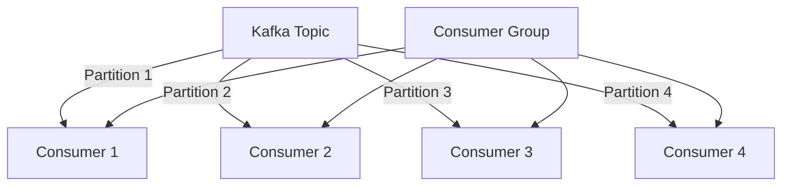

## 4.3.1 Competing Consumers

### Introduction

The **Competing Consumers** pattern is a fundamental design pattern in Apache Kafka that allows multiple consumer instances to process messages from a topic's partitions in parallel. This pattern is crucial for achieving high throughput and fault tolerance in distributed systems. In this section, we will delve into how consumer groups enable this pattern, the mechanics of partition assignment, and the benefits and challenges associated with implementing competing consumers in Kafka.

### Understanding Consumer Groups

Consumer groups are a core concept in Kafka that facilitate the competing consumers pattern. A consumer group is a collection of consumer instances that work together to consume messages from a set of Kafka topics. Each consumer in the group is responsible for processing messages from one or more partitions, ensuring that each message is processed only once by the group.

#### How Consumer Groups Enable Competing Consumers

- **Parallel Processing**: By distributing partitions among multiple consumers, Kafka allows for parallel processing of messages, significantly increasing throughput.
- **Load Balancing**: Kafka automatically balances the load among consumers in a group, assigning partitions to consumers based on availability and capacity.
- **Fault Tolerance**: If a consumer instance fails, Kafka reassigns its partitions to other consumers in the group, ensuring continuous processing.

### Partition Assignment in Kafka

Kafka's partition assignment mechanism is central to the competing consumers pattern. When a consumer group subscribes to a topic, Kafka assigns partitions to consumers in the group. This assignment is dynamic and can change based on consumer availability and group membership.

#### How Kafka Assigns Partitions to Consumers

- **Static Assignment**: Partitions can be statically assigned to consumers, but this approach lacks flexibility and can lead to uneven load distribution.
- **Dynamic Assignment**: Kafka's default behavior is dynamic assignment, where partitions are automatically distributed among available consumers in a group.
- **Rebalancing**: When a consumer joins or leaves a group, Kafka triggers a rebalance, redistributing partitions among the remaining consumers.

### Benefits of the Competing Consumers Pattern

The competing consumers pattern offers several advantages for scaling and reliability in Kafka-based systems:

- **Increased Throughput**: By processing messages in parallel, the pattern allows systems to handle higher message volumes.
- **Improved Fault Tolerance**: The automatic reassignment of partitions ensures that message processing continues even if some consumers fail.
- **Scalability**: Adding more consumers to a group can increase processing capacity, allowing systems to scale with demand.

### Real-World Applications of Competing Consumers

Many applications leverage the competing consumers pattern to achieve high performance and reliability:

- **Event-Driven Microservices**: In microservices architectures, services often consume events from Kafka topics. Competing consumers enable these services to process events concurrently, improving responsiveness.
- **Real-Time Data Processing**: Applications that require real-time analytics or monitoring can use competing consumers to process data streams efficiently.
- **Batch Processing**: Even in batch processing scenarios, competing consumers can distribute the workload across multiple instances, reducing processing time.

### Challenges in Implementing Competing Consumers

While the competing consumers pattern offers significant benefits, it also presents challenges that must be addressed:

#### Consumer Rebalancing

- **Impact on Performance**: Rebalancing can temporarily disrupt message processing, leading to increased latency.
- **Partition Ownership**: Ensuring that consumers maintain consistent state across rebalances is crucial for reliable processing.

#### Managing Consumer State and Idempotency

- **State Management**: Consumers must manage state effectively to ensure that messages are processed exactly once.
- **Idempotency**: Implementing idempotent operations is essential to handle duplicate message processing gracefully.

### Best Practices for Competing Consumers

To effectively implement the competing consumers pattern, consider the following best practices:

- **Optimize Consumer Configuration**: Tune consumer settings such as fetch size and session timeout to balance performance and reliability.
- **Monitor Consumer Lag**: Use monitoring tools to track consumer lag and ensure that consumers keep up with the message rate.
- **Implement Idempotent Processing**: Design consumers to handle duplicate messages without adverse effects, ensuring data consistency.
- **Use Sticky Assignor**: Consider using the sticky assignor for partition assignment to minimize rebalancing disruptions.

### Implementation Examples

Let's explore how to implement the competing consumers pattern in various programming languages, including Java, Scala, Kotlin, and Clojure.

#### Java Example

```java
import org.apache.kafka.clients.consumer.ConsumerConfig;
import org.apache.kafka.clients.consumer.KafkaConsumer;
import org.apache.kafka.clients.consumer.ConsumerRecords;
import org.apache.kafka.clients.consumer.ConsumerRecord;
import java.util.Collections;
import java.util.Properties;

public class CompetingConsumerExample {
    public static void main(String[] args) {
        Properties props = new Properties();
        props.put(ConsumerConfig.BOOTSTRAP_SERVERS_CONFIG, "localhost:9092");
        props.put(ConsumerConfig.GROUP_ID_CONFIG, "competing-consumers-group");
        props.put(ConsumerConfig.KEY_DESERIALIZER_CLASS_CONFIG, "org.apache.kafka.common.serialization.StringDeserializer");
        props.put(ConsumerConfig.VALUE_DESERIALIZER_CLASS_CONFIG, "org.apache.kafka.common.serialization.StringDeserializer");

        KafkaConsumer<String, String> consumer = new KafkaConsumer<>(props);
        consumer.subscribe(Collections.singletonList("example-topic"));

        while (true) {
            ConsumerRecords<String, String> records = consumer.poll(100);
            for (ConsumerRecord<String, String> record : records) {
                System.out.printf("Consumed message: %s%n", record.value());
            }
        }
    }
}
```

#### Scala Example

```scala
import org.apache.kafka.clients.consumer.{ConsumerConfig, KafkaConsumer}
import java.util.Properties
import scala.collection.JavaConverters._

object CompetingConsumerExample extends App {
  val props = new Properties()
  props.put(ConsumerConfig.BOOTSTRAP_SERVERS_CONFIG, "localhost:9092")
  props.put(ConsumerConfig.GROUP_ID_CONFIG, "competing-consumers-group")
  props.put(ConsumerConfig.KEY_DESERIALIZER_CLASS_CONFIG, "org.apache.kafka.common.serialization.StringDeserializer")
  props.put(ConsumerConfig.VALUE_DESERIALIZER_CLASS_CONFIG, "org.apache.kafka.common.serialization.StringDeserializer")

  val consumer = new KafkaConsumer[String, String](props)
  consumer.subscribe(List("example-topic").asJava)

  while (true) {
    val records = consumer.poll(100).asScala
    for (record <- records) {
      println(s"Consumed message: ${record.value()}")
    }
  }
}
```

#### Kotlin Example

```kotlin
import org.apache.kafka.clients.consumer.ConsumerConfig
import org.apache.kafka.clients.consumer.KafkaConsumer
import org.apache.kafka.clients.consumer.ConsumerRecords
import org.apache.kafka.clients.consumer.ConsumerRecord
import java.util.Properties

fun main() {
    val props = Properties().apply {
        put(ConsumerConfig.BOOTSTRAP_SERVERS_CONFIG, "localhost:9092")
        put(ConsumerConfig.GROUP_ID_CONFIG, "competing-consumers-group")
        put(ConsumerConfig.KEY_DESERIALIZER_CLASS_CONFIG, "org.apache.kafka.common.serialization.StringDeserializer")
        put(ConsumerConfig.VALUE_DESERIALIZER_CLASS_CONFIG, "org.apache.kafka.common.serialization.StringDeserializer")
    }

    val consumer = KafkaConsumer<String, String>(props)
    consumer.subscribe(listOf("example-topic"))

    while (true) {
        val records: ConsumerRecords<String, String> = consumer.poll(100)
        for (record: ConsumerRecord<String, String> in records) {
            println("Consumed message: ${record.value()}")
        }
    }
}
```

#### Clojure Example

```clojure
(ns competing-consumer-example
  (:import [org.apache.kafka.clients.consumer KafkaConsumer ConsumerConfig]
           [java.util Properties Collections]))

(defn -main []
  (let [props (doto (Properties.)
                (.put ConsumerConfig/BOOTSTRAP_SERVERS_CONFIG "localhost:9092")
                (.put ConsumerConfig/GROUP_ID_CONFIG "competing-consumers-group")
                (.put ConsumerConfig/KEY_DESERIALIZER_CLASS_CONFIG "org.apache.kafka.common.serialization.StringDeserializer")
                (.put ConsumerConfig/VALUE_DESERIALIZER_CLASS_CONFIG "org.apache.kafka.common.serialization.StringDeserializer"))
        consumer (KafkaConsumer. props)]
    (.subscribe consumer (Collections/singletonList "example-topic"))
    (while true
      (let [records (.poll consumer 100)]
        (doseq [record records]
          (println "Consumed message:" (.value record)))))))
```

### Diagram: Consumer Group and Partition Assignment



**Caption**: This diagram illustrates how partitions of a Kafka topic are assigned to consumers within a consumer group, enabling parallel processing.

### Conclusion

The competing consumers pattern is a powerful mechanism in Apache Kafka for achieving high throughput and fault tolerance. By leveraging consumer groups and partition assignment, systems can scale efficiently and handle failures gracefully. However, implementing this pattern requires careful consideration of challenges such as consumer rebalancing and state management. By following best practices and leveraging the flexibility of Kafka's consumer API, developers can build robust and scalable data processing applications.

## Test Your Knowledge: Competing Consumers in Apache Kafka



### What is the primary benefit of using the competing consumers pattern in Kafka?

- [x] Increased throughput and fault tolerance
- [ ] Simplified consumer configuration
- [ ] Reduced network latency
- [ ] Improved message ordering

> **Explanation:** The competing consumers pattern allows for parallel processing of messages, which increases throughput and provides fault tolerance by redistributing partitions when a consumer fails.

### How does Kafka assign partitions to consumers in a group?

- [x] Automatically based on consumer availability
- [ ] Manually by the administrator
- [ ] Randomly without any specific logic
- [ ] Based on message size

> **Explanation:** Kafka automatically assigns partitions to consumers in a group based on their availability, ensuring balanced load distribution.

### What happens when a consumer in a group fails?

- [x] Partitions are reassigned to other consumers in the group
- [ ] The topic stops producing messages
- [ ] All consumers in the group are restarted
- [ ] Messages are lost

> **Explanation:** When a consumer fails, Kafka reassigns its partitions to other consumers in the group to ensure continuous processing.

### Which of the following is a challenge associated with the competing consumers pattern?

- [x] Consumer rebalancing
- [ ] Message serialization
- [ ] Topic creation
- [ ] Broker configuration

> **Explanation:** Consumer rebalancing can disrupt message processing and requires careful management to maintain performance.

### What is a best practice for managing consumer state in Kafka?

- [x] Implement idempotent processing
- [ ] Use a single consumer per topic
- [ ] Disable partition reassignment
- [ ] Increase message retention time

> **Explanation:** Implementing idempotent processing ensures that duplicate messages do not adversely affect the system, maintaining data consistency.

### In which scenario is the competing consumers pattern most beneficial?

- [x] Real-time data processing
- [ ] Static data storage
- [ ] Single-threaded applications
- [ ] Low-latency messaging

> **Explanation:** The competing consumers pattern is ideal for real-time data processing, where high throughput and fault tolerance are critical.

### What is the role of the consumer group in Kafka?

- [x] To coordinate message consumption among multiple consumers
- [ ] To manage topic creation and deletion
- [ ] To handle message serialization
- [ ] To configure broker settings

> **Explanation:** Consumer groups coordinate message consumption among multiple consumers, enabling parallel processing and load balancing.

### How can consumer lag be monitored in Kafka?

- [x] Using monitoring tools to track consumer offsets
- [ ] By checking the message size
- [ ] By observing network traffic
- [ ] By analyzing broker logs

> **Explanation:** Monitoring tools can track consumer offsets to ensure that consumers keep up with the message rate, preventing lag.

### What is the impact of consumer rebalancing on message processing?

- [x] It can temporarily disrupt processing and increase latency
- [ ] It improves message ordering
- [ ] It reduces network traffic
- [ ] It enhances message serialization

> **Explanation:** Consumer rebalancing can disrupt processing as partitions are reassigned, potentially increasing latency.

### True or False: The competing consumers pattern can be used to scale Kafka consumers horizontally.

- [x] True
- [ ] False

> **Explanation:** The competing consumers pattern allows for horizontal scaling by adding more consumers to a group, increasing processing capacity.


