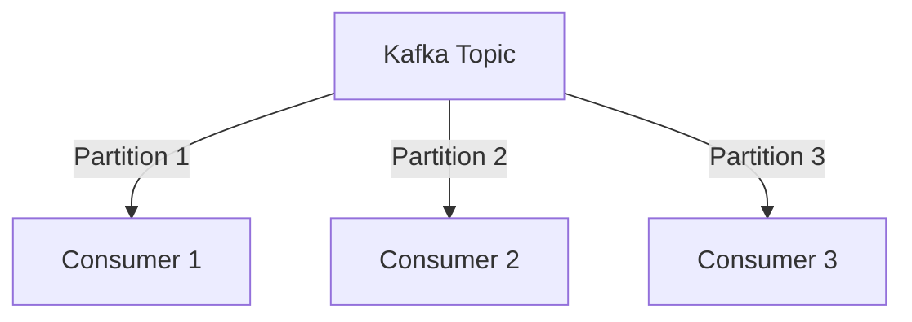
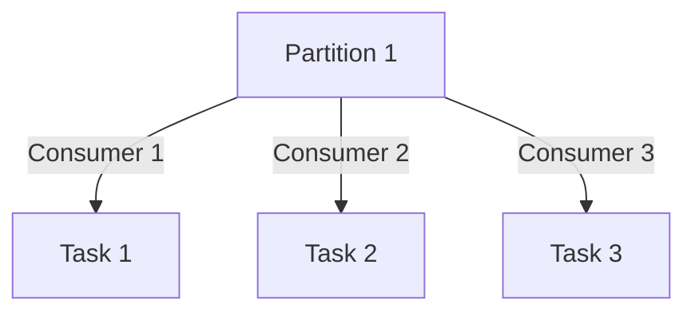
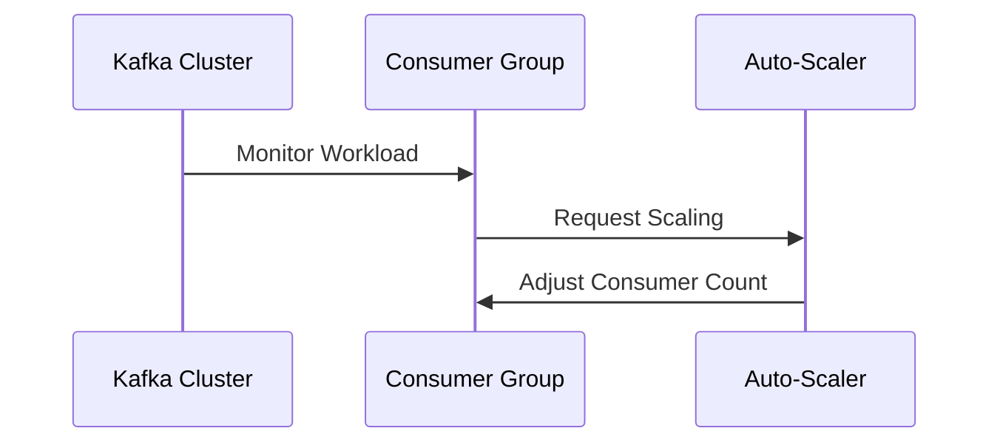
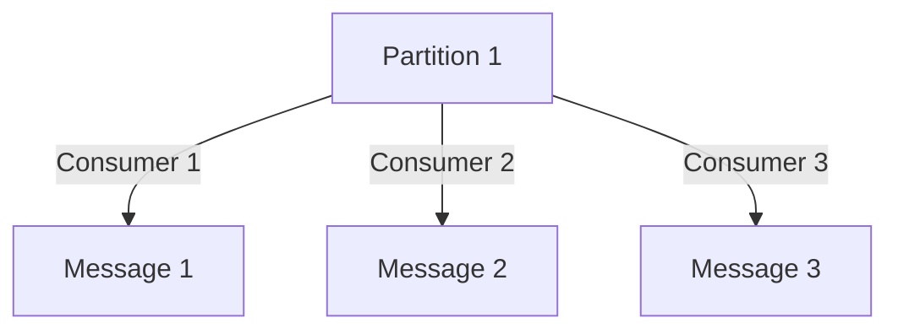
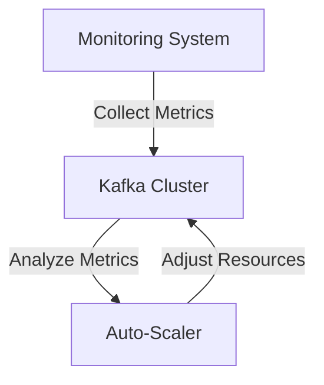

## 4.3 Consumer Scaling Patterns

### Introduction

In the world of distributed systems and real-time data processing, Apache Kafka stands out as a robust platform for handling high-throughput, fault-tolerant data streams. As organizations scale their Kafka deployments, the ability to efficiently scale consumers becomes critical. This section delves into the advanced patterns and strategies for scaling Kafka consumers, ensuring that your system can handle increasing workloads without compromising performance or reliability.

### Understanding Consumer Scaling

**Consumer scaling** refers to the ability to increase or decrease the number of consumers in a Kafka consumer group to match the workload demands. This is crucial in maintaining the performance and efficiency of data processing as the volume of messages grows. Proper scaling ensures that messages are processed in a timely manner, resources are utilized optimally, and the system remains responsive under varying loads.

### Competing Consumers Pattern

#### Intent

The **Competing Consumers Pattern** is designed to distribute the processing of messages across multiple consumers within a consumer group. This pattern allows for parallel processing of messages, improving throughput and fault tolerance.

#### Motivation

As the volume of messages in a Kafka topic increases, a single consumer may become a bottleneck. By employing multiple consumers, each can process a subset of the messages, thereby increasing the overall processing capacity.

#### Applicability

This pattern is applicable in scenarios where:

- High throughput is required.
- Fault tolerance is a priority.
- Message processing can be parallelized without strict ordering requirements.

#### Structure



**Caption**: Diagram illustrating the Competing Consumers Pattern where each consumer processes messages from different partitions.

#### Participants

- **Kafka Topic**: The source of messages.
- **Partitions**: Subdivisions of the topic that allow parallel processing.
- **Consumers**: Instances that process messages from partitions.

#### Collaborations

Consumers within a group coordinate to ensure that each partition is processed by only one consumer at a time. This coordination is managed by Kafka's consumer group protocol, which handles partition assignment and rebalancing.

#### Consequences

- **Increased Throughput**: By distributing the workload, the system can handle more messages concurrently.
- **Fault Tolerance**: If a consumer fails, another can take over its partitions.
- **Complexity in Ordering**: Messages within a partition are ordered, but across partitions, ordering is not guaranteed.

#### Implementation

- **Java**:

    ```java
    Properties props = new Properties();
    props.put("bootstrap.servers", "localhost:9092");
    props.put("group.id", "consumer-group");
    props.put("enable.auto.commit", "true");
    props.put("key.deserializer", "org.apache.kafka.common.serialization.StringDeserializer");
    props.put("value.deserializer", "org.apache.kafka.common.serialization.StringDeserializer");

    KafkaConsumer<String, String> consumer = new KafkaConsumer<>(props);
    consumer.subscribe(Arrays.asList("my-topic"));

    while (true) {
        ConsumerRecords<String, String> records = consumer.poll(Duration.ofMillis(100));
        for (ConsumerRecord<String, String> record : records) {
            System.out.printf("offset = %d, key = %s, value = %s%n", record.offset(), record.key(), record.value());
        }
    }
    ```

- **Scala**:

    ```scala
    import java.util.Properties
    import org.apache.kafka.clients.consumer.KafkaConsumer
    import scala.collection.JavaConverters._

    val props = new Properties()
    props.put("bootstrap.servers", "localhost:9092")
    props.put("group.id", "consumer-group")
    props.put("enable.auto.commit", "true")
    props.put("key.deserializer", "org.apache.kafka.common.serialization.StringDeserializer")
    props.put("value.deserializer", "org.apache.kafka.common.serialization.StringDeserializer")

    val consumer = new KafkaConsumer[String, String](props)
    consumer.subscribe(List("my-topic").asJava)

    while (true) {
      val records = consumer.poll(100)
      for (record <- records.asScala) {
        println(s"offset = ${record.offset()}, key = ${record.key()}, value = ${record.value()}")
      }
    }
    ```

- **Kotlin**:

    ```kotlin
    import org.apache.kafka.clients.consumer.KafkaConsumer
    import java.time.Duration
    import java.util.*

    val props = Properties().apply {
        put("bootstrap.servers", "localhost:9092")
        put("group.id", "consumer-group")
        put("enable.auto.commit", "true")
        put("key.deserializer", "org.apache.kafka.common.serialization.StringDeserializer")
        put("value.deserializer", "org.apache.kafka.common.serialization.StringDeserializer")
    }

    val consumer = KafkaConsumer<String, String>(props)
    consumer.subscribe(listOf("my-topic"))

    while (true) {
        val records = consumer.poll(Duration.ofMillis(100))
        for (record in records) {
            println("offset = ${record.offset()}, key = ${record.key()}, value = ${record.value()}")
        }
    }
    ```

- **Clojure**:

    ```clojure
    (import '[org.apache.kafka.clients.consumer KafkaConsumer]
            '[org.apache.kafka.common.serialization StringDeserializer])

    (def props
      (doto (java.util.Properties.)
        (.put "bootstrap.servers" "localhost:9092")
        (.put "group.id" "consumer-group")
        (.put "enable.auto.commit" "true")
        (.put "key.deserializer" StringDeserializer)
        (.put "value.deserializer" StringDeserializer)))

    (def consumer (KafkaConsumer. props))
    (.subscribe consumer ["my-topic"])

    (while true
      (let [records (.poll consumer 100)]
        (doseq [record records]
          (println (str "offset = " (.offset record) ", key = " (.key record) ", value = " (.value record))))))
    ```

#### Sample Use Cases

- **E-commerce Platforms**: Processing orders from multiple customers simultaneously.
- **Financial Services**: Handling transactions in parallel to reduce latency.

#### Related Patterns

- **[4.1.1 Queue vs. Publish/Subscribe Models]( "Queue vs. Publish/Subscribe Models")**: Discusses different messaging models that can complement consumer scaling.

### Workload Distribution Techniques

#### Intent

To ensure that workloads are evenly distributed among consumers, preventing any single consumer from becoming a bottleneck.

#### Motivation

Uneven workload distribution can lead to inefficient resource utilization and increased latency. By distributing workloads evenly, systems can achieve better performance and reliability.

#### Applicability

This is applicable in scenarios where:

- Workloads are variable and unpredictable.
- Resource utilization needs to be optimized.

#### Structure



**Caption**: Diagram showing workload distribution among consumers.

#### Participants

- **Partitions**: The source of tasks.
- **Consumers**: Entities that process tasks.

#### Collaborations

Kafka's consumer group protocol automatically balances the load by reassigning partitions when consumers join or leave the group.

#### Consequences

- **Improved Resource Utilization**: Consumers are more evenly loaded.
- **Reduced Latency**: Faster processing of messages.
- **Complexity in Management**: Requires careful monitoring and tuning.

#### Implementation

- **Dynamic Partition Assignment**: Kafka automatically assigns partitions to consumers in a way that balances the load.

#### Sample Use Cases

- **Log Processing**: Distributing log entries across multiple consumers for analysis.
- **Data Aggregation**: Spreading the workload of aggregating data across consumers.

#### Related Patterns

- **[4.2.1 Key-Based Partitioning]( "Key-Based Partitioning")**: Discusses partitioning strategies that can affect workload distribution.

### Dynamic Scaling Strategies

#### Intent

To dynamically adjust the number of consumers in response to changing workloads, ensuring optimal performance and resource utilization.

#### Motivation

Static consumer configurations can lead to inefficiencies. Dynamic scaling allows systems to adapt to workload changes in real-time.

#### Applicability

This is applicable in environments with:

- Fluctuating workloads.
- Resource constraints that require efficient scaling.

#### Structure



**Caption**: Sequence diagram illustrating dynamic scaling of consumers.

#### Participants

- **Kafka Cluster**: Monitors workload.
- **Consumer Group**: Processes messages.
- **Auto-Scaler**: Adjusts the number of consumers.

#### Collaborations

The auto-scaler monitors metrics such as message lag and adjusts the number of consumers accordingly.

#### Consequences

- **Scalability**: System can handle varying loads efficiently.
- **Cost Efficiency**: Resources are used only when needed.
- **Complexity**: Requires sophisticated monitoring and scaling logic.

#### Implementation

- **Auto-Scaling Tools**: Use tools like Kubernetes HPA (Horizontal Pod Autoscaler) to manage scaling.

#### Sample Use Cases

- **Cloud-Based Applications**: Automatically scaling consumers based on cloud metrics.
- **IoT Systems**: Adjusting consumer count based on sensor data influx.

#### Related Patterns

- **[3.5.1 Continuous Integration and Deployment Strategies]( "Continuous Integration and Deployment Strategies")**: Discusses automation strategies that can complement dynamic scaling.

### Impact of Scaling on Message Ordering and Processing Guarantees

#### Intent

To understand how scaling affects message ordering and processing guarantees, ensuring that system behavior remains predictable.

#### Motivation

Scaling can introduce challenges in maintaining message order and processing guarantees, which are critical for certain applications.

#### Applicability

This is crucial in systems where:

- Message order is important.
- Processing guarantees must be maintained.

#### Structure



**Caption**: Diagram showing potential impact of scaling on message ordering.

#### Participants

- **Partitions**: Source of messages.
- **Consumers**: Process messages.

#### Collaborations

Kafka ensures message order within a partition, but scaling can affect order across partitions.

#### Consequences

- **Order Preservation**: Order is maintained within partitions but not across them.
- **Processing Guarantees**: Must be carefully managed to avoid data loss or duplication.

#### Implementation

- **Idempotent Consumers**: Design consumers to handle duplicate messages gracefully.

#### Sample Use Cases

- **Financial Transactions**: Ensuring order and guarantees in transaction processing.
- **Event Sourcing**: Maintaining event order in event-driven systems.

#### Related Patterns

- **[4.4.1 At-Most-Once, At-Least-Once, and Exactly-Once Semantics]( "At-Most-Once, At-Least-Once, and Exactly-Once Semantics")**: Discusses processing guarantees that are affected by scaling.

### Monitoring and Auto-Scaling Considerations

#### Intent

To provide guidelines for effectively monitoring and auto-scaling Kafka consumers, ensuring system reliability and performance.

#### Motivation

Effective monitoring and auto-scaling are essential for maintaining system health and performance in dynamic environments.

#### Applicability

This is applicable in systems where:

- Real-time monitoring is required.
- Auto-scaling is used to manage resources.

#### Structure



**Caption**: Diagram illustrating the monitoring and auto-scaling process.

#### Participants

- **Monitoring System**: Collects and analyzes metrics.
- **Kafka Cluster**: Provides data for analysis.
- **Auto-Scaler**: Adjusts resources based on metrics.

#### Collaborations

The monitoring system collects metrics such as consumer lag and throughput, which are used by the auto-scaler to adjust resources.

#### Consequences

- **Improved Reliability**: System can adapt to changing conditions.
- **Resource Efficiency**: Resources are used optimally.
- **Complexity**: Requires sophisticated monitoring and scaling logic.

#### Implementation

- **Monitoring Tools**: Use tools like Prometheus and Grafana for monitoring.
- **Auto-Scaling Policies**: Define policies based on metrics like consumer lag.

#### Sample Use Cases

- **E-commerce Platforms**: Monitoring and scaling consumers based on traffic.
- **Streaming Analytics**: Adjusting resources based on data flow.

#### Related Patterns

- **[10.3.1 Identifying Bottlenecks]( "Identifying Bottlenecks")**: Discusses techniques for identifying performance issues that can inform scaling decisions.

### Conclusion

Scaling Kafka consumers is a critical aspect of building robust, high-performance data processing systems. By understanding and applying the patterns and strategies discussed in this section, you can ensure that your Kafka deployment remains efficient and responsive as workloads grow. Whether through competing consumers, workload distribution, or dynamic scaling, these techniques provide the foundation for scalable and reliable Kafka applications.

---

## Test Your Knowledge: Advanced Kafka Consumer Scaling Patterns Quiz



### What is the primary benefit of the Competing Consumers Pattern in Kafka?

- [x] Increased throughput and fault tolerance
- [ ] Simplified consumer management
- [ ] Guaranteed message ordering across partitions
- [ ] Reduced resource usage

> **Explanation:** The Competing Consumers Pattern allows for parallel processing of messages, which increases throughput and fault tolerance by distributing the load across multiple consumers.

### How does Kafka ensure message order within a partition?

- [x] By assigning each partition to only one consumer at a time
- [ ] By using timestamps to order messages
- [ ] By using a global ordering service
- [ ] By assigning messages to consumers based on their key

> **Explanation:** Kafka ensures message order within a partition by allowing only one consumer to process messages from a partition at any given time.

### What is a key consideration when dynamically scaling Kafka consumers?

- [x] Maintaining message processing guarantees
- [ ] Reducing the number of partitions
- [ ] Increasing the number of brokers
- [ ] Using a single consumer group

> **Explanation:** When dynamically scaling consumers, it's important to maintain message processing guarantees to avoid data loss or duplication.

### Which tool can be used for monitoring Kafka consumer lag?

- [x] Prometheus
- [ ] Jenkins
- [ ] Ansible
- [ ] Terraform

> **Explanation:** Prometheus is a popular monitoring tool that can be used to track Kafka consumer lag and other metrics.

### What is the impact of scaling on message ordering in Kafka?

- [x] Order is maintained within partitions but not across them
- [ ] Order is maintained across all partitions
- [ ] Order is not maintained at all
- [ ] Order is determined by the consumer group

> **Explanation:** Kafka maintains message order within individual partitions, but scaling can affect order across different partitions.

### What is the role of an auto-scaler in Kafka consumer scaling?

- [x] Adjusting the number of consumers based on workload
- [ ] Assigning partitions to consumers
- [ ] Managing broker configurations
- [ ] Ensuring message order

> **Explanation:** An auto-scaler adjusts the number of consumers in response to workload changes to ensure optimal performance.

### Which pattern is related to workload distribution in Kafka?

- [x] Key-Based Partitioning
- [ ] Saga Pattern
- [ ] Outbox Pattern
- [ ] CQRS

> **Explanation:** Key-Based Partitioning is related to workload distribution as it affects how messages are distributed across partitions.

### What is a potential drawback of the Competing Consumers Pattern?

- [x] Complexity in maintaining message order
- [ ] Increased resource usage
- [ ] Reduced throughput
- [ ] Simplified fault tolerance

> **Explanation:** The Competing Consumers Pattern can introduce complexity in maintaining message order, especially across partitions.

### Which strategy can be used to handle duplicate messages in Kafka?

- [x] Designing idempotent consumers
- [ ] Increasing the number of partitions
- [ ] Using a single consumer group
- [ ] Reducing the number of brokers

> **Explanation:** Designing idempotent consumers ensures that duplicate messages are handled gracefully without affecting the system's state.

### True or False: Kafka automatically balances the load by reassigning partitions when consumers join or leave the group.

- [x] True
- [ ] False

> **Explanation:** Kafka's consumer group protocol automatically reassigns partitions to balance the load when consumers join or leave the group.



---

By mastering these consumer scaling patterns, you can build Kafka applications that are not only scalable but also resilient and efficient, capable of handling the demands of modern data-driven environments.
