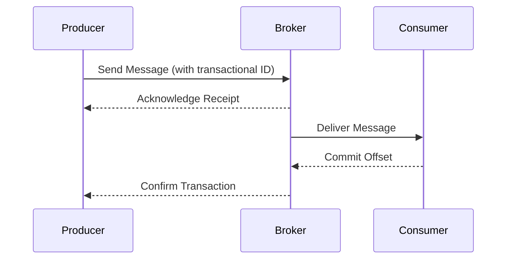

## 4.4 Reliable Data Delivery Patterns

### Introduction

Reliable data delivery is a cornerstone of any robust data processing system. In Apache Kafka, ensuring that messages are delivered reliably is crucial for maintaining data integrity and consistency across distributed systems. This section delves into the various patterns and techniques used in Kafka to achieve reliable data delivery, focusing on delivery semantics, idempotent producers, and transactional messaging.

### Delivery Semantics in Kafka

Kafka provides three primary delivery semantics to ensure reliable message delivery:

- **At-Most-Once**: Messages are delivered at most once, meaning there is a possibility that some messages may not be delivered. This is suitable for scenarios where message loss is acceptable, but duplicate messages are not.

- **At-Least-Once**: Messages are delivered at least once, ensuring that no messages are lost. However, this may result in duplicate messages. This is ideal for applications where message loss is unacceptable, but duplicates can be handled.

- **Exactly-Once**: Messages are delivered exactly once, ensuring no duplicates and no loss. This is the most reliable delivery semantic and is suitable for critical applications where data accuracy is paramount.

#### Default Behavior of Kafka

By default, Kafka operates with an **at-least-once** delivery semantic. This means that Kafka will ensure that messages are not lost, but it may deliver the same message more than once. This default behavior is achieved through the use of acknowledgments and retries.

### Acknowledgments, Retries, and Offsets

#### Acknowledgments

Acknowledgments in Kafka are used to confirm the receipt of messages by the broker. Producers can specify the level of acknowledgment required before considering a message successfully sent. The acknowledgment levels are:

- **acks=0**: The producer does not wait for any acknowledgment from the broker. This provides the lowest latency but the highest risk of message loss.

- **acks=1**: The producer waits for acknowledgment from the leader broker. This balances latency and reliability.

- **acks=all**: The producer waits for acknowledgment from all in-sync replicas. This provides the highest reliability but can increase latency.

#### Retries

Retries are used to handle transient failures in message delivery. Kafka producers can be configured to retry sending messages a specified number of times before giving up. This helps in achieving at-least-once delivery semantics.

#### Offsets

Offsets are used by consumers to track the position of messages in a topic. By committing offsets, consumers can ensure that they do not process the same message more than once, which is crucial for achieving exactly-once semantics.

### Configuring Producers and Consumers for Delivery Semantics

#### At-Most-Once Configuration

To configure Kafka for at-most-once delivery, you can set the acknowledgment level to 0 and disable retries. This ensures that messages are not retried, and any transient failures result in message loss.

**Producer Configuration Example (Java):**

```java
Properties props = new Properties();
props.put("bootstrap.servers", "localhost:9092");
props.put("key.serializer", "org.apache.kafka.common.serialization.StringSerializer");
props.put("value.serializer", "org.apache.kafka.common.serialization.StringSerializer");
props.put("acks", "0"); // No acknowledgment
props.put("retries", "0"); // No retries

KafkaProducer<String, String> producer = new KafkaProducer<>(props);
```

#### At-Least-Once Configuration

For at-least-once delivery, set the acknowledgment level to 1 or all, and enable retries. This ensures that messages are retried in case of transient failures, minimizing the risk of message loss.

**Producer Configuration Example (Scala):**

```scala
val props = new Properties()
props.put("bootstrap.servers", "localhost:9092")
props.put("key.serializer", "org.apache.kafka.common.serialization.StringSerializer")
props.put("value.serializer", "org.apache.kafka.common.serialization.StringSerializer")
props.put("acks", "1") // Leader acknowledgment
props.put("retries", "3") // Enable retries

val producer = new KafkaProducer[String, String](props)
```

#### Exactly-Once Configuration

To achieve exactly-once delivery, use idempotent producers and transactional messaging. This involves enabling idempotence and transactions in the producer configuration.

**Producer Configuration Example (Kotlin):**

```kotlin
val props = Properties()
props["bootstrap.servers"] = "localhost:9092"
props["key.serializer"] = "org.apache.kafka.common.serialization.StringSerializer"
props["value.serializer"] = "org.apache.kafka.common.serialization.StringSerializer"
props["acks"] = "all" // All replicas acknowledgment
props["enable.idempotence"] = "true" // Enable idempotence
props["transactional.id"] = "my-transactional-id" // Transactional ID

val producer = KafkaProducer<String, String>(props)
producer.initTransactions()
```

### Idempotent Producers and Transactional Messaging

#### Idempotent Producers

Idempotent producers ensure that messages are not duplicated even if they are retried. This is achieved by assigning a unique sequence number to each message, allowing the broker to detect and discard duplicates.

#### Transactional Messaging

Transactional messaging allows producers to send a batch of messages atomically. This means that either all messages in the batch are successfully sent, or none are. This is crucial for maintaining data consistency across multiple topics and partitions.

**Transactional Messaging Example (Clojure):**

```clojure
(def props
  {"bootstrap.servers" "localhost:9092"
   "key.serializer" "org.apache.kafka.common.serialization.StringSerializer"
   "value.serializer" "org.apache.kafka.common.serialization.StringSerializer"
   "acks" "all"
   "enable.idempotence" "true"
   "transactional.id" "my-transactional-id"})

(def producer (KafkaProducer. props))
(.initTransactions producer)

(.beginTransaction producer)
(.send producer (ProducerRecord. "my-topic" "key" "value"))
(.commitTransaction producer)
```

### Scenarios Suitable for Each Delivery Guarantee

- **At-Most-Once**: Suitable for logging or monitoring applications where occasional message loss is acceptable.

- **At-Least-Once**: Ideal for data processing applications where message loss is unacceptable, but duplicates can be handled, such as in [1.4.4 Big Data Integration]( "Big Data Integration").

- **Exactly-Once**: Critical for financial transactions, inventory management, or any application where data accuracy is crucial.

### Sample Configurations and Code Examples

Below are sample configurations and code examples for different delivery semantics in multiple languages.

#### Java Example for Exactly-Once Semantics

```java
Properties props = new Properties();
props.put("bootstrap.servers", "localhost:9092");
props.put("key.serializer", "org.apache.kafka.common.serialization.StringSerializer");
props.put("value.serializer", "org.apache.kafka.common.serialization.StringSerializer");
props.put("acks", "all");
props.put("enable.idempotence", "true");
props.put("transactional.id", "my-transactional-id");

KafkaProducer<String, String> producer = new KafkaProducer<>(props);
producer.initTransactions();

try {
    producer.beginTransaction();
    producer.send(new ProducerRecord<>("my-topic", "key", "value"));
    producer.commitTransaction();
} catch (ProducerFencedException | OutOfOrderSequenceException | AuthorizationException e) {
    // Fatal errors, cannot recover
    producer.close();
} catch (KafkaException e) {
    // Abort transaction and retry
    producer.abortTransaction();
}
```

#### Scala Example for At-Least-Once Semantics

```scala
val props = new Properties()
props.put("bootstrap.servers", "localhost:9092")
props.put("key.serializer", "org.apache.kafka.common.serialization.StringSerializer")
props.put("value.serializer", "org.apache.kafka.common.serialization.StringSerializer")
props.put("acks", "1")
props.put("retries", "3")

val producer = new KafkaProducer[String, String](props)

producer.send(new ProducerRecord[String, String]("my-topic", "key", "value"))
```

#### Kotlin Example for At-Most-Once Semantics

```kotlin
val props = Properties()
props["bootstrap.servers"] = "localhost:9092"
props["key.serializer"] = "org.apache.kafka.common.serialization.StringSerializer"
props["value.serializer"] = "org.apache.kafka.common.serialization.StringSerializer"
props["acks"] = "0"
props["retries"] = "0"

val producer = KafkaProducer<String, String>(props)

producer.send(ProducerRecord("my-topic", "key", "value"))
```

#### Clojure Example for Exactly-Once Semantics

```clojure
(def props
  {"bootstrap.servers" "localhost:9092"
   "key.serializer" "org.apache.kafka.common.serialization.StringSerializer"
   "value.serializer" "org.apache.kafka.common.serialization.StringSerializer"
   "acks" "all"
   "enable.idempotence" "true"
   "transactional.id" "my-transactional-id"})

(def producer (KafkaProducer. props))
(.initTransactions producer)

(try
  (.beginTransaction producer)
  (.send producer (ProducerRecord. "my-topic" "key" "value"))
  (.commitTransaction producer)
  (catch Exception e
    (.abortTransaction producer)))
```

### Visualizing Reliable Data Delivery

To better understand the flow of reliable data delivery in Kafka, consider the following diagram illustrating the interaction between producers, brokers, and consumers in an exactly-once delivery scenario:



**Diagram Description**: This sequence diagram illustrates the process of exactly-once message delivery in Kafka, highlighting the interactions between producers, brokers, and consumers.

### Conclusion

Reliable data delivery in Apache Kafka is achieved through a combination of delivery semantics, idempotent producers, and transactional messaging. By understanding and configuring these components appropriately, you can ensure that your Kafka-based systems deliver messages reliably, meeting the specific needs of your applications.

### Key Takeaways

- **Understand the different delivery semantics** and their implications for message reliability.
- **Configure producers and consumers** to achieve the desired level of reliability.
- **Use idempotent producers and transactional messaging** for exactly-once delivery.
- **Consider the trade-offs** between latency, throughput, and reliability when choosing delivery semantics.

### Further Reading

- [Apache Kafka Documentation](https://kafka.apache.org/documentation/)
- [Confluent Documentation](https://docs.confluent.io/)

## Test Your Knowledge: Reliable Data Delivery Patterns in Kafka



### Which delivery semantic ensures that messages are delivered exactly once?

- [ ] At-Most-Once
- [ ] At-Least-Once
- [x] Exactly-Once
- [ ] None of the above

> **Explanation:** Exactly-once delivery ensures that messages are delivered without duplication or loss.

### What is the default delivery semantic in Kafka?

- [ ] At-Most-Once
- [x] At-Least-Once
- [ ] Exactly-Once
- [ ] None of the above

> **Explanation:** Kafka's default delivery semantic is at-least-once, ensuring no message loss but allowing duplicates.

### How can you achieve exactly-once delivery in Kafka?

- [x] By using idempotent producers and transactional messaging
- [ ] By setting acks=0
- [ ] By disabling retries
- [ ] By using only one broker

> **Explanation:** Exactly-once delivery is achieved through idempotent producers and transactional messaging.

### What does setting acks=all ensure?

- [x] All in-sync replicas acknowledge the message
- [ ] Only the leader broker acknowledges the message
- [ ] No acknowledgment is required
- [ ] The message is sent to all topics

> **Explanation:** Setting acks=all ensures that all in-sync replicas acknowledge the message, providing higher reliability.

### Which configuration is suitable for at-most-once delivery?

- [x] acks=0 and retries=0
- [ ] acks=1 and retries=3
- [ ] acks=all and enable.idempotence=true
- [ ] acks=all and retries=5

> **Explanation:** At-most-once delivery is achieved by setting acks=0 and retries=0, allowing for message loss.

### What role do offsets play in Kafka?

- [x] They track the position of messages for consumers
- [ ] They determine the partitioning strategy
- [ ] They configure the number of retries
- [ ] They set the acknowledgment level

> **Explanation:** Offsets are used by consumers to track the position of messages in a topic.

### How do idempotent producers prevent duplicate messages?

- [x] By assigning a unique sequence number to each message
- [ ] By setting acks=0
- [ ] By disabling retries
- [ ] By using multiple brokers

> **Explanation:** Idempotent producers assign a unique sequence number to each message, allowing brokers to detect and discard duplicates.

### What is the purpose of transactional messaging in Kafka?

- [x] To send a batch of messages atomically
- [ ] To increase message throughput
- [ ] To reduce message latency
- [ ] To simplify consumer configuration

> **Explanation:** Transactional messaging ensures that a batch of messages is sent atomically, maintaining data consistency.

### Which delivery semantic is most suitable for financial transactions?

- [ ] At-Most-Once
- [ ] At-Least-Once
- [x] Exactly-Once
- [ ] None of the above

> **Explanation:** Exactly-once delivery is crucial for financial transactions to ensure data accuracy.

### True or False: Kafka's default behavior is to deliver messages exactly once.

- [ ] True
- [x] False

> **Explanation:** Kafka's default behavior is at-least-once delivery, not exactly-once.


