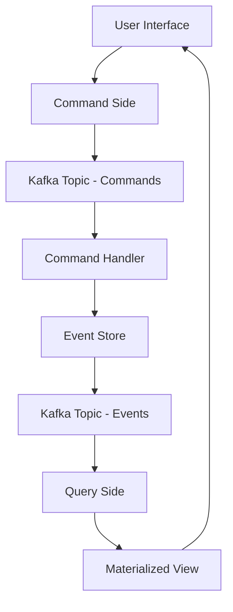

## 4.5.2 Command Query Responsibility Segregation

### Introduction

Command Query Responsibility Segregation (CQRS) is a design pattern that separates the read and write operations of a system. This separation allows for optimized performance, scalability, and flexibility in distributed systems. By leveraging Apache Kafka, CQRS can be implemented effectively to handle real-time data processing and ensure data consistency across different components of an application.

### Principles of CQRS

#### Intent

The primary intent of CQRS is to decouple the command (write) and query (read) sides of an application. This separation allows each side to be optimized independently, addressing specific performance and scalability needs.

#### Motivation

In traditional architectures, a single data model is used for both reading and writing data. This can lead to performance bottlenecks, especially in systems with high read and write loads. CQRS addresses these issues by allowing different models for reading and writing, enabling more efficient data handling and processing.

#### Applicability

CQRS is particularly useful in scenarios where:

- The system has complex business logic that requires different models for reading and writing.
- There is a need for high scalability and performance optimization.
- The application requires real-time data processing and eventual consistency.

### Structure

In a CQRS architecture, the command and query sides are represented by separate components, each interacting with Kafka topics to process and store data.



**Caption**: The diagram illustrates the flow of data in a CQRS architecture using Kafka, where the command side processes write operations and the query side handles read operations.

### Participants

- **Command Side**: Handles write operations and updates the event store.
- **Query Side**: Processes read operations and maintains materialized views.
- **Kafka Topics**: Serve as the communication layer between the command and query sides.
- **Event Store**: Stores events generated by the command side.

### Collaborations

- The **Command Side** receives commands from the user interface and publishes them to a Kafka topic.
- The **Event Store** captures these events, which are then consumed by the **Query Side** to update materialized views.
- The **Query Side** provides data to the user interface by querying these materialized views.

### Consequences

- **Benefits**: Improved scalability and performance, flexibility in data modeling, and the ability to handle complex business logic.
- **Drawbacks**: Increased complexity in managing separate models and ensuring data consistency.

### Implementation

#### Kafka Topics for Command and Query Sides

In a CQRS architecture, Kafka topics play a crucial role in decoupling the command and query sides. Commands are published to a dedicated topic, while events are stored in another topic for the query side to consume.

#### Updating Materialized Views

Materialized views are updated in response to events consumed from Kafka topics. This ensures that the query side always has the latest data available for read operations.

#### Synchronization Between Read and Write Models

Synchronization is achieved through event-driven updates. The query side listens to events from the Kafka topic and updates its materialized views accordingly.

#### Best Practices for Data Consistency

- **Eventual Consistency**: Accept that data may not be immediately consistent across all components, but will eventually reach a consistent state.
- **Idempotency**: Ensure that event processing is idempotent to handle duplicate events without side effects.
- **Versioning**: Use versioning to manage changes in data models and ensure backward compatibility.

#### Tools and Frameworks

Several tools and frameworks facilitate the implementation of CQRS with Kafka:

- **Axon Framework**: Provides support for CQRS and event sourcing in Java applications.
- **Lagom**: A microservices framework that supports CQRS and event sourcing.
- **Spring Cloud Stream**: Integrates with Kafka to support event-driven architectures.

### Sample Code Snippets

#### Java

```java
// Command Handler in Java
public class OrderCommandHandler {

    private final KafkaTemplate<String, OrderEvent> kafkaTemplate;

    public OrderCommandHandler(KafkaTemplate<String, OrderEvent> kafkaTemplate) {
        this.kafkaTemplate = kafkaTemplate;
    }

    public void handle(CreateOrderCommand command) {
        // Validate and process command
        OrderEvent event = new OrderEvent(command.getOrderId(), command.getOrderDetails());
        // Publish event to Kafka topic
        kafkaTemplate.send("order-events", event);
    }
}
```

#### Scala

```scala
// Command Handler in Scala
class OrderCommandHandler(kafkaProducer: KafkaProducer[String, OrderEvent]) {

  def handle(command: CreateOrderCommand): Unit = {
    // Validate and process command
    val event = OrderEvent(command.orderId, command.orderDetails)
    // Publish event to Kafka topic
    kafkaProducer.send(new ProducerRecord("order-events", event))
  }
}
```

#### Kotlin

```kotlin
// Command Handler in Kotlin
class OrderCommandHandler(private val kafkaTemplate: KafkaTemplate<String, OrderEvent>) {

    fun handle(command: CreateOrderCommand) {
        // Validate and process command
        val event = OrderEvent(command.orderId, command.orderDetails)
        // Publish event to Kafka topic
        kafkaTemplate.send("order-events", event)
    }
}
```

#### Clojure

```clojure
;; Command Handler in Clojure
(defn handle-command [kafka-producer command]
  (let [event (->OrderEvent (:order-id command) (:order-details command))]
    ;; Publish event to Kafka topic
    (.send kafka-producer "order-events" event)))
```

### Sample Use Cases

- **E-commerce Platforms**: Implementing CQRS to handle high volumes of transactions and provide real-time inventory updates.
- **Financial Services**: Using CQRS to separate transaction processing from reporting and analytics.
- **IoT Applications**: Managing sensor data ingestion and real-time monitoring with CQRS.

### Related Patterns

- **[4.5.1 Implementing Event Sourcing Patterns]( "Implementing Event Sourcing Patterns")**: Often used in conjunction with CQRS to provide a complete audit trail of changes.
- **[4.4.2 Idempotent Producers and Transactions]( "Idempotent Producers and Transactions")**: Ensures reliable message delivery and processing.

### Conclusion

CQRS with Apache Kafka offers a powerful approach to building scalable and flexible distributed systems. By separating the command and query sides, applications can achieve higher performance and better manage complex business logic. Leveraging Kafka's capabilities, developers can implement CQRS effectively, ensuring data consistency and integrity across their systems.

## Test Your Knowledge: Advanced CQRS with Kafka Quiz



### What is the primary benefit of using CQRS in a distributed system?

- [x] It separates read and write operations for optimized performance.
- [ ] It combines read and write operations into a single model.
- [ ] It eliminates the need for a database.
- [ ] It simplifies the architecture by using a single data model.

> **Explanation:** CQRS separates the read and write operations, allowing each to be optimized independently for better performance and scalability.

### How does Kafka facilitate the implementation of CQRS?

- [x] By providing topics for decoupling command and query sides.
- [ ] By storing data in a single topic for both reads and writes.
- [ ] By eliminating the need for materialized views.
- [ ] By ensuring immediate consistency across all components.

> **Explanation:** Kafka topics allow for the decoupling of command and query sides, enabling asynchronous communication and eventual consistency.

### What is a materialized view in the context of CQRS?

- [x] A read-optimized data structure updated in response to events.
- [ ] A write-optimized data structure for storing commands.
- [ ] A temporary cache for storing query results.
- [ ] A backup of the event store.

> **Explanation:** Materialized views are read-optimized data structures that are updated in response to events, providing efficient query capabilities.

### Which tool is commonly used to implement CQRS with Kafka in Java applications?

- [x] Axon Framework
- [ ] Spring Boot
- [ ] Hibernate
- [ ] Apache Camel

> **Explanation:** Axon Framework provides support for implementing CQRS and event sourcing in Java applications.

### What is the role of the event store in a CQRS architecture?

- [x] To store events generated by the command side.
- [ ] To store queries executed by the query side.
- [ ] To store commands issued by the user interface.
- [ ] To store materialized views.

> **Explanation:** The event store captures events generated by the command side, which are then consumed by the query side to update materialized views.

### How can data consistency be ensured in a CQRS architecture?

- [x] By using eventual consistency and idempotent event processing.
- [ ] By ensuring immediate consistency across all components.
- [ ] By storing all data in a single database.
- [ ] By eliminating the use of Kafka topics.

> **Explanation:** Eventual consistency and idempotent event processing help ensure data consistency in a CQRS architecture.

### What is the purpose of using versioning in CQRS?

- [x] To manage changes in data models and ensure backward compatibility.
- [ ] To eliminate the need for materialized views.
- [ ] To simplify the architecture by using a single data model.
- [ ] To ensure immediate consistency across all components.

> **Explanation:** Versioning helps manage changes in data models and ensures backward compatibility, which is crucial in a CQRS architecture.

### Which of the following is a drawback of using CQRS?

- [x] Increased complexity in managing separate models.
- [ ] Reduced scalability and performance.
- [ ] Elimination of real-time data processing capabilities.
- [ ] Simplification of business logic.

> **Explanation:** CQRS introduces increased complexity in managing separate models for read and write operations.

### What is the relationship between CQRS and event sourcing?

- [x] CQRS is often used in conjunction with event sourcing to provide a complete audit trail.
- [ ] CQRS eliminates the need for event sourcing.
- [ ] CQRS and event sourcing are mutually exclusive patterns.
- [ ] CQRS simplifies event sourcing by using a single data model.

> **Explanation:** CQRS is often used alongside event sourcing to provide a complete audit trail of changes in the system.

### True or False: CQRS can be implemented without using Kafka.

- [x] True
- [ ] False

> **Explanation:** While Kafka facilitates the implementation of CQRS, it is not strictly necessary. CQRS can be implemented using other messaging systems or databases.


