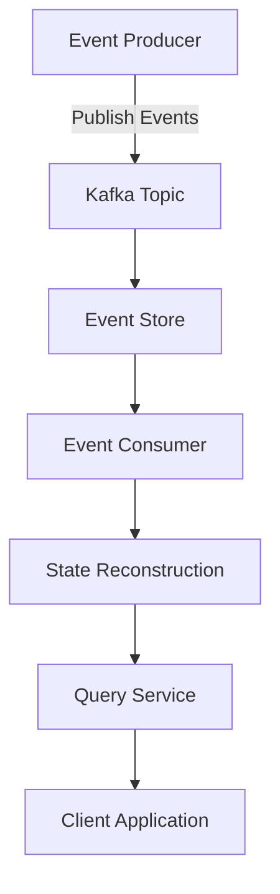
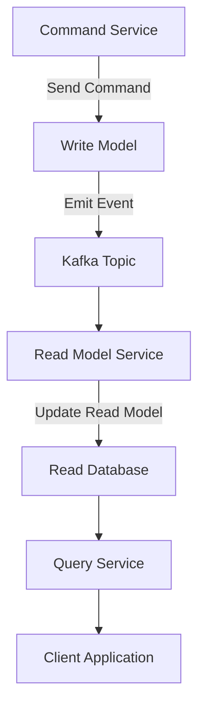

## 4.5 Event Sourcing and CQRS with Kafka

### Introduction

Event sourcing and Command Query Responsibility Segregation (CQRS) are two powerful architectural patterns that can significantly enhance the scalability and maintainability of distributed systems. Apache Kafka, with its robust distributed log capabilities, is an ideal platform for implementing these patterns. This section delves into the intricacies of event sourcing and CQRS, illustrating how Kafka can be leveraged to build systems that maintain a complete history of changes and optimize read and write operations.

### Event Sourcing

#### Definition and Benefits

**Event Sourcing** is a design pattern where state changes in a system are captured as a sequence of events. Instead of storing the current state of an entity, the system records every change as an event in an append-only log. This approach offers several benefits:

- **Complete Audit Trail**: Every change is recorded, providing a comprehensive history that can be audited or replayed.
- **Temporal Queries**: The ability to reconstruct past states by replaying events allows for powerful temporal queries.
- **Decoupled Systems**: Systems can be decoupled by publishing events that other services can consume asynchronously.

#### Kafka's Role in Event Sourcing

Kafka's architecture is inherently suited for event sourcing due to its append-only log and retention policies. Here's how Kafka supports event sourcing:

- **Append-Only Log**: Kafka's log structure naturally aligns with the event sourcing model, where events are appended to a log.
- **Retention Policies**: Kafka allows configuring retention policies to keep events for a specified duration, enabling long-term storage of event history.
- **Scalability**: Kafka's distributed nature ensures that event logs can scale horizontally, accommodating high volumes of events.

#### Architectural Diagram

**Caption**: The diagram illustrates how events are produced and consumed in a Kafka-based event sourcing architecture. Events are published to a Kafka topic, stored in an event store, and consumed by services that reconstruct state or provide query capabilities.

### CQRS Pattern

#### Definition and Separation of Concerns

**Command Query Responsibility Segregation (CQRS)** is a pattern that separates the read and write operations of a system into distinct models. This separation allows for optimized handling of commands (writes) and queries (reads), each potentially using different data models and storage mechanisms.

- **Commands**: Responsible for making changes to the system state. They are processed by the write model.
- **Queries**: Responsible for retrieving data without modifying it. They are handled by the read model.

#### Kafka's Role in CQRS

Kafka can facilitate CQRS by acting as the intermediary between the command and query models:

- **Command Handling**: Commands are processed and result in events that are published to Kafka.
- **Event Propagation**: Kafka distributes these events to various services that update their read models.
- **Read Model Updates**: Services consume events from Kafka to update their read models, ensuring they reflect the latest state.

#### Architectural Diagram

**Caption**: The diagram shows the separation of command and query responsibilities in a CQRS architecture using Kafka. Commands are processed by the write model, which emits events to Kafka. These events are consumed by read model services to update their databases.

### Practical Examples and Case Studies

#### Example: E-Commerce Order Processing

In an e-commerce system, event sourcing and CQRS can be used to manage order processing:

- **Event Sourcing**: Each change in an order's status (e.g., created, paid, shipped) is recorded as an event in Kafka.
- **CQRS**: The command model handles order updates, while the query model provides real-time order status to customers.

#### Case Study: Financial Transactions

A financial services company uses Kafka for event sourcing and CQRS to manage transactions:

- **Event Sourcing**: Transactions are recorded as events, providing a complete audit trail.
- **CQRS**: The command model processes transaction requests, while the query model provides account balances and transaction histories.

### Challenges and Best Practices

#### Challenges

- **Eventual Consistency**: Systems using event sourcing and CQRS often operate under eventual consistency, which can complicate data synchronization.
- **Complexity**: Implementing and maintaining separate models for commands and queries can increase system complexity.
- **Event Schema Evolution**: Managing changes to event schemas requires careful planning to ensure backward compatibility.

#### Best Practices

- **Schema Management**: Use tools like [1.3.3 Schema Registry]( "Schema Registry") to manage event schemas and ensure compatibility.
- **Idempotency**: Design consumers to be idempotent, handling duplicate events gracefully.
- **Monitoring and Alerting**: Implement robust monitoring to detect and resolve issues quickly, as discussed in [11. Observability and Monitoring Best Practices]( "Observability and Monitoring Best Practices").

### Conclusion

Event sourcing and CQRS are powerful patterns that, when combined with Kafka, can create scalable, resilient systems capable of handling high volumes of data with ease. By leveraging Kafka's distributed log capabilities, organizations can maintain a complete history of changes and optimize their read and write operations. However, these patterns also introduce challenges that require careful consideration and planning.

## Test Your Knowledge: Event Sourcing and CQRS with Kafka Quiz



### What is the primary benefit of using event sourcing in a system?

- [x] It provides a complete audit trail of all changes.
- [ ] It reduces the complexity of the system.
- [ ] It eliminates the need for a database.
- [ ] It simplifies the user interface.

> **Explanation:** Event sourcing records every change as an event, providing a comprehensive audit trail.

### How does Kafka's append-only log support event sourcing?

- [x] By allowing events to be stored sequentially.
- [ ] By deleting old events automatically.
- [ ] By compressing events to save space.
- [ ] By encrypting events for security.

> **Explanation:** Kafka's append-only log structure aligns with the event sourcing model, where events are stored sequentially.

### In CQRS, what is the role of the command model?

- [x] To handle write operations and emit events.
- [ ] To process read requests.
- [ ] To store query results.
- [ ] To manage user authentication.

> **Explanation:** The command model in CQRS is responsible for handling write operations and emitting events.

### What challenge is commonly associated with event sourcing?

- [x] Eventual consistency.
- [ ] Increased read latency.
- [ ] Reduced scalability.
- [ ] Simplified data models.

> **Explanation:** Event sourcing often operates under eventual consistency, which can complicate data synchronization.

### Which tool can be used to manage event schemas in Kafka?

- [x] Schema Registry
- [ ] Zookeeper
- [ ] Kafka Connect
- [ ] Kafka Streams

> **Explanation:** The Schema Registry is used to manage event schemas and ensure compatibility.

### What is a key advantage of using CQRS?

- [x] Separation of read and write concerns.
- [ ] Simplified system architecture.
- [ ] Reduced need for data storage.
- [ ] Faster network communication.

> **Explanation:** CQRS separates read and write concerns, allowing each to be optimized independently.

### How can Kafka facilitate the CQRS pattern?

- [x] By acting as an intermediary between command and query models.
- [ ] By storing all data in a single database.
- [ ] By compressing data for faster access.
- [ ] By encrypting data for security.

> **Explanation:** Kafka acts as an intermediary, distributing events between command and query models.

### What is a common use case for event sourcing with Kafka?

- [x] Financial transaction management.
- [ ] Static website hosting.
- [ ] Image processing.
- [ ] Video streaming.

> **Explanation:** Event sourcing with Kafka is commonly used in financial transaction management for audit trails.

### What is a potential drawback of implementing CQRS?

- [x] Increased system complexity.
- [ ] Reduced data consistency.
- [ ] Slower write operations.
- [ ] Limited scalability.

> **Explanation:** Implementing CQRS can increase system complexity due to the need for separate models.

### True or False: CQRS eliminates the need for a database.

- [ ] True
- [x] False

> **Explanation:** CQRS does not eliminate the need for a database; it separates read and write operations into different models.


