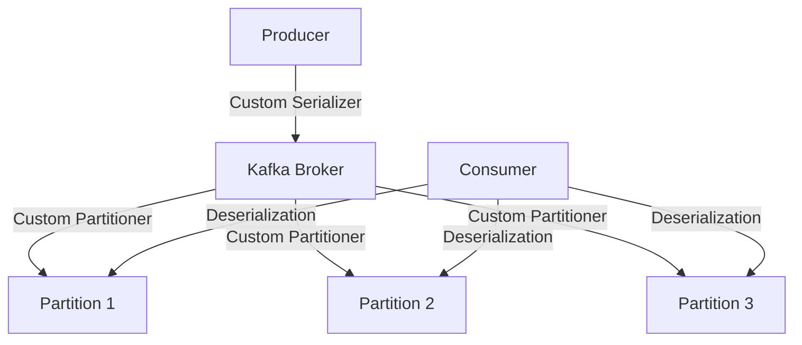

## 5.1.1 Custom Serializers and Partitioners

In the realm of Apache Kafka, the ability to customize serializers and partitioners is pivotal for optimizing data handling and message distribution. This section delves into the intricacies of creating custom serializers to manage specific data formats and custom partitioners to control message distribution across partitions. By mastering these techniques, expert software engineers and enterprise architects can enhance the performance and reliability of their Kafka-based systems.

### Understanding the Need for Custom Serializers

**Serializers** in Kafka are responsible for converting objects into byte arrays, which are then transmitted over the network. While Kafka provides default serializers for common data types such as strings and integers, there are scenarios where custom serialization is necessary:

- **Complex Data Structures**: When dealing with complex data structures or custom objects, default serializers may not suffice.
- **Performance Optimization**: Custom serializers can be optimized for performance, reducing serialization overhead.
- **Data Format Compatibility**: Ensuring compatibility with specific data formats (e.g., Avro, Protobuf) that are not natively supported by Kafka's default serializers.

### Creating a Custom Serializer

To create a custom serializer in Kafka, follow these steps:

1. **Implement the Serializer Interface**: Create a class that implements the `org.apache.kafka.common.serialization.Serializer` interface.
2. **Override the `serialize` Method**: Implement the logic to convert your object into a byte array.
3. **Configure the Serializer**: Register the custom serializer with the Kafka producer.

#### Step-by-Step Guide

**Java Example**:

```java
import org.apache.kafka.common.serialization.Serializer;
import java.nio.ByteBuffer;
import java.util.Map;

public class CustomObjectSerializer implements Serializer<CustomObject> {

    @Override
    public void configure(Map<String, ?> configs, boolean isKey) {
        // Configuration logic if needed
    }

    @Override
    public byte[] serialize(String topic, CustomObject data) {
        if (data == null) {
            return null;
        }
        ByteBuffer buffer = ByteBuffer.allocate(4 + data.getName().length());
        buffer.putInt(data.getId());
        buffer.put(data.getName().getBytes());
        return buffer.array();
    }

    @Override
    public void close() {
        // Cleanup logic if needed
    }
}
```

**Scala Example**:

```scala
import org.apache.kafka.common.serialization.Serializer
import java.nio.ByteBuffer

class CustomObjectSerializer extends Serializer[CustomObject] {

  override def configure(configs: java.util.Map[String, _], isKey: Boolean): Unit = {
    // Configuration logic if needed
  }

  override def serialize(topic: String, data: CustomObject): Array[Byte] = {
    if (data == null) {
      return null
    }
    val buffer = ByteBuffer.allocate(4 + data.name.length)
    buffer.putInt(data.id)
    buffer.put(data.name.getBytes)
    buffer.array()
  }

  override def close(): Unit = {
    // Cleanup logic if needed
  }
}
```

**Kotlin Example**:

```kotlin
import org.apache.kafka.common.serialization.Serializer
import java.nio.ByteBuffer

class CustomObjectSerializer : Serializer<CustomObject> {

    override fun configure(configs: Map<String, *>?, isKey: Boolean) {
        // Configuration logic if needed
    }

    override fun serialize(topic: String?, data: CustomObject?): ByteArray? {
        if (data == null) {
            return null
        }
        val buffer = ByteBuffer.allocate(4 + data.name.length)
        buffer.putInt(data.id)
        buffer.put(data.name.toByteArray())
        return buffer.array()
    }

    override fun close() {
        // Cleanup logic if needed
    }
}
```

**Clojure Example**:

```clojure
(ns custom-serializer
  (:import [org.apache.kafka.common.serialization Serializer]
           [java.nio ByteBuffer]))

(deftype CustomObjectSerializer []
  Serializer
  (configure [_ _ _])
  (serialize [_ _ data]
    (when data
      (let [buffer (ByteBuffer/allocate (+ 4 (.length (.name data))))]
        (.putInt buffer (.id data))
        (.put buffer (.getBytes (.name data)))
        (.array buffer))))
  (close [_]))
```

### Registering and Configuring the Custom Serializer

Once the custom serializer is implemented, it needs to be registered with the Kafka producer. This is done through the producer's configuration properties.

**Java Configuration**:

```java
Properties props = new Properties();
props.put("bootstrap.servers", "localhost:9092");
props.put("key.serializer", "org.apache.kafka.common.serialization.StringSerializer");
props.put("value.serializer", "com.example.CustomObjectSerializer");

KafkaProducer<String, CustomObject> producer = new KafkaProducer<>(props);
```

### Scenarios Requiring Custom Partitioning Logic

**Partitioners** in Kafka determine how messages are distributed across partitions. Custom partitioning logic is beneficial in scenarios such as:

- **Load Balancing**: Distributing messages evenly across partitions to balance load.
- **Data Locality**: Ensuring related messages are sent to the same partition for processing efficiency.
- **Custom Routing**: Directing messages to specific partitions based on custom criteria.

### Implementing a Custom Partitioner

To implement a custom partitioner, follow these steps:

1. **Implement the Partitioner Interface**: Create a class that implements the `org.apache.kafka.clients.producer.Partitioner` interface.
2. **Override the `partition` Method**: Implement the logic to determine the partition for each message.
3. **Configure the Partitioner**: Register the custom partitioner with the Kafka producer.

#### Step-by-Step Guide

**Java Example**:

```java
import org.apache.kafka.clients.producer.Partitioner;
import org.apache.kafka.common.Cluster;

import java.util.Map;

public class CustomPartitioner implements Partitioner {

    @Override
    public void configure(Map<String, ?> configs) {
        // Configuration logic if needed
    }

    @Override
    public int partition(String topic, Object key, byte[] keyBytes, Object value, byte[] valueBytes, Cluster cluster) {
        int numPartitions = cluster.partitionCountForTopic(topic);
        int partition = 0;
        if (keyBytes != null) {
            partition = Math.abs(key.hashCode()) % numPartitions;
        }
        return partition;
    }

    @Override
    public void close() {
        // Cleanup logic if needed
    }
}
```

**Scala Example**:

```scala
import org.apache.kafka.clients.producer.Partitioner
import org.apache.kafka.common.Cluster

class CustomPartitioner extends Partitioner {

  override def configure(configs: java.util.Map[String, _]): Unit = {
    // Configuration logic if needed
  }

  override def partition(topic: String, key: Any, keyBytes: Array[Byte], value: Any, valueBytes: Array[Byte], cluster: Cluster): Int = {
    val numPartitions = cluster.partitionCountForTopic(topic)
    if (keyBytes != null) {
      Math.abs(key.hashCode) % numPartitions
    } else {
      0
    }
  }

  override def close(): Unit = {
    // Cleanup logic if needed
  }
}
```

**Kotlin Example**:

```kotlin
import org.apache.kafka.clients.producer.Partitioner
import org.apache.kafka.common.Cluster

class CustomPartitioner : Partitioner {

    override fun configure(configs: Map<String, *>?) {
        // Configuration logic if needed
    }

    override fun partition(topic: String, key: Any?, keyBytes: ByteArray?, value: Any?, valueBytes: ByteArray?, cluster: Cluster): Int {
        val numPartitions = cluster.partitionCountForTopic(topic)
        return if (keyBytes != null) {
            Math.abs(key.hashCode()) % numPartitions
        } else {
            0
        }
    }

    override fun close() {
        // Cleanup logic if needed
    }
}
```

**Clojure Example**:

```clojure
(ns custom-partitioner
  (:import [org.apache.kafka.clients.producer Partitioner]
           [org.apache.kafka.common Cluster]))

(deftype CustomPartitioner []
  Partitioner
  (configure [_ _])
  (partition [_ topic key key-bytes value value-bytes cluster]
    (let [num-partitions (.partitionCountForTopic cluster topic)]
      (if key-bytes
        (mod (Math/abs (.hashCode key)) num-partitions)
        0)))
  (close [_]))
```

### Configuring the Custom Partitioner

Register the custom partitioner with the Kafka producer through configuration properties.

**Java Configuration**:

```java
Properties props = new Properties();
props.put("bootstrap.servers", "localhost:9092");
props.put("key.serializer", "org.apache.kafka.common.serialization.StringSerializer");
props.put("value.serializer", "org.apache.kafka.common.serialization.StringSerializer");
props.put("partitioner.class", "com.example.CustomPartitioner");

KafkaProducer<String, String> producer = new KafkaProducer<>(props);
```

### Practical Applications and Real-World Scenarios

Custom serializers and partitioners are essential in scenarios such as:

- **Financial Services**: Ensuring transactions are serialized efficiently and routed to specific partitions for processing.
- **E-commerce Platforms**: Custom partitioning to ensure related orders are processed together.
- **IoT Applications**: Efficient serialization of sensor data and partitioning based on device ID.

### Visualizing Kafka's Data Flow with Custom Serializers and Partitioners



**Caption**: This diagram illustrates how a producer uses a custom serializer to convert data before sending it to a Kafka broker. The broker then uses a custom partitioner to distribute the data across partitions, which are consumed by consumers that deserialize the data.

### Key Takeaways

- **Custom Serializers**: Enable efficient handling of complex data structures and specific data formats.
- **Custom Partitioners**: Provide control over message distribution, optimizing load balancing and data locality.
- **Configuration**: Proper registration and configuration of custom serializers and partitioners are crucial for their effective use.

## Test Your Knowledge: Custom Serializers and Partitioners in Kafka



### What is the primary role of a custom serializer in Kafka?

- [x] Convert objects into byte arrays for transmission.
- [ ] Distribute messages across partitions.
- [ ] Manage consumer offsets.
- [ ] Handle message acknowledgments.

> **Explanation:** A custom serializer is responsible for converting objects into byte arrays, which are then transmitted over the network.

### Why might you need a custom serializer?

- [x] To handle complex data structures.
- [x] To optimize serialization performance.
- [ ] To manage consumer group rebalancing.
- [ ] To monitor Kafka cluster health.

> **Explanation:** Custom serializers are used to handle complex data structures and optimize serialization performance, which are not possible with default serializers.

### Which method must be overridden when implementing a custom serializer?

- [x] `serialize`
- [ ] `partition`
- [ ] `configure`
- [ ] `close`

> **Explanation:** The `serialize` method must be overridden to define how an object is converted into a byte array.

### What is the purpose of a custom partitioner?

- [x] Control how messages are distributed across partitions.
- [ ] Convert objects into byte arrays.
- [ ] Manage Kafka broker configurations.
- [ ] Handle consumer group offsets.

> **Explanation:** A custom partitioner controls how messages are distributed across partitions, allowing for custom routing and load balancing.

### In which scenarios is a custom partitioner beneficial?

- [x] Load balancing across partitions.
- [x] Ensuring data locality.
- [ ] Managing consumer offsets.
- [ ] Monitoring Kafka cluster health.

> **Explanation:** Custom partitioners are beneficial for load balancing across partitions and ensuring data locality, which are not handled by default partitioners.

### Which interface must be implemented to create a custom partitioner?

- [x] `org.apache.kafka.clients.producer.Partitioner`
- [ ] `org.apache.kafka.common.serialization.Serializer`
- [ ] `org.apache.kafka.clients.consumer.Consumer`
- [ ] `org.apache.kafka.clients.producer.Producer`

> **Explanation:** The `org.apache.kafka.clients.producer.Partitioner` interface must be implemented to create a custom partitioner.

### How do you register a custom serializer with a Kafka producer?

- [x] By setting the `value.serializer` property in the producer configuration.
- [ ] By overriding the `partition` method.
- [ ] By setting the `key.deserializer` property in the consumer configuration.
- [ ] By implementing the `Consumer` interface.

> **Explanation:** A custom serializer is registered with a Kafka producer by setting the `value.serializer` property in the producer configuration.

### What is a key benefit of using custom serializers and partitioners?

- [x] Enhanced performance and control over data handling.
- [ ] Simplified consumer group management.
- [ ] Automatic topic creation.
- [ ] Built-in data encryption.

> **Explanation:** Custom serializers and partitioners provide enhanced performance and control over data handling, which are not possible with default implementations.

### Which method in a custom partitioner determines the partition for a message?

- [x] `partition`
- [ ] `serialize`
- [ ] `configure`
- [ ] `close`

> **Explanation:** The `partition` method determines the partition for a message in a custom partitioner.

### True or False: Custom serializers can be used to encrypt data before sending it to Kafka.

- [x] True
- [ ] False

> **Explanation:** Custom serializers can include logic to encrypt data before sending it to Kafka, enhancing data security.



By mastering custom serializers and partitioners, you can significantly enhance the efficiency and reliability of your Kafka-based systems, tailoring them to meet the specific needs of your applications.
