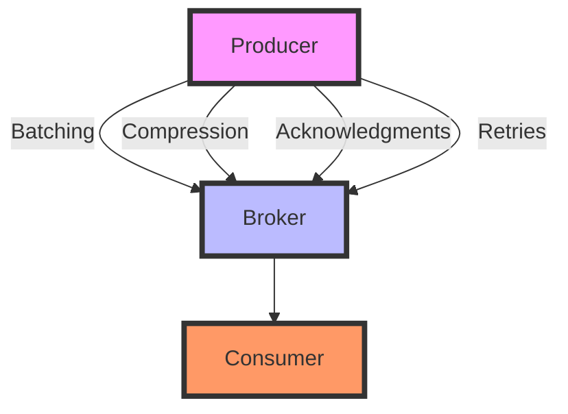

## 5.1.3 Advanced Producer Configurations

In the realm of Apache Kafka, producers are pivotal in ensuring that messages are efficiently and reliably sent to Kafka brokers. Advanced producer configurations allow you to fine-tune performance, optimize resource utilization, and ensure delivery guarantees. This section delves into key configuration parameters such as `linger.ms`, `batch.size`, `compression.type`, and others, providing insights into their effects and best practices for tuning them according to your workload characteristics.

### Key Configuration Parameters

#### **Batching and Linger Time**

Batching messages can significantly improve throughput by reducing the number of requests sent to the broker. Two critical parameters for batching are `batch.size` and `linger.ms`.

- **`batch.size`**: This parameter specifies the maximum number of bytes that will be included in a batch. Increasing the batch size can improve throughput but may also increase latency if the batch is not filled quickly.

- **`linger.ms`**: This parameter adds a delay to the sending of messages, allowing more messages to accumulate in a batch. This can increase throughput by reducing the number of requests but may also increase latency.

**Example Configuration:**

```java
Properties props = new Properties();
props.put("bootstrap.servers", "localhost:9092");
props.put("key.serializer", "org.apache.kafka.common.serialization.StringSerializer");
props.put("value.serializer", "org.apache.kafka.common.serialization.StringSerializer");
props.put("batch.size", 16384); // 16 KB
props.put("linger.ms", 5); // 5 milliseconds
```

**Recommendation**: For high-throughput applications, consider increasing `batch.size` and `linger.ms` to allow more messages to be batched together. However, be mindful of the trade-off with latency.

#### **Compression**

Compression reduces the size of the messages sent over the network, which can lead to significant performance improvements, especially in bandwidth-constrained environments.

- **`compression.type`**: Kafka supports several compression algorithms, including `gzip`, `snappy`, `lz4`, and `zstd`. Each has its trade-offs in terms of compression ratio and CPU usage.

**Example Configuration:**

```java
props.put("compression.type", "gzip");
```

**Recommendation**: Use `gzip` or `zstd` for better compression ratios, but be aware of the increased CPU usage. `snappy` and `lz4` offer faster compression with lower CPU overhead, making them suitable for real-time applications.

#### **Acknowledgments and Delivery Guarantees**

The `acks` parameter determines the number of acknowledgments the producer requires the leader to have received before considering a request complete. This setting affects the durability and reliability of message delivery.

- **`acks=0`**: The producer does not wait for any acknowledgment from the broker. This provides the lowest latency but the highest risk of message loss.
- **`acks=1`**: The producer waits for the leader to write the record to its local log. This is a good balance between performance and reliability.
- **`acks=all`**: The producer waits for the full set of in-sync replicas to acknowledge the record. This provides the highest level of durability.

**Example Configuration:**

```java
props.put("acks", "all");
```

**Recommendation**: For critical data, use `acks=all` to ensure maximum durability. For less critical data where performance is a priority, `acks=1` may be sufficient.

#### **Retries and Idempotent Producers**

Retries can help handle transient errors, but they must be configured carefully to avoid message duplication.

- **`retries`**: This parameter specifies the number of retry attempts for failed sends. Combined with idempotent producers, it ensures that retries do not lead to duplicate messages.

- **`enable.idempotence`**: When set to `true`, this ensures that messages are delivered exactly once to a particular topic partition.

**Example Configuration:**

```java
props.put("retries", 3);
props.put("enable.idempotence", true);
```

**Recommendation**: Enable idempotence for applications where exactly-once semantics are required. Set a reasonable number of retries to handle transient network issues.

### Practical Applications and Real-World Scenarios

#### **Scenario 1: High-Throughput Data Ingestion**

In a scenario where a system ingests large volumes of data, such as log aggregation, optimizing for throughput is crucial.

- **Configuration**: Increase `batch.size` and `linger.ms` to allow more messages to be batched together. Use `compression.type=snappy` for fast compression with minimal CPU overhead.

#### **Scenario 2: Real-Time Analytics**

For real-time analytics applications, minimizing latency is critical.

- **Configuration**: Use smaller `batch.size` and `linger.ms` values to reduce latency. Consider `compression.type=lz4` for fast compression.

#### **Scenario 3: Financial Transactions**

In financial applications, ensuring data integrity and exactly-once delivery is paramount.

- **Configuration**: Set `acks=all` and enable idempotence. Use a moderate `batch.size` to balance throughput and latency.

### Code Examples in Multiple Languages

#### **Java Example**

```java
import org.apache.kafka.clients.producer.KafkaProducer;
import org.apache.kafka.clients.producer.ProducerRecord;
import java.util.Properties;

public class KafkaProducerExample {
    public static void main(String[] args) {
        Properties props = new Properties();
        props.put("bootstrap.servers", "localhost:9092");
        props.put("key.serializer", "org.apache.kafka.common.serialization.StringSerializer");
        props.put("value.serializer", "org.apache.kafka.common.serialization.StringSerializer");
        props.put("acks", "all");
        props.put("retries", 3);
        props.put("batch.size", 16384);
        props.put("linger.ms", 5);
        props.put("compression.type", "gzip");
        props.put("enable.idempotence", true);

        KafkaProducer<String, String> producer = new KafkaProducer<>(props);
        for (int i = 0; i < 100; i++) {
            producer.send(new ProducerRecord<>("my-topic", Integer.toString(i), "message-" + i));
        }
        producer.close();
    }
}
```

#### **Scala Example**

```scala
import org.apache.kafka.clients.producer.{KafkaProducer, ProducerRecord}
import java.util.Properties

object KafkaProducerExample extends App {
  val props = new Properties()
  props.put("bootstrap.servers", "localhost:9092")
  props.put("key.serializer", "org.apache.kafka.common.serialization.StringSerializer")
  props.put("value.serializer", "org.apache.kafka.common.serialization.StringSerializer")
  props.put("acks", "all")
  props.put("retries", "3")
  props.put("batch.size", "16384")
  props.put("linger.ms", "5")
  props.put("compression.type", "gzip")
  props.put("enable.idempotence", "true")

  val producer = new KafkaProducer[String, String](props)
  for (i <- 0 until 100) {
    producer.send(new ProducerRecord[String, String]("my-topic", i.toString, s"message-$i"))
  }
  producer.close()
}
```

#### **Kotlin Example**

```kotlin
import org.apache.kafka.clients.producer.KafkaProducer
import org.apache.kafka.clients.producer.ProducerRecord
import java.util.Properties

fun main() {
    val props = Properties()
    props["bootstrap.servers"] = "localhost:9092"
    props["key.serializer"] = "org.apache.kafka.common.serialization.StringSerializer"
    props["value.serializer"] = "org.apache.kafka.common.serialization.StringSerializer"
    props["acks"] = "all"
    props["retries"] = 3
    props["batch.size"] = 16384
    props["linger.ms"] = 5
    props["compression.type"] = "gzip"
    props["enable.idempotence"] = true

    val producer = KafkaProducer<String, String>(props)
    for (i in 0 until 100) {
        producer.send(ProducerRecord("my-topic", i.toString(), "message-$i"))
    }
    producer.close()
}
```

#### **Clojure Example**

```clojure
(import '[org.apache.kafka.clients.producer KafkaProducer ProducerRecord]
        '[java.util Properties])

(defn create-producer []
  (let [props (doto (Properties.)
                (.put "bootstrap.servers" "localhost:9092")
                (.put "key.serializer" "org.apache.kafka.common.serialization.StringSerializer")
                (.put "value.serializer" "org.apache.kafka.common.serialization.StringSerializer")
                (.put "acks" "all")
                (.put "retries" "3")
                (.put "batch.size" "16384")
                (.put "linger.ms" "5")
                (.put "compression.type" "gzip")
                (.put "enable.idempotence" "true"))]
    (KafkaProducer. props)))

(defn send-messages [producer]
  (doseq [i (range 100)]
    (.send producer (ProducerRecord. "my-topic" (str i) (str "message-" i)))))

(defn -main []
  (let [producer (create-producer)]
    (send-messages producer)
    (.close producer)))
```

### Visualizing Kafka Producer Configuration

To better understand how these configurations interact, consider the following diagram illustrating the flow of messages from the producer to the broker with different configurations.



**Caption**: This diagram illustrates the flow of messages from the producer to the broker, highlighting the impact of batching, compression, acknowledgments, and retries.

### Knowledge Check

To reinforce your understanding of advanced producer configurations, consider the following questions:

- How does increasing `batch.size` affect throughput and latency?
- What are the trade-offs between using `gzip` and `snappy` for compression?
- Why is `acks=all` recommended for critical data?
- How do retries and idempotence work together to ensure exactly-once delivery?

### Conclusion

Advanced producer configurations in Apache Kafka provide powerful tools for optimizing performance, ensuring reliability, and managing resource utilization. By understanding and tuning parameters such as `batch.size`, `linger.ms`, `compression.type`, and `acks`, you can tailor your Kafka producers to meet the specific needs of your applications. Experiment with different configurations and monitor their impact on your system to achieve the best results.

## Test Your Knowledge: Advanced Kafka Producer Configurations Quiz



### What is the primary effect of increasing `batch.size` in Kafka producer configurations?

- [x] Increases throughput by allowing more messages to be batched together.
- [ ] Decreases latency by sending messages more quickly.
- [ ] Reduces CPU usage by minimizing processing overhead.
- [ ] Improves compression efficiency by using larger buffers.

> **Explanation:** Increasing `batch.size` allows more messages to be batched together, which can improve throughput by reducing the number of requests sent to the broker.

### Which compression type offers the best compression ratio but higher CPU usage?

- [x] gzip
- [ ] snappy
- [ ] lz4
- [ ] none

> **Explanation:** `gzip` offers a better compression ratio compared to `snappy` and `lz4`, but it requires more CPU resources.

### What does setting `acks=all` ensure in Kafka producer configurations?

- [x] Maximum durability by waiting for all in-sync replicas to acknowledge the record.
- [ ] Minimum latency by sending messages without waiting for acknowledgments.
- [ ] Reduced network usage by compressing acknowledgments.
- [ ] Increased throughput by batching acknowledgments.

> **Explanation:** `acks=all` ensures maximum durability by waiting for all in-sync replicas to acknowledge the record, providing the highest level of data reliability.

### How do retries and idempotence work together in Kafka?

- [x] They ensure exactly-once delivery by preventing duplicate messages during retries.
- [ ] They increase throughput by allowing multiple retries for each message.
- [ ] They reduce latency by minimizing the number of retries.
- [ ] They improve compression efficiency by retrying compressed messages.

> **Explanation:** Retries and idempotence work together to ensure exactly-once delivery by preventing duplicate messages during retries, which is crucial for maintaining data integrity.

### Which configuration is recommended for high-throughput applications?

- [x] Increase `batch.size` and `linger.ms` with `compression.type=snappy`.
- [ ] Decrease `batch.size` and `linger.ms` with `compression.type=gzip`.
- [x] Use `acks=1` for a balance between performance and reliability.
- [ ] Enable idempotence for all messages.

> **Explanation:** For high-throughput applications, increasing `batch.size` and `linger.ms` allows more messages to be batched together, and using `compression.type=snappy` provides fast compression with minimal CPU overhead. `acks=1` offers a balance between performance and reliability.

### What is the effect of enabling idempotence in Kafka producers?

- [x] Ensures exactly-once delivery by preventing duplicate messages.
- [ ] Increases throughput by batching messages more efficiently.
- [ ] Reduces latency by sending messages more quickly.
- [ ] Improves compression efficiency by using larger buffers.

> **Explanation:** Enabling idempotence ensures exactly-once delivery by preventing duplicate messages, which is essential for maintaining data integrity in applications where message duplication is unacceptable.

### Which parameter should be adjusted to reduce latency in real-time analytics applications?

- [x] Decrease `batch.size` and `linger.ms`.
- [ ] Increase `batch.size` and `linger.ms`.
- [x] Use `compression.type=lz4` for fast compression.
- [ ] Enable idempotence for all messages.

> **Explanation:** To reduce latency in real-time analytics applications, decreasing `batch.size` and `linger.ms` allows messages to be sent more quickly, and using `compression.type=lz4` provides fast compression.

### What is the recommended `acks` setting for financial transactions?

- [x] acks=all
- [ ] acks=0
- [ ] acks=1
- [ ] acks=none

> **Explanation:** For financial transactions, `acks=all` is recommended to ensure maximum durability and data integrity, as it waits for all in-sync replicas to acknowledge the record.

### How does `compression.type=snappy` benefit Kafka producers?

- [x] Provides fast compression with minimal CPU overhead.
- [ ] Offers the best compression ratio with higher CPU usage.
- [ ] Reduces latency by sending messages more quickly.
- [ ] Improves throughput by batching messages more efficiently.

> **Explanation:** `compression.type=snappy` provides fast compression with minimal CPU overhead, making it suitable for real-time applications where performance is a priority.

### True or False: Increasing `linger.ms` always improves throughput.

- [x] True
- [ ] False

> **Explanation:** Increasing `linger.ms` can improve throughput by allowing more messages to be batched together, but it may also increase latency if the delay is too long.


