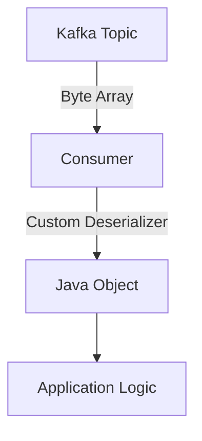

## 5.2.1 Custom Deserializers

### Introduction

In the world of Apache Kafka, deserializers play a crucial role in the consumer workflow by transforming raw byte data into meaningful, structured data types that applications can process. This section delves into the creation and use of custom deserializers, providing a comprehensive guide for expert software engineers and enterprise architects. We will explore the purpose of deserializers, guide you through implementing custom deserializers, discuss their registration in consumer configurations, and provide examples for various data formats such as Avro and Protobuf. Additionally, we will address error handling during deserialization and include code snippets in multiple programming languages.

### Purpose of Deserializers in the Consumer Workflow

Deserializers are essential components in Kafka consumers that convert byte arrays received from Kafka topics into Java objects or other data types. This conversion is necessary because Kafka stores messages as byte arrays, and consumers need to interpret these bytes to perform meaningful operations. Deserializers ensure that the data is correctly interpreted and transformed into a format that the application logic can utilize.

### Implementing a Custom Deserializer

To implement a custom deserializer, you need to create a class that implements the `org.apache.kafka.common.serialization.Deserializer` interface. This interface requires the implementation of two primary methods: `deserialize` and `configure`. The `deserialize` method is where the conversion logic from byte array to the desired data type is defined.

#### Steps to Implement a Custom Deserializer

1. **Define the Deserializer Class**: Create a class that implements the `Deserializer` interface.
2. **Implement the `deserialize` Method**: This method should contain the logic to convert the byte array into the desired object.
3. **Handle Configuration**: Implement the `configure` method to handle any configuration settings.
4. **Close Resources**: Implement the `close` method to release any resources when the deserializer is no longer needed.

#### Example: Implementing a Custom Deserializer in Java

```java
import org.apache.kafka.common.serialization.Deserializer;
import java.util.Map;

public class CustomObjectDeserializer implements Deserializer<CustomObject> {

    @Override
    public void configure(Map<String, ?> configs, boolean isKey) {
        // Configuration logic if needed
    }

    @Override
    public CustomObject deserialize(String topic, byte[] data) {
        if (data == null) {
            return null;
        }

        try {
            // Assuming CustomObject has a constructor that takes a byte array
            return new CustomObject(data);
        } catch (Exception e) {
            throw new RuntimeException("Failed to deserialize data", e);
        }
    }

    @Override
    public void close() {
        // Cleanup resources if needed
    }
}
```

### Registering the Deserializer in Consumer Configurations

Once you have implemented your custom deserializer, you need to register it in the consumer configuration. This is done by setting the `key.deserializer` and `value.deserializer` properties in the consumer configuration to the fully qualified class name of your custom deserializer.

#### Example: Registering a Custom Deserializer

```java
import org.apache.kafka.clients.consumer.ConsumerConfig;
import org.apache.kafka.clients.consumer.KafkaConsumer;
import java.util.Properties;

Properties props = new Properties();
props.put(ConsumerConfig.BOOTSTRAP_SERVERS_CONFIG, "localhost:9092");
props.put(ConsumerConfig.GROUP_ID_CONFIG, "custom-deserializer-group");
props.put(ConsumerConfig.KEY_DESERIALIZER_CLASS_CONFIG, "org.apache.kafka.common.serialization.StringDeserializer");
props.put(ConsumerConfig.VALUE_DESERIALIZER_CLASS_CONFIG, "com.example.CustomObjectDeserializer");

KafkaConsumer<String, CustomObject> consumer = new KafkaConsumer<>(props);
```

### Examples of Deserializers for Various Data Formats

Custom deserializers can be implemented for various data formats, including Avro and Protobuf. These formats are commonly used for their efficiency and schema evolution capabilities.

#### Avro Deserializer Example

Avro is a popular serialization format that supports schema evolution. To implement an Avro deserializer, you can use the Avro library to parse the byte array into an Avro object.

```java
import org.apache.kafka.common.serialization.Deserializer;
import org.apache.avro.generic.GenericRecord;
import org.apache.avro.io.DatumReader;
import org.apache.avro.io.Decoder;
import org.apache.avro.io.DecoderFactory;
import org.apache.avro.specific.SpecificDatumReader;

public class AvroDeserializer implements Deserializer<GenericRecord> {

    private final DatumReader<GenericRecord> reader;

    public AvroDeserializer(Schema schema) {
        this.reader = new SpecificDatumReader<>(schema);
    }

    @Override
    public GenericRecord deserialize(String topic, byte[] data) {
        try {
            Decoder decoder = DecoderFactory.get().binaryDecoder(data, null);
            return reader.read(null, decoder);
        } catch (IOException e) {
            throw new RuntimeException("Failed to deserialize Avro data", e);
        }
    }
}
```

#### Protobuf Deserializer Example

Protobuf is another efficient serialization format. To implement a Protobuf deserializer, use the Protobuf library to parse the byte array into a Protobuf object.

```java
import org.apache.kafka.common.serialization.Deserializer;
import com.google.protobuf.Message;

public class ProtobufDeserializer<T extends Message> implements Deserializer<T> {

    private final Parser<T> parser;

    public ProtobufDeserializer(Parser<T> parser) {
        this.parser = parser;
    }

    @Override
    public T deserialize(String topic, byte[] data) {
        try {
            return parser.parseFrom(data);
        } catch (InvalidProtocolBufferException e) {
            throw new RuntimeException("Failed to deserialize Protobuf data", e);
        }
    }
}
```

### Error Handling During Deserialization

Error handling is a critical aspect of deserialization. When deserialization fails, it can lead to data loss or application crashes. Implement robust error handling to manage these scenarios gracefully.

#### Strategies for Error Handling

- **Logging**: Log errors with sufficient context to aid in debugging.
- **Fallback Mechanisms**: Implement fallback mechanisms to handle deserialization failures, such as default values or error topics.
- **Exception Handling**: Use try-catch blocks to manage exceptions and prevent application crashes.

### Code Snippets Showing Custom Deserializer Usage

Below are examples of using custom deserializers in different programming languages.

#### Scala Example

```scala
import org.apache.kafka.common.serialization.Deserializer
import java.util

class CustomObjectDeserializer extends Deserializer[CustomObject] {

  override def configure(configs: util.Map[String, _], isKey: Boolean): Unit = {
    // Configuration logic if needed
  }

  override def deserialize(topic: String, data: Array[Byte]): CustomObject = {
    if (data == null) return null

    try {
      // Assuming CustomObject has a constructor that takes a byte array
      new CustomObject(data)
    } catch {
      case e: Exception => throw new RuntimeException("Failed to deserialize data", e)
    }
  }

  override def close(): Unit = {
    // Cleanup resources if needed
  }
}
```

#### Kotlin Example

```kotlin
import org.apache.kafka.common.serialization.Deserializer

class CustomObjectDeserializer : Deserializer<CustomObject> {

    override fun configure(configs: Map<String, *>, isKey: Boolean) {
        // Configuration logic if needed
    }

    override fun deserialize(topic: String, data: ByteArray?): CustomObject? {
        if (data == null) return null

        return try {
            // Assuming CustomObject has a constructor that takes a byte array
            CustomObject(data)
        } catch (e: Exception) {
            throw RuntimeException("Failed to deserialize data", e)
        }
    }

    override fun close() {
        // Cleanup resources if needed
    }
}
```

#### Clojure Example

```clojure
(ns custom-deserializer
  (:import (org.apache.kafka.common.serialization Deserializer)))

(defrecord CustomObjectDeserializer []
  Deserializer
  (configure [_ _ _])
  (deserialize [_ _ data]
    (when data
      (try
        ;; Assuming CustomObject has a constructor that takes a byte array
        (CustomObject. data)
        (catch Exception e
          (throw (RuntimeException. "Failed to deserialize data" e))))))
  (close [_]))
```

### Visualizing the Deserialization Process

To better understand the deserialization process, consider the following diagram that illustrates the flow of data from Kafka to the consumer application.



**Caption**: This diagram shows the flow of data from a Kafka topic to the consumer application, highlighting the role of the custom deserializer in transforming byte arrays into Java objects.

### Knowledge Check

To reinforce your understanding of custom deserializers, consider the following questions:

1. What is the primary role of a deserializer in Kafka?
2. How do you register a custom deserializer in a Kafka consumer configuration?
3. What are some common data formats for which you might implement a custom deserializer?
4. Why is error handling important in the deserialization process?

### Conclusion

Custom deserializers are powerful tools that allow you to tailor the deserialization process to your application's specific needs. By implementing custom deserializers, you can efficiently transform raw byte data into complex data types, enabling your applications to process Kafka messages effectively. Remember to handle errors gracefully and register your deserializers correctly in the consumer configuration.

### SEO-Optimized Quiz Title

## Test Your Knowledge: Mastering Kafka Custom Deserializers



### What is the primary purpose of a deserializer in Kafka?

- [x] To convert byte arrays into structured data types
- [ ] To send messages to Kafka topics
- [ ] To manage Kafka consumer offsets
- [ ] To configure Kafka brokers

> **Explanation:** Deserializers are used to convert byte arrays received from Kafka topics into structured data types that applications can process.

### How do you register a custom deserializer in a Kafka consumer configuration?

- [x] By setting the `value.deserializer` property to the custom deserializer class
- [ ] By modifying the Kafka broker configuration
- [ ] By setting the `key.serializer` property
- [ ] By using a Kafka Connect plugin

> **Explanation:** Custom deserializers are registered in the consumer configuration by setting the `value.deserializer` property to the fully qualified class name of the custom deserializer.

### Which of the following is a common data format for custom deserializers?

- [x] Avro
- [x] Protobuf
- [ ] XML
- [ ] CSV

> **Explanation:** Avro and Protobuf are common data formats for which custom deserializers are often implemented due to their efficiency and schema evolution capabilities.

### Why is error handling important in the deserialization process?

- [x] To prevent data loss and application crashes
- [ ] To increase Kafka broker throughput
- [ ] To reduce network latency
- [ ] To improve serialization speed

> **Explanation:** Error handling during deserialization is crucial to prevent data loss and application crashes, ensuring that deserialization failures are managed gracefully.

### What method must be implemented when creating a custom deserializer?

- [x] `deserialize`
- [ ] `serialize`
- [ ] `poll`
- [ ] `commit`

> **Explanation:** The `deserialize` method must be implemented to define the logic for converting byte arrays into the desired data type.

### In which programming language is the following custom deserializer implemented?

```java
public class CustomObjectDeserializer implements Deserializer<CustomObject> {
    // Implementation
}
```

- [x] Java
- [ ] Scala
- [ ] Kotlin
- [ ] Clojure

> **Explanation:** The code snippet is written in Java, as indicated by the syntax and use of Java-specific keywords.

### What is a potential consequence of not handling deserialization errors?

- [x] Application crashes
- [ ] Increased Kafka broker storage
- [ ] Faster message processing
- [ ] Improved network performance

> **Explanation:** Not handling deserialization errors can lead to application crashes, as unhandled exceptions may cause the application to terminate unexpectedly.

### Which method in the Deserializer interface is used for resource cleanup?

- [x] `close`
- [ ] `configure`
- [ ] `deserialize`
- [ ] `init`

> **Explanation:** The `close` method is used to release any resources when the deserializer is no longer needed.

### What is the role of the `configure` method in a custom deserializer?

- [x] To handle configuration settings for the deserializer
- [ ] To convert byte arrays into objects
- [ ] To send messages to Kafka topics
- [ ] To manage Kafka consumer offsets

> **Explanation:** The `configure` method is used to handle any configuration settings needed for the deserializer.

### True or False: Custom deserializers can only be implemented in Java.

- [ ] True
- [x] False

> **Explanation:** Custom deserializers can be implemented in various programming languages, including Java, Scala, Kotlin, and Clojure.


