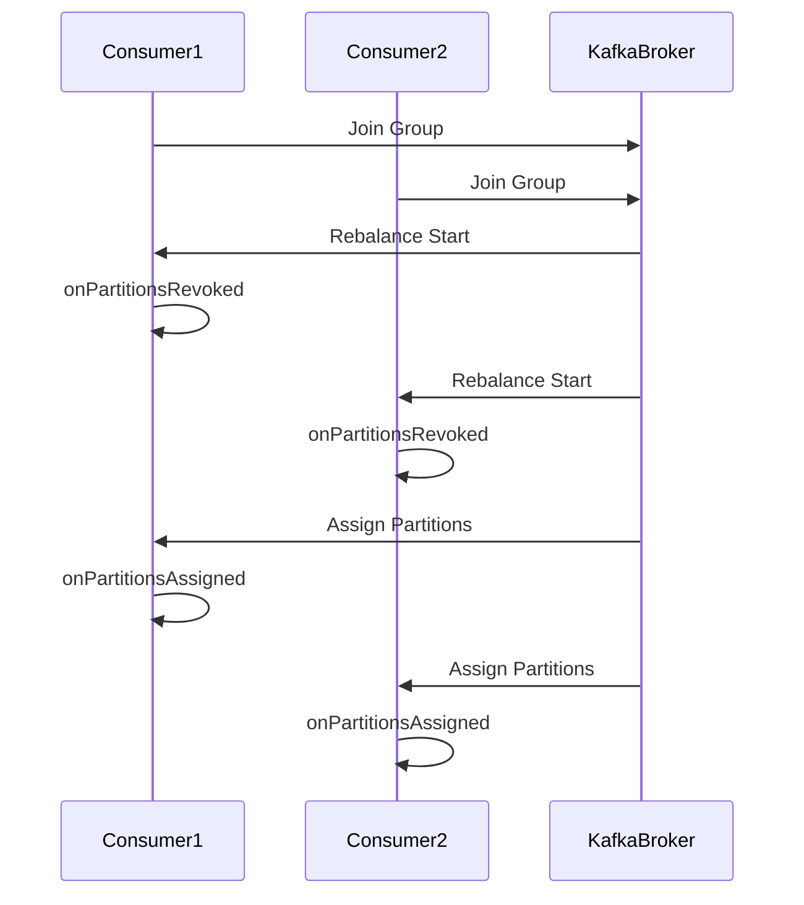

## 5.2.3 Rebalance Listeners and Partition Assignment

In Apache Kafka, consumer rebalances are a critical aspect of maintaining a balanced load across consumer instances within a consumer group. Understanding and effectively managing rebalances is essential for building resilient and efficient Kafka applications. This section delves into the intricacies of the consumer rebalance process, the role of `ConsumerRebalanceListener`, and strategies for handling partition assignments and state transitions gracefully.

### Understanding the Consumer Rebalance Process

A consumer rebalance occurs when the set of consumers in a group changes, or when the set of partitions in a topic changes. This can happen due to:

- A new consumer joining the group.
- An existing consumer leaving the group.
- A change in the number of partitions for a topic.

During a rebalance, Kafka reassigns partitions to consumers in the group to ensure an even distribution of load. This process can temporarily disrupt message processing, making it crucial to handle rebalances efficiently.

### Implementing a ConsumerRebalanceListener

The `ConsumerRebalanceListener` interface in Kafka provides hooks for responding to partition assignment changes. By implementing this interface, you can execute custom logic during the rebalance process, specifically in the `onPartitionsRevoked` and `onPartitionsAssigned` callbacks.

#### Key Methods of ConsumerRebalanceListener

- **onPartitionsRevoked**: Invoked before the rebalance starts, allowing consumers to commit offsets and release resources for partitions that are about to be reassigned.
- **onPartitionsAssigned**: Called after the rebalance completes, enabling consumers to initialize resources and resume processing for newly assigned partitions.

### Actions During onPartitionsRevoked and onPartitionsAssigned

#### onPartitionsRevoked

In the `onPartitionsRevoked` method, you should:

- **Commit Offsets**: Ensure that offsets for the partitions being revoked are committed to avoid message duplication or loss.
- **Release Resources**: Clean up resources associated with the partitions, such as closing file handles or database connections.

#### onPartitionsAssigned

In the `onPartitionsAssigned` method, you should:

- **Initialize Resources**: Set up any necessary resources for the newly assigned partitions.
- **Resume Processing**: Start consuming messages from the last committed offset for each partition.

### Code Examples

Below are examples of implementing a `ConsumerRebalanceListener` in various programming languages.

#### Java

```java
import org.apache.kafka.clients.consumer.ConsumerRebalanceListener;
import org.apache.kafka.clients.consumer.KafkaConsumer;
import org.apache.kafka.common.TopicPartition;

import java.util.Collection;

public class MyRebalanceListener implements ConsumerRebalanceListener {

    private final KafkaConsumer<String, String> consumer;

    public MyRebalanceListener(KafkaConsumer<String, String> consumer) {
        this.consumer = consumer;
    }

    @Override
    public void onPartitionsRevoked(Collection<TopicPartition> partitions) {
        // Commit offsets for the partitions being revoked
        consumer.commitSync();
        // Release resources associated with the partitions
        System.out.println("Partitions revoked: " + partitions);
    }

    @Override
    public void onPartitionsAssigned(Collection<TopicPartition> partitions) {
        // Initialize resources for the newly assigned partitions
        System.out.println("Partitions assigned: " + partitions);
        // Resume processing from the last committed offset
    }
}
```

#### Scala

```scala
import org.apache.kafka.clients.consumer.{ConsumerRebalanceListener, KafkaConsumer}
import org.apache.kafka.common.TopicPartition

import scala.collection.JavaConverters._

class MyRebalanceListener(consumer: KafkaConsumer[String, String]) extends ConsumerRebalanceListener {

  override def onPartitionsRevoked(partitions: java.util.Collection[TopicPartition]): Unit = {
    // Commit offsets for the partitions being revoked
    consumer.commitSync()
    // Release resources associated with the partitions
    println(s"Partitions revoked: ${partitions.asScala.mkString(", ")}")
  }

  override def onPartitionsAssigned(partitions: java.util.Collection[TopicPartition]): Unit = {
    // Initialize resources for the newly assigned partitions
    println(s"Partitions assigned: ${partitions.asScala.mkString(", ")}")
    // Resume processing from the last committed offset
  }
}
```

#### Kotlin

```kotlin
import org.apache.kafka.clients.consumer.ConsumerRebalanceListener
import org.apache.kafka.clients.consumer.KafkaConsumer
import org.apache.kafka.common.TopicPartition

class MyRebalanceListener(private val consumer: KafkaConsumer<String, String>) : ConsumerRebalanceListener {

    override fun onPartitionsRevoked(partitions: Collection<TopicPartition>) {
        // Commit offsets for the partitions being revoked
        consumer.commitSync()
        // Release resources associated with the partitions
        println("Partitions revoked: $partitions")
    }

    override fun onPartitionsAssigned(partitions: Collection<TopicPartition>) {
        // Initialize resources for the newly assigned partitions
        println("Partitions assigned: $partitions")
        // Resume processing from the last committed offset
    }
}
```

#### Clojure

```clojure
(import '[org.apache.kafka.clients.consumer ConsumerRebalanceListener KafkaConsumer]
        '[org.apache.kafka.common TopicPartition])

(defn my-rebalance-listener [^KafkaConsumer consumer]
  (reify ConsumerRebalanceListener
    (onPartitionsRevoked [_ partitions]
      ;; Commit offsets for the partitions being revoked
      (.commitSync consumer)
      ;; Release resources associated with the partitions
      (println "Partitions revoked:" partitions))
    (onPartitionsAssigned [_ partitions]
      ;; Initialize resources for the newly assigned partitions
      (println "Partitions assigned:" partitions)
      ;; Resume processing from the last committed offset
      )))
```

### Managing In-Flight Messages

Handling in-flight messages during a rebalance is crucial to ensure data consistency and avoid message loss. Here are some strategies:

- **Graceful Shutdown**: Implement a mechanism to pause message consumption and allow in-flight messages to be processed before a rebalance.
- **Idempotent Processing**: Design your application to handle duplicate messages gracefully, ensuring that processing the same message multiple times does not lead to inconsistent states.

### Strategies to Minimize Disruption During Rebalances

- **Optimize Consumer Configuration**: Tune consumer configurations such as `max.poll.interval.ms` and `session.timeout.ms` to reduce the likelihood of unnecessary rebalances.
- **Monitor Consumer Lag**: Use monitoring tools to track consumer lag and identify potential issues that could trigger rebalances.
- **Use Static Membership**: Consider using static membership to reduce the frequency of rebalances when consumers frequently join and leave the group.

### Visualizing the Rebalance Process

To better understand the rebalance process, consider the following diagram illustrating the sequence of events during a consumer rebalance:



**Caption**: Sequence diagram illustrating the consumer rebalance process in Kafka.

### Real-World Scenarios and Best Practices

In real-world applications, managing rebalances effectively can significantly impact system performance and reliability. Here are some best practices:

- **Preemptive Resource Management**: Anticipate rebalances by preemptively managing resources and state transitions.
- **Testing and Simulation**: Regularly test rebalance scenarios in a controlled environment to identify potential issues and optimize your handling strategies.
- **Continuous Monitoring**: Implement comprehensive monitoring to detect and respond to rebalance events promptly.

### Conclusion

Mastering the consumer rebalance process in Kafka is essential for building robust and efficient data streaming applications. By implementing `ConsumerRebalanceListener` and adopting best practices for managing partition assignments and state transitions, you can minimize disruption and ensure seamless message processing.

## Test Your Knowledge: Kafka Rebalance Listeners and Partition Assignment Quiz



### What is the primary purpose of a ConsumerRebalanceListener in Kafka?

- [x] To handle partition assignment changes during a rebalance.
- [ ] To manage consumer group offsets.
- [ ] To monitor consumer lag.
- [ ] To optimize producer performance.

> **Explanation:** The `ConsumerRebalanceListener` is used to handle partition assignment changes during a rebalance, allowing consumers to manage resources and state transitions effectively.

### Which method in ConsumerRebalanceListener is called before a rebalance starts?

- [x] onPartitionsRevoked
- [ ] onPartitionsAssigned
- [ ] onPartitionsLost
- [ ] onPartitionsResumed

> **Explanation:** The `onPartitionsRevoked` method is called before a rebalance starts, allowing consumers to commit offsets and release resources for partitions that are about to be reassigned.

### What is a key action to perform in the onPartitionsRevoked method?

- [x] Commit offsets for the partitions being revoked.
- [ ] Initialize resources for new partitions.
- [ ] Monitor consumer lag.
- [ ] Optimize producer throughput.

> **Explanation:** Committing offsets for the partitions being revoked is crucial to ensure that no messages are lost or duplicated during a rebalance.

### What strategy can help minimize disruption during rebalances?

- [x] Use static membership to reduce the frequency of rebalances.
- [ ] Increase the number of partitions.
- [ ] Decrease the session timeout.
- [ ] Use a single consumer instance.

> **Explanation:** Using static membership can help reduce the frequency of rebalances, especially in environments where consumers frequently join and leave the group.

### Which of the following is a benefit of idempotent processing?

- [x] It ensures consistent state even if messages are processed multiple times.
- [ ] It increases consumer throughput.
- [ ] It reduces network latency.
- [ ] It simplifies producer configuration.

> **Explanation:** Idempotent processing ensures that processing the same message multiple times does not lead to inconsistent states, which is crucial during rebalances.

### What is the role of the onPartitionsAssigned method?

- [x] To initialize resources and resume processing for newly assigned partitions.
- [ ] To commit offsets for revoked partitions.
- [ ] To monitor consumer lag.
- [ ] To optimize producer performance.

> **Explanation:** The `onPartitionsAssigned` method is used to initialize resources and resume processing for newly assigned partitions after a rebalance.

### How can you handle in-flight messages during a rebalance?

- [x] Implement a graceful shutdown mechanism.
- [ ] Increase the number of partitions.
- [ ] Decrease the session timeout.
- [ ] Use a single consumer instance.

> **Explanation:** Implementing a graceful shutdown mechanism allows in-flight messages to be processed before a rebalance, ensuring data consistency.

### What is a potential drawback of frequent rebalances?

- [x] Increased message processing latency.
- [ ] Improved consumer throughput.
- [ ] Reduced network latency.
- [ ] Simplified consumer configuration.

> **Explanation:** Frequent rebalances can lead to increased message processing latency due to the temporary disruption in message consumption.

### Which configuration can help reduce unnecessary rebalances?

- [x] Optimize max.poll.interval.ms and session.timeout.ms.
- [ ] Increase the number of partitions.
- [ ] Decrease the number of consumer instances.
- [ ] Use a single consumer instance.

> **Explanation:** Optimizing `max.poll.interval.ms` and `session.timeout.ms` can help reduce the likelihood of unnecessary rebalances by ensuring that consumers remain active and responsive.

### True or False: The onPartitionsRevoked method is called after a rebalance completes.

- [ ] True
- [x] False

> **Explanation:** The `onPartitionsRevoked` method is called before a rebalance starts, not after it completes.



By mastering the concepts and techniques discussed in this section, you can effectively manage consumer rebalances in Kafka, ensuring that your applications remain resilient and performant even in dynamic environments.
