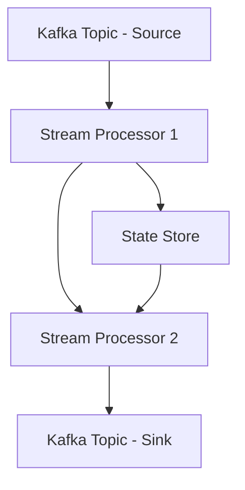

## 5.3.1 Introduction to Kafka Streams

Apache Kafka Streams is a robust client library designed for building real-time stream processing applications and microservices. It is part of the broader Apache Kafka ecosystem, providing developers with the tools to process and analyze data stored in Kafka topics. This section delves into the key features, architecture, and practical applications of Kafka Streams, offering insights into how it stands out from other stream processing frameworks.

### Key Features of Kafka Streams

Kafka Streams is renowned for its simplicity and power, offering several key features that make it an attractive choice for stream processing:

- **Integrated with Kafka**: Kafka Streams is tightly integrated with Kafka, allowing seamless data ingestion and processing without the need for additional infrastructure.
- **Scalability**: It supports horizontal scaling, enabling applications to handle large volumes of data by distributing processing across multiple instances.
- **Fault Tolerance**: Built-in mechanisms ensure that applications can recover from failures, maintaining data integrity and processing continuity.
- **Exactly-Once Processing**: Kafka Streams provides exactly-once processing semantics, ensuring that each record is processed precisely once, even in the face of failures.
- **Stateful and Stateless Processing**: It supports both stateful and stateless operations, allowing for complex transformations and aggregations.
- **Ease of Deployment**: Kafka Streams applications can be deployed as standard Java applications, eliminating the need for a separate processing cluster.

### Kafka Streams Architecture

Kafka Streams operates on a simple yet powerful architecture that differentiates it from other stream processing frameworks:

- **Stream Processing Topology**: At the core of Kafka Streams is the concept of a topology, which is a directed acyclic graph (DAG) of stream processors that define the data processing logic.
- **Stream Processors**: These are the nodes in the topology, responsible for transforming, filtering, and aggregating data.
- **State Stores**: Kafka Streams uses state stores to maintain local state, enabling stateful processing and windowed operations.
- **Kafka Topics**: Data flows through Kafka topics, with Kafka Streams consuming and producing data to these topics as part of the processing pipeline.

#### Diagram: Kafka Streams Architecture



*Caption: The diagram illustrates the basic architecture of Kafka Streams, showing the flow of data from source topics through stream processors and state stores to sink topics.*

### Differences from Other Stream Processing Frameworks

Kafka Streams distinguishes itself from other frameworks like Apache Flink and Apache Spark Streaming in several ways:

- **No Separate Cluster**: Unlike Flink and Spark, Kafka Streams does not require a separate cluster for execution. Applications run as standalone Java applications, simplifying deployment and management.
- **Lightweight**: Kafka Streams is lightweight, with minimal overhead, making it suitable for microservices architectures.
- **Native Kafka Integration**: Its deep integration with Kafka allows for seamless data processing and management, leveraging Kafka's capabilities for scalability and fault tolerance.

### Typical Use Cases for Kafka Streams

Kafka Streams is versatile and can be applied to a wide range of real-time data processing scenarios:

- **Real-Time Analytics**: Analyze streaming data in real-time for insights and decision-making.
- **Event-Driven Applications**: Build applications that react to events as they occur, such as fraud detection systems.
- **Data Transformation**: Transform and enrich data streams for downstream processing or storage.
- **Monitoring and Alerting**: Monitor system metrics and generate alerts based on predefined thresholds.

### Getting Started with Kafka Streams

To start developing with Kafka Streams, you need to set up a Java project and include the Kafka Streams library as a dependency. Below are examples in Java, Scala, Kotlin, and Clojure to illustrate the basic setup and a simple stream processing application.

#### Java Example

```java
import org.apache.kafka.streams.KafkaStreams;
import org.apache.kafka.streams.StreamsBuilder;
import org.apache.kafka.streams.StreamsConfig;
import org.apache.kafka.streams.kstream.KStream;

import java.util.Properties;

public class SimpleKafkaStreamsApp {
    public static void main(String[] args) {
        Properties props = new Properties();
        props.put(StreamsConfig.APPLICATION_ID_CONFIG, "streams-app");
        props.put(StreamsConfig.BOOTSTRAP_SERVERS_CONFIG, "localhost:9092");

        StreamsBuilder builder = new StreamsBuilder();
        KStream<String, String> sourceStream = builder.stream("input-topic");
        sourceStream.to("output-topic");

        KafkaStreams streams = new KafkaStreams(builder.build(), props);
        streams.start();
    }
}
```

*Explanation: This Java example sets up a basic Kafka Streams application that reads from an "input-topic" and writes to an "output-topic".*

#### Scala Example

```scala
import org.apache.kafka.streams.{KafkaStreams, StreamsBuilder, StreamsConfig}
import org.apache.kafka.streams.kstream.KStream

import java.util.Properties

object SimpleKafkaStreamsApp extends App {
  val props = new Properties()
  props.put(StreamsConfig.APPLICATION_ID_CONFIG, "streams-app")
  props.put(StreamsConfig.BOOTSTRAP_SERVERS_CONFIG, "localhost:9092")

  val builder = new StreamsBuilder()
  val sourceStream: KStream[String, String] = builder.stream("input-topic")
  sourceStream.to("output-topic")

  val streams = new KafkaStreams(builder.build(), props)
  streams.start()
}
```

*Explanation: The Scala example mirrors the Java setup, demonstrating the simplicity and power of Kafka Streams in a Scala application.*

#### Kotlin Example

```kotlin
import org.apache.kafka.streams.KafkaStreams
import org.apache.kafka.streams.StreamsBuilder
import org.apache.kafka.streams.StreamsConfig
import org.apache.kafka.streams.kstream.KStream

fun main() {
    val props = Properties().apply {
        put(StreamsConfig.APPLICATION_ID_CONFIG, "streams-app")
        put(StreamsConfig.BOOTSTRAP_SERVERS_CONFIG, "localhost:9092")
    }

    val builder = StreamsBuilder()
    val sourceStream: KStream<String, String> = builder.stream("input-topic")
    sourceStream.to("output-topic")

    val streams = KafkaStreams(builder.build(), props)
    streams.start()
}
```

*Explanation: This Kotlin example showcases the concise syntax and functional style of Kotlin for building Kafka Streams applications.*

#### Clojure Example

```clojure
(ns simple-kafka-streams-app
  (:import [org.apache.kafka.streams KafkaStreams StreamsBuilder StreamsConfig]
           [org.apache.kafka.streams.kstream KStream])
  (:gen-class))

(defn -main [& args]
  (let [props (doto (java.util.Properties.)
                (.put StreamsConfig/APPLICATION_ID_CONFIG "streams-app")
                (.put StreamsConfig/BOOTSTRAP_SERVERS_CONFIG "localhost:9092"))
        builder (StreamsBuilder.)
        source-stream (.stream builder "input-topic")]
    (.to source-stream "output-topic")
    (let [streams (KafkaStreams. (.build builder) props)]
      (.start streams))))
```

*Explanation: The Clojure example demonstrates how to leverage Kafka Streams in a functional programming paradigm.*

### Practical Applications and Real-World Scenarios

Kafka Streams is widely used in various industries for real-time data processing. Here are some practical applications:

- **Financial Services**: Real-time fraud detection and transaction monitoring.
- **E-commerce**: Personalization and recommendation engines based on user activity.
- **Telecommunications**: Network monitoring and anomaly detection.
- **Healthcare**: Real-time patient monitoring and alerting systems.

### Conclusion

Kafka Streams is a powerful tool for building real-time stream processing applications. Its integration with Kafka, ease of deployment, and robust feature set make it an ideal choice for developers looking to harness the power of real-time data. For more information, refer to the [Apache Kafka Streams documentation](https://kafka.apache.org/documentation/streams).

### Knowledge Check

To reinforce your understanding of Kafka Streams, consider the following questions and exercises:

- How does Kafka Streams ensure exactly-once processing semantics?
- What are the advantages of using Kafka Streams over other stream processing frameworks?
- Implement a Kafka Streams application that filters and aggregates data from a Kafka topic.
- Explore the use of state stores in Kafka Streams and how they enable stateful processing.

## Test Your Knowledge: Kafka Streams Mastery Quiz



### What is a key feature of Kafka Streams that differentiates it from other stream processing frameworks?

- [x] No separate cluster is needed for deployment.
- [ ] Requires a dedicated cluster for execution.
- [ ] Only supports stateless processing.
- [ ] Does not integrate with Kafka.

> **Explanation:** Kafka Streams does not require a separate cluster for execution, making it lightweight and easy to deploy.

### Which of the following is a typical use case for Kafka Streams?

- [x] Real-time analytics
- [ ] Batch processing
- [ ] Static data storage
- [ ] Image rendering

> **Explanation:** Kafka Streams is designed for real-time analytics and processing of streaming data.

### How does Kafka Streams achieve fault tolerance?

- [x] Built-in mechanisms for recovery and data integrity
- [ ] Manual intervention required for recovery
- [ ] Only supports stateless operations
- [ ] Requires external tools for fault tolerance

> **Explanation:** Kafka Streams has built-in mechanisms to ensure fault tolerance and data integrity.

### What is the purpose of a state store in Kafka Streams?

- [x] To maintain local state for stateful processing
- [ ] To store configuration settings
- [ ] To manage user sessions
- [ ] To log application errors

> **Explanation:** State stores in Kafka Streams are used to maintain local state, enabling stateful processing.

### Which programming languages can be used to develop Kafka Streams applications?

- [x] Java
- [x] Scala
- [x] Kotlin
- [x] Clojure

> **Explanation:** Kafka Streams applications can be developed in Java, Scala, Kotlin, and Clojure.

### What is a stream processor in Kafka Streams?

- [x] A node in the topology responsible for data transformation
- [ ] A tool for managing Kafka clusters
- [ ] A database for storing processed data
- [ ] A user interface for monitoring streams

> **Explanation:** A stream processor is a node in the Kafka Streams topology that handles data transformation.

### How does Kafka Streams handle exactly-once processing?

- [x] By providing exactly-once processing semantics
- [ ] By allowing duplicate processing
- [ ] By ignoring duplicate records
- [ ] By using external databases

> **Explanation:** Kafka Streams ensures exactly-once processing semantics, meaning each record is processed exactly once.

### What is the role of Kafka topics in Kafka Streams?

- [x] They serve as the source and sink for data streams.
- [ ] They store application logs.
- [ ] They manage user permissions.
- [ ] They configure network settings.

> **Explanation:** Kafka topics are used as the source and sink for data streams in Kafka Streams applications.

### True or False: Kafka Streams requires a separate processing cluster.

- [ ] True
- [x] False

> **Explanation:** False. Kafka Streams does not require a separate processing cluster; it runs as a standalone Java application.

### Which of the following is a benefit of using Kafka Streams?

- [x] Seamless integration with Kafka
- [ ] Requires a large infrastructure
- [ ] Limited to batch processing
- [ ] Only supports Java

> **Explanation:** Kafka Streams offers seamless integration with Kafka, making it a powerful tool for real-time stream processing.



For further exploration, refer to the [Apache Kafka Streams documentation](https://kafka.apache.org/documentation/streams) and experiment with building your own Kafka Streams applications.
