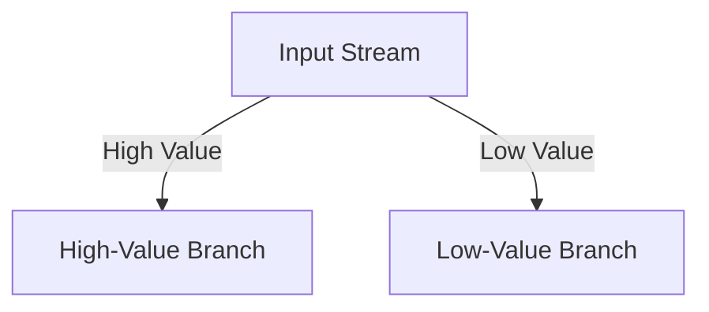

## 5.3.11 Advanced Processor API Patterns

The Kafka Streams Processor API provides unparalleled flexibility for implementing custom processing logic and complex stream transformations. This section delves into advanced patterns and techniques that leverage the Processor API, enabling expert software engineers and enterprise architects to build sophisticated stream processing applications. We will explore branching, dynamic routing, integrating external services, managing context and state, and best practices for error handling and backpressure.

### Flexibility of the Processor API

The Processor API in Kafka Streams allows developers to define custom processing logic by implementing the `Processor` and `Transformer` interfaces. This flexibility is crucial for scenarios where the high-level Streams DSL is insufficient. The Processor API enables:

- **Custom State Management**: Direct access to state stores for maintaining application state.
- **Complex Event Processing**: Implementing intricate processing logic that requires custom algorithms.
- **Integration with External Systems**: Communicating with external services or databases during stream processing.

### Advanced Patterns with the Processor API

#### Branching and Dynamic Routing

Branching and dynamic routing are essential patterns for directing data to different processing paths based on specific criteria.

**Branching** involves splitting a stream into multiple sub-streams based on predicates. This pattern is useful for scenarios where different processing logic is applied to different subsets of data.

**Dynamic Routing** allows for more complex decision-making, where messages are routed to different processors or topics based on dynamic conditions.

##### Implementation Example: Branching

Let's consider an example where we branch a stream of transactions into two sub-streams: one for high-value transactions and another for low-value transactions.

**Java Example:**

```java
import org.apache.kafka.streams.processor.Processor;
import org.apache.kafka.streams.processor.ProcessorContext;
import org.apache.kafka.streams.processor.ProcessorSupplier;
import org.apache.kafka.streams.processor.PunctuationType;
import org.apache.kafka.streams.processor.Punctuator;
import org.apache.kafka.streams.processor.To;

public class TransactionBranchingProcessor implements Processor<String, Transaction> {
    private ProcessorContext context;

    @Override
    public void init(ProcessorContext context) {
        this.context = context;
    }

    @Override
    public void process(String key, Transaction transaction) {
        if (transaction.getAmount() > 10000) {
            context.forward(key, transaction, To.child("high-value-branch"));
        } else {
            context.forward(key, transaction, To.child("low-value-branch"));
        }
    }

    @Override
    public void close() {
        // Cleanup resources if needed
    }
}
```

**Scala Example:**

```scala
import org.apache.kafka.streams.processor.{Processor, ProcessorContext, To}

class TransactionBranchingProcessor extends Processor[String, Transaction] {
  private var context: ProcessorContext = _

  override def init(context: ProcessorContext): Unit = {
    this.context = context
  }

  override def process(key: String, transaction: Transaction): Unit = {
    if (transaction.amount > 10000) {
      context.forward(key, transaction, To.child("high-value-branch"))
    } else {
      context.forward(key, transaction, To.child("low-value-branch"))
    }
  }

  override def close(): Unit = {
    // Cleanup resources if needed
  }
}
```

**Kotlin Example:**

```kotlin
import org.apache.kafka.streams.processor.Processor
import org.apache.kafka.streams.processor.ProcessorContext
import org.apache.kafka.streams.processor.To

class TransactionBranchingProcessor : Processor<String, Transaction> {
    private lateinit var context: ProcessorContext

    override fun init(context: ProcessorContext) {
        this.context = context
    }

    override fun process(key: String, transaction: Transaction) {
        if (transaction.amount > 10000) {
            context.forward(key, transaction, To.child("high-value-branch"))
        } else {
            context.forward(key, transaction, To.child("low-value-branch"))
        }
    }

    override fun close() {
        // Cleanup resources if needed
    }
}
```

**Clojure Example:**

```clojure
(ns kafka-streams.processor
  (:import [org.apache.kafka.streams.processor Processor ProcessorContext To]))

(defn transaction-branching-processor []
  (reify Processor
    (init [this context]
      (set! (.context this) context))
    (process [this key transaction]
      (if (> (.getAmount transaction) 10000)
        (.forward (.context this) key transaction (To/child "high-value-branch"))
        (.forward (.context this) key transaction (To/child "low-value-branch"))))
    (close [this]
      ;; Cleanup resources if needed
      )))
```

##### Diagram: Branching Pattern



**Caption**: The diagram illustrates the branching pattern, where an input stream is split into high-value and low-value branches based on transaction amount.

#### Integrating External Services

Integrating external services within processors is a powerful capability of the Processor API. This pattern is useful for enriching data, performing lookups, or triggering actions in external systems.

**Example Scenario**: Enriching a stream of user activity events with user profile data from an external database.

**Java Example:**

```java
import org.apache.kafka.streams.processor.Processor;
import org.apache.kafka.streams.processor.ProcessorContext;

public class UserProfileEnrichmentProcessor implements Processor<String, UserActivity> {
    private ProcessorContext context;
    private UserProfileService userProfileService;

    public UserProfileEnrichmentProcessor(UserProfileService userProfileService) {
        this.userProfileService = userProfileService;
    }

    @Override
    public void init(ProcessorContext context) {
        this.context = context;
    }

    @Override
    public void process(String key, UserActivity activity) {
        UserProfile profile = userProfileService.getUserProfile(activity.getUserId());
        EnrichedUserActivity enrichedActivity = new EnrichedUserActivity(activity, profile);
        context.forward(key, enrichedActivity);
    }

    @Override
    public void close() {
        // Cleanup resources if needed
    }
}
```

**Scala Example:**

```scala
import org.apache.kafka.streams.processor.{Processor, ProcessorContext}

class UserProfileEnrichmentProcessor(userProfileService: UserProfileService) extends Processor[String, UserActivity] {
  private var context: ProcessorContext = _

  override def init(context: ProcessorContext): Unit = {
    this.context = context
  }

  override def process(key: String, activity: UserActivity): Unit = {
    val profile = userProfileService.getUserProfile(activity.userId)
    val enrichedActivity = EnrichedUserActivity(activity, profile)
    context.forward(key, enrichedActivity)
  }

  override def close(): Unit = {
    // Cleanup resources if needed
  }
}
```

**Kotlin Example:**

```kotlin
import org.apache.kafka.streams.processor.Processor
import org.apache.kafka.streams.processor.ProcessorContext

class UserProfileEnrichmentProcessor(private val userProfileService: UserProfileService) : Processor<String, UserActivity> {
    private lateinit var context: ProcessorContext

    override fun init(context: ProcessorContext) {
        this.context = context
    }

    override fun process(key: String, activity: UserActivity) {
        val profile = userProfileService.getUserProfile(activity.userId)
        val enrichedActivity = EnrichedUserActivity(activity, profile)
        context.forward(key, enrichedActivity)
    }

    override fun close() {
        // Cleanup resources if needed
    }
}
```

**Clojure Example:**

```clojure
(ns kafka-streams.processor
  (:import [org.apache.kafka.streams.processor Processor ProcessorContext]))

(defn user-profile-enrichment-processor [user-profile-service]
  (reify Processor
    (init [this context]
      (set! (.context this) context))
    (process [this key activity]
      (let [profile (.getUserProfile user-profile-service (.getUserId activity))
            enriched-activity (EnrichedUserActivity. activity profile)]
        (.forward (.context this) key enriched-activity)))
    (close [this]
      ;; Cleanup resources if needed
      )))
```

#### Managing Context and State

Managing context and state within processors is crucial for maintaining application state and ensuring consistent processing. The Processor API provides access to state stores, which can be used to store and retrieve state information.

**Example Scenario**: Counting the number of events per user and storing the count in a state store.

**Java Example:**

```java
import org.apache.kafka.streams.processor.Processor;
import org.apache.kafka.streams.processor.ProcessorContext;
import org.apache.kafka.streams.state.KeyValueStore;

public class EventCountProcessor implements Processor<String, UserActivity> {
    private ProcessorContext context;
    private KeyValueStore<String, Integer> stateStore;

    @Override
    public void init(ProcessorContext context) {
        this.context = context;
        this.stateStore = (KeyValueStore<String, Integer>) context.getStateStore("event-count-store");
    }

    @Override
    public void process(String key, UserActivity activity) {
        Integer count = stateStore.get(activity.getUserId());
        if (count == null) {
            count = 0;
        }
        count++;
        stateStore.put(activity.getUserId(), count);
        context.forward(key, count);
    }

    @Override
    public void close() {
        // Cleanup resources if needed
    }
}
```

**Scala Example:**

```scala
import org.apache.kafka.streams.processor.{Processor, ProcessorContext}
import org.apache.kafka.streams.state.KeyValueStore

class EventCountProcessor extends Processor[String, UserActivity] {
  private var context: ProcessorContext = _
  private var stateStore: KeyValueStore[String, Integer] = _

  override def init(context: ProcessorContext): Unit = {
    this.context = context
    this.stateStore = context.getStateStore("event-count-store").asInstanceOf[KeyValueStore[String, Integer]]
  }

  override def process(key: String, activity: UserActivity): Unit = {
    var count = Option(stateStore.get(activity.userId)).getOrElse(0)
    count += 1
    stateStore.put(activity.userId, count)
    context.forward(key, count)
  }

  override def close(): Unit = {
    // Cleanup resources if needed
  }
}
```

**Kotlin Example:**

```kotlin
import org.apache.kafka.streams.processor.Processor
import org.apache.kafka.streams.processor.ProcessorContext
import org.apache.kafka.streams.state.KeyValueStore

class EventCountProcessor : Processor<String, UserActivity> {
    private lateinit var context: ProcessorContext
    private lateinit var stateStore: KeyValueStore<String, Int>

    override fun init(context: ProcessorContext) {
        this.context = context
        this.stateStore = context.getStateStore("event-count-store") as KeyValueStore<String, Int>
    }

    override fun process(key: String, activity: UserActivity) {
        var count = stateStore.get(activity.userId) ?: 0
        count++
        stateStore.put(activity.userId, count)
        context.forward(key, count)
    }

    override fun close() {
        // Cleanup resources if needed
    }
}
```

**Clojure Example:**

```clojure
(ns kafka-streams.processor
  (:import [org.apache.kafka.streams.processor Processor ProcessorContext]
           [org.apache.kafka.streams.state KeyValueStore]))

(defn event-count-processor []
  (reify Processor
    (init [this context]
      (set! (.context this) context)
      (set! (.stateStore this) (.getStateStore context "event-count-store")))
    (process [this key activity]
      (let [count (or (.get (.stateStore this) (.getUserId activity)) 0)]
        (.put (.stateStore this) (.getUserId activity) (inc count))
        (.forward (.context this) key (inc count))))
    (close [this]
      ;; Cleanup resources if needed
      )))
```

### Best Practices for Error Handling and Backpressure

Error handling and backpressure are critical aspects of building robust stream processing applications. The Processor API allows for fine-grained control over error handling and backpressure management.

#### Error Handling

- **Retry Logic**: Implement retry logic for transient errors, such as network timeouts or temporary service unavailability.
- **Dead Letter Queues**: Use dead letter queues to capture and analyze messages that cannot be processed successfully after multiple attempts.
- **Logging and Monitoring**: Ensure comprehensive logging and monitoring to detect and diagnose errors quickly.

#### Backpressure Management

- **Rate Limiting**: Implement rate limiting to prevent overwhelming downstream systems or external services.
- **Buffering**: Use buffering to absorb bursts of incoming data and smooth out processing rates.
- **Flow Control**: Implement flow control mechanisms to dynamically adjust processing rates based on system load and resource availability.

### Conclusion

The Kafka Streams Processor API provides a powerful toolkit for implementing advanced stream processing patterns. By leveraging custom processing logic, dynamic routing, and integration with external services, developers can build sophisticated applications that meet complex business requirements. Managing context and state, along with best practices for error handling and backpressure, ensures robust and reliable stream processing.

## Test Your Knowledge: Advanced Processor API Patterns Quiz



### What is the primary advantage of using the Processor API in Kafka Streams?

- [x] It allows for custom processing logic and complex transformations.
- [ ] It simplifies the deployment of Kafka clusters.
- [ ] It provides built-in support for machine learning models.
- [ ] It automatically scales the application across multiple nodes.

> **Explanation:** The Processor API enables developers to implement custom processing logic and complex transformations that are not possible with the high-level Streams DSL.

### Which pattern involves splitting a stream into multiple sub-streams based on predicates?

- [x] Branching
- [ ] Dynamic Routing
- [ ] State Management
- [ ] Error Handling

> **Explanation:** Branching involves splitting a stream into multiple sub-streams based on predicates, allowing different processing logic to be applied to different subsets of data.

### How can external services be integrated within processors?

- [x] By calling external services during the processing of each message.
- [ ] By deploying external services within the Kafka cluster.
- [ ] By using Kafka Connect to import data from external services.
- [ ] By configuring external services in the Kafka Streams configuration file.

> **Explanation:** External services can be integrated within processors by calling them during the processing of each message, allowing for data enrichment or triggering actions.

### What is a common technique for managing state within processors?

- [x] Using state stores to store and retrieve state information.
- [ ] Storing state in external databases.
- [ ] Using in-memory data structures only.
- [ ] Relying on the Kafka broker for state management.

> **Explanation:** State stores are used within processors to store and retrieve state information, enabling consistent processing and state management.

### Which of the following is a best practice for error handling in stream processing?

- [x] Implementing retry logic for transient errors.
- [ ] Ignoring errors to maintain high throughput.
- [ ] Stopping the application on any error.
- [ ] Using only synchronous processing to avoid errors.

> **Explanation:** Implementing retry logic for transient errors is a best practice for error handling, allowing the application to recover from temporary issues.

### What is the purpose of a dead letter queue?

- [x] To capture and analyze messages that cannot be processed successfully.
- [ ] To store all processed messages for auditing purposes.
- [ ] To temporarily hold messages during processing.
- [ ] To balance the load across multiple processors.

> **Explanation:** A dead letter queue captures and analyzes messages that cannot be processed successfully, providing insights into processing failures.

### How can backpressure be managed in stream processing applications?

- [x] By implementing rate limiting and buffering.
- [ ] By increasing the number of processors.
- [ ] By reducing the size of the Kafka cluster.
- [ ] By disabling logging and monitoring.

> **Explanation:** Backpressure can be managed by implementing rate limiting and buffering, which help control the flow of data and prevent system overload.

### What is the role of flow control in backpressure management?

- [x] To dynamically adjust processing rates based on system load.
- [ ] To increase the speed of data processing.
- [ ] To reduce the memory usage of the application.
- [ ] To simplify the configuration of Kafka Streams.

> **Explanation:** Flow control dynamically adjusts processing rates based on system load and resource availability, helping to manage backpressure effectively.

### Which language is NOT commonly used for implementing Kafka Streams applications?

- [ ] Java
- [ ] Scala
- [ ] Kotlin
- [x] Python

> **Explanation:** While Java, Scala, and Kotlin are commonly used for implementing Kafka Streams applications, Python is not typically used for this purpose.

### True or False: The Processor API can be used to implement machine learning models directly within Kafka Streams.

- [ ] True
- [x] False

> **Explanation:** The Processor API is not specifically designed for implementing machine learning models directly within Kafka Streams, although it can be used to integrate with external machine learning services.


