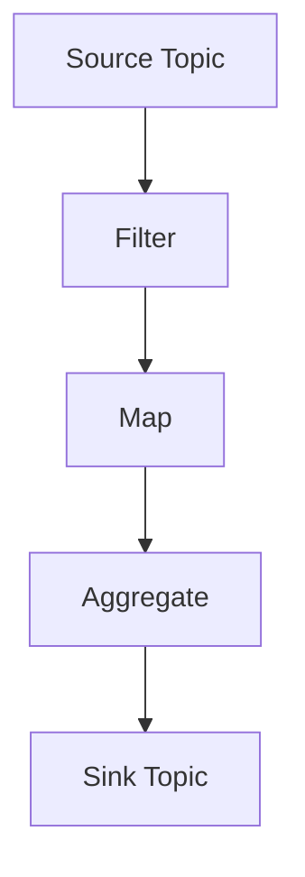
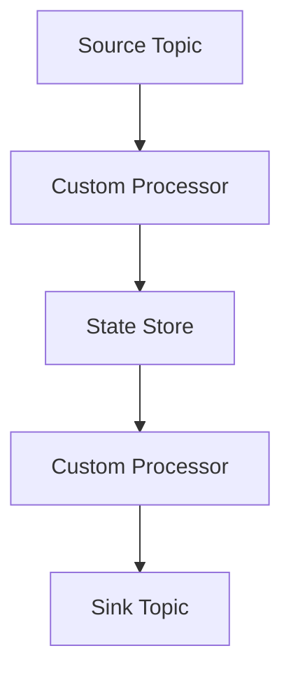

## 5.3.2 Streams DSL vs. Processor API

### Introduction

Apache Kafka's Streams API offers two distinct approaches for stream processing: the high-level Streams DSL (Domain Specific Language) and the low-level Processor API. Each provides unique abstractions and capabilities, catering to different needs and complexities in stream processing tasks. This section delves into the intricacies of both APIs, offering insights into their use cases, advantages, and implementation techniques.

### Streams DSL: High-Level Abstractions

#### Intent

The Streams DSL is designed to simplify stream processing by providing a high-level, declarative approach. It abstracts the complexities of stream processing, allowing developers to focus on defining the "what" rather than the "how."

#### Motivation

The Streams DSL is ideal for developers who need to implement common stream processing tasks quickly and efficiently without delving into the underlying mechanics. It is particularly useful for tasks such as filtering, mapping, joining, and aggregating data streams.

#### Applicability

- **Simple to Moderate Complexity**: Use the Streams DSL for straightforward processing tasks that can be expressed in a declarative manner.
- **Rapid Development**: Ideal for projects with tight deadlines where rapid prototyping is essential.
- **Common Operations**: Suitable for tasks involving standard operations like filtering, mapping, and joining.

#### Structure

The Streams DSL provides a fluent API that allows chaining operations to define a processing topology.



*Caption: A typical Streams DSL topology involving filtering, mapping, and aggregating data from a source topic to a sink topic.*

#### Participants

- **KStream**: Represents a stream of records.
- **KTable**: Represents a changelog stream, essentially a table.
- **GlobalKTable**: Represents a globally replicated table.

#### Collaborations

- **KStream-KStream Joins**: Joining two streams.
- **KStream-KTable Joins**: Enriching a stream with a table.
- **Windowed Operations**: Applying time-based operations.

#### Consequences

- **Ease of Use**: Simplifies development with a rich set of built-in operations.
- **Limited Flexibility**: Less control over the processing logic compared to the Processor API.

#### Implementation

- **Java**:

    ```java
    StreamsBuilder builder = new StreamsBuilder();
    KStream<String, String> source = builder.stream("source-topic");
    KStream<String, String> filtered = source.filter((key, value) -> value.contains("important"));
    filtered.to("sink-topic");
    ```

- **Scala**:

    ```scala
    val builder = new StreamsBuilder()
    val source: KStream[String, String] = builder.stream("source-topic")
    val filtered = source.filter((key, value) => value.contains("important"))
    filtered.to("sink-topic")
    ```

- **Kotlin**:

    ```kotlin
    val builder = StreamsBuilder()
    val source: KStream<String, String> = builder.stream("source-topic")
    val filtered = source.filter { key, value -> value.contains("important") }
    filtered.to("sink-topic")
    ```

- **Clojure**:

    ```clojure
    (def builder (StreamsBuilder.))
    (def source (.stream builder "source-topic"))
    (def filtered (.filter source (reify Predicate
                                    (test [_ key value]
                                      (.contains value "important")))))
    (.to filtered "sink-topic")
    ```

### Processor API: Low-Level Control

#### Intent

The Processor API offers fine-grained control over the processing logic, allowing developers to implement custom processing logic and manage state explicitly.

#### Motivation

The Processor API is suitable for complex processing tasks that require custom logic, state management, or integration with external systems.

#### Applicability

- **Complex Processing Logic**: Use the Processor API for tasks that cannot be easily expressed with the Streams DSL.
- **Custom State Management**: Ideal for applications requiring explicit state handling.
- **Integration with External Systems**: Suitable for scenarios where integration with non-Kafka systems is necessary.

#### Structure

The Processor API allows developers to define a processing topology using custom processors and state stores.



*Caption: A Processor API topology with custom processors and state stores.*

#### Participants

- **Processor**: A node in the processing topology that processes records.
- **StateStore**: A storage mechanism for maintaining state.
- **TopologyBuilder**: Constructs the processing topology.

#### Collaborations

- **Custom Processors**: Implement custom logic for processing records.
- **State Management**: Use state stores for maintaining application state.

#### Consequences

- **Flexibility**: Provides full control over the processing logic and state management.
- **Complexity**: Requires a deeper understanding of stream processing concepts and Kafka internals.

#### Implementation

- **Java**:

    ```java
    Topology topology = new Topology();
    topology.addSource("Source", "source-topic")
            .addProcessor("Process", CustomProcessor::new, "Source")
            .addStateStore(Stores.keyValueStoreBuilder(
                Stores.inMemoryKeyValueStore("state-store"),
                Serdes.String(),
                Serdes.String()), "Process")
            .addSink("Sink", "sink-topic", "Process");

    public class CustomProcessor implements Processor<String, String> {
        private ProcessorContext context;
        private KeyValueStore<String, String> stateStore;

        @Override
        public void init(ProcessorContext context) {
            this.context = context;
            this.stateStore = (KeyValueStore<String, String>) context.getStateStore("state-store");
        }

        @Override
        public void process(String key, String value) {
            // Custom processing logic
            if (value.contains("important")) {
                stateStore.put(key, value);
                context.forward(key, value);
            }
        }

        @Override
        public void close() {
            // Cleanup resources
        }
    }
    ```

- **Scala**:

    ```scala
    val topology = new Topology()
    topology.addSource("Source", "source-topic")
            .addProcessor("Process", () => new CustomProcessor, "Source")
            .addStateStore(Stores.keyValueStoreBuilder(
                Stores.inMemoryKeyValueStore("state-store"),
                Serdes.String(),
                Serdes.String()), "Process")
            .addSink("Sink", "sink-topic", "Process")

    class CustomProcessor extends Processor[String, String] {
        private var context: ProcessorContext = _
        private var stateStore: KeyValueStore[String, String] = _

        override def init(context: ProcessorContext): Unit = {
            this.context = context
            this.stateStore = context.getStateStore("state-store").asInstanceOf[KeyValueStore[String, String]]
        }

        override def process(key: String, value: String): Unit = {
            if (value.contains("important")) {
                stateStore.put(key, value)
                context.forward(key, value)
            }
        }

        override def close(): Unit = {
            // Cleanup resources
        }
    }
    ```

- **Kotlin**:

    ```kotlin
    val topology = Topology()
    topology.addSource("Source", "source-topic")
            .addProcessor("Process", { CustomProcessor() }, "Source")
            .addStateStore(Stores.keyValueStoreBuilder(
                Stores.inMemoryKeyValueStore("state-store"),
                Serdes.String(),
                Serdes.String()), "Process")
            .addSink("Sink", "sink-topic", "Process")

    class CustomProcessor : Processor<String, String> {
        private lateinit var context: ProcessorContext
        private lateinit var stateStore: KeyValueStore<String, String>

        override fun init(context: ProcessorContext) {
            this.context = context
            this.stateStore = context.getStateStore("state-store") as KeyValueStore<String, String>
        }

        override fun process(key: String, value: String) {
            if (value.contains("important")) {
                stateStore.put(key, value)
                context.forward(key, value)
            }
        }

        override fun close() {
            // Cleanup resources
        }
    }
    ```

- **Clojure**:

    ```clojure
    (def topology (Topology.))
    (.addSource topology "Source" (into-array String ["source-topic"]))
    (.addProcessor topology "Process" (reify ProcessorSupplier
                                        (get [_]
                                          (reify Processor
                                            (init [_ context]
                                              (def context context)
                                              (def state-store (.getStateStore context "state-store")))
                                            (process [_ key value]
                                              (when (.contains value "important")
                                                (.put state-store key value)
                                                (.forward context key value)))
                                            (close [_])))) "Source")
    (.addStateStore topology (Stores/keyValueStoreBuilder
                               (Stores/inMemoryKeyValueStore "state-store")
                               (Serdes/String)
                               (Serdes/String)) "Process")
    (.addSink topology "Sink" "sink-topic" "Process")
    ```

### Learning Curve and Complexity

The Streams DSL offers a gentle learning curve, making it accessible to developers familiar with functional programming paradigms. Its declarative nature allows for rapid development and prototyping. In contrast, the Processor API requires a deeper understanding of Kafka's internals and stream processing concepts, making it more suitable for experienced developers who need fine-grained control over processing logic.

### Guidelines for Selecting the Appropriate API

- **Use Streams DSL** when:
  - The processing logic is straightforward and can be expressed declaratively.
  - Rapid development and prototyping are priorities.
  - Built-in operations suffice for the application's needs.

- **Use Processor API** when:
  - Custom processing logic is required.
  - There is a need for explicit state management.
  - Integration with external systems is necessary.

### Conclusion

Both the Streams DSL and Processor API offer powerful capabilities for stream processing in Apache Kafka. The choice between them depends on the complexity of the processing tasks, the need for custom logic, and the developer's familiarity with Kafka's internals. By understanding the strengths and limitations of each approach, developers can select the most appropriate API for their specific use case.

## Test Your Knowledge: Apache Kafka Streams DSL vs. Processor API Quiz



### Which API is best suited for rapid development and prototyping?

- [x] Streams DSL
- [ ] Processor API
- [ ] Both
- [ ] Neither

> **Explanation:** The Streams DSL is designed for rapid development with its high-level abstractions and built-in operations.

### What is a key advantage of the Processor API over the Streams DSL?

- [x] Fine-grained control over processing logic
- [ ] Easier to learn
- [ ] Faster execution
- [ ] Built-in operations

> **Explanation:** The Processor API provides fine-grained control, allowing developers to implement custom processing logic and manage state explicitly.

### In which scenario would you choose the Streams DSL?

- [x] When the processing logic is straightforward
- [ ] When custom state management is required
- [ ] When integrating with external systems
- [ ] When low-level control is necessary

> **Explanation:** The Streams DSL is ideal for straightforward processing tasks that can be expressed declaratively.

### What is a consequence of using the Processor API?

- [x] Increased complexity
- [ ] Limited flexibility
- [ ] Rapid prototyping
- [ ] Built-in operations

> **Explanation:** The Processor API increases complexity due to its low-level control and requirement for custom logic.

### Which API would you use for tasks involving custom state management?

- [ ] Streams DSL
- [x] Processor API
- [ ] Both
- [ ] Neither

> **Explanation:** The Processor API is suitable for tasks requiring custom state management.

### What is a primary feature of the Streams DSL?

- [x] High-level abstractions
- [ ] Custom processors
- [ ] State stores
- [ ] Low-level control

> **Explanation:** The Streams DSL provides high-level abstractions for common stream processing tasks.

### Which API is more suitable for integrating with external systems?

- [ ] Streams DSL
- [x] Processor API
- [ ] Both
- [ ] Neither

> **Explanation:** The Processor API is more suitable for integration with external systems due to its flexibility and control.

### What is a benefit of using the Streams DSL?

- [x] Simplifies development
- [ ] Requires deep understanding of Kafka internals
- [ ] Provides custom state management
- [ ] Offers low-level control

> **Explanation:** The Streams DSL simplifies development with its high-level, declarative approach.

### Which API requires a deeper understanding of Kafka's internals?

- [ ] Streams DSL
- [x] Processor API
- [ ] Both
- [ ] Neither

> **Explanation:** The Processor API requires a deeper understanding of Kafka's internals due to its low-level nature.

### True or False: The Streams DSL is less flexible than the Processor API.

- [x] True
- [ ] False

> **Explanation:** The Streams DSL is less flexible because it abstracts the complexities of stream processing, whereas the Processor API provides full control over processing logic.


