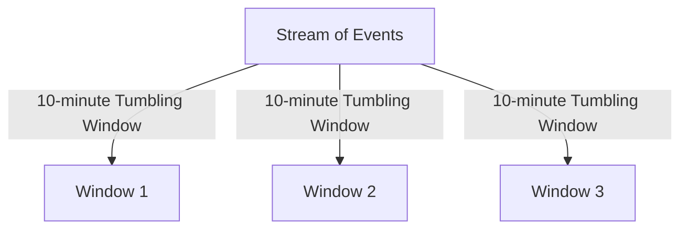
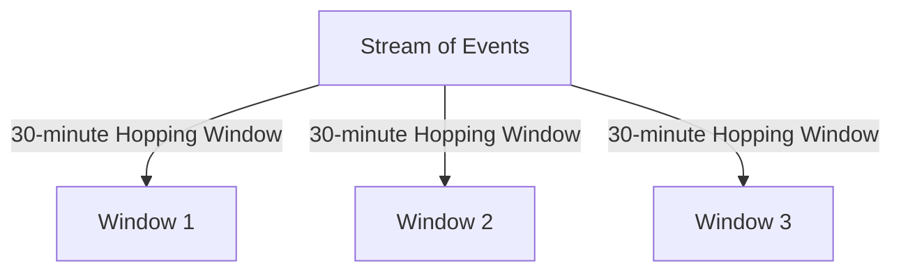
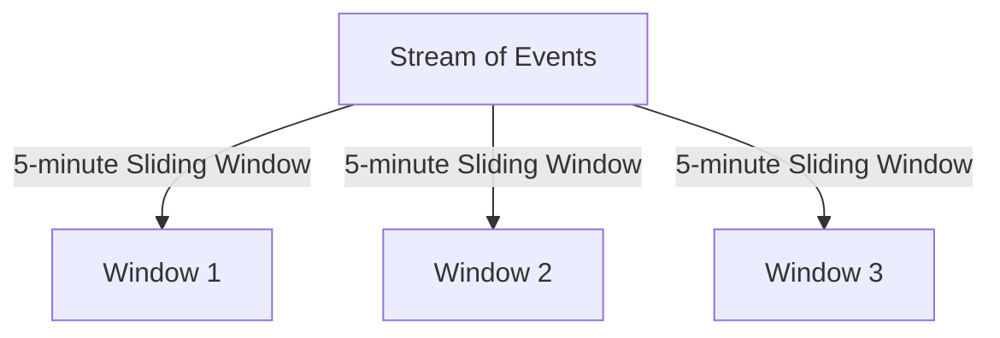
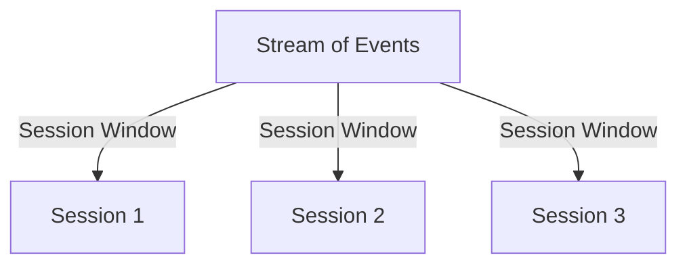

## 5.3.4 Windowing Concepts and Implementations

### Introduction

In the realm of stream processing, windowing is a fundamental concept that allows for the aggregation and analysis of data over finite chunks of time or other criteria. This section delves into the intricacies of windowing in Kafka Streams, providing expert insights into its implementation and practical applications. By mastering windowing, you can unlock the potential of real-time data processing, enabling sophisticated analytics and decision-making capabilities.

### Understanding Windowing in Stream Processing

Windowing is a technique used to divide a continuous stream of data into manageable, finite segments called windows. These windows enable operations such as aggregation, counting, and joining to be performed over specific intervals, making it possible to derive meaningful insights from streaming data.

#### Purpose of Windowing

- **Aggregation**: Summarize data over a defined period, such as calculating the average temperature every minute.
- **Analysis**: Perform statistical analysis on data segments, like identifying trends or anomalies.
- **Real-Time Decision Making**: Enable timely responses to events, such as triggering alerts when thresholds are exceeded.

### Types of Windows in Kafka Streams

Kafka Streams supports several types of windows, each suited to different use cases and data characteristics. Understanding these window types is crucial for designing effective stream processing applications.

#### Tumbling Windows

Tumbling windows are fixed-size, non-overlapping windows that process data in discrete chunks. Each event belongs to exactly one window.

- **Use Case**: Ideal for periodic reporting, such as generating hourly sales reports.
- **Example**: Calculate the total number of transactions every 10 minutes.



#### Hopping Windows

Hopping windows are fixed-size, overlapping windows that slide over the data stream at regular intervals. An event can belong to multiple windows.

- **Use Case**: Useful for moving averages, such as calculating the average temperature over the last hour, updated every 10 minutes.
- **Example**: Compute a 30-minute moving average of website visits, updated every 5 minutes.



#### Sliding Windows

Sliding windows are variable-size windows that are triggered by events. They capture all events that occur within a specified duration relative to each event.

- **Use Case**: Suitable for event-driven analytics, such as detecting fraud within a 5-minute window of a transaction.
- **Example**: Identify all transactions within 5 minutes of a suspicious activity.



#### Session Windows

Session windows are dynamic windows that group events based on periods of inactivity, known as gaps. They are ideal for capturing user sessions.

- **Use Case**: Track user activity sessions on a website, where a session ends after 30 minutes of inactivity.
- **Example**: Aggregate user clicks into sessions with a 30-minute inactivity gap.



### Implementing Windowed Operations in Kafka Streams

Kafka Streams provides a robust API for implementing windowed operations, allowing developers to define and process windows with ease.

#### Tumbling Window Implementation

To implement a tumbling window in Kafka Streams, use the `TimeWindows` class to define the window size.

**Java Example**:

```java
KStream<String, Long> inputStream = builder.stream("input-topic");

KTable<Windowed<String>, Long> tumblingWindowCounts = inputStream
    .groupByKey()
    .windowedBy(TimeWindows.of(Duration.ofMinutes(10)))
    .count();

tumblingWindowCounts.toStream().to("output-topic", Produced.with(WindowedSerdes.timeWindowedSerdeFrom(String.class), Serdes.Long()));
```

**Scala Example**:

```scala
val inputStream: KStream[String, Long] = builder.stream("input-topic")

val tumblingWindowCounts: KTable[Windowed[String], Long] = inputStream
  .groupByKey
  .windowedBy(TimeWindows.of(Duration.ofMinutes(10)))
  .count()

tumblingWindowCounts.toStream.to("output-topic")(Produced.`with`(WindowedSerdes.timeWindowedSerdeFrom(classOf[String]), Serdes.Long()))
```

**Kotlin Example**:

```kotlin
val inputStream: KStream<String, Long> = builder.stream("input-topic")

val tumblingWindowCounts: KTable<Windowed<String>, Long> = inputStream
    .groupByKey()
    .windowedBy(TimeWindows.of(Duration.ofMinutes(10)))
    .count()

tumblingWindowCounts.toStream().to("output-topic", Produced.with(WindowedSerdes.timeWindowedSerdeFrom(String::class.java), Serdes.Long()))
```

**Clojure Example**:

```clojure
(def input-stream (.stream builder "input-topic"))

(def tumbling-window-counts
  (-> input-stream
      (.groupByKey)
      (.windowedBy (TimeWindows/of (Duration/ofMinutes 10)))
      (.count)))

(.toStream tumbling-window-counts)
(.to "output-topic" (Produced/with (WindowedSerdes/timeWindowedSerdeFrom String) Serdes/Long))
```

#### Hopping Window Implementation

Hopping windows require specifying both the window size and the advance interval.

**Java Example**:

```java
KTable<Windowed<String>, Long> hoppingWindowCounts = inputStream
    .groupByKey()
    .windowedBy(TimeWindows.of(Duration.ofMinutes(30)).advanceBy(Duration.ofMinutes(5)))
    .count();

hoppingWindowCounts.toStream().to("output-topic", Produced.with(WindowedSerdes.timeWindowedSerdeFrom(String.class), Serdes.Long()));
```

**Scala Example**:

```scala
val hoppingWindowCounts: KTable[Windowed[String], Long] = inputStream
  .groupByKey
  .windowedBy(TimeWindows.of(Duration.ofMinutes(30)).advanceBy(Duration.ofMinutes(5)))
  .count()

hoppingWindowCounts.toStream.to("output-topic")(Produced.`with`(WindowedSerdes.timeWindowedSerdeFrom(classOf[String]), Serdes.Long()))
```

**Kotlin Example**:

```kotlin
val hoppingWindowCounts: KTable<Windowed<String>, Long> = inputStream
    .groupByKey()
    .windowedBy(TimeWindows.of(Duration.ofMinutes(30)).advanceBy(Duration.ofMinutes(5)))
    .count()

hoppingWindowCounts.toStream().to("output-topic", Produced.with(WindowedSerdes.timeWindowedSerdeFrom(String::class.java), Serdes.Long()))
```

**Clojure Example**:

```clojure
(def hopping-window-counts
  (-> input-stream
      (.groupByKey)
      (.windowedBy (TimeWindows/of (Duration/ofMinutes 30) (Duration/ofMinutes 5)))
      (.count)))

(.toStream hopping-window-counts)
(.to "output-topic" (Produced/with (WindowedSerdes/timeWindowedSerdeFrom String) Serdes/Long))
```

#### Sliding Window Implementation

Sliding windows are typically implemented using custom logic to define the window duration relative to each event.

#### Session Window Implementation

Session windows are defined using the `SessionWindows` class, specifying the inactivity gap.

**Java Example**:

```java
KTable<Windowed<String>, Long> sessionWindowCounts = inputStream
    .groupByKey()
    .windowedBy(SessionWindows.with(Duration.ofMinutes(30)))
    .count();

sessionWindowCounts.toStream().to("output-topic", Produced.with(WindowedSerdes.sessionWindowedSerdeFrom(String.class), Serdes.Long()));
```

**Scala Example**:

```scala
val sessionWindowCounts: KTable[Windowed[String], Long] = inputStream
  .groupByKey
  .windowedBy(SessionWindows.with(Duration.ofMinutes(30)))
  .count()

sessionWindowCounts.toStream.to("output-topic")(Produced.`with`(WindowedSerdes.sessionWindowedSerdeFrom(classOf[String]), Serdes.Long()))
```

**Kotlin Example**:

```kotlin
val sessionWindowCounts: KTable<Windowed<String>, Long> = inputStream
    .groupByKey()
    .windowedBy(SessionWindows.with(Duration.ofMinutes(30)))
    .count()

sessionWindowCounts.toStream().to("output-topic", Produced.with(WindowedSerdes.sessionWindowedSerdeFrom(String::class.java), Serdes.Long()))
```

**Clojure Example**:

```clojure
(def session-window-counts
  (-> input-stream
      (.groupByKey)
      (.windowedBy (SessionWindows/with (Duration/ofMinutes 30)))
      (.count)))

(.toStream session-window-counts)
(.to "output-topic" (Produced/with (WindowedSerdes/sessionWindowedSerdeFrom String) Serdes/Long))
```

### Handling Late-Arriving Data and Watermarking

In stream processing, late-arriving data can pose challenges, especially when dealing with time-based windows. Kafka Streams provides mechanisms to handle such scenarios effectively.

#### Late-Arriving Data

- **Buffering**: Temporarily store late-arriving data to include it in the correct window.
- **Grace Periods**: Define a grace period to allow late data to be processed within a window.

#### Watermarking

Watermarks are timestamps that indicate the progress of event time in a stream. They help manage late data by determining when a window can be considered complete.

- **Implementation**: Use watermarks to trigger window closure and output results, ensuring late data is handled appropriately.

### Practical Applications and Use Cases

Windowing in Kafka Streams is applicable across various domains, enabling powerful real-time analytics and decision-making capabilities.

#### Real-Time Analytics

- **Financial Services**: Monitor stock prices and detect anomalies in real-time using sliding windows.
- **Retail**: Analyze customer behavior and optimize inventory with session windows.

#### IoT and Sensor Data

- **Smart Cities**: Aggregate sensor data from traffic lights and adjust signals dynamically using hopping windows.
- **Environmental Monitoring**: Track air quality metrics and issue alerts with tumbling windows.

#### Fraud Detection

- **Banking**: Identify fraudulent transactions by analyzing patterns within session windows.
- **E-commerce**: Detect unusual purchasing behavior using sliding windows.

### Conclusion

Windowing is a powerful concept in Kafka Streams that enables sophisticated stream processing and real-time analytics. By understanding and implementing different window types, you can harness the full potential of your streaming data, driving informed decision-making and operational efficiency.

### Key Takeaways

- **Windowing**: Essential for aggregating and analyzing streaming data.
- **Types**: Tumbling, hopping, sliding, and session windows each serve unique purposes.
- **Implementation**: Kafka Streams provides robust APIs for defining and processing windows.
- **Handling Late Data**: Use buffering, grace periods, and watermarking to manage late-arriving events.

### References and Further Reading

- [Apache Kafka Documentation](https://kafka.apache.org/documentation/)
- [Confluent Documentation](https://docs.confluent.io/)
- [Kafka Streams API Guide](https://kafka.apache.org/documentation/streams/)

## Test Your Knowledge: Advanced Kafka Streams Windowing Quiz



### What is the primary purpose of windowing in stream processing?

- [x] To aggregate and analyze data over finite chunks of time.
- [ ] To increase the speed of data processing.
- [ ] To reduce the size of data streams.
- [ ] To improve data security.

> **Explanation:** Windowing allows for the aggregation and analysis of data over specific intervals, enabling meaningful insights from streaming data.

### Which window type is best suited for periodic reporting?

- [x] Tumbling Windows
- [ ] Hopping Windows
- [ ] Sliding Windows
- [ ] Session Windows

> **Explanation:** Tumbling windows are fixed-size, non-overlapping windows ideal for periodic reporting, such as hourly sales reports.

### How do hopping windows differ from tumbling windows?

- [x] Hopping windows overlap, while tumbling windows do not.
- [ ] Tumbling windows overlap, while hopping windows do not.
- [ ] Hopping windows are event-driven, while tumbling windows are time-driven.
- [ ] Tumbling windows are event-driven, while hopping windows are time-driven.

> **Explanation:** Hopping windows are fixed-size, overlapping windows, whereas tumbling windows are non-overlapping.

### What is a session window?

- [x] A dynamic window that groups events based on periods of inactivity.
- [ ] A fixed-size window that processes data in discrete chunks.
- [ ] An overlapping window that slides over the data stream.
- [ ] A window that captures all events within a specified duration relative to each event.

> **Explanation:** Session windows are dynamic and group events based on periods of inactivity, making them ideal for capturing user sessions.

### How can late-arriving data be handled in Kafka Streams?

- [x] By using grace periods and buffering.
- [ ] By ignoring late data.
- [ ] By increasing the window size.
- [ ] By reducing the data stream speed.

> **Explanation:** Grace periods and buffering allow late-arriving data to be processed within the correct window.

### What role do watermarks play in stream processing?

- [x] They indicate the progress of event time and help manage late data.
- [ ] They increase the speed of data processing.
- [ ] They reduce the size of data streams.
- [ ] They improve data security.

> **Explanation:** Watermarks are timestamps that indicate event time progress, helping to manage late-arriving data.

### Which window type is ideal for detecting fraud within a specific time frame?

- [x] Sliding Windows
- [ ] Tumbling Windows
- [ ] Hopping Windows
- [ ] Session Windows

> **Explanation:** Sliding windows are suitable for event-driven analytics, such as detecting fraud within a specific time frame.

### What is the advantage of using session windows for user activity tracking?

- [x] They group events based on inactivity, capturing complete user sessions.
- [ ] They provide fixed-size, non-overlapping windows.
- [ ] They overlap, allowing for more data capture.
- [ ] They are event-driven, capturing all events within a specified duration.

> **Explanation:** Session windows group events based on inactivity, making them ideal for capturing complete user sessions.

### Which window type is best for calculating moving averages?

- [x] Hopping Windows
- [ ] Tumbling Windows
- [ ] Sliding Windows
- [ ] Session Windows

> **Explanation:** Hopping windows are ideal for moving averages, as they overlap and slide over the data stream.

### True or False: Watermarks are used to improve data security in stream processing.

- [ ] True
- [x] False

> **Explanation:** Watermarks are used to manage late-arriving data by indicating the progress of event time, not for improving data security.


