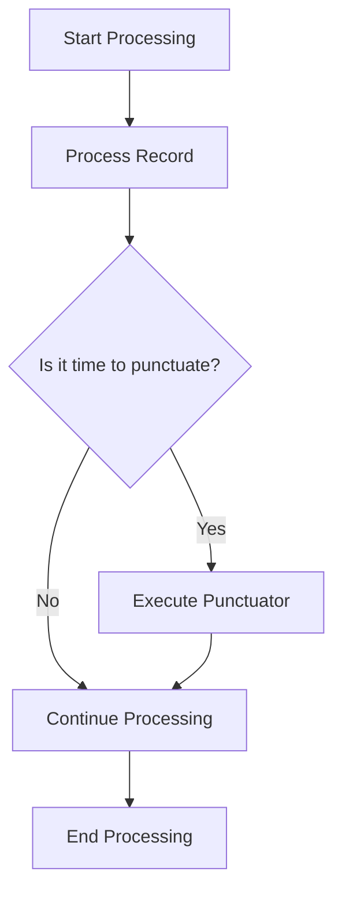

## 5.3.8 Punctuators and Stream Time Advancement

### Introduction

In the realm of stream processing, time plays a crucial role in determining how data is processed and when certain operations should be triggered. Apache Kafka Streams provides a powerful mechanism known as **punctuators** to facilitate time-based operations within the stream processing topology. This section delves into the concept of punctuators, their implementation, and their practical applications in real-time data processing.

### Understanding Punctuators

#### What are Punctuators?

Punctuators in Kafka Streams are a feature of the Processor API that allows developers to schedule periodic actions based on stream time. They are essentially callbacks that are triggered at specified intervals, enabling time-based operations such as emitting periodic results, cleaning up state stores, or performing aggregations.

#### Role of Punctuators in Kafka Streams

Punctuators serve several key purposes in stream processing:

- **Periodic State Updates**: They allow for the periodic update of state stores, ensuring that the state is consistently maintained and up-to-date.
- **Time-Based Aggregations**: Punctuators can be used to trigger aggregations at regular intervals, such as computing rolling averages or sums.
- **Emitting Results**: They enable the emission of results at specific time intervals, which is particularly useful for applications that require periodic reporting or alerting.

### Implementing and Registering a Punctuator

#### Steps to Implement a Punctuator

1. **Create a Processor**: Implement the `Processor` interface, which provides the `process` method for handling incoming records.

2. **Define the Punctuator**: Implement the `Punctuator` interface, which includes the `punctuate` method. This method will contain the logic to be executed at each scheduled interval.

3. **Register the Punctuator**: Use the `context.schedule` method within the `init` method of your processor to register the punctuator. You can specify the interval and the type of time (stream time or wall-clock time) for scheduling.

#### Code Example: Java

```java
import org.apache.kafka.streams.processor.AbstractProcessor;
import org.apache.kafka.streams.processor.Punctuator;
import org.apache.kafka.streams.processor.ProcessorContext;
import org.apache.kafka.streams.processor.PunctuationType;

public class MyProcessor extends AbstractProcessor<String, String> {

    @Override
    public void init(ProcessorContext context) {
        super.init(context);
        // Register a punctuator to trigger every 1000 milliseconds based on stream time
        context.schedule(1000, PunctuationType.STREAM_TIME, new MyPunctuator());
    }

    @Override
    public void process(String key, String value) {
        // Processing logic for each record
    }

    private class MyPunctuator implements Punctuator {
        @Override
        public void punctuate(long timestamp) {
            // Logic to execute at each punctuation
            System.out.println("Punctuator triggered at stream time: " + timestamp);
        }
    }
}
```

#### Code Example: Scala

```scala
import org.apache.kafka.streams.processor.{AbstractProcessor, Punctuator, ProcessorContext, PunctuationType}

class MyProcessor extends AbstractProcessor[String, String] {

  override def init(context: ProcessorContext): Unit = {
    super.init(context)
    // Register a punctuator to trigger every 1000 milliseconds based on stream time
    context.schedule(1000, PunctuationType.STREAM_TIME, new MyPunctuator)
  }

  override def process(key: String, value: String): Unit = {
    // Processing logic for each record
  }

  private class MyPunctuator extends Punctuator {
    override def punctuate(timestamp: Long): Unit = {
      // Logic to execute at each punctuation
      println(s"Punctuator triggered at stream time: $timestamp")
    }
  }
}
```

### Practical Applications of Punctuators

#### Tasks Suited for Punctuators

1. **Emitting Periodic Results**: In scenarios where results need to be emitted at regular intervals, punctuators can be used to trigger the emission of aggregated data or alerts.

2. **State Store Maintenance**: Punctuators can be employed to periodically clean up or update state stores, ensuring that the state remains consistent and does not grow indefinitely.

3. **Time-Based Aggregations**: For applications that require time-based aggregations, such as calculating moving averages or sums, punctuators provide a mechanism to trigger these calculations at specified intervals.

#### Real-World Scenario: Periodic Reporting

Consider a financial application that processes stock market data in real-time. The application needs to generate periodic reports every minute, summarizing the average price of stocks. A punctuator can be used to trigger the aggregation and emission of these reports at the end of each minute.

### Stream Time vs. Wall-Clock Time

#### Differences Between Stream Time and Wall-Clock Time

- **Stream Time**: This refers to the time associated with the data being processed. It is determined by the timestamps of the records in the stream. Stream time advances as records with newer timestamps are processed.

- **Wall-Clock Time**: This is the actual time on the system clock. It advances continuously, independent of the data being processed.

#### Choosing Between Stream Time and Wall-Clock Time

The choice between stream time and wall-clock time depends on the application's requirements:

- **Stream Time**: Use stream time when operations need to be aligned with the data's inherent time characteristics, such as processing events in the order they occurred.

- **Wall-Clock Time**: Use wall-clock time for operations that need to occur at regular intervals, regardless of the data being processed, such as periodic reporting or maintenance tasks.

### Code Samples Demonstrating Punctuator Usage

#### Example: Emitting Periodic Results

In this example, we demonstrate how to use a punctuator to emit periodic results based on stream time.

##### Java

```java
import org.apache.kafka.streams.processor.AbstractProcessor;
import org.apache.kafka.streams.processor.Punctuator;
import org.apache.kafka.streams.processor.ProcessorContext;
import org.apache.kafka.streams.processor.PunctuationType;

public class PeriodicResultEmitter extends AbstractProcessor<String, Double> {

    private double sum = 0.0;
    private int count = 0;

    @Override
    public void init(ProcessorContext context) {
        super.init(context);
        context.schedule(60000, PunctuationType.STREAM_TIME, new ResultPunctuator());
    }

    @Override
    public void process(String key, Double value) {
        sum += value;
        count++;
    }

    private class ResultPunctuator implements Punctuator {
        @Override
        public void punctuate(long timestamp) {
            double average = count == 0 ? 0 : sum / count;
            System.out.println("Average at " + timestamp + ": " + average);
            sum = 0;
            count = 0;
        }
    }
}
```

##### Scala

```scala
import org.apache.kafka.streams.processor.{AbstractProcessor, Punctuator, ProcessorContext, PunctuationType}

class PeriodicResultEmitter extends AbstractProcessor[String, Double] {

  private var sum = 0.0
  private var count = 0

  override def init(context: ProcessorContext): Unit = {
    super.init(context)
    context.schedule(60000, PunctuationType.STREAM_TIME, new ResultPunctuator)
  }

  override def process(key: String, value: Double): Unit = {
    sum += value
    count += 1
  }

  private class ResultPunctuator extends Punctuator {
    override def punctuate(timestamp: Long): Unit = {
      val average = if (count == 0) 0 else sum / count
      println(s"Average at $timestamp: $average")
      sum = 0
      count = 0
    }
  }
}
```

### Considerations for Time Advancement

#### Testing Environments

In testing environments, it is crucial to simulate time advancement to ensure that punctuators are triggered as expected. This can be achieved by manipulating the timestamps of the records being processed or by using mock time advancement techniques.

#### Production Environments

In production environments, ensure that the system clock is synchronized across all nodes to avoid discrepancies in wall-clock time. Additionally, consider the impact of time zone differences and daylight saving time changes on time-based operations.

### Visualizing Punctuators and Stream Time Advancement



**Caption**: This diagram illustrates the flow of processing records in Kafka Streams with punctuators. The punctuator is executed at specified intervals, allowing for time-based operations within the stream processing topology.

### Conclusion

Punctuators in Kafka Streams provide a powerful mechanism for scheduling periodic actions based on stream time, enabling a wide range of time-based operations within stream processing applications. By understanding the differences between stream time and wall-clock time, and by implementing punctuators effectively, developers can build robust and efficient stream processing solutions.

### Knowledge Check

#### Key Takeaways

- Punctuators allow for periodic actions based on stream time in Kafka Streams.
- They are useful for tasks such as emitting periodic results and maintaining state stores.
- Stream time is based on the data's timestamps, while wall-clock time is based on the system clock.
- Proper implementation and testing of punctuators are crucial for reliable stream processing.

## Test Your Knowledge: Kafka Streams Punctuators and Time Management Quiz



### What is the primary purpose of a punctuator in Kafka Streams?

- [x] To schedule periodic actions based on stream time.
- [ ] To process records in parallel.
- [ ] To manage consumer offsets.
- [ ] To handle exceptions in stream processing.

> **Explanation:** Punctuators are used to schedule periodic actions based on stream time, enabling time-based operations within stream processing.

### Which method is used to register a punctuator in Kafka Streams?

- [x] `context.schedule`
- [ ] `context.punctuate`
- [ ] `context.register`
- [ ] `context.trigger`

> **Explanation:** The `context.schedule` method is used to register a punctuator, specifying the interval and type of time for scheduling.

### What is the difference between stream time and wall-clock time?

- [x] Stream time is based on data timestamps, while wall-clock time is based on the system clock.
- [ ] Stream time is faster than wall-clock time.
- [ ] Stream time is used for debugging, while wall-clock time is used in production.
- [ ] Stream time is more accurate than wall-clock time.

> **Explanation:** Stream time is determined by the timestamps of the records being processed, whereas wall-clock time is the actual time on the system clock.

### In which scenarios should stream time be used over wall-clock time?

- [x] When operations need to align with the data's inherent time characteristics.
- [ ] When operations need to occur at regular intervals regardless of data.
- [ ] When testing stream processing applications.
- [ ] When processing data in batch mode.

> **Explanation:** Stream time should be used when operations need to be aligned with the data's inherent time characteristics, such as processing events in the order they occurred.

### What is a common use case for punctuators in stream processing?

- [x] Emitting periodic results.
- [ ] Managing consumer offsets.
- [ ] Handling exceptions.
- [ ] Parallel processing.

> **Explanation:** Punctuators are commonly used for emitting periodic results, such as generating reports or alerts at regular intervals.

### How can time advancement be simulated in testing environments?

- [x] By manipulating the timestamps of records or using mock time advancement techniques.
- [ ] By increasing the system clock speed.
- [ ] By using a different time zone.
- [ ] By disabling punctuators.

> **Explanation:** In testing environments, time advancement can be simulated by manipulating the timestamps of records or using mock time advancement techniques to ensure punctuators are triggered as expected.

### What should be considered in production environments regarding time-based operations?

- [x] Synchronizing the system clock across all nodes.
- [ ] Disabling daylight saving time.
- [ ] Using only wall-clock time.
- [ ] Avoiding time-based operations.

> **Explanation:** In production environments, it is important to synchronize the system clock across all nodes to avoid discrepancies in wall-clock time and ensure reliable time-based operations.

### Which of the following is a benefit of using punctuators?

- [x] They enable time-based operations within stream processing.
- [ ] They increase the speed of record processing.
- [ ] They reduce the complexity of stream processing applications.
- [ ] They eliminate the need for state stores.

> **Explanation:** Punctuators enable time-based operations within stream processing, allowing for tasks such as periodic state updates and time-based aggregations.

### What is a potential drawback of using punctuators?

- [x] They can introduce complexity in managing time-based operations.
- [ ] They slow down record processing.
- [ ] They require additional hardware resources.
- [ ] They are not supported in all Kafka versions.

> **Explanation:** While punctuators provide powerful capabilities, they can introduce complexity in managing time-based operations, requiring careful implementation and testing.

### True or False: Punctuators can only be used with stream time.

- [ ] True
- [x] False

> **Explanation:** Punctuators can be used with both stream time and wall-clock time, depending on the application's requirements.



By mastering the use of punctuators and understanding the nuances of stream time advancement, developers can enhance the capabilities of their Kafka Streams applications, enabling sophisticated time-based processing and analysis.
