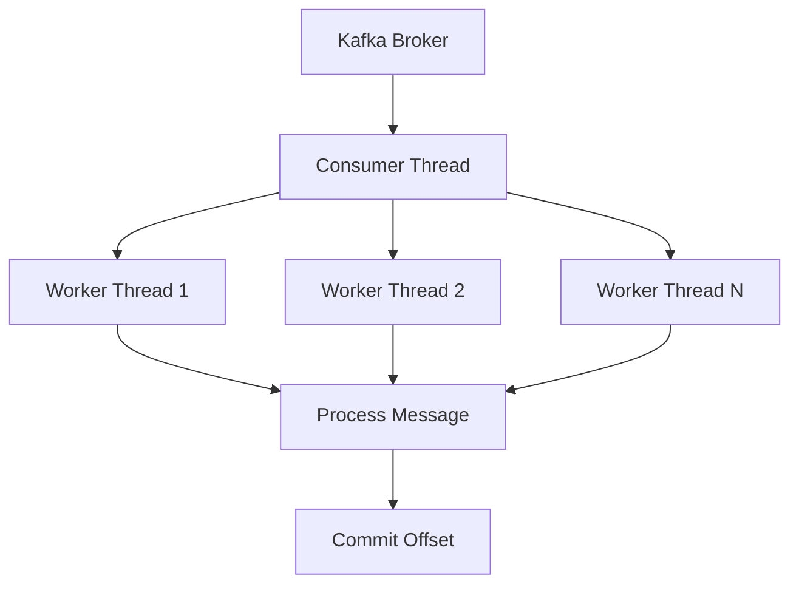

## 5.6.2 Consumer Threading Models

In the realm of Apache Kafka, efficient message consumption is paramount for maintaining high throughput and low latency in distributed systems. This section delves into the intricacies of consumer threading models, providing expert guidance on threading strategies, offset management, and concurrency challenges.

### Understanding Kafka Consumer Thread Safety

The Kafka consumer is not thread-safe, meaning that multiple threads cannot safely access a single consumer instance concurrently. This limitation necessitates careful design when implementing threading models to ensure that message processing is efficient and that concurrency does not lead to offset management issues.

#### Key Concepts

- **Single-threaded Consumer**: A straightforward approach where a single thread handles message consumption and processing. This model is simple but may not fully utilize available resources in high-throughput scenarios.
- **Multi-threaded Consumer**: Involves multiple threads to process messages concurrently, enhancing throughput but requiring careful management of thread safety and offset commits.

### Approaches to Parallel Message Processing

To leverage the full potential of Kafka, it's essential to process messages in parallel. Here are some common strategies:

#### Worker Threads

Worker threads are a popular model for parallel processing. In this approach, a single consumer thread reads messages from Kafka and dispatches them to a pool of worker threads for processing.

```java
// Java example of a worker thread model
public class KafkaConsumerWorker {
    private final KafkaConsumer<String, String> consumer;
    private final ExecutorService executor;

    public KafkaConsumerWorker(Properties props, int numWorkers) {
        this.consumer = new KafkaConsumer<>(props);
        this.executor = Executors.newFixedThreadPool(numWorkers);
    }

    public void startConsuming() {
        consumer.subscribe(Collections.singletonList("topic"));
        while (true) {
            ConsumerRecords<String, String> records = consumer.poll(Duration.ofMillis(100));
            for (ConsumerRecord<String, String> record : records) {
                executor.submit(() -> processRecord(record));
            }
        }
    }

    private void processRecord(ConsumerRecord<String, String> record) {
        // Process the record
    }
}
```

#### Thread Pools

Thread pools provide a more structured way to manage worker threads, allowing for dynamic adjustment of resources based on workload.

```scala
// Scala example using a thread pool
import java.util.concurrent.{Executors, ExecutorService}
import org.apache.kafka.clients.consumer.{KafkaConsumer, ConsumerRecords}

class KafkaConsumerThreadPool(props: java.util.Properties, numThreads: Int) {
  private val consumer = new KafkaConsumer[String, String](props)
  private val executor: ExecutorService = Executors.newFixedThreadPool(numThreads)

  def startConsuming(): Unit = {
    consumer.subscribe(java.util.Collections.singletonList("topic"))
    while (true) {
      val records: ConsumerRecords[String, String] = consumer.poll(java.time.Duration.ofMillis(100))
      records.forEach(record => executor.submit(new Runnable {
        override def run(): Unit = processRecord(record)
      }))
    }
  }

  private def processRecord(record: ConsumerRecord[String, String]): Unit = {
    // Process the record
  }
}
```

### Safely Committing Offsets in Multi-threaded Consumers

Offset management is critical in Kafka to ensure that messages are not reprocessed or lost. In a multi-threaded environment, committing offsets safely requires careful coordination.

#### Synchronous Offset Commit

One approach is to commit offsets synchronously after processing each batch of messages. This ensures that offsets are only committed once processing is complete, but it can introduce latency.

```kotlin
// Kotlin example of synchronous offset commit
fun consumeAndProcess(consumer: KafkaConsumer<String, String>) {
    consumer.subscribe(listOf("topic"))
    while (true) {
        val records = consumer.poll(Duration.ofMillis(100))
        records.forEach { record ->
            processRecord(record)
        }
        consumer.commitSync()
    }
}

fun processRecord(record: ConsumerRecord<String, String>) {
    // Process the record
}
```

#### Asynchronous Offset Commit

Asynchronous commits can improve performance by allowing processing to continue while offsets are being committed. However, this approach requires handling potential failures in offset commits.

```clojure
;; Clojure example of asynchronous offset commit
(defn consume-and-process [consumer]
  (.subscribe consumer ["topic"])
  (while true
    (let [records (.poll consumer (java.time.Duration/ofMillis 100))]
      (doseq [record records]
        (process-record record))
      (.commitAsync consumer nil))))
      
(defn process-record [record]
  ;; Process the record
  )
```

### Handling Rebalancing During Concurrent Processing

Rebalancing is a critical aspect of Kafka's consumer group mechanism, ensuring that partitions are evenly distributed among consumers. However, it can pose challenges in a multi-threaded environment, especially if rebalancing occurs during message processing.

#### Strategies to Mitigate Rebalancing Issues

- **Pause Consumption**: Temporarily pause consumption during rebalancing to prevent processing of messages that may be reassigned.
- **Graceful Shutdown**: Implement a mechanism to gracefully shut down worker threads during rebalancing, ensuring that in-flight messages are processed before rebalancing completes.

### Best Practices for Coordinating Threads and Managing Resources

To effectively manage resources and ensure efficient message processing, consider the following best practices:

- **Use Dedicated Threads**: Assign dedicated threads for consuming and processing messages to avoid contention.
- **Monitor Thread Health**: Regularly monitor the health of worker threads to detect and recover from failures.
- **Optimize Thread Pool Size**: Adjust the size of thread pools based on workload and system resources to maximize throughput.
- **Implement Backpressure**: Use backpressure mechanisms to prevent overwhelming the system with too many concurrent processing tasks.

### Visualizing Consumer Threading Models

To better understand the flow of data and threading in Kafka consumers, consider the following diagram:



**Diagram Explanation**: This diagram illustrates a typical consumer threading model where a single consumer thread reads messages from Kafka and distributes them to multiple worker threads for processing. Once processing is complete, offsets are committed.

### Conclusion

Mastering consumer threading models in Kafka is essential for building scalable and efficient data processing systems. By understanding the nuances of thread safety, parallel processing, and offset management, you can optimize your Kafka consumers for high performance and reliability.

## Test Your Knowledge: Advanced Kafka Consumer Threading Models Quiz



### What is a key consideration when using a single-threaded Kafka consumer?

- [x] Simplicity and ease of implementation
- [ ] High throughput
- [ ] Complex offset management
- [ ] Concurrent processing

> **Explanation:** A single-threaded consumer is simple to implement but may not achieve high throughput due to limited concurrency.

### How can you achieve parallel message processing in Kafka consumers?

- [x] Using worker threads
- [x] Implementing thread pools
- [ ] Increasing partition count
- [ ] Using a single-threaded model

> **Explanation:** Worker threads and thread pools allow for parallel processing, enhancing throughput.

### What is a potential drawback of synchronous offset commits?

- [x] Increased latency
- [ ] Offset loss
- [ ] Concurrent processing issues
- [ ] Thread safety problems

> **Explanation:** Synchronous commits can introduce latency as processing waits for the commit to complete.

### Why is rebalancing a challenge in multi-threaded consumers?

- [x] It can interrupt message processing
- [ ] It improves throughput
- [ ] It simplifies offset management
- [ ] It enhances thread safety

> **Explanation:** Rebalancing can interrupt processing if partitions are reassigned during message handling.

### What is a best practice for managing worker threads in Kafka consumers?

- [x] Monitor thread health
- [x] Use dedicated threads for processing
- [ ] Use a single-threaded model
- [ ] Avoid backpressure mechanisms

> **Explanation:** Monitoring thread health and using dedicated threads help maintain efficient processing.

### How can you mitigate rebalancing issues in Kafka consumers?

- [x] Pause consumption during rebalancing
- [ ] Increase partition count
- [ ] Use synchronous commits
- [ ] Avoid thread pools

> **Explanation:** Pausing consumption during rebalancing prevents processing of reassigned messages.

### What is the role of backpressure in Kafka consumer threading models?

- [x] Prevent overwhelming the system
- [ ] Increase throughput
- [ ] Simplify offset management
- [ ] Enhance thread safety

> **Explanation:** Backpressure helps manage system load by controlling the rate of message processing.

### What is a benefit of using asynchronous offset commits?

- [x] Improved performance
- [ ] Simplified offset management
- [ ] Reduced latency
- [ ] Enhanced thread safety

> **Explanation:** Asynchronous commits allow processing to continue while offsets are being committed.

### What is the primary challenge of using a multi-threaded Kafka consumer?

- [x] Managing thread safety and offset commits
- [ ] Achieving high throughput
- [ ] Implementing a single-threaded model
- [ ] Simplifying offset management

> **Explanation:** Multi-threaded consumers require careful management of thread safety and offset commits.

### True or False: Kafka consumers are thread-safe and can be accessed by multiple threads concurrently.

- [ ] True
- [x] False

> **Explanation:** Kafka consumers are not thread-safe and should not be accessed by multiple threads concurrently.


