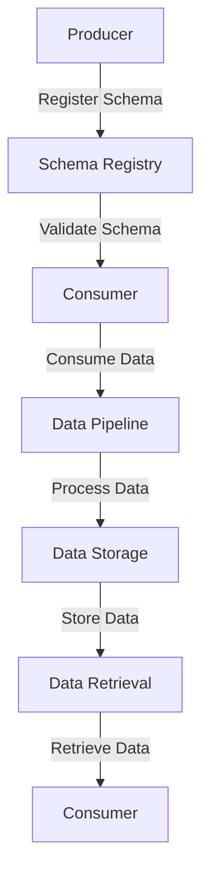

## 6.1.1 Importance of Schema Evolution

### Introduction

In the realm of distributed systems and real-time data processing, Apache Kafka stands out as a robust platform for building scalable and fault-tolerant applications. However, as systems evolve, so do the data structures they rely on. This evolution necessitates a careful approach to schema management to ensure that changes do not disrupt existing consumers and producers. This section delves into the importance of schema evolution in Kafka applications, highlighting strategies to manage changes gracefully and maintain data integrity.

### Understanding Schema Evolution

Schema evolution refers to the process of modifying the data structure or schema of a system over time while maintaining compatibility with existing data and applications. In Kafka, schemas define the structure of data being produced and consumed, typically using serialization formats like Avro, Protobuf, or JSON. As applications evolve, schemas may need to change to accommodate new requirements, such as adding new fields, modifying existing ones, or even removing obsolete fields.

#### Challenges of Schema Evolution

Managing schema evolution presents several challenges:

- **Compatibility**: Ensuring that changes to the schema do not break existing consumers or producers.
- **Data Integrity**: Maintaining the accuracy and consistency of data across different versions of the schema.
- **Versioning**: Keeping track of different schema versions and ensuring that systems can handle multiple versions simultaneously.
- **Tooling**: Utilizing tools and frameworks that support schema evolution and provide mechanisms for managing changes.

### Compatibility in Schema Evolution

Compatibility is a critical aspect of schema evolution, ensuring that changes to the schema do not disrupt existing systems. There are two primary types of compatibility to consider:

#### Forward Compatibility

Forward compatibility ensures that new consumers can read data produced by older producers. This is crucial when deploying new versions of consumers that need to process data written by older versions of producers. Forward compatibility typically involves:

- **Adding new fields**: New fields can be added with default values, allowing older data to be read by new consumers without issues.
- **Avoiding removal of fields**: Removing fields can break forward compatibility, as older data may still rely on those fields.

#### Backward Compatibility

Backward compatibility ensures that old consumers can read data produced by newer producers. This is important when deploying new versions of producers that need to write data readable by older consumers. Backward compatibility typically involves:

- **Adding new fields**: New fields can be added, but they should be optional or have default values to ensure older consumers can still process the data.
- **Avoiding changes to existing fields**: Modifying the type or meaning of existing fields can break backward compatibility.

### Impact of Schema Changes on Data Pipelines

Schema changes can have a significant impact on data pipelines, affecting data processing, storage, and retrieval. Key considerations include:

- **Data Processing**: Changes to the schema can affect how data is processed, requiring updates to processing logic to handle new or modified fields.
- **Data Storage**: Schema changes may necessitate updates to data storage systems to accommodate new fields or data types.
- **Data Retrieval**: Consumers may need to be updated to handle changes in the schema, ensuring they can retrieve and process data correctly.

### Strategies for Managing Schema Evolution

To manage schema evolution gracefully, consider the following strategies:

1. **Use a Schema Registry**: A schema registry provides a centralized repository for managing schemas and their versions. It ensures that producers and consumers use compatible schemas and facilitates schema validation and compatibility checks. See [1.3.3 Schema Registry]( "Schema Registry") for more details.

2. **Versioning Schemas**: Assign version numbers to schemas to track changes and ensure compatibility. Use semantic versioning to indicate the nature of changes (e.g., major, minor, patch).

3. **Implement Compatibility Checks**: Use tools and frameworks that support compatibility checks, ensuring that schema changes do not break existing systems.

4. **Adopt a Contract-First Approach**: Define schemas as contracts between producers and consumers, ensuring that changes are agreed upon and tested before implementation.

5. **Use Default Values**: When adding new fields, provide default values to ensure compatibility with older data.

6. **Test Schema Changes**: Thoroughly test schema changes in a staging environment before deploying them to production, ensuring that all systems can handle the changes.

### Tools and Mechanisms Supporting Schema Evolution

Several tools and mechanisms support schema evolution in Kafka applications:

- **Confluent Schema Registry**: A popular tool for managing schemas and ensuring compatibility. It provides RESTful APIs for registering and retrieving schemas and supports Avro, Protobuf, and JSON Schema formats.

- **Apache Avro**: A serialization framework that supports schema evolution by allowing schemas to be embedded with data, facilitating compatibility checks.

- **Protobuf and JSON Schema**: Other serialization formats that support schema evolution, each with its own mechanisms for managing changes and ensuring compatibility.

### Examples of Compatible and Incompatible Schema Changes

#### Compatible Schema Changes

- **Adding a New Field**: Adding a new field with a default value is a compatible change, as it does not affect existing data or consumers.

    ```java
    // Java example of adding a new field with a default value
    public class User {
        private String name;
        private int age;
        private String email = ""; // New field with default value
    }
    ```

    ```scala
    // Scala example of adding a new field with a default value
    case class User(name: String, age: Int, email: String = "")
    ```

    ```kotlin
    // Kotlin example of adding a new field with a default value
    data class User(val name: String, val age: Int, val email: String = "")
    ```

    ```clojure
    ;; Clojure example of adding a new field with a default value
    (defrecord User [name age email])
    (defn create-user [name age] (->User name age ""))
    ```

#### Incompatible Schema Changes

- **Removing a Field**: Removing a field is an incompatible change, as it can break existing consumers that rely on that field.

    ```java
    // Java example of removing a field (incompatible change)
    public class User {
        private String name;
        private int age;
        // Removed email field
    }
    ```

    ```scala
    // Scala example of removing a field (incompatible change)
    case class User(name: String, age: Int)
    ```

    ```kotlin
    // Kotlin example of removing a field (incompatible change)
    data class User(val name: String, val age: Int)
    ```

    ```clojure
    ;; Clojure example of removing a field (incompatible change)
    (defrecord User [name age])
    ```

### Visualizing Schema Evolution

To better understand schema evolution, consider the following diagram illustrating the process of managing schema changes using a schema registry:



**Diagram Description**: This diagram illustrates the flow of data and schema management in a Kafka application. The producer registers the schema with the schema registry, which validates the schema for compatibility. The consumer then consumes data, which is processed and stored in the data pipeline. Data retrieval is performed by the consumer, ensuring compatibility with the registered schema.

### Conclusion

Schema evolution is a critical aspect of managing data in Apache Kafka applications. By understanding the challenges and strategies for managing schema changes, you can ensure that your data pipelines remain robust and compatible with evolving data structures. Utilize tools like the Confluent Schema Registry and serialization frameworks like Avro to facilitate schema evolution and maintain data integrity.

### Key Takeaways

- **Schema evolution** is essential for maintaining compatibility and data integrity in evolving systems.
- **Forward and backward compatibility** are crucial for ensuring that schema changes do not disrupt existing consumers and producers.
- **Tools like the Confluent Schema Registry** provide mechanisms for managing schemas and ensuring compatibility.
- **Testing and versioning** are critical strategies for managing schema changes gracefully.

### References and Further Reading

- [Apache Kafka Documentation](https://kafka.apache.org/documentation/)
- [Confluent Documentation](https://docs.confluent.io/)
- [Avro Documentation](https://avro.apache.org/docs/current/)
- [Protobuf Documentation](https://developers.google.com/protocol-buffers/docs/overview)
- [JSON Schema Documentation](https://json-schema.org/)

## Test Your Knowledge: Mastering Schema Evolution in Apache Kafka



### What is schema evolution in the context of Apache Kafka?

- [x] The process of modifying data structures over time while maintaining compatibility.
- [ ] The process of creating new schemas for each data change.
- [ ] The process of deleting old schemas.
- [ ] The process of converting schemas to JSON format.

> **Explanation:** Schema evolution involves modifying data structures while ensuring compatibility with existing data and applications.

### Which type of compatibility ensures that new consumers can read data produced by older producers?

- [x] Forward compatibility
- [ ] Backward compatibility
- [ ] Bidirectional compatibility
- [ ] Temporal compatibility

> **Explanation:** Forward compatibility ensures that new consumers can read data produced by older producers.

### What is a common strategy for maintaining backward compatibility?

- [x] Adding new fields with default values
- [ ] Removing fields
- [ ] Changing field types
- [ ] Ignoring schema changes

> **Explanation:** Adding new fields with default values helps maintain backward compatibility by allowing older consumers to process new data.

### Which tool is commonly used to manage schemas and ensure compatibility in Kafka applications?

- [x] Confluent Schema Registry
- [ ] Apache Zookeeper
- [ ] Kafka Connect
- [ ] Kafka Streams

> **Explanation:** The Confluent Schema Registry is a popular tool for managing schemas and ensuring compatibility in Kafka applications.

### What is the impact of removing a field from a schema?

- [x] It can break existing consumers that rely on the field.
- [ ] It improves data processing speed.
- [ ] It enhances forward compatibility.
- [ ] It has no impact on data pipelines.

> **Explanation:** Removing a field can break existing consumers that rely on that field, making it an incompatible change.

### What is the benefit of using a schema registry in Kafka applications?

- [x] Centralized management of schemas and versions
- [ ] Faster data processing
- [ ] Reduced storage costs
- [ ] Increased data redundancy

> **Explanation:** A schema registry provides centralized management of schemas and their versions, ensuring compatibility and consistency.

### Which serialization framework supports schema evolution by embedding schemas with data?

- [x] Apache Avro
- [ ] JSON
- [ ] XML
- [ ] YAML

> **Explanation:** Apache Avro supports schema evolution by allowing schemas to be embedded with data, facilitating compatibility checks.

### What is a key consideration when adding a new field to a schema?

- [x] Providing a default value for the new field
- [ ] Removing existing fields
- [ ] Changing the data type of existing fields
- [ ] Ignoring backward compatibility

> **Explanation:** Providing a default value for new fields ensures compatibility with older data and consumers.

### Which of the following is an incompatible schema change?

- [x] Removing a field
- [ ] Adding a new field with a default value
- [ ] Changing a field's default value
- [ ] Adding a new optional field

> **Explanation:** Removing a field is an incompatible change, as it can break existing consumers that rely on that field.

### True or False: Schema evolution is only important for producers in Kafka applications.

- [ ] True
- [x] False

> **Explanation:** Schema evolution is important for both producers and consumers in Kafka applications to ensure compatibility and data integrity.


