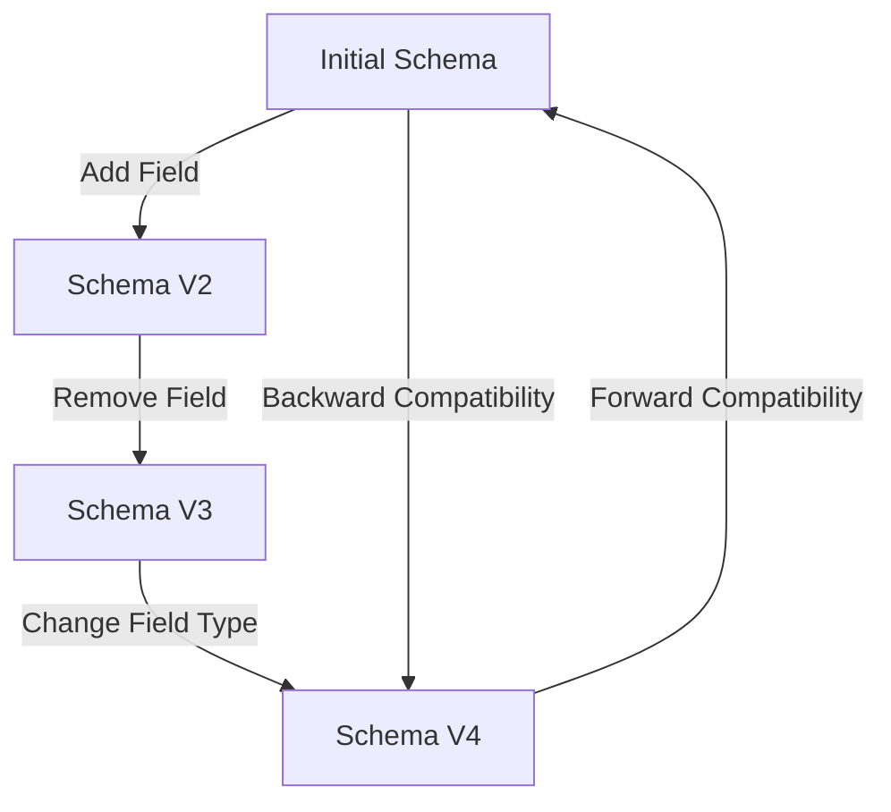

## 6.1.2 Avro Schemas

Apache Avro is a widely used serialization format and schema definition language that plays a crucial role in Kafka applications. It facilitates efficient data encoding and supports schema evolution, making it an ideal choice for real-time data processing systems. This section delves into the features and benefits of Avro, how Avro schemas are defined and used, integration with the Confluent Schema Registry, and considerations for schema evolution.

### Features and Benefits of Avro

Avro offers several advantages that make it a preferred choice for data serialization in Kafka:

- **Compact Binary Format**: Avro uses a compact binary format, which reduces the size of the data being transmitted over the network and stored in Kafka topics. This efficiency is crucial for high-throughput systems.
- **Schema Evolution**: Avro supports schema evolution, allowing producers and consumers to evolve independently. This feature is vital for maintaining compatibility in distributed systems where data structures may change over time.
- **Language Agnostic**: Avro is language agnostic, meaning it can be used with various programming languages, including Java, Scala, Kotlin, and Clojure, which are commonly used in Kafka applications.
- **Self-Describing Data**: Avro files contain the schema definition, making the data self-describing. This feature simplifies data processing and integration with other systems.
- **Integration with Schema Registry**: Avro integrates seamlessly with the Confluent Schema Registry, providing centralized schema management and ensuring compatibility across different components of a Kafka ecosystem.

### Defining and Using Avro Schemas

Avro schemas are defined using JSON, which makes them easy to read and write. A typical Avro schema consists of a name, type, and fields. Here's an example of an Avro schema for a simple user record:

```json
{
  "type": "record",
  "name": "User",
  "namespace": "com.example",
  "fields": [
    {"name": "id", "type": "string"},
    {"name": "name", "type": "string"},
    {"name": "email", "type": ["null", "string"], "default": null}
  ]
}
```

In this schema:
- The `type` is `record`, indicating that this schema defines a record structure.
- The `name` is `User`, and it belongs to the `com.example` namespace.
- The `fields` array defines the fields of the record, each with a `name` and `type`. The `email` field is a union type, allowing it to be either `null` or `string`, with a default value of `null`.

### Integration with Confluent Schema Registry

The Confluent Schema Registry provides a centralized repository for managing Avro schemas. It ensures that producers and consumers use compatible schemas, preventing data corruption and enabling seamless schema evolution. Here's how to integrate Avro with the Schema Registry:

1. **Registering a Schema**: Before producing data, register the Avro schema with the Schema Registry. This step assigns a unique ID to the schema, which is used to encode data.

2. **Producing Data**: When producing data, the Avro serializer retrieves the schema ID from the Schema Registry and encodes the data accordingly.

3. **Consuming Data**: Consumers use the schema ID to retrieve the schema from the Schema Registry and decode the data.

### Serializing and Deserializing Data with Avro

Let's explore how to serialize and deserialize data using Avro in different programming languages.

#### Java Example

```java
import org.apache.avro.Schema;
import org.apache.avro.generic.GenericData;
import org.apache.avro.generic.GenericRecord;
import org.apache.avro.io.DatumReader;
import org.apache.avro.io.DatumWriter;
import org.apache.avro.io.DecoderFactory;
import org.apache.avro.io.EncoderFactory;
import org.apache.avro.specific.SpecificDatumReader;
import org.apache.avro.specific.SpecificDatumWriter;
import org.apache.avro.util.ByteBufferOutputStream;

import java.io.ByteArrayInputStream;
import java.io.ByteArrayOutputStream;
import java.io.IOException;

public class AvroExample {
    public static void main(String[] args) throws IOException {
        // Define the schema
        String schemaString = "{"
                + "\"type\":\"record\","
                + "\"name\":\"User\","
                + "\"fields\":["
                + "{\"name\":\"id\",\"type\":\"string\"},"
                + "{\"name\":\"name\",\"type\":\"string\"},"
                + "{\"name\":\"email\",\"type\":[\"null\",\"string\"],\"default\":null}"
                + "]}";
        Schema schema = new Schema.Parser().parse(schemaString);

        // Create a record
        GenericRecord user = new GenericData.Record(schema);
        user.put("id", "1");
        user.put("name", "John Doe");
        user.put("email", "john.doe@example.com");

        // Serialize the record
        ByteArrayOutputStream outputStream = new ByteArrayOutputStream();
        DatumWriter<GenericRecord> datumWriter = new SpecificDatumWriter<>(schema);
        EncoderFactory.get().directBinaryEncoder(outputStream, null).write(datumWriter, user);

        // Deserialize the record
        ByteArrayInputStream inputStream = new ByteArrayInputStream(outputStream.toByteArray());
        DatumReader<GenericRecord> datumReader = new SpecificDatumReader<>(schema);
        GenericRecord deserializedUser = datumReader.read(null, DecoderFactory.get().binaryDecoder(inputStream, null));

        // Output the deserialized record
        System.out.println(deserializedUser);
    }
}
```

#### Scala Example

```scala
import org.apache.avro.Schema
import org.apache.avro.generic.{GenericData, GenericRecord}
import org.apache.avro.io.{DatumReader, DatumWriter, DecoderFactory, EncoderFactory}
import org.apache.avro.specific.{SpecificDatumReader, SpecificDatumWriter}

import java.io.{ByteArrayInputStream, ByteArrayOutputStream}

object AvroExample extends App {
  // Define the schema
  val schemaString =
    """
      |{
      |  "type": "record",
      |  "name": "User",
      |  "fields": [
      |    {"name": "id", "type": "string"},
      |    {"name": "name", "type": "string"},
      |    {"name": "email", "type": ["null", "string"], "default": null}
      |  ]
      |}
      |""".stripMargin
  val schema = new Schema.Parser().parse(schemaString)

  // Create a record
  val user: GenericRecord = new GenericData.Record(schema)
  user.put("id", "1")
  user.put("name", "John Doe")
  user.put("email", "john.doe@example.com")

  // Serialize the record
  val outputStream = new ByteArrayOutputStream()
  val datumWriter: DatumWriter[GenericRecord] = new SpecificDatumWriter[GenericRecord](schema)
  val encoder = EncoderFactory.get().directBinaryEncoder(outputStream, null)
  datumWriter.write(user, encoder)

  // Deserialize the record
  val inputStream = new ByteArrayInputStream(outputStream.toByteArray)
  val datumReader: DatumReader[GenericRecord] = new SpecificDatumReader[GenericRecord](schema)
  val decoder = DecoderFactory.get().binaryDecoder(inputStream, null)
  val deserializedUser = datumReader.read(null, decoder)

  // Output the deserialized record
  println(deserializedUser)
}
```

#### Kotlin Example

```kotlin
import org.apache.avro.Schema
import org.apache.avro.generic.GenericData
import org.apache.avro.generic.GenericRecord
import org.apache.avro.io.DatumReader
import org.apache.avro.io.DatumWriter
import org.apache.avro.io.DecoderFactory
import org.apache.avro.io.EncoderFactory
import org.apache.avro.specific.SpecificDatumReader
import org.apache.avro.specific.SpecificDatumWriter
import java.io.ByteArrayInputStream
import java.io.ByteArrayOutputStream

fun main() {
    // Define the schema
    val schemaString = """
        {
          "type": "record",
          "name": "User",
          "fields": [
            {"name": "id", "type": "string"},
            {"name": "name", "type": "string"},
            {"name": "email", "type": ["null", "string"], "default": null}
          ]
        }
    """.trimIndent()
    val schema = Schema.Parser().parse(schemaString)

    // Create a record
    val user: GenericRecord = GenericData.Record(schema)
    user.put("id", "1")
    user.put("name", "John Doe")
    user.put("email", "john.doe@example.com")

    // Serialize the record
    val outputStream = ByteArrayOutputStream()
    val datumWriter: DatumWriter<GenericRecord> = SpecificDatumWriter(schema)
    val encoder = EncoderFactory.get().directBinaryEncoder(outputStream, null)
    datumWriter.write(user, encoder)

    // Deserialize the record
    val inputStream = ByteArrayInputStream(outputStream.toByteArray())
    val datumReader: DatumReader<GenericRecord> = SpecificDatumReader(schema)
    val decoder = DecoderFactory.get().binaryDecoder(inputStream, null)
    val deserializedUser = datumReader.read(null, decoder)

    // Output the deserialized record
    println(deserializedUser)
}
```

#### Clojure Example

```clojure
(require '[org.apache.avro Schema]
         '[org.apache.avro.generic GenericData GenericRecord]
         '[org.apache.avro.io DatumReader DatumWriter DecoderFactory EncoderFactory]
         '[org.apache.avro.specific SpecificDatumReader SpecificDatumWriter]
         '[java.io ByteArrayInputStream ByteArrayOutputStream])

(def schema-string
  "{\"type\":\"record\", \"name\":\"User\", \"fields\":[{\"name\":\"id\",\"type\":\"string\"},{\"name\":\"name\",\"type\":\"string\"},{\"name\":\"email\",\"type\":[\"null\",\"string\"],\"default\":null}]}")

(def schema (Schema/parse schema-string))

(defn serialize [record]
  (let [output-stream (ByteArrayOutputStream.)
        datum-writer (SpecificDatumWriter. schema)
        encoder (.directBinaryEncoder (EncoderFactory/get) output-stream nil)]
    (.write datum-writer record encoder)
    (.toByteArray output-stream)))

(defn deserialize [data]
  (let [input-stream (ByteArrayInputStream. data)
        datum-reader (SpecificDatumReader. schema)
        decoder (.binaryDecoder (DecoderFactory/get) input-stream nil)]
    (.read datum-reader nil decoder)))

(def user (doto (GenericData$Record. schema)
            (.put "id" "1")
            (.put "name" "John Doe")
            (.put "email" "john.doe@example.com")))

(def serialized-data (serialize user))
(def deserialized-user (deserialize serialized-data))

(println deserialized-user)
```

### Considerations for Schema Evolution with Avro

Schema evolution is a critical aspect of managing data in Kafka applications. Avro supports several schema evolution strategies, including:

- **Backward Compatibility**: New schemas can read data written by older schemas. This strategy is useful when consumers need to process data produced by older versions.
- **Forward Compatibility**: Older schemas can read data written by newer schemas. This approach is beneficial when producers need to send data to consumers using older schema versions.
- **Full Compatibility**: New schemas can read data written by older schemas, and vice versa. This strategy ensures maximum flexibility and is often used in environments where both producers and consumers evolve independently.

When evolving schemas, consider the following:

- **Adding Fields**: New fields can be added with a default value to maintain backward compatibility.
- **Removing Fields**: Fields can be removed if they have a default value, ensuring forward compatibility.
- **Changing Field Types**: Changing field types can break compatibility. Use union types to accommodate changes.

### Visualizing Avro Schema Evolution

To better understand schema evolution, consider the following diagram illustrating the process:



**Caption**: This diagram shows the evolution of an Avro schema from the initial version to subsequent versions, highlighting backward and forward compatibility.

### Practical Applications and Real-World Scenarios

Avro schemas are widely used in various real-world scenarios, including:

- **Event-Driven Microservices**: Avro facilitates efficient communication between microservices by providing a compact and flexible serialization format. For more on event-driven microservices, refer to [1.4.1 Event-Driven Microservices]( "Event-Driven Microservices").
- **Real-Time Data Pipelines**: Avro's compact format and schema evolution capabilities make it ideal for real-time data pipelines, where data structures may change over time. See [1.4.2 Real-Time Data Pipelines]( "Real-Time Data Pipelines") for more information.
- **Big Data Integration**: Avro's integration with the Confluent Schema Registry simplifies schema management in big data environments. For more on big data integration, refer to [1.4.4 Big Data Integration]( "Big Data Integration").

### References and Links

- [Apache Avro Documentation](https://avro.apache.org/)
- [Confluent Schema Registry Documentation](https://docs.confluent.io/platform/current/schema-registry/index.html)
- [Apache Kafka Documentation](https://kafka.apache.org/documentation/)

### Knowledge Check

To reinforce your understanding of Avro schemas, consider the following questions:

## Test Your Knowledge: Avro Schemas and Kafka Integration Quiz



### What is the primary benefit of using Avro for data serialization in Kafka?

- [x] Compact binary format
- [ ] Human-readable format
- [ ] XML-based format
- [ ] Text-based format

> **Explanation:** Avro uses a compact binary format, which reduces data size and improves efficiency in Kafka applications.

### How does Avro support schema evolution?

- [x] By allowing backward and forward compatibility
- [ ] By using XML schemas
- [ ] By enforcing strict schema validation
- [ ] By using JSON schemas only

> **Explanation:** Avro supports schema evolution through backward and forward compatibility, allowing producers and consumers to evolve independently.

### Which component is essential for managing Avro schemas in a Kafka ecosystem?

- [x] Confluent Schema Registry
- [ ] Kafka Connect
- [ ] Kafka Streams
- [ ] Zookeeper

> **Explanation:** The Confluent Schema Registry provides centralized schema management, ensuring compatibility across Kafka components.

### What is a key feature of Avro that simplifies data processing?

- [x] Self-describing data
- [ ] XML-based data
- [ ] Text-based data
- [ ] CSV-based data

> **Explanation:** Avro files contain the schema definition, making the data self-describing and simplifying data processing.

### What is the default value for the "email" field in the provided Avro schema example?

- [x] null
- [ ] ""
- [ ] "unknown"
- [ ] "N/A"

> **Explanation:** The "email" field in the example schema is a union type with a default value of `null`.

### Which of the following is NOT a compatibility strategy supported by Avro?

- [ ] Backward Compatibility
- [ ] Forward Compatibility
- [ ] Full Compatibility
- [x] Strict Compatibility

> **Explanation:** Avro supports backward, forward, and full compatibility, but not strict compatibility.

### What is the purpose of the `SpecificDatumWriter` in Avro serialization?

- [x] To write data to a binary format
- [ ] To read data from a binary format
- [ ] To convert data to JSON
- [ ] To convert data to XML

> **Explanation:** `SpecificDatumWriter` is used to write data to a binary format during Avro serialization.

### How can you ensure backward compatibility when adding a new field to an Avro schema?

- [x] Add the field with a default value
- [ ] Remove an existing field
- [ ] Change the field type
- [ ] Add the field without a default value

> **Explanation:** Adding a new field with a default value ensures backward compatibility in Avro schemas.

### Which language is NOT mentioned as being compatible with Avro?

- [ ] Java
- [ ] Scala
- [ ] Kotlin
- [x] Ruby

> **Explanation:** The article mentions Java, Scala, Kotlin, and Clojure as compatible languages, but not Ruby.

### True or False: Avro schemas are defined using XML.

- [ ] True
- [x] False

> **Explanation:** Avro schemas are defined using JSON, not XML.



By mastering Avro schemas, you can efficiently manage data serialization and schema evolution in your Kafka applications, ensuring robust and scalable real-time data processing systems.
