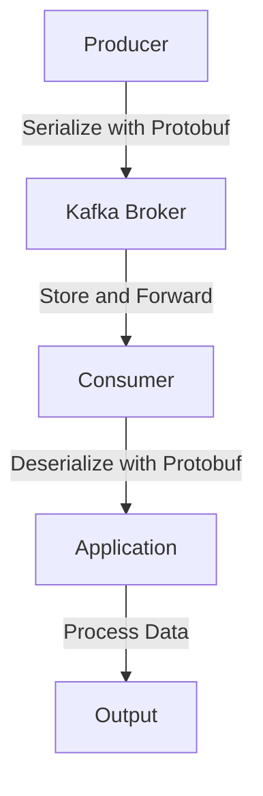

## 6.1.3 Protobuf Schemas

### Introduction to Protocol Buffers

Protocol Buffers, commonly known as Protobuf, is a language-neutral, platform-neutral, extensible mechanism for serializing structured data. Developed by Google, Protobuf is widely used for communication protocols, data storage, and more. It is particularly valued for its efficiency in both space and speed, making it an excellent choice for high-performance systems like Apache Kafka.

#### Key Features of Protobuf

- **Compact and Efficient**: Protobuf encodes data in a binary format, which is more compact than text-based formats like JSON or XML. This efficiency reduces the size of messages and speeds up serialization and deserialization processes.
- **Language Support**: Protobuf supports multiple programming languages, including Java, Scala, Kotlin, and Clojure, allowing seamless integration into diverse systems.
- **Backward and Forward Compatibility**: Protobuf supports schema evolution, enabling backward and forward compatibility, which is crucial for maintaining systems over time without breaking existing functionality.
- **Extensibility**: Protobuf allows for the addition of new fields to existing data structures without affecting existing code.

### Defining and Compiling Protobuf Schemas

To use Protobuf, you must first define your data structure in a `.proto` file. This file specifies the schema, including the data types and field numbers, which are used to encode and decode the data.

#### Example of a Protobuf Schema

```protobuf
syntax = "proto3";

package com.example.kafka;

message User {
  int32 id = 1;
  string name = 2;
  string email = 3;
}
```

In this example, the `User` message contains three fields: `id`, `name`, and `email`. Each field has a unique number, which is used in the binary encoding.

#### Compiling Protobuf Schemas

Once the schema is defined, you need to compile it into code that can be used in your application. The Protobuf compiler (`protoc`) generates source code for the specified language.

##### Compiling for Java

```bash
protoc --java_out=src/main/java/ src/main/proto/user.proto
```

This command generates Java classes from the `user.proto` file, placing them in the specified output directory.

### Integrating Protobuf with Kafka

To integrate Protobuf with Kafka, you need to use Protobuf serializers and deserializers. These components convert between Protobuf messages and Kafka's byte array format.

#### Using Protobuf with Kafka Producers and Consumers

##### Java Example

**Producer Configuration**

```java
import org.apache.kafka.clients.producer.KafkaProducer;
import org.apache.kafka.clients.producer.ProducerConfig;
import org.apache.kafka.common.serialization.StringSerializer;
import io.confluent.kafka.serializers.protobuf.KafkaProtobufSerializer;

import java.util.Properties;

Properties props = new Properties();
props.put(ProducerConfig.BOOTSTRAP_SERVERS_CONFIG, "localhost:9092");
props.put(ProducerConfig.KEY_SERIALIZER_CLASS_CONFIG, StringSerializer.class.getName());
props.put(ProducerConfig.VALUE_SERIALIZER_CLASS_CONFIG, KafkaProtobufSerializer.class.getName());

KafkaProducer<String, User> producer = new KafkaProducer<>(props);
```

**Consumer Configuration**

```java
import org.apache.kafka.clients.consumer.KafkaConsumer;
import org.apache.kafka.clients.consumer.ConsumerConfig;
import org.apache.kafka.common.serialization.StringDeserializer;
import io.confluent.kafka.serializers.protobuf.KafkaProtobufDeserializer;

Properties props = new Properties();
props.put(ConsumerConfig.BOOTSTRAP_SERVERS_CONFIG, "localhost:9092");
props.put(ConsumerConfig.GROUP_ID_CONFIG, "user-consumer-group");
props.put(ConsumerConfig.KEY_DESERIALIZER_CLASS_CONFIG, StringDeserializer.class.getName());
props.put(ConsumerConfig.VALUE_DESERIALIZER_CLASS_CONFIG, KafkaProtobufDeserializer.class.getName());

KafkaConsumer<String, User> consumer = new KafkaConsumer<>(props);
```

### Integration with Schema Registry

The [1.3.3 Schema Registry]( "Schema Registry") is a critical component for managing Protobuf schemas in Kafka. It stores schemas and provides compatibility checks to ensure that data producers and consumers are aligned.

#### Registering Protobuf Schemas

To register a Protobuf schema, you can use the Schema Registry's REST API or client libraries. This ensures that your Kafka applications can retrieve and validate schemas at runtime.

```bash
curl -X POST -H "Content-Type: application/vnd.schemaregistry.v1+json" \
--data '{"schema": "<PROTOBUF_SCHEMA>"}' \
http://localhost:8081/subjects/User-value/versions
```

### Schema Evolution and Versioning

Protobuf's support for schema evolution allows you to update your data structures without breaking existing consumers. This is achieved by following certain guidelines:

- **Adding Fields**: New fields can be added with new field numbers. Existing consumers will ignore unknown fields, maintaining backward compatibility.
- **Removing Fields**: Fields can be deprecated but should not be removed immediately to maintain compatibility.
- **Changing Field Types**: Avoid changing field types or numbers, as this can break compatibility.

#### Example of Schema Evolution

```protobuf
syntax = "proto3";

package com.example.kafka;

message User {
  int32 id = 1;
  string name = 2;
  string email = 3;
  string phone = 4; // New field added
}
```

### Practical Applications and Real-World Scenarios

Protobuf is particularly useful in scenarios where performance and efficiency are critical. For example, in a high-throughput Kafka-based data pipeline, using Protobuf can significantly reduce the size of messages, leading to faster processing and lower storage costs.

### Code Examples in Multiple Languages

#### Scala Example

**Producer Configuration**

```scala
import org.apache.kafka.clients.producer.{KafkaProducer, ProducerConfig}
import org.apache.kafka.common.serialization.StringSerializer
import io.confluent.kafka.serializers.protobuf.KafkaProtobufSerializer

val props = new java.util.Properties()
props.put(ProducerConfig.BOOTSTRAP_SERVERS_CONFIG, "localhost:9092")
props.put(ProducerConfig.KEY_SERIALIZER_CLASS_CONFIG, classOf[StringSerializer].getName)
props.put(ProducerConfig.VALUE_SERIALIZER_CLASS_CONFIG, classOf[KafkaProtobufSerializer[User]].getName)

val producer = new KafkaProducer[String, User](props)
```

**Consumer Configuration**

```scala
import org.apache.kafka.clients.consumer.{KafkaConsumer, ConsumerConfig}
import org.apache.kafka.common.serialization.StringDeserializer
import io.confluent.kafka.serializers.protobuf.KafkaProtobufDeserializer

val props = new java.util.Properties()
props.put(ConsumerConfig.BOOTSTRAP_SERVERS_CONFIG, "localhost:9092")
props.put(ConsumerConfig.GROUP_ID_CONFIG, "user-consumer-group")
props.put(ConsumerConfig.KEY_DESERIALIZER_CLASS_CONFIG, classOf[StringDeserializer].getName)
props.put(ConsumerConfig.VALUE_DESERIALIZER_CLASS_CONFIG, classOf[KafkaProtobufDeserializer[User]].getName)

val consumer = new KafkaConsumer[String, User](props)
```

#### Kotlin Example

**Producer Configuration**

```kotlin
import org.apache.kafka.clients.producer.KafkaProducer
import org.apache.kafka.clients.producer.ProducerConfig
import org.apache.kafka.common.serialization.StringSerializer
import io.confluent.kafka.serializers.protobuf.KafkaProtobufSerializer

val props = Properties().apply {
    put(ProducerConfig.BOOTSTRAP_SERVERS_CONFIG, "localhost:9092")
    put(ProducerConfig.KEY_SERIALIZER_CLASS_CONFIG, StringSerializer::class.java.name)
    put(ProducerConfig.VALUE_SERIALIZER_CLASS_CONFIG, KafkaProtobufSerializer::class.java.name)
}

val producer = KafkaProducer<String, User>(props)
```

**Consumer Configuration**

```kotlin
import org.apache.kafka.clients.consumer.KafkaConsumer
import org.apache.kafka.clients.consumer.ConsumerConfig
import org.apache.kafka.common.serialization.StringDeserializer
import io.confluent.kafka.serializers.protobuf.KafkaProtobufDeserializer

val props = Properties().apply {
    put(ConsumerConfig.BOOTSTRAP_SERVERS_CONFIG, "localhost:9092")
    put(ConsumerConfig.GROUP_ID_CONFIG, "user-consumer-group")
    put(ConsumerConfig.KEY_DESERIALIZER_CLASS_CONFIG, StringDeserializer::class.java.name)
    put(ConsumerConfig.VALUE_DESERIALIZER_CLASS_CONFIG, KafkaProtobufDeserializer::class.java.name)
}

val consumer = KafkaConsumer<String, User>(props)
```

#### Clojure Example

**Producer Configuration**

```clojure
(require '[org.apache.kafka.clients.producer.KafkaProducer]
         '[org.apache.kafka.clients.producer.ProducerConfig]
         '[org.apache.kafka.common.serialization.StringSerializer]
         '[io.confluent.kafka.serializers.protobuf.KafkaProtobufSerializer])

(def props
  (doto (java.util.Properties.)
    (.put ProducerConfig/BOOTSTRAP_SERVERS_CONFIG "localhost:9092")
    (.put ProducerConfig/KEY_SERIALIZER_CLASS_CONFIG StringSerializer)
    (.put ProducerConfig/VALUE_SERIALIZER_CLASS_CONFIG KafkaProtobufSerializer)))

(def producer (KafkaProducer. props))
```

**Consumer Configuration**

```clojure
(require '[org.apache.kafka.clients.consumer.KafkaConsumer]
         '[org.apache.kafka.clients.consumer.ConsumerConfig]
         '[org.apache.kafka.common.serialization.StringDeserializer]
         '[io.confluent.kafka.serializers.protobuf.KafkaProtobufDeserializer])

(def props
  (doto (java.util.Properties.)
    (.put ConsumerConfig/BOOTSTRAP_SERVERS_CONFIG "localhost:9092")
    (.put ConsumerConfig/GROUP_ID_CONFIG "user-consumer-group")
    (.put ConsumerConfig/KEY_DESERIALIZER_CLASS_CONFIG StringDeserializer)
    (.put ConsumerConfig/VALUE_DESERIALIZER_CLASS_CONFIG KafkaProtobufDeserializer)))

(def consumer (KafkaConsumer. props))
```

### Visualizing Protobuf Integration with Kafka



**Diagram Explanation**: This diagram illustrates the flow of data from a producer to a consumer in a Kafka system using Protobuf for serialization and deserialization. The producer serializes data with Protobuf before sending it to the Kafka broker. The consumer retrieves the data, deserializes it using Protobuf, and processes it in the application.

### Best Practices for Using Protobuf with Kafka

- **Schema Management**: Use the Schema Registry to manage Protobuf schemas, ensuring compatibility and version control.
- **Performance Optimization**: Leverage Protobuf's compact binary format to optimize performance in high-throughput environments.
- **Schema Evolution**: Plan for schema evolution by following Protobuf's guidelines for adding and deprecating fields.
- **Testing and Validation**: Regularly test and validate schemas to prevent compatibility issues.

### Knowledge Check

- **Question**: What are the advantages of using Protobuf over JSON for Kafka message serialization?
- **Question**: How does Protobuf ensure backward and forward compatibility?
- **Question**: What role does the Schema Registry play in managing Protobuf schemas?

### Conclusion

Protobuf is a powerful tool for efficient data serialization in Kafka systems. Its compact format, language support, and schema evolution capabilities make it an ideal choice for high-performance, scalable applications. By integrating Protobuf with Kafka and the Schema Registry, you can build robust, future-proof data pipelines.

For more information on Protocol Buffers, visit the [Protocol Buffers documentation](https://developers.google.com/protocol-buffers).

## Test Your Knowledge: Protobuf Schemas and Kafka Integration Quiz



### What is a key advantage of using Protobuf for Kafka message serialization?

- [x] Compact binary format
- [ ] Human-readable format
- [ ] Requires no schema definition
- [ ] Limited language support

> **Explanation:** Protobuf's compact binary format reduces message size and improves serialization speed, making it ideal for high-performance systems.

### How does Protobuf handle schema evolution?

- [x] By allowing new fields with unique numbers
- [ ] By removing old fields automatically
- [ ] By changing field types freely
- [ ] By ignoring unknown fields

> **Explanation:** Protobuf allows new fields to be added with unique numbers, and unknown fields are ignored by existing consumers, ensuring compatibility.

### What is the purpose of the Schema Registry in Kafka?

- [x] To manage and validate schemas
- [ ] To store Kafka messages
- [ ] To serialize data
- [ ] To provide network security

> **Explanation:** The Schema Registry manages and validates schemas, ensuring that producers and consumers are compatible.

### Which command is used to compile a Protobuf schema for Java?

- [x] `protoc --java_out=src/main/java/ src/main/proto/user.proto`
- [ ] `javac user.proto`
- [ ] `protobufc user.proto`
- [ ] `compile-proto user.proto`

> **Explanation:** The `protoc` command with `--java_out` option compiles a Protobuf schema into Java classes.

### What is a common practice when evolving Protobuf schemas?

- [x] Adding new fields with new numbers
- [ ] Changing existing field types
- [ ] Removing fields immediately
- [ ] Ignoring schema changes

> **Explanation:** Adding new fields with new numbers ensures backward compatibility, as existing consumers will ignore unknown fields.

### Which language is NOT supported by Protobuf?

- [ ] Java
- [ ] Scala
- [ ] Kotlin
- [x] HTML

> **Explanation:** Protobuf supports multiple programming languages like Java, Scala, and Kotlin, but not HTML, which is a markup language.

### What is the role of field numbers in Protobuf schemas?

- [x] They are used for encoding and decoding data
- [ ] They determine the order of fields
- [ ] They specify data types
- [ ] They are optional

> **Explanation:** Field numbers are crucial in Protobuf for encoding and decoding data, ensuring each field is uniquely identified.

### How does Protobuf improve performance in Kafka systems?

- [x] By reducing message size
- [ ] By increasing message size
- [ ] By using text-based format
- [ ] By requiring more processing power

> **Explanation:** Protobuf's binary format reduces message size, leading to faster processing and lower storage costs.

### What should be avoided when evolving Protobuf schemas?

- [x] Changing field types
- [ ] Adding new fields
- [ ] Deprecating fields
- [ ] Ignoring unknown fields

> **Explanation:** Changing field types can break compatibility, so it should be avoided when evolving Protobuf schemas.

### True or False: Protobuf schemas can be registered with the Schema Registry using a REST API.

- [x] True
- [ ] False

> **Explanation:** Protobuf schemas can be registered with the Schema Registry using its REST API, allowing for centralized schema management.


