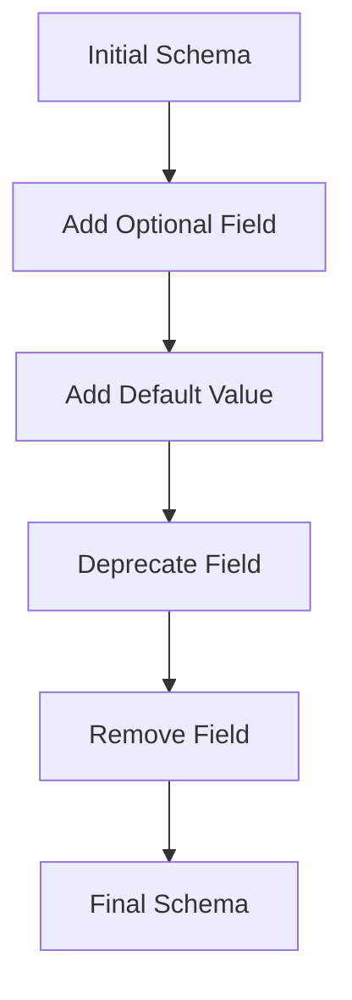

## 6.1.7 Best Practices for Schema Design

Designing efficient and robust schemas is a cornerstone of building scalable and maintainable Kafka applications. A well-structured schema not only ensures data integrity and consistency but also facilitates seamless data evolution and integration across distributed systems. This section delves into the best practices for schema design in Kafka, emphasizing the importance of clear naming conventions, schema organization, documentation, handling optional fields, and ensuring compatibility.

### Importance of Clear and Consistent Naming Conventions

**Naming conventions** play a critical role in schema design, as they provide clarity and consistency across data models. Adopting a standardized naming strategy helps developers and data engineers understand the data structure and its purpose, reducing the likelihood of errors and misinterpretations.

#### Guidelines for Naming Conventions

1. **Use Descriptive Names**: Ensure that field names are descriptive and convey the purpose or content of the field. Avoid abbreviations that may not be universally understood.

2. **Consistency Across Schemas**: Maintain consistency in naming conventions across different schemas. For example, if you use camelCase for field names in one schema, apply the same convention across all schemas.

3. **Avoid Reserved Keywords**: Be cautious of using reserved keywords from languages or systems that might interact with your Kafka data, such as SQL or JSON.

4. **Versioning in Names**: When necessary, include versioning in schema names to indicate major changes, e.g., `UserV1`, `UserV2`.

### Strategies for Organizing Schemas and Namespaces

**Organizing schemas** effectively is crucial for managing large-scale Kafka deployments. Proper organization aids in schema discovery, reuse, and governance.

#### Schema Organization Techniques

1. **Namespace Utilization**: Use namespaces to logically group related schemas. This can be based on business domains, microservices, or data types.

2. **Hierarchical Structuring**: Implement a hierarchical structure for schemas, where complex types are broken down into reusable components. This promotes reusability and simplifies schema management.

3. **Schema Registry**: Leverage a [Schema Registry]( "Schema Registry") to store and manage schemas centrally. This ensures that all producers and consumers adhere to the same schema definitions.

### Documentation Practices for Schemas

Comprehensive **documentation** is essential for maintaining and evolving schemas over time. It serves as a reference for developers and data engineers, ensuring that everyone understands the schema's structure and intent.

#### Effective Documentation Strategies

1. **Inline Comments**: Include comments within the schema definition to explain the purpose of fields and any constraints or special considerations.

2. **Schema Evolution Notes**: Document changes made to schemas over time, including the rationale for changes and any impact on backward or forward compatibility.

3. **External Documentation**: Maintain external documentation that provides an overview of the schema, its use cases, and examples of data conforming to the schema.

### Handling Optional Fields and Defaults

**Optional fields** and default values are powerful tools in schema design, allowing for flexibility and evolution without breaking existing consumers.

#### Best Practices for Optional Fields

1. **Use Defaults Wisely**: Define default values for optional fields to ensure that consumers can handle missing data gracefully.

2. **Minimize Optional Fields**: While optional fields provide flexibility, excessive use can lead to complexity. Use them judiciously and ensure that their absence does not lead to ambiguous data interpretation.

3. **Document Optionality**: Clearly document which fields are optional and the implications of their absence.

### Ensuring Backward and Forward Compatibility

**Compatibility** is a critical aspect of schema design, especially in distributed systems where producers and consumers may not be updated simultaneously.

#### Strategies for Compatibility

1. **Backward Compatibility**: Ensure that new schema versions can be read by older consumers. This typically involves adding new fields as optional with default values.

2. **Forward Compatibility**: Design schemas so that older versions can be read by newer consumers. This often requires avoiding the removal of fields or changing field types.

3. **Schema Evolution Testing**: Regularly test schema changes to ensure compatibility. Use tools and frameworks that simulate different producer and consumer versions interacting with the schema.

### Examples of Well-Designed Schemas

Below are examples of well-designed schemas in various languages, demonstrating the application of best practices discussed.

#### Java Example

```java
// User schema in Java with clear naming and optional fields
public class User {
    private String userId; // Unique identifier for the user
    private String userName; // Name of the user
    private Optional<String> email = Optional.empty(); // Optional email address
    private int age = 0; // Default age
}
```

#### Scala Example

```scala
// User schema in Scala with clear naming and optional fields
case class User(
    userId: String, // Unique identifier for the user
    userName: String, // Name of the user
    email: Option[String] = None, // Optional email address
    age: Int = 0 // Default age
)
```

#### Kotlin Example

```kotlin
// User schema in Kotlin with clear naming and optional fields
data class User(
    val userId: String, // Unique identifier for the user
    val userName: String, // Name of the user
    val email: String? = null, // Optional email address
    val age: Int = 0 // Default age
)
```

#### Clojure Example

```clojure
;; User schema in Clojure with clear naming and optional fields
(defrecord User [userId userName email age])

(defn create-user
  [userId userName & {:keys [email age] :or {email nil age 0}}]
  (->User userId userName email age))
```

### Visualizing Schema Design

To further illustrate the concepts, consider the following diagram that depicts a typical schema evolution process:



**Caption**: This diagram illustrates the typical stages of schema evolution, highlighting the importance of optional fields and default values in maintaining compatibility.

### References and Links

- [Apache Kafka Documentation](https://kafka.apache.org/documentation/)
- [Confluent Documentation](https://docs.confluent.io/)
- [1.3.3 Schema Registry]( "Schema Registry")

### Knowledge Check

To reinforce your understanding of schema design best practices, consider the following questions and challenges.

## Test Your Knowledge: Schema Design Best Practices Quiz



### What is the primary benefit of using clear and consistent naming conventions in schema design?

- [x] They enhance readability and reduce errors.
- [ ] They increase data processing speed.
- [ ] They simplify schema evolution.
- [ ] They ensure data security.

> **Explanation:** Clear and consistent naming conventions improve readability and understanding, reducing the likelihood of errors in data handling.

### Which strategy is recommended for organizing schemas in a large-scale Kafka deployment?

- [x] Use namespaces to group related schemas.
- [ ] Store all schemas in a single file.
- [ ] Avoid using namespaces for simplicity.
- [ ] Use random naming for schemas.

> **Explanation:** Using namespaces helps logically group related schemas, making them easier to manage and discover.

### How can optional fields be effectively managed in a schema?

- [x] Define default values for optional fields.
- [ ] Avoid using optional fields altogether.
- [ ] Make all fields optional.
- [ ] Use optional fields without defaults.

> **Explanation:** Defining default values for optional fields ensures that consumers can handle missing data gracefully.

### What is a key consideration for ensuring backward compatibility in schema design?

- [x] Add new fields as optional with default values.
- [ ] Remove unused fields.
- [ ] Change field types frequently.
- [ ] Avoid testing schema changes.

> **Explanation:** Adding new fields as optional with default values ensures that older consumers can still read the data.

### Which of the following is a best practice for documenting schemas?

- [x] Include inline comments and external documentation.
- [ ] Rely solely on external documentation.
- [ ] Avoid documenting schemas to save time.
- [ ] Use only inline comments.

> **Explanation:** Combining inline comments with external documentation provides a comprehensive understanding of the schema.

### What is the impact of not maintaining schema compatibility?

- [x] It can lead to data processing errors.
- [ ] It improves data security.
- [ ] It simplifies schema management.
- [ ] It enhances system performance.

> **Explanation:** Lack of schema compatibility can result in data processing errors and disrupt communication between producers and consumers.

### How can schema evolution be effectively managed?

- [x] Regularly test schema changes for compatibility.
- [ ] Avoid changing schemas once deployed.
- [ ] Change schemas frequently without testing.
- [ ] Use a single schema version for all data.

> **Explanation:** Regular testing of schema changes ensures compatibility and smooth evolution.

### What is a benefit of using a Schema Registry?

- [x] It centralizes schema management and ensures consistency.
- [ ] It increases data processing speed.
- [ ] It eliminates the need for schema documentation.
- [ ] It simplifies schema versioning.

> **Explanation:** A Schema Registry centralizes schema management, ensuring consistency across producers and consumers.

### Which language feature is commonly used to handle optional fields in schemas?

- [x] Optional types or nullable types.
- [ ] Arrays.
- [ ] Loops.
- [ ] Constants.

> **Explanation:** Optional or nullable types are used to represent fields that may or may not have a value.

### True or False: Backward compatibility ensures that new schema versions can be read by older consumers.

- [x] True
- [ ] False

> **Explanation:** Backward compatibility allows older consumers to read data produced with new schema versions.



By adhering to these best practices, you can design schemas that are robust, flexible, and maintainable, ensuring the long-term success of your Kafka applications.
