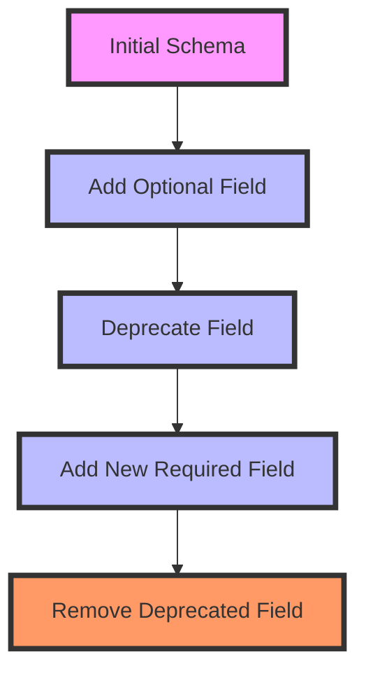

## 6.1 Schema Design Strategies

### Introduction

In the realm of Apache Kafka, schema design is a cornerstone for building robust, scalable, and maintainable data systems. A well-thought-out schema design not only ensures data integrity and compatibility but also facilitates seamless integration and evolution of data models over time. This section delves into the critical aspects of schema design, focusing on the challenges of schema evolution, the comparison of serialization formats, and best practices for schema management.

### Importance of Schema Design in Kafka-Based Systems

Schema design in Kafka-based systems is crucial for several reasons:

- **Data Integrity**: Ensures that data is consistently structured and validated across producers and consumers.
- **Interoperability**: Facilitates communication between different systems and applications by providing a common data format.
- **Evolution and Compatibility**: Supports the evolution of data models without breaking existing applications.
- **Performance Optimization**: Efficient serialization and deserialization can significantly impact system performance.

### Challenges of Schema Evolution in Distributed Environments

Schema evolution refers to the ability to modify the schema of data over time without disrupting the systems that consume the data. In distributed environments like Kafka, schema evolution presents several challenges:

- **Backward and Forward Compatibility**: Ensuring that new schema versions can coexist with older versions without causing data processing errors.
- **Version Management**: Keeping track of schema versions and changes to prevent conflicts and ensure consistency.
- **Data Migration**: Handling the migration of existing data to new schema versions without data loss or corruption.

### Serialization Formats: Avro, Protobuf, JSON, Thrift

Choosing the right serialization format is a critical decision in schema design. Each format has its strengths and weaknesses, and the choice depends on the specific requirements of your system.

#### Avro

- **Description**: Avro is a binary serialization format that is compact and efficient. It supports schema evolution and is widely used in Kafka applications.
- **Advantages**:
  - Compact binary format reduces storage and bandwidth usage.
  - Strong schema evolution support with backward and forward compatibility.
  - Native support in Kafka through the [Schema Registry]( "Schema Registry").
- **Disadvantages**:
  - Requires a schema definition for both serialization and deserialization.
  - Less human-readable compared to JSON.

#### Protobuf

- **Description**: Protocol Buffers (Protobuf) is a language-neutral, platform-neutral extensible mechanism for serializing structured data.
- **Advantages**:
  - Efficient binary format with small message sizes.
  - Strong support for schema evolution with optional and repeated fields.
  - Language-neutral, with support for multiple programming languages.
- **Disadvantages**:
  - Requires a schema definition and code generation for each language.
  - More complex setup compared to JSON.

#### JSON

- **Description**: JSON (JavaScript Object Notation) is a lightweight, text-based format that is easy to read and write.
- **Advantages**:
  - Human-readable and easy to debug.
  - No need for a predefined schema, allowing for flexible data structures.
- **Disadvantages**:
  - Larger message sizes compared to binary formats.
  - Lack of built-in schema evolution support, leading to potential compatibility issues.

#### Thrift

- **Description**: Apache Thrift is a software framework for scalable cross-language services development, combining a software stack with a code generation engine.
- **Advantages**:
  - Supports multiple languages and platforms.
  - Efficient binary serialization with support for complex data types.
- **Disadvantages**:
  - Requires a schema definition and code generation.
  - More complex setup and maintenance compared to JSON.

### Guidelines for Choosing the Appropriate Serialization Format

When selecting a serialization format for your Kafka-based system, consider the following guidelines:

- **Data Volume and Performance**: For high-volume data streams, choose a compact binary format like Avro or Protobuf to minimize storage and bandwidth usage.
- **Schema Evolution Needs**: If schema evolution is a priority, Avro and Protobuf offer strong support for backward and forward compatibility.
- **Human Readability and Debugging**: For systems where human readability is important, JSON is a suitable choice despite its larger size.
- **Language and Platform Support**: Consider the programming languages and platforms used in your system. Protobuf and Thrift offer broad language support, while Avro is well-integrated with Kafka.

### Best Practices for Schema Design

#### Versioning and Compatibility

- **Use Semantic Versioning**: Adopt semantic versioning for schema changes to clearly communicate the nature of changes (e.g., major, minor, patch).
- **Ensure Backward Compatibility**: Design schemas to be backward compatible, allowing new consumers to read data produced by older producers.
- **Document Schema Changes**: Maintain comprehensive documentation of schema changes to facilitate understanding and troubleshooting.

#### Schema Documentation

- **Include Field Descriptions**: Provide clear descriptions for each field in the schema to ensure consistent understanding across teams.
- **Use Examples**: Include example data for each schema version to illustrate expected data structures and formats.

#### Schema Registry and Management

- **Leverage Schema Registry**: Use a schema registry to manage and enforce schemas across producers and consumers, ensuring consistency and compatibility.
- **Automate Schema Validation**: Implement automated schema validation in your CI/CD pipelines to catch compatibility issues early in the development process.

### Code Examples

Below are code examples demonstrating schema design and serialization in different languages.

#### Java Example with Avro

```java
// Define an Avro schema
String userSchema = "{"
    + "\"type\":\"record\","
    + "\"name\":\"User\","
    + "\"fields\":["
    + "  {\"name\":\"name\",\"type\":\"string\"},"
    + "  {\"name\":\"age\",\"type\":\"int\"}"
    + "]}";

// Create a schema object
Schema.Parser parser = new Schema.Parser();
Schema schema = parser.parse(userSchema);

// Serialize data using Avro
GenericRecord user = new GenericData.Record(schema);
user.put("name", "Alice");
user.put("age", 30);

ByteArrayOutputStream out = new ByteArrayOutputStream();
DatumWriter<GenericRecord> writer = new GenericDatumWriter<>(schema);
BinaryEncoder encoder = EncoderFactory.get().binaryEncoder(out, null);
writer.write(user, encoder);
encoder.flush();
out.close();

// Deserialize data using Avro
DatumReader<GenericRecord> reader = new GenericDatumReader<>(schema);
BinaryDecoder decoder = DecoderFactory.get().binaryDecoder(out.toByteArray(), null);
GenericRecord result = reader.read(null, decoder);

System.out.println("Deserialized user: " + result);
```

#### Scala Example with Protobuf

```scala
// Define a Protobuf message
syntax = "proto3";

message User {
  string name = 1;
  int32 age = 2;
}

// Serialize data using Protobuf
val user = User.newBuilder().setName("Alice").setAge(30).build()
val outputStream = new ByteArrayOutputStream()
user.writeTo(outputStream)

// Deserialize data using Protobuf
val inputStream = new ByteArrayInputStream(outputStream.toByteArray)
val deserializedUser = User.parseFrom(inputStream)

println(s"Deserialized user: ${deserializedUser.getName}, ${deserializedUser.getAge}")
```

#### Kotlin Example with JSON

```kotlin
import com.fasterxml.jackson.module.kotlin.jacksonObjectMapper
import com.fasterxml.jackson.module.kotlin.readValue

data class User(val name: String, val age: Int)

fun main() {
    val mapper = jacksonObjectMapper()

    // Serialize data using JSON
    val user = User("Alice", 30)
    val jsonString = mapper.writeValueAsString(user)
    println("Serialized JSON: $jsonString")

    // Deserialize data using JSON
    val deserializedUser: User = mapper.readValue(jsonString)
    println("Deserialized user: ${deserializedUser.name}, ${deserializedUser.age}")
}
```

#### Clojure Example with Thrift

```clojure
(ns thrift-example.core
  (:import [org.apache.thrift.protocol TBinaryProtocol]
           [org.apache.thrift.transport TMemoryBuffer]
           [example User]))

(defn serialize-user [user]
  (let [buffer (TMemoryBuffer. 512)
        protocol (TBinaryProtocol. buffer)]
    (.write user protocol)
    (.getArray buffer)))

(defn deserialize-user [bytes]
  (let [buffer (TMemoryBuffer. bytes)
        protocol (TBinaryProtocol. buffer)
        user (User.)]
    (.read user protocol)
    user))

;; Example usage
(let [user (User. "Alice" 30)
      serialized (serialize-user user)
      deserialized (deserialize-user serialized)]
  (println "Deserialized user:" (.getName deserialized) (.getAge deserialized)))
```

### Visualizing Schema Evolution

To better understand schema evolution, consider the following diagram illustrating the process of evolving a schema while maintaining compatibility.



**Caption**: This diagram illustrates a typical schema evolution process, highlighting the addition of optional fields, deprecation, and eventual removal of fields.

### Conclusion

Effective schema design is a critical component of building scalable and maintainable Kafka-based systems. By carefully selecting serialization formats, managing schema evolution, and adhering to best practices, you can ensure data integrity, compatibility, and performance across your distributed applications.

## Test Your Knowledge: Advanced Schema Design Strategies Quiz



### Why is schema design critical in Kafka-based systems?

- [x] It ensures data integrity and compatibility.
- [ ] It reduces the need for data serialization.
- [ ] It eliminates the need for data validation.
- [ ] It simplifies the Kafka configuration.

> **Explanation:** Schema design is crucial for ensuring data integrity and compatibility across producers and consumers in a Kafka-based system.

### What is a major challenge of schema evolution in distributed environments?

- [x] Ensuring backward and forward compatibility.
- [ ] Reducing data storage costs.
- [ ] Increasing data throughput.
- [ ] Simplifying data serialization.

> **Explanation:** Schema evolution in distributed environments must ensure backward and forward compatibility to prevent data processing errors.

### Which serialization format is known for its human readability?

- [ ] Avro
- [ ] Protobuf
- [x] JSON
- [ ] Thrift

> **Explanation:** JSON is a text-based format that is human-readable and easy to debug.

### What is a key advantage of using Avro in Kafka applications?

- [x] Strong schema evolution support.
- [ ] No need for schema definition.
- [ ] Larger message sizes.
- [ ] Limited language support.

> **Explanation:** Avro offers strong schema evolution support, making it ideal for Kafka applications that require backward and forward compatibility.

### Which serialization format requires code generation for each language?

- [ ] JSON
- [x] Protobuf
- [ ] Avro
- [ ] CSV

> **Explanation:** Protobuf requires code generation for each language to serialize and deserialize data.

### What is a best practice for schema versioning?

- [x] Use semantic versioning.
- [ ] Avoid documenting schema changes.
- [ ] Use random version numbers.
- [ ] Change schema without versioning.

> **Explanation:** Semantic versioning helps communicate the nature of schema changes clearly.

### Which tool can be used to manage and enforce schemas in Kafka?

- [x] Schema Registry
- [ ] Kafka Connect
- [ ] Zookeeper
- [ ] Kafka Streams

> **Explanation:** Schema Registry is used to manage and enforce schemas across producers and consumers in Kafka.

### What is a disadvantage of using JSON as a serialization format?

- [ ] Lack of human readability.
- [x] Larger message sizes.
- [ ] Limited language support.
- [ ] Complex setup.

> **Explanation:** JSON typically results in larger message sizes compared to binary formats like Avro and Protobuf.

### Which serialization format is known for its efficient binary serialization?

- [ ] JSON
- [x] Thrift
- [ ] XML
- [ ] YAML

> **Explanation:** Thrift is known for its efficient binary serialization and support for complex data types.

### True or False: Schema evolution is only necessary when adding new fields to a schema.

- [ ] True
- [x] False

> **Explanation:** Schema evolution is necessary for any changes to a schema, including adding, removing, or modifying fields, to ensure compatibility.


