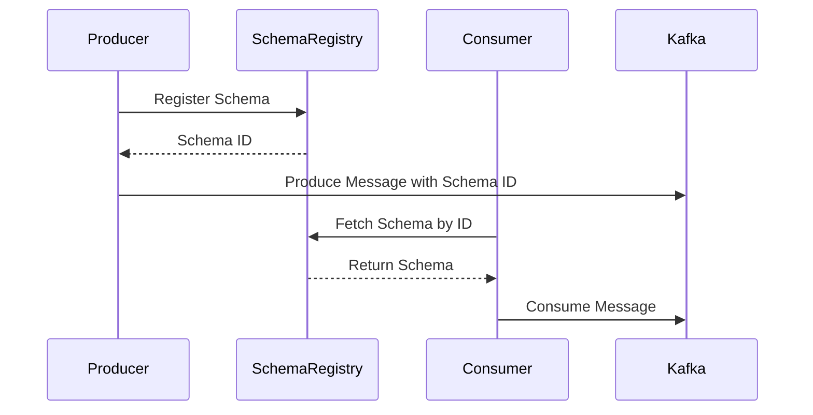

## 6.2.1 Schema Management and Governance

In the realm of distributed systems and real-time data processing, maintaining data quality and consistency is paramount. Apache Kafka, as a distributed streaming platform, relies heavily on structured data to ensure seamless communication between producers and consumers. This is where schema management and governance come into play, serving as the backbone for data integrity and interoperability across Kafka applications.

### The Role of Schema Registry in Kafka

The [Confluent Schema Registry]( "Schema Registry") is a critical component in the Kafka ecosystem, providing a centralized repository for managing schemas. It supports Avro, Protobuf, and JSON Schema formats, enabling producers and consumers to serialize and deserialize data efficiently.

#### Key Features of Schema Registry

- **Centralized Schema Storage**: The Schema Registry stores schemas for Kafka topics, ensuring that all applications use consistent data structures.
- **Schema Versioning**: It supports schema evolution, allowing schemas to change over time without breaking existing applications.
- **Compatibility Checks**: The registry enforces compatibility rules, preventing incompatible schema changes that could disrupt data processing.
- **RESTful Interface**: Provides a RESTful API for managing schemas, making it easy to integrate with various tools and applications.

### Importance of Schema Management and Governance

Schema management and governance are essential for maintaining data quality and consistency across Kafka applications. They ensure that data producers and consumers adhere to agreed-upon data structures, reducing the risk of data corruption and processing errors.

#### Benefits of Effective Schema Management

- **Data Consistency**: Ensures that all applications use the same data format, reducing discrepancies and errors.
- **Interoperability**: Facilitates seamless communication between different systems and applications.
- **Data Quality**: Enforces data validation rules, ensuring that only valid data is processed.
- **Change Management**: Provides a structured approach to managing schema changes, minimizing disruptions.

### Policies for Schema Evolution and Versioning

Schema evolution is a critical aspect of schema management, allowing data structures to change over time without breaking existing applications. The Schema Registry supports several compatibility modes to facilitate schema evolution:

- **Backward Compatibility**: New schemas can read data produced by older schemas.
- **Forward Compatibility**: Older schemas can read data produced by newer schemas.
- **Full Compatibility**: Ensures both backward and forward compatibility.

#### Strategies for Managing Schema Evolution

1. **Define Compatibility Rules**: Establish clear rules for schema changes, ensuring that they do not break existing applications.
2. **Versioning Schemas**: Use version numbers to track schema changes, making it easier to manage and roll back changes if necessary.
3. **Automated Testing**: Implement automated tests to verify schema compatibility and detect potential issues early.

### Collaborative Schema Development

Collaborative schema development involves multiple stakeholders working together to define and manage schemas. This approach ensures that schemas meet the needs of all applications and systems that use them.

#### Best Practices for Collaborative Schema Development

- **Stakeholder Involvement**: Involve all relevant stakeholders in the schema design process to ensure that all requirements are considered.
- **Schema Review Process**: Implement a formal review process for schema changes, ensuring that they are thoroughly vetted before implementation.
- **Documentation**: Maintain comprehensive documentation for all schemas, including their purpose, structure, and version history.

### Tools and Practices for Enforcing Governance

Effective schema governance requires a combination of tools and practices to ensure compliance with established policies and procedures.

#### Key Tools for Schema Governance

- **Schema Registry**: As the central repository for schemas, the Schema Registry plays a crucial role in enforcing governance policies.
- **CI/CD Pipelines**: Integrate schema validation and compatibility checks into CI/CD pipelines to automate governance processes.
- **Monitoring and Alerts**: Implement monitoring and alerting systems to detect and respond to schema-related issues promptly.

#### Practices for Enforcing Governance

- **Regular Audits**: Conduct regular audits of schemas and their usage to ensure compliance with governance policies.
- **Training and Education**: Provide training and resources to help developers understand and adhere to schema governance policies.
- **Feedback Loops**: Establish feedback loops to continuously improve schema governance processes based on stakeholder input and lessons learned.

### Organizational Processes and Communication

Effective schema management and governance require clear organizational processes and communication channels to ensure that all stakeholders are aligned and informed.

#### Key Considerations for Organizational Processes

- **Roles and Responsibilities**: Clearly define roles and responsibilities for schema management and governance, ensuring accountability and ownership.
- **Communication Channels**: Establish communication channels for discussing schema-related issues and changes, facilitating collaboration and information sharing.
- **Change Management**: Implement a structured change management process for schema changes, ensuring that they are communicated and coordinated effectively.

### Code Examples

To illustrate the concepts discussed, let's explore some code examples demonstrating schema management and governance using the Confluent Schema Registry.

#### Java Example

```java
import io.confluent.kafka.schemaregistry.client.CachedSchemaRegistryClient;
import io.confluent.kafka.schemaregistry.client.SchemaRegistryClient;
import io.confluent.kafka.schemaregistry.client.rest.exceptions.RestClientException;
import org.apache.avro.Schema;
import org.apache.avro.SchemaBuilder;

import java.io.IOException;

public class SchemaRegistryExample {
    public static void main(String[] args) throws IOException, RestClientException {
        String schemaRegistryUrl = "http://localhost:8081";
        SchemaRegistryClient schemaRegistryClient = new CachedSchemaRegistryClient(schemaRegistryUrl, 100);

        Schema schema = SchemaBuilder.record("User")
                .fields()
                .requiredString("name")
                .requiredInt("age")
                .endRecord();

        int schemaId = schemaRegistryClient.register("user-value", schema);
        System.out.println("Registered schema with ID: " + schemaId);
    }
}
```

#### Scala Example

```scala
import io.confluent.kafka.schemaregistry.client.{CachedSchemaRegistryClient, SchemaRegistryClient}
import org.apache.avro.Schema
import org.apache.avro.SchemaBuilder

object SchemaRegistryExample extends App {
  val schemaRegistryUrl = "http://localhost:8081"
  val schemaRegistryClient: SchemaRegistryClient = new CachedSchemaRegistryClient(schemaRegistryUrl, 100)

  val schema: Schema = SchemaBuilder.record("User")
    .fields()
    .requiredString("name")
    .requiredInt("age")
    .endRecord()

  val schemaId: Int = schemaRegistryClient.register("user-value", schema)
  println(s"Registered schema with ID: $schemaId")
}
```

#### Kotlin Example

```kotlin
import io.confluent.kafka.schemaregistry.client.CachedSchemaRegistryClient
import io.confluent.kafka.schemaregistry.client.SchemaRegistryClient
import org.apache.avro.Schema
import org.apache.avro.SchemaBuilder

fun main() {
    val schemaRegistryUrl = "http://localhost:8081"
    val schemaRegistryClient: SchemaRegistryClient = CachedSchemaRegistryClient(schemaRegistryUrl, 100)

    val schema: Schema = SchemaBuilder.record("User")
        .fields()
        .requiredString("name")
        .requiredInt("age")
        .endRecord()

    val schemaId: Int = schemaRegistryClient.register("user-value", schema)
    println("Registered schema with ID: $schemaId")
}
```

#### Clojure Example

```clojure
(require '[io.confluent.kafka.schemaregistry.client CachedSchemaRegistryClient])
(require '[org.apache.avro Schema SchemaBuilder])

(def schema-registry-url "http://localhost:8081")
(def schema-registry-client (CachedSchemaRegistryClient. schema-registry-url 100))

(def schema (-> (SchemaBuilder/record "User")
                (.fields)
                (.requiredString "name")
                (.requiredInt "age")
                (.endRecord)))

(def schema-id (.register schema-registry-client "user-value" schema))
(println "Registered schema with ID:" schema-id)
```

### Visualizing Schema Management

To better understand the schema management process, let's visualize the workflow using a sequence diagram.



**Diagram Explanation**: This sequence diagram illustrates the interaction between a producer, the Schema Registry, and a consumer. The producer registers a schema with the Schema Registry and receives a schema ID. It then produces a message to Kafka, including the schema ID. The consumer retrieves the schema from the Schema Registry using the schema ID before consuming the message.

### Knowledge Check

To reinforce your understanding of schema management and governance, consider the following questions:

1. What are the key benefits of using a Schema Registry in Kafka?
2. How does schema versioning facilitate schema evolution?
3. What are the different compatibility modes supported by the Schema Registry?
4. Why is collaborative schema development important?
5. What tools and practices can be used to enforce schema governance?

### Conclusion

Schema management and governance are critical components of any Kafka-based data architecture. By leveraging the Confluent Schema Registry and implementing effective governance policies, organizations can ensure data quality, consistency, and interoperability across their distributed systems. As you continue to explore Kafka and its ecosystem, remember the importance of schemas in maintaining the integrity and reliability of your data streams.

## Test Your Knowledge: Schema Management and Governance in Kafka



### What is the primary role of the Schema Registry in Kafka?

- [x] To store and manage schemas for Kafka topics
- [ ] To manage Kafka brokers
- [ ] To handle message serialization
- [ ] To provide a user interface for Kafka

> **Explanation:** The Schema Registry is responsible for storing and managing schemas for Kafka topics, ensuring data consistency and compatibility.

### Which compatibility mode allows new schemas to read data produced by older schemas?

- [x] Backward Compatibility
- [ ] Forward Compatibility
- [ ] Full Compatibility
- [ ] None of the above

> **Explanation:** Backward compatibility allows new schemas to read data produced by older schemas, ensuring seamless schema evolution.

### Why is schema versioning important?

- [x] It helps track schema changes and manage schema evolution.
- [ ] It improves data serialization speed.
- [ ] It reduces network latency.
- [ ] It increases data storage efficiency.

> **Explanation:** Schema versioning is crucial for tracking changes and managing schema evolution, ensuring that applications can handle schema updates without disruption.

### What is a key benefit of collaborative schema development?

- [x] It ensures that schemas meet the needs of all stakeholders.
- [ ] It speeds up data processing.
- [ ] It reduces the need for data validation.
- [ ] It eliminates the need for schema versioning.

> **Explanation:** Collaborative schema development ensures that schemas meet the needs of all stakeholders, leading to more robust and flexible data models.

### Which tool is essential for enforcing schema governance in Kafka?

- [x] Schema Registry
- [ ] Kafka Connect
- [ ] Zookeeper
- [ ] Kafka Streams

> **Explanation:** The Schema Registry is essential for enforcing schema governance, providing a centralized repository for managing schemas and enforcing compatibility rules.

### What is the purpose of schema compatibility checks?

- [x] To prevent incompatible schema changes
- [ ] To improve data serialization speed
- [ ] To reduce message size
- [ ] To increase data throughput

> **Explanation:** Schema compatibility checks prevent incompatible schema changes, ensuring that data producers and consumers can communicate effectively.

### How can CI/CD pipelines be used in schema governance?

- [x] By integrating schema validation and compatibility checks
- [ ] By deploying Kafka brokers
- [ ] By managing Kafka topics
- [ ] By monitoring Kafka performance

> **Explanation:** CI/CD pipelines can integrate schema validation and compatibility checks, automating governance processes and ensuring compliance.

### What is a key consideration for organizational processes in schema management?

- [x] Defining roles and responsibilities
- [ ] Increasing data throughput
- [ ] Reducing message size
- [ ] Improving serialization speed

> **Explanation:** Defining roles and responsibilities is crucial for effective schema management, ensuring accountability and ownership.

### Which of the following is a benefit of schema governance?

- [x] Improved data quality and consistency
- [ ] Faster data serialization
- [ ] Reduced network latency
- [ ] Increased data storage efficiency

> **Explanation:** Schema governance improves data quality and consistency, ensuring that all applications adhere to agreed-upon data structures.

### True or False: Schema Registry only supports Avro schemas.

- [ ] True
- [x] False

> **Explanation:** The Schema Registry supports Avro, Protobuf, and JSON Schema formats, providing flexibility in schema management.


