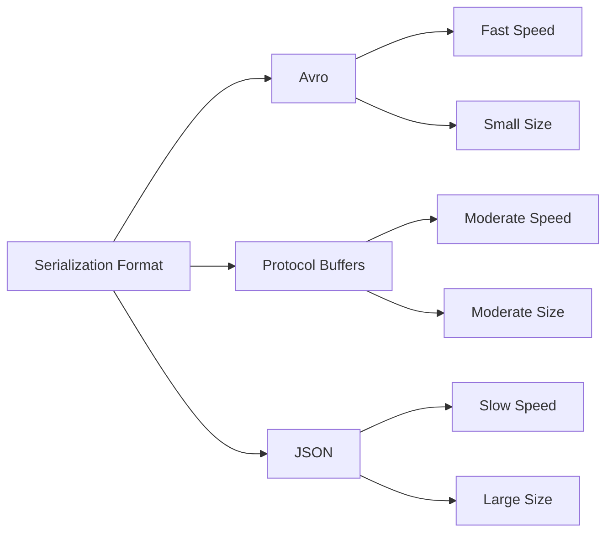

## 6.3.1 Performance Considerations

In the realm of high-throughput data processing with Apache Kafka, serialization and deserialization play a pivotal role in determining the overall performance of your Kafka applications. This section delves into the performance implications of various serialization strategies, offering insights into how to optimize these processes to achieve efficient data handling in Kafka.

### Understanding Serialization and Its Impact

Serialization is the process of converting an object into a byte stream, which can then be transmitted over a network or stored in a file. Deserialization is the reverse process, where the byte stream is converted back into an object. In Kafka, serialization and deserialization are crucial for producers and consumers to communicate effectively.

#### CPU and Memory Usage

Serialization impacts both CPU and memory usage significantly. The choice of serialization format can affect the speed of serialization/deserialization, the size of the serialized data, and the computational resources required. For instance, more complex serialization formats may offer richer data structures but at the cost of increased CPU usage and memory footprint.

- **CPU Usage**: Complex serialization formats like JSON or XML require more CPU cycles due to their verbose nature and the need for parsing. In contrast, binary formats like Avro or Protocol Buffers are more CPU-efficient.
- **Memory Usage**: The memory footprint is influenced by the size of the serialized data. Larger serialized data can lead to increased memory consumption, affecting the performance of Kafka producers and consumers.

### Comparing Serialization Formats

To make informed decisions about serialization, it's essential to understand the trade-offs between different formats. Here, we compare some popular serialization formats used in Kafka applications.

#### Avro

Apache Avro is a binary serialization format that is compact and fast. It supports schema evolution, making it a popular choice for Kafka.

- **Pros**: Compact binary format, supports schema evolution, fast serialization/deserialization.
- **Cons**: Requires schema management, less human-readable.

#### Protocol Buffers

Developed by Google, Protocol Buffers (Protobuf) is another binary serialization format known for its efficiency and schema evolution support.

- **Pros**: Efficient binary format, supports schema evolution, cross-language compatibility.
- **Cons**: Requires schema definition, less human-readable.

#### JSON

JSON is a text-based format that is widely used due to its readability and ease of use.

- **Pros**: Human-readable, widely supported, no need for schema management.
- **Cons**: Verbose, slower serialization/deserialization, larger data size.

#### Benchmarking Serialization Formats

To illustrate the performance differences, consider the following benchmarks comparing Avro, Protobuf, and JSON in terms of serialization/deserialization speed and data size.



**Caption**: Comparison of serialization formats in terms of speed and data size.

### Techniques for Optimizing Serialization

To optimize serialization in Kafka applications, consider the following techniques:

#### Schema Caching

Schema caching involves storing the schema in memory to avoid repeated retrievals, reducing the overhead associated with schema management.

- **Implementation**: Use a local cache to store schemas retrieved from the [6.2 Leveraging Confluent Schema Registry]( "Leveraging Confluent Schema Registry").
- **Benefits**: Reduces latency and improves throughput by minimizing schema retrieval times.

#### Object Pooling

Object pooling is a technique where a pool of reusable objects is maintained to reduce the overhead of object creation and garbage collection.

- **Implementation**: Use libraries like Apache Commons Pool to manage object pools for serialization.
- **Benefits**: Reduces CPU and memory usage by reusing objects, leading to improved performance.

#### Balancing Performance and Flexibility

When choosing a serialization format, it's crucial to balance performance with flexibility. Consider the following recommendations:

- **Use Avro or Protobuf** for high-performance applications where schema evolution is required.
- **Opt for JSON** in scenarios where human readability and ease of debugging are priorities, despite its performance drawbacks.
- **Evaluate the trade-offs** between serialization speed, data size, and schema management complexity.

### Code Examples: Optimized Serialization Workflows

Let's explore how to implement optimized serialization workflows in Kafka using Java, Scala, Kotlin, and Clojure.

#### Java Example

```java
import org.apache.kafka.common.serialization.Serializer;
import org.apache.kafka.common.serialization.Deserializer;
import org.apache.avro.generic.GenericRecord;
import org.apache.avro.io.DatumWriter;
import org.apache.avro.io.Encoder;
import org.apache.avro.io.EncoderFactory;
import org.apache.avro.specific.SpecificDatumWriter;

public class AvroSerializer implements Serializer<GenericRecord> {
    @Override
    public byte[] serialize(String topic, GenericRecord data) {
        try {
            DatumWriter<GenericRecord> datumWriter = new SpecificDatumWriter<>(data.getSchema());
            ByteArrayOutputStream out = new ByteArrayOutputStream();
            Encoder encoder = EncoderFactory.get().binaryEncoder(out, null);
            datumWriter.write(data, encoder);
            encoder.flush();
            return out.toByteArray();
        } catch (IOException e) {
            throw new SerializationException("Error serializing Avro message", e);
        }
    }
}
```

**Explanation**: This Java code demonstrates an Avro serializer implementation, focusing on efficient serialization using Avro's binary encoding.

#### Scala Example

```scala
import org.apache.kafka.common.serialization.{Serializer, Deserializer}
import org.apache.avro.generic.GenericRecord
import org.apache.avro.io.{DatumWriter, Encoder, EncoderFactory}
import org.apache.avro.specific.SpecificDatumWriter

class AvroSerializer extends Serializer[GenericRecord] {
  override def serialize(topic: String, data: GenericRecord): Array[Byte] = {
    val datumWriter: DatumWriter[GenericRecord] = new SpecificDatumWriter[GenericRecord](data.getSchema)
    val out = new ByteArrayOutputStream()
    val encoder: Encoder = EncoderFactory.get().binaryEncoder(out, null)
    datumWriter.write(data, encoder)
    encoder.flush()
    out.toByteArray
  }
}
```

**Explanation**: This Scala code provides a similar Avro serializer implementation, showcasing Scala's concise syntax.

#### Kotlin Example

```kotlin
import org.apache.kafka.common.serialization.Serializer
import org.apache.avro.generic.GenericRecord
import org.apache.avro.io.DatumWriter
import org.apache.avro.io.Encoder
import org.apache.avro.io.EncoderFactory
import org.apache.avro.specific.SpecificDatumWriter

class AvroSerializer : Serializer<GenericRecord> {
    override fun serialize(topic: String, data: GenericRecord): ByteArray {
        val datumWriter: DatumWriter<GenericRecord> = SpecificDatumWriter(data.schema)
        val out = ByteArrayOutputStream()
        val encoder: Encoder = EncoderFactory.get().binaryEncoder(out, null)
        datumWriter.write(data, encoder)
        encoder.flush()
        return out.toByteArray()
    }
}
```

**Explanation**: This Kotlin example highlights the use of Avro serialization with Kotlin's expressive syntax.

#### Clojure Example

```clojure
(ns kafka.avro-serializer
  (:import [org.apache.kafka.common.serialization Serializer]
           [org.apache.avro.generic GenericRecord]
           [org.apache.avro.io DatumWriter Encoder EncoderFactory]
           [org.apache.avro.specific SpecificDatumWriter]))

(defn avro-serializer []
  (reify Serializer
    (serialize [_ topic data]
      (let [datum-writer (SpecificDatumWriter. (.getSchema data))
            out (java.io.ByteArrayOutputStream.)
            encoder (EncoderFactory/get binaryEncoder out nil)]
        (.write datum-writer data encoder)
        (.flush encoder)
        (.toByteArray out)))))
```

**Explanation**: This Clojure code demonstrates an Avro serializer, leveraging Clojure's functional programming capabilities.

### Practical Applications and Real-World Scenarios

Serialization optimization is crucial in scenarios where Kafka is used for real-time data processing, such as:

- **Event-Driven Microservices**: Efficient serialization ensures low latency and high throughput in microservices architectures.
- **Real-Time Analytics**: Optimized serialization is essential for processing large volumes of data in real-time analytics applications.
- **IoT Data Processing**: Serialization efficiency is critical when handling high-frequency sensor data in IoT applications.

### Key Takeaways

- **Serialization impacts performance**: The choice of serialization format affects CPU and memory usage, influencing Kafka's overall performance.
- **Benchmarking is essential**: Compare serialization formats to understand their trade-offs in terms of speed and data size.
- **Optimization techniques**: Implement schema caching and object pooling to enhance serialization efficiency.
- **Balance performance and flexibility**: Choose the appropriate serialization format based on your application's requirements.

### Knowledge Check

To reinforce your understanding of serialization performance considerations in Kafka, test your knowledge with the following quiz.

## Test Your Knowledge: Kafka Serialization Performance Quiz



### Which serialization format is known for its compact binary representation and schema evolution support?

- [x] Avro
- [ ] JSON
- [ ] XML
- [ ] YAML

> **Explanation:** Avro is a binary serialization format that supports schema evolution, making it compact and efficient for Kafka applications.

### What is a primary disadvantage of using JSON for serialization in Kafka?

- [ ] It is not human-readable.
- [x] It is verbose and slower than binary formats.
- [ ] It does not support schema evolution.
- [ ] It is not widely supported.

> **Explanation:** JSON is verbose and slower compared to binary formats like Avro and Protobuf, which affects performance in high-throughput applications.

### How does schema caching improve serialization performance?

- [x] By reducing the latency associated with schema retrieval.
- [ ] By increasing the size of serialized data.
- [ ] By making the data human-readable.
- [ ] By eliminating the need for serialization.

> **Explanation:** Schema caching stores schemas in memory, reducing the time needed to retrieve them, thus improving serialization performance.

### What is the benefit of using object pooling in serialization workflows?

- [ ] It increases CPU usage.
- [x] It reduces the overhead of object creation and garbage collection.
- [ ] It makes the data more readable.
- [ ] It eliminates the need for deserialization.

> **Explanation:** Object pooling reduces the overhead of creating and destroying objects, improving CPU and memory efficiency.

### Which serialization format is best suited for applications requiring human readability?

- [ ] Avro
- [ ] Protocol Buffers
- [x] JSON
- [ ] Thrift

> **Explanation:** JSON is a text-based format that is human-readable, making it suitable for applications where readability is a priority.

### What is a key advantage of using Protocol Buffers over JSON?

- [ ] It is more human-readable.
- [x] It is more efficient in terms of speed and data size.
- [ ] It does not require schema management.
- [ ] It is less widely supported.

> **Explanation:** Protocol Buffers are more efficient than JSON in terms of serialization speed and data size, making them suitable for high-performance applications.

### Which technique helps in reducing the latency of serialization by storing schemas in memory?

- [ ] Object pooling
- [x] Schema caching
- [ ] Data compression
- [ ] Data encryption

> **Explanation:** Schema caching stores schemas in memory, reducing the latency associated with retrieving schemas from external sources.

### What is the primary benefit of using Avro for serialization in Kafka?

- [ ] It is human-readable.
- [x] It supports schema evolution and is compact.
- [ ] It does not require schema management.
- [ ] It is slower than JSON.

> **Explanation:** Avro supports schema evolution and is compact, making it an efficient choice for Kafka serialization.

### True or False: JSON serialization is faster than Avro serialization.

- [ ] True
- [x] False

> **Explanation:** JSON serialization is generally slower than Avro serialization due to its verbose nature and the need for parsing.

### Which of the following is a recommended practice for optimizing serialization in Kafka?

- [x] Implementing schema caching and object pooling.
- [ ] Using only text-based formats for serialization.
- [ ] Avoiding schema management.
- [ ] Increasing the verbosity of serialized data.

> **Explanation:** Implementing schema caching and object pooling are recommended practices for optimizing serialization performance in Kafka.


