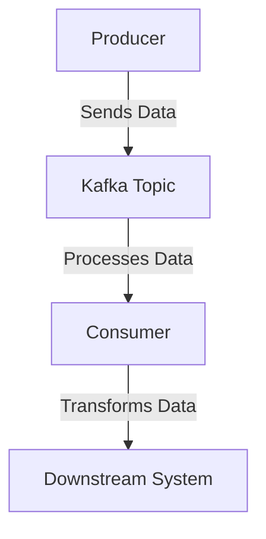

## 6.4.1 Tracking Data Lineage

### Introduction

In the realm of modern data architectures, understanding the journey of data from its origin to its final destination is crucial. This journey, known as data lineage, provides insights into the data's lifecycle, transformations, and interactions across various systems. In Apache Kafka, a distributed streaming platform, tracking data lineage poses unique challenges due to its real-time nature and the complexity of data flows. This section delves into the techniques, tools, and best practices for tracking data lineage within Kafka, emphasizing its importance for debugging, compliance, and data governance.

### Challenges of Tracking Data Lineage in Streaming Systems

Tracking data lineage in streaming systems like Kafka involves several challenges:

1. **Real-Time Data Flow**: Unlike batch processing systems, streaming systems continuously process data, making it difficult to capture and track changes in real-time.

2. **Complex Data Transformations**: Data in Kafka often undergoes multiple transformations as it flows through producers, topics, and consumers, complicating the lineage tracking process.

3. **Distributed Architecture**: Kafka's distributed nature means data can be processed across multiple nodes and clusters, requiring a comprehensive approach to track its lineage.

4. **Volume and Velocity**: The high volume and velocity of data in Kafka streams necessitate efficient and scalable lineage tracking mechanisms.

5. **Schema Evolution**: As data schemas evolve, maintaining accurate lineage information becomes challenging, especially when backward compatibility is required.

### Approaches to Tracking Data Lineage

To effectively track data lineage in Kafka, several approaches can be employed:

#### Metadata Propagation

Metadata propagation involves attaching metadata to data records as they flow through Kafka. This metadata can include information about the data's origin, transformations, and processing history.

- **Implementation**: Use Kafka headers to propagate metadata. Headers are key-value pairs that can be attached to Kafka messages, allowing metadata to travel with the data.

- **Example**: 

    ```java
    // Java example of adding metadata to Kafka headers
    ProducerRecord<String, String> record = new ProducerRecord<>("topic", "key", "value");
    record.headers().add("origin", "source-system".getBytes());
    record.headers().add("transformation", "filtering".getBytes());
    producer.send(record);
    ```

- **Benefits**: Metadata propagation provides a lightweight and flexible way to track data lineage without altering the data payload.

#### Tagging

Tagging involves assigning tags to data records or streams to categorize and track them throughout their lifecycle.

- **Implementation**: Use a tagging system to label data at various stages of processing. Tags can be stored in a centralized metadata repository for easy access and management.

- **Example**: 

    ```scala
    // Scala example of tagging data in Kafka
    val record = new ProducerRecord[String, String]("topic", "key", "value")
    record.headers().add("tag", "important".getBytes())
    producer.send(record)
    ```

- **Benefits**: Tagging allows for easy filtering and querying of data based on specific attributes, facilitating lineage tracking and analysis.

#### Tools for Data Lineage Tracking

Several tools can assist with tracking data lineage in Kafka:

1. **Apache Atlas**: An open-source data governance and metadata management tool that provides lineage tracking capabilities for Kafka. It integrates with Kafka to capture metadata and visualize data flows.

2. **Confluent Control Center**: Part of the Confluent Platform, it offers monitoring and management capabilities, including data lineage visualization for Kafka streams.

3. **DataHub**: An open-source metadata platform that supports data lineage tracking across various systems, including Kafka.

4. **Egeria**: An open-source project under the Linux Foundation that provides tools for metadata management and lineage tracking.

### Benefits of Understanding Data Lineage

Understanding data lineage in Kafka offers several benefits:

- **Debugging**: Lineage information helps identify the source of data issues and track the impact of changes across the data pipeline.

- **Compliance**: Regulatory requirements often mandate data lineage tracking to ensure data integrity and transparency.

- **Data Governance**: Lineage tracking supports data governance initiatives by providing visibility into data usage and transformations.

- **Impact Analysis**: Lineage information enables impact analysis by showing how changes to data sources or transformations affect downstream systems.

### Strategies for Visualizing Data Flows

Visualizing data flows is essential for understanding data lineage in Kafka. Several strategies can be employed:

#### Flow Diagrams

Use flow diagrams to represent data movement and transformations within Kafka. These diagrams can illustrate the relationships between producers, topics, and consumers.



*Caption*: This diagram illustrates a simple data flow in Kafka, showing the movement of data from a producer to a consumer and its transformation before reaching a downstream system.

#### Interactive Dashboards

Leverage interactive dashboards to visualize data lineage in real-time. Tools like Apache Atlas and Confluent Control Center provide graphical interfaces for exploring data flows and lineage information.

#### Data Lineage Graphs

Create data lineage graphs to depict the dependencies and transformations of data within Kafka. These graphs can be generated using tools like Neo4j or GraphQL.

### Conclusion

Tracking data lineage in Apache Kafka is a critical aspect of data governance and compliance. By employing techniques like metadata propagation and tagging, and leveraging tools such as Apache Atlas and Confluent Control Center, organizations can gain valuable insights into their data flows. Understanding data lineage not only aids in debugging and compliance but also enhances data governance and impact analysis efforts.

## Test Your Knowledge: Advanced Data Lineage Tracking in Kafka



### What is a primary challenge of tracking data lineage in streaming systems like Kafka?

- [x] Real-time data flow
- [ ] Low data volume
- [ ] Simple data transformations
- [ ] Centralized architecture

> **Explanation:** Real-time data flow is a primary challenge because it requires capturing and tracking changes continuously as data moves through the system.

### Which approach involves attaching metadata to data records in Kafka?

- [x] Metadata propagation
- [ ] Tagging
- [ ] Data masking
- [ ] Data encryption

> **Explanation:** Metadata propagation involves attaching metadata to data records, allowing it to travel with the data through Kafka.

### What is a benefit of understanding data lineage in Kafka?

- [x] Improved debugging
- [ ] Increased data volume
- [ ] Simplified data transformations
- [ ] Reduced data velocity

> **Explanation:** Understanding data lineage improves debugging by helping identify the source of data issues and track the impact of changes.

### Which tool is known for providing data lineage tracking capabilities for Kafka?

- [x] Apache Atlas
- [ ] Apache Spark
- [ ] Apache Hadoop
- [ ] Apache Flink

> **Explanation:** Apache Atlas is an open-source data governance tool that provides lineage tracking capabilities for Kafka.

### What is the purpose of tagging in data lineage tracking?

- [x] Categorizing and tracking data
- [ ] Encrypting data
- [ ] Compressing data
- [ ] Deleting data

> **Explanation:** Tagging involves categorizing and tracking data by assigning labels to data records or streams.

### Which visualization strategy uses flow diagrams to represent data movement in Kafka?

- [x] Flow Diagrams
- [ ] Interactive Dashboards
- [ ] Data Lineage Graphs
- [ ] Data Tables

> **Explanation:** Flow diagrams are used to represent data movement and transformations within Kafka.

### What is a benefit of using interactive dashboards for data lineage visualization?

- [x] Real-time exploration of data flows
- [ ] Increased data storage
- [ ] Simplified data encryption
- [ ] Reduced data latency

> **Explanation:** Interactive dashboards allow for real-time exploration of data flows, enhancing understanding of data lineage.

### Which tool is part of the Confluent Platform and offers data lineage visualization?

- [x] Confluent Control Center
- [ ] Apache Kafka
- [ ] Apache Zookeeper
- [ ] Apache Cassandra

> **Explanation:** Confluent Control Center is part of the Confluent Platform and provides data lineage visualization for Kafka streams.

### What is a key benefit of data lineage for compliance?

- [x] Ensures data integrity and transparency
- [ ] Increases data velocity
- [ ] Simplifies data transformations
- [ ] Reduces data volume

> **Explanation:** Data lineage ensures data integrity and transparency, which is crucial for meeting regulatory compliance requirements.

### True or False: Data lineage tracking is only beneficial for debugging purposes.

- [ ] True
- [x] False

> **Explanation:** Data lineage tracking is beneficial for debugging, compliance, data governance, and impact analysis, among other purposes.



By understanding and implementing effective data lineage tracking in Kafka, organizations can enhance their data governance, compliance, and operational efficiency.
