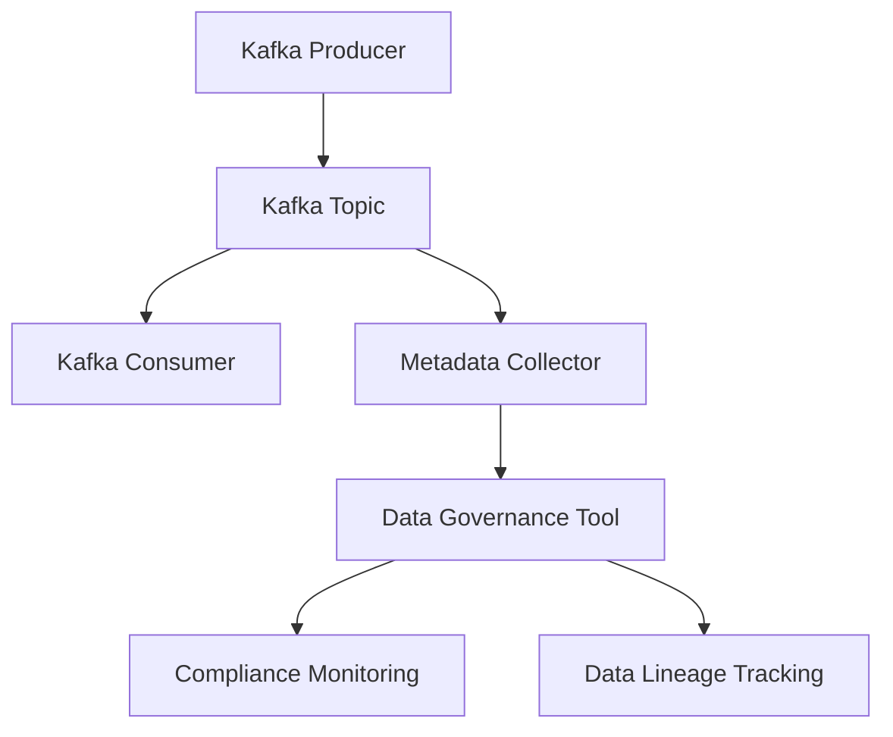

## 6.4.2 Integrating with Data Governance Tools

In the modern data-driven enterprise, integrating Apache Kafka with data governance tools is crucial for enforcing policies, monitoring data usage, and ensuring compliance. This section explores how to effectively integrate Kafka with leading data governance platforms such as Apache Atlas and DataHub, focusing on metadata management, data lineage, and compliance.

### Introduction to Data Governance Tools

Data governance tools are essential for managing and controlling data assets within an organization. They provide capabilities for metadata management, data lineage tracking, policy enforcement, and compliance monitoring. Integrating these tools with Kafka allows organizations to maintain a consistent view of their data landscape, ensuring that data flows through Kafka are well-documented and compliant with regulatory requirements.

#### Key Data Governance Platforms

1. **Apache Atlas**: A scalable and extensible set of core foundational governance services that enable enterprises to effectively and efficiently meet their compliance requirements within Hadoop and other data ecosystems. [Apache Atlas](https://atlas.apache.org/)

2. **DataHub**: An open-source metadata platform for the modern data stack, providing a central hub for metadata management and data discovery. [DataHub](https://datahubproject.io/)

### Connecting Kafka to Data Governance Tools

Integrating Kafka with data governance tools involves setting up connectors and metadata collectors that can capture and relay metadata from Kafka topics, producers, and consumers to the governance platform. This integration ensures that all data flowing through Kafka is tracked, documented, and compliant with organizational policies.

#### Steps to Integrate Kafka with Apache Atlas

1. **Install and Configure Apache Atlas**: Begin by setting up Apache Atlas in your environment. Ensure that it is configured to communicate with your Kafka cluster.

2. **Set Up Kafka Connect**: Use Kafka Connect to create connectors that can capture metadata from Kafka topics and relay it to Apache Atlas. This involves configuring source connectors for Kafka topics and sink connectors for Atlas.

3. **Configure Metadata Collectors**: Implement metadata collectors that can extract metadata from Kafka producers and consumers. These collectors should be able to capture information such as schema details, data lineage, and access patterns.

4. **Implement Metadata Policies**: Define and enforce metadata policies within Apache Atlas to ensure that all Kafka data is compliant with organizational standards and regulatory requirements.

5. **Monitor and Audit Data Flows**: Use Apache Atlas's monitoring and auditing capabilities to track data flows through Kafka, ensuring that all data is properly documented and compliant.

#### Steps to Integrate Kafka with DataHub

1. **Deploy DataHub**: Set up DataHub in your environment, ensuring it is configured to integrate with your Kafka cluster.

2. **Use Metadata Ingestion Frameworks**: Leverage DataHub's metadata ingestion frameworks to capture metadata from Kafka topics, producers, and consumers. This involves setting up ingestion pipelines that can extract and relay metadata to DataHub.

3. **Configure Data Lineage Tracking**: Implement data lineage tracking within DataHub to visualize and document data flows through Kafka. This helps in understanding the origin, movement, and transformation of data within the organization.

4. **Define Compliance and Governance Policies**: Establish compliance and governance policies within DataHub to ensure that all Kafka data adheres to organizational standards and regulatory requirements.

5. **Utilize DataHub's Search and Discovery Features**: Take advantage of DataHub's search and discovery capabilities to enable users to easily find and understand Kafka data assets.

### Importance of Consistent Metadata Management

Consistent metadata management is critical for ensuring that data governance efforts are effective. By maintaining a unified view of metadata across Kafka and other data systems, organizations can ensure that data is accurately documented, easily discoverable, and compliant with policies.

#### Benefits of Consistent Metadata Management

- **Improved Data Quality**: Ensures that data is accurate, complete, and reliable.
- **Enhanced Compliance**: Facilitates adherence to regulatory requirements by providing a clear view of data flows and transformations.
- **Better Decision Making**: Enables data-driven decision-making by providing a comprehensive view of data assets.
- **Increased Efficiency**: Reduces the time and effort required to manage and govern data assets.

### Practical Applications and Real-World Scenarios

Integrating Kafka with data governance tools has numerous practical applications in real-world scenarios. Here are a few examples:

- **Financial Services**: Ensuring compliance with regulations such as GDPR and CCPA by tracking data flows and access patterns through Kafka.
- **Healthcare**: Maintaining data lineage and documentation for patient data to comply with HIPAA regulations.
- **Retail**: Monitoring and auditing data flows through Kafka to ensure data quality and compliance with industry standards.

### Code Examples

To illustrate the integration of Kafka with data governance tools, let's explore some code examples in Java, Scala, Kotlin, and Clojure.

#### Java Example: Kafka to Apache Atlas Integration

```java
import org.apache.kafka.clients.producer.KafkaProducer;
import org.apache.kafka.clients.producer.ProducerRecord;
import org.apache.kafka.clients.producer.ProducerConfig;
import org.apache.kafka.common.serialization.StringSerializer;
import java.util.Properties;

public class KafkaAtlasIntegration {
    public static void main(String[] args) {
        Properties props = new Properties();
        props.put(ProducerConfig.BOOTSTRAP_SERVERS_CONFIG, "localhost:9092");
        props.put(ProducerConfig.KEY_SERIALIZER_CLASS_CONFIG, StringSerializer.class.getName());
        props.put(ProducerConfig.VALUE_SERIALIZER_CLASS_CONFIG, StringSerializer.class.getName());

        KafkaProducer<String, String> producer = new KafkaProducer<>(props);
        String topic = "metadata-topic";

        // Send metadata to Apache Atlas
        ProducerRecord<String, String> record = new ProducerRecord<>(topic, "key", "value");
        producer.send(record);

        producer.close();
    }
}
```

#### Scala Example: Kafka to DataHub Integration

```scala
import org.apache.kafka.clients.producer.{KafkaProducer, ProducerConfig, ProducerRecord}
import org.apache.kafka.common.serialization.StringSerializer

object KafkaDataHubIntegration extends App {
  val props = new java.util.Properties()
  props.put(ProducerConfig.BOOTSTRAP_SERVERS_CONFIG, "localhost:9092")
  props.put(ProducerConfig.KEY_SERIALIZER_CLASS_CONFIG, classOf[StringSerializer].getName)
  props.put(ProducerConfig.VALUE_SERIALIZER_CLASS_CONFIG, classOf[StringSerializer].getName)

  val producer = new KafkaProducer[String, String](props)
  val topic = "metadata-topic"

  // Send metadata to DataHub
  val record = new ProducerRecord[String, String](topic, "key", "value")
  producer.send(record)

  producer.close()
}
```

#### Kotlin Example: Kafka Metadata Collector

```kotlin
import org.apache.kafka.clients.producer.KafkaProducer
import org.apache.kafka.clients.producer.ProducerConfig
import org.apache.kafka.clients.producer.ProducerRecord
import org.apache.kafka.common.serialization.StringSerializer

fun main() {
    val props = Properties().apply {
        put(ProducerConfig.BOOTSTRAP_SERVERS_CONFIG, "localhost:9092")
        put(ProducerConfig.KEY_SERIALIZER_CLASS_CONFIG, StringSerializer::class.java.name)
        put(ProducerConfig.VALUE_SERIALIZER_CLASS_CONFIG, StringSerializer::class.java.name)
    }

    val producer = KafkaProducer<String, String>(props)
    val topic = "metadata-topic"

    // Send metadata to governance tool
    val record = ProducerRecord(topic, "key", "value")
    producer.send(record)

    producer.close()
}
```

#### Clojure Example: Kafka Governance Integration

```clojure
(require '[clojure.java.io :as io])
(import '[org.apache.kafka.clients.producer KafkaProducer ProducerConfig ProducerRecord]
        '[org.apache.kafka.common.serialization StringSerializer])

(defn kafka-producer []
  (let [props (doto (java.util.Properties.)
                (.put ProducerConfig/BOOTSTRAP_SERVERS_CONFIG "localhost:9092")
                (.put ProducerConfig/KEY_SERIALIZER_CLASS_CONFIG StringSerializer)
                (.put ProducerConfig/VALUE_SERIALIZER_CLASS_CONFIG StringSerializer))]
    (KafkaProducer. props)))

(defn send-metadata [producer topic key value]
  (let [record (ProducerRecord. topic key value)]
    (.send producer record)))

(defn -main []
  (let [producer (kafka-producer)
        topic "metadata-topic"]
    (send-metadata producer topic "key" "value")
    (.close producer)))
```

### Visualizing Kafka and Data Governance Integration

To better understand the integration of Kafka with data governance tools, consider the following diagram illustrating the data flow and metadata management process.



**Diagram Explanation**: This diagram shows how data flows from a Kafka producer to a Kafka topic and is consumed by a Kafka consumer. A metadata collector captures metadata from the Kafka topic and sends it to a data governance tool, which then facilitates compliance monitoring and data lineage tracking.

### References and Links

- Apache Atlas: [Apache Atlas](https://atlas.apache.org/)
- DataHub: [DataHub](https://datahubproject.io/)
- Apache Kafka Documentation: [Apache Kafka Documentation](https://kafka.apache.org/documentation/)
- Confluent Documentation: [Confluent Documentation](https://docs.confluent.io/)

### Knowledge Check

To reinforce your understanding of integrating Kafka with data governance tools, consider the following questions and exercises.

1. **What are the key benefits of integrating Kafka with data governance tools?**
2. **Describe the process of setting up a Kafka connector for Apache Atlas.**
3. **How does consistent metadata management improve data quality and compliance?**
4. **Experiment with the provided code examples by modifying the Kafka topic and metadata values.**
5. **Discuss the role of metadata collectors in the integration process.**

### Conclusion

Integrating Kafka with data governance tools is essential for maintaining a compliant and well-documented data landscape. By leveraging platforms like Apache Atlas and DataHub, organizations can ensure that their Kafka data flows are accurately tracked, monitored, and compliant with regulatory requirements. This integration not only enhances data quality and compliance but also facilitates better decision-making and operational efficiency.

## Test Your Knowledge: Kafka and Data Governance Integration Quiz



### What is the primary benefit of integrating Kafka with data governance tools?

- [x] Ensures compliance and data quality
- [ ] Increases data processing speed
- [ ] Reduces storage costs
- [ ] Simplifies Kafka configuration

> **Explanation:** Integrating Kafka with data governance tools ensures compliance with regulatory requirements and improves data quality by providing a comprehensive view of data flows and metadata.

### Which tool is known for providing a central hub for metadata management and data discovery?

- [ ] Apache Atlas
- [x] DataHub
- [ ] Apache Kafka
- [ ] Confluent

> **Explanation:** DataHub is an open-source metadata platform that provides a central hub for metadata management and data discovery.

### What is the role of metadata collectors in Kafka integration with governance tools?

- [x] Capture and relay metadata from Kafka to governance tools
- [ ] Increase Kafka's throughput
- [ ] Reduce Kafka's latency
- [ ] Manage Kafka's storage

> **Explanation:** Metadata collectors capture and relay metadata from Kafka topics, producers, and consumers to governance tools for tracking and compliance.

### How does consistent metadata management benefit an organization?

- [x] Improves data quality and compliance
- [ ] Increases data storage
- [ ] Reduces data processing time
- [ ] Simplifies data encryption

> **Explanation:** Consistent metadata management improves data quality and compliance by ensuring data is accurately documented and easily discoverable.

### Which of the following is a step in integrating Kafka with Apache Atlas?

- [x] Set up Kafka Connect
- [ ] Increase Kafka's partition count
- [ ] Reduce Kafka's replication factor
- [ ] Simplify Kafka's configuration

> **Explanation:** Setting up Kafka Connect is a crucial step in integrating Kafka with Apache Atlas to capture and relay metadata.

### What is the primary function of Apache Atlas in data governance?

- [x] Provides governance services for compliance
- [ ] Increases data processing speed
- [ ] Reduces data storage costs
- [ ] Simplifies Kafka configuration

> **Explanation:** Apache Atlas provides governance services that enable enterprises to meet compliance requirements effectively.

### What is a key feature of DataHub in the context of Kafka integration?

- [x] Metadata ingestion frameworks
- [ ] Data compression algorithms
- [ ] Network optimization tools
- [ ] Storage management systems

> **Explanation:** DataHub's metadata ingestion frameworks allow for capturing metadata from Kafka topics, producers, and consumers.

### What does the diagram in the article illustrate?

- [x] Data flow and metadata management process
- [ ] Kafka's storage architecture
- [ ] Kafka's security protocols
- [ ] Kafka's networking configuration

> **Explanation:** The diagram illustrates the data flow and metadata management process in the integration of Kafka with data governance tools.

### Why is data lineage tracking important in Kafka integration?

- [x] Helps visualize and document data flows
- [ ] Increases Kafka's throughput
- [ ] Reduces Kafka's latency
- [ ] Manages Kafka's storage

> **Explanation:** Data lineage tracking helps visualize and document data flows, which is crucial for compliance and understanding data transformations.

### True or False: Integrating Kafka with data governance tools can enhance decision-making.

- [x] True
- [ ] False

> **Explanation:** True. Integrating Kafka with data governance tools provides a comprehensive view of data assets, facilitating better decision-making.


