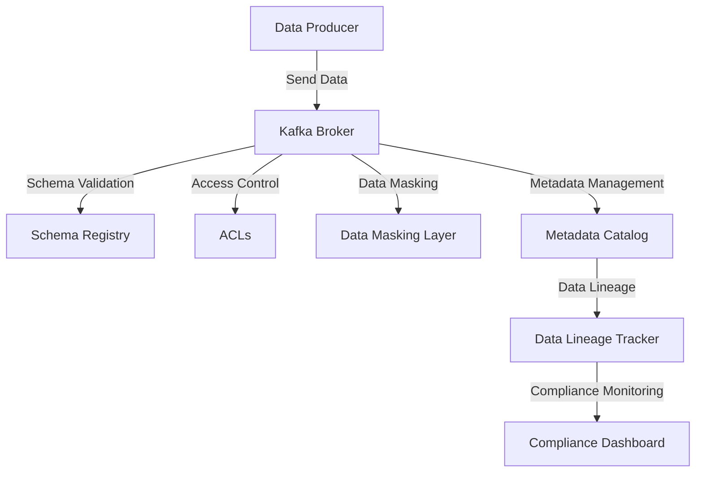

## 6.4.4 Enterprise Data Governance and Policy Management

### Introduction

In the era of big data and real-time analytics, organizations face the challenge of managing vast amounts of data while ensuring its quality, security, and compliance. Enterprise Data Governance (EDG) is a critical framework that addresses these challenges by establishing policies and procedures for data management. Apache Kafka, as a leading platform for real-time data streaming, plays a pivotal role in these frameworks. This section delves into the components of an enterprise data governance framework, how Kafka integrates into these frameworks, and strategies for policy enforcement across different layers.

### Components of an Enterprise Data Governance Framework

An effective enterprise data governance framework encompasses several key components:

1. **Data Quality Management**: Ensures the accuracy, completeness, and reliability of data.
2. **Data Security and Privacy**: Protects data from unauthorized access and ensures compliance with privacy regulations.
3. **Data Lifecycle Management**: Manages data from creation to deletion, ensuring proper archiving and disposal.
4. **Metadata Management**: Provides context and meaning to data, facilitating its discovery and usage.
5. **Compliance and Risk Management**: Ensures adherence to legal and regulatory requirements.
6. **Data Stewardship**: Involves assigning roles and responsibilities for data management.

### How Kafka Fits into Enterprise Data Governance Frameworks

Apache Kafka is integral to modern data architectures, serving as a backbone for real-time data processing and integration. Here's how Kafka aligns with the components of an enterprise data governance framework:

- **Data Quality Management**: Kafka's ability to handle high-throughput data streams ensures timely and accurate data delivery. Implementing schema validation using tools like the [Schema Registry]( "Schema Registry") helps maintain data consistency.
  
- **Data Security and Privacy**: Kafka supports encryption and authentication mechanisms such as SSL/TLS and SASL, ensuring secure data transmission. Role-based access control can be implemented to restrict access to sensitive data.

- **Data Lifecycle Management**: Kafka's retention policies and log compaction features facilitate effective data lifecycle management, allowing organizations to manage data storage efficiently.

- **Metadata Management**: Kafka's integration with metadata management tools enables the tracking and management of data lineage, enhancing data discoverability and usage.

- **Compliance and Risk Management**: Kafka's robust logging and monitoring capabilities support compliance with data regulations by providing detailed audit trails.

- **Data Stewardship**: Kafka's ecosystem encourages collaboration between data stewards, developers, and stakeholders, ensuring that data governance policies are effectively implemented and maintained.

### Strategies for Policy Enforcement in Kafka

Implementing data governance policies in Kafka involves enforcing rules and procedures at various layers:

#### Data Layer

- **Schema Validation**: Use the Schema Registry to enforce schema validation, ensuring that data conforms to predefined formats and structures.
  
- **Data Masking and Anonymization**: Implement data masking techniques to protect sensitive information, ensuring compliance with privacy regulations.

- **Access Controls**: Define and enforce access controls using Kafka's ACLs (Access Control Lists) to restrict data access based on roles and responsibilities.

#### Metadata Layer

- **Metadata Cataloging**: Integrate Kafka with metadata management tools to catalog and manage data assets, enhancing data discoverability and usage.

- **Data Lineage Tracking**: Implement data lineage tracking to monitor data flow and transformations, ensuring transparency and accountability.

- **Policy Documentation**: Maintain comprehensive documentation of data governance policies and procedures, ensuring that all stakeholders are informed and aligned.

### Collaboration Between Data Stewards, Developers, and Stakeholders

Effective data governance requires collaboration between various roles within an organization:

- **Data Stewards**: Responsible for overseeing data governance policies, ensuring data quality, and managing data assets.

- **Developers**: Implement data governance policies within Kafka applications, ensuring compliance with organizational standards.

- **Stakeholders**: Provide input and feedback on data governance policies, ensuring alignment with business objectives and regulatory requirements.

### Examples of Governance Policies Relevant to Kafka

1. **Data Retention Policy**: Define retention periods for different data types, ensuring compliance with legal and regulatory requirements.

2. **Data Access Policy**: Establish rules for data access and sharing, ensuring that only authorized users can access sensitive information.

3. **Data Quality Policy**: Define standards for data quality, including accuracy, completeness, and consistency, ensuring that data meets organizational requirements.

4. **Data Security Policy**: Implement security measures to protect data from unauthorized access and breaches, ensuring compliance with privacy regulations.

5. **Compliance Policy**: Ensure adherence to legal and regulatory requirements, including GDPR, CCPA, and HIPAA, by implementing appropriate data governance measures.

### Code Examples

To illustrate the implementation of data governance policies in Kafka, let's explore some code examples in Java, Scala, Kotlin, and Clojure.

#### Java Example: Schema Validation with Schema Registry

```java
import io.confluent.kafka.schemaregistry.client.CachedSchemaRegistryClient;
import io.confluent.kafka.schemaregistry.client.SchemaRegistryClient;
import io.confluent.kafka.schemaregistry.client.rest.exceptions.RestClientException;
import org.apache.avro.Schema;
import org.apache.avro.generic.GenericRecord;
import org.apache.kafka.clients.producer.KafkaProducer;
import org.apache.kafka.clients.producer.ProducerRecord;

import java.io.IOException;
import java.util.Properties;

public class KafkaSchemaValidation {
    public static void main(String[] args) throws IOException, RestClientException {
        String schemaRegistryUrl = "http://localhost:8081";
        SchemaRegistryClient schemaRegistryClient = new CachedSchemaRegistryClient(schemaRegistryUrl, 100);

        // Fetch schema from Schema Registry
        Schema schema = schemaRegistryClient.getById(1);

        // Configure Kafka producer
        Properties props = new Properties();
        props.put("bootstrap.servers", "localhost:9092");
        props.put("key.serializer", "org.apache.kafka.common.serialization.StringSerializer");
        props.put("value.serializer", "io.confluent.kafka.serializers.KafkaAvroSerializer");
        props.put("schema.registry.url", schemaRegistryUrl);

        KafkaProducer<String, GenericRecord> producer = new KafkaProducer<>(props);

        // Create a record conforming to the schema
        GenericRecord record = new GenericData.Record(schema);
        record.put("field1", "value1");
        record.put("field2", 123);

        // Send the record to Kafka
        ProducerRecord<String, GenericRecord> producerRecord = new ProducerRecord<>("topic", "key", record);
        producer.send(producerRecord);

        producer.close();
    }
}
```

#### Scala Example: Data Masking

```scala
import org.apache.kafka.clients.consumer.KafkaConsumer
import org.apache.kafka.clients.producer.{KafkaProducer, ProducerRecord}
import java.util.Properties
import scala.collection.JavaConverters._

object KafkaDataMasking {
  def main(args: Array[String]): Unit = {
    val props = new Properties()
    props.put("bootstrap.servers", "localhost:9092")
    props.put("key.deserializer", "org.apache.kafka.common.serialization.StringDeserializer")
    props.put("value.deserializer", "org.apache.kafka.common.serialization.StringDeserializer")
    props.put("group.id", "masking-group")

    val consumer = new KafkaConsumer[String, String](props)
    consumer.subscribe(List("input-topic").asJava)

    val producerProps = new Properties()
    producerProps.put("bootstrap.servers", "localhost:9092")
    producerProps.put("key.serializer", "org.apache.kafka.common.serialization.StringSerializer")
    producerProps.put("value.serializer", "org.apache.kafka.common.serialization.StringSerializer")

    val producer = new KafkaProducer[String, String](producerProps)

    while (true) {
      val records = consumer.poll(1000).asScala
      for (record <- records) {
        val maskedValue = maskSensitiveData(record.value())
        val producerRecord = new ProducerRecord[String, String]("output-topic", record.key(), maskedValue)
        producer.send(producerRecord)
      }
    }
  }

  def maskSensitiveData(data: String): String = {
    // Implement data masking logic here
    data.replaceAll("\\d", "*")
  }
}
```

#### Kotlin Example: Access Control

```kotlin
import org.apache.kafka.clients.admin.AdminClient
import org.apache.kafka.clients.admin.NewAclBinding
import org.apache.kafka.common.acl.AclBinding
import org.apache.kafka.common.acl.AclOperation
import org.apache.kafka.common.acl.AclPermissionType
import org.apache.kafka.common.resource.PatternType
import org.apache.kafka.common.resource.ResourcePattern
import org.apache.kafka.common.resource.ResourceType
import java.util.Properties

fun main() {
    val props = Properties()
    props["bootstrap.servers"] = "localhost:9092"

    val adminClient = AdminClient.create(props)

    val resourcePattern = ResourcePattern(ResourceType.TOPIC, "sensitive-topic", PatternType.LITERAL)
    val aclBinding = AclBinding(
        resourcePattern,
        NewAclBinding(
            AclOperation.READ,
            AclPermissionType.ALLOW,
            "User:authorized-user"
        )
    )

    adminClient.createAcls(listOf(aclBinding)).all().get()

    adminClient.close()
}
```

#### Clojure Example: Metadata Management

```clojure
(ns kafka.metadata-management
  (:require [clj-kafka.admin :as admin]))

(defn create-topic-with-metadata
  [topic-name metadata]
  (let [admin-client (admin/create-admin-client {"bootstrap.servers" "localhost:9092"})]
    (admin/create-topic admin-client topic-name 1 1)
    (admin/add-metadata admin-client topic-name metadata)
    (admin/close-admin-client admin-client)))

(create-topic-with-metadata "my-topic" {"owner" "data-steward" "description" "Sample topic for metadata management"})
```

### Visualizing Data Governance in Kafka

To better understand how data governance policies are implemented in Kafka, let's visualize the data flow and policy enforcement using a Mermaid.js diagram.



**Diagram Description**: This diagram illustrates the flow of data through a Kafka broker, highlighting key points where data governance policies are enforced, such as schema validation, access control, data masking, and metadata management.

### Conclusion

Enterprise data governance and policy management are essential for maintaining data quality, security, and compliance in modern data architectures. Apache Kafka, with its robust capabilities and integration with governance tools, plays a crucial role in implementing these frameworks. By enforcing policies at various layers and fostering collaboration between data stewards, developers, and stakeholders, organizations can ensure effective data governance and drive business success.

## Test Your Knowledge: Enterprise Data Governance in Kafka



### What is the primary role of data stewards in enterprise data governance?

- [x] Overseeing data governance policies and managing data assets.
- [ ] Implementing data governance policies within Kafka applications.
- [ ] Providing input and feedback on data governance policies.
- [ ] Ensuring compliance with legal and regulatory requirements.

> **Explanation:** Data stewards are responsible for overseeing data governance policies, ensuring data quality, and managing data assets.

### How does Kafka support data quality management?

- [x] By handling high-throughput data streams and implementing schema validation.
- [ ] By providing encryption and authentication mechanisms.
- [ ] By defining retention periods for different data types.
- [ ] By integrating with metadata management tools.

> **Explanation:** Kafka supports data quality management by handling high-throughput data streams and implementing schema validation to maintain data consistency.

### Which Kafka feature is used to enforce schema validation?

- [x] Schema Registry
- [ ] Access Control Lists (ACLs)
- [ ] Log Compaction
- [ ] Data Masking

> **Explanation:** The Schema Registry is used to enforce schema validation, ensuring that data conforms to predefined formats and structures.

### What is the purpose of data masking in Kafka?

- [x] To protect sensitive information and ensure compliance with privacy regulations.
- [ ] To enforce schema validation.
- [ ] To manage data from creation to deletion.
- [ ] To track data flow and transformations.

> **Explanation:** Data masking is used to protect sensitive information and ensure compliance with privacy regulations by obscuring data.

### Which component of an enterprise data governance framework involves managing data from creation to deletion?

- [x] Data Lifecycle Management
- [ ] Data Quality Management
- [ ] Metadata Management
- [ ] Compliance and Risk Management

> **Explanation:** Data Lifecycle Management involves managing data from creation to deletion, ensuring proper archiving and disposal.

### How can Kafka's ACLs be used in data governance?

- [x] By defining and enforcing access controls to restrict data access based on roles.
- [ ] By cataloging and managing data assets.
- [ ] By tracking data flow and transformations.
- [ ] By ensuring data quality and consistency.

> **Explanation:** Kafka's ACLs (Access Control Lists) can be used to define and enforce access controls, restricting data access based on roles and responsibilities.

### What is the role of metadata management in data governance?

- [x] To provide context and meaning to data, facilitating its discovery and usage.
- [ ] To protect data from unauthorized access.
- [ ] To ensure data quality and reliability.
- [ ] To manage data from creation to deletion.

> **Explanation:** Metadata management provides context and meaning to data, facilitating its discovery and usage, which is essential for effective data governance.

### Which Kafka feature supports compliance with data regulations by providing detailed audit trails?

- [x] Logging and Monitoring
- [ ] Schema Validation
- [ ] Data Masking
- [ ] Metadata Cataloging

> **Explanation:** Kafka's robust logging and monitoring capabilities support compliance with data regulations by providing detailed audit trails.

### What is the benefit of integrating Kafka with metadata management tools?

- [x] Enhancing data discoverability and usage.
- [ ] Protecting sensitive information.
- [ ] Enforcing schema validation.
- [ ] Managing data from creation to deletion.

> **Explanation:** Integrating Kafka with metadata management tools enhances data discoverability and usage by cataloging and managing data assets.

### True or False: Data governance policies in Kafka can only be enforced at the data layer.

- [ ] True
- [x] False

> **Explanation:** Data governance policies in Kafka can be enforced at various layers, including the data layer and metadata layer, to ensure comprehensive governance.


