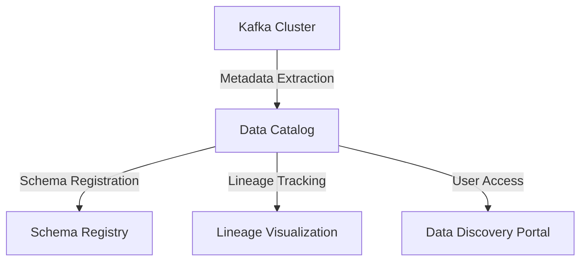

## 6.4.5 Data Catalog Integration

### Introduction

In the rapidly evolving landscape of data-driven enterprises, the ability to efficiently manage, discover, and govern data is paramount. Data catalogs play a crucial role in this ecosystem by providing a centralized repository for metadata management, enhancing data discoverability, and fostering collaboration among data stakeholders. Integrating Apache Kafka with data catalog tools can significantly enhance these capabilities, enabling organizations to harness the full potential of their data assets.

### Purpose of Data Catalogs in Data Ecosystems

Data catalogs serve as a comprehensive inventory of an organization's data assets, offering a unified view of data sources, schemas, lineage, and usage patterns. They facilitate:

- **Data Discoverability**: Allowing users to easily find and access relevant data sets.
- **Metadata Management**: Providing detailed information about data sources, including schema definitions, data types, and relationships.
- **Data Governance**: Ensuring compliance with data policies and regulations through robust access controls and audit trails.
- **Collaboration**: Enabling data professionals to share insights, annotations, and best practices.

### Cataloging Kafka Topics and Schemas

Apache Kafka, as a distributed streaming platform, generates a wealth of data that can be challenging to manage without a structured approach. By cataloging Kafka topics and schemas, organizations can achieve:

- **Enhanced Metadata Visibility**: By registering Kafka topics and their associated schemas in a data catalog, users gain visibility into the structure and semantics of streaming data.
- **Schema Evolution Tracking**: Data catalogs can track changes in Kafka schemas over time, ensuring compatibility and facilitating schema evolution.
- **Lineage and Impact Analysis**: Understanding the flow of data through Kafka topics and its transformation across different stages of processing.

#### Example: Cataloging Kafka Topics

Consider a Kafka topic named `customer-transactions` that streams financial transaction data. By integrating with a data catalog, you can:

- **Register the Topic**: Add `customer-transactions` to the catalog with metadata such as creation date, owner, and description.
- **Define the Schema**: Include the Avro or JSON schema used for the topic, detailing fields like `transaction_id`, `customer_id`, `amount`, and `timestamp`.
- **Track Lineage**: Document how data flows from the `customer-transactions` topic to downstream analytics applications or data lakes.

### Integrating Kafka with Data Catalog Platforms

Integrating Kafka with data catalog platforms involves several steps, including metadata extraction, schema registration, and lineage tracking. Here are some common approaches:

1. **Metadata Extraction**: Use Kafka Connect or custom scripts to extract metadata from Kafka topics and publish it to the data catalog.
2. **Schema Registration**: Leverage the [1.3.3 Schema Registry]( "Schema Registry") to manage and version Kafka schemas, and synchronize them with the data catalog.
3. **Lineage Tracking**: Implement tools like Apache Atlas or DataHub to capture data lineage and visualize the flow of data through Kafka topics.

#### Example: Integrating with Apache Atlas

Apache Atlas is an open-source data governance and metadata management platform that can be integrated with Kafka to enhance data cataloging capabilities. Here's how you can achieve this integration:

- **Install and Configure Atlas**: Set up Apache Atlas in your environment and configure it to connect with your Kafka cluster.
- **Define Kafka Entities**: Create entities in Atlas to represent Kafka topics, schemas, and data flows.
- **Automate Metadata Ingestion**: Use Kafka Connectors to automatically ingest metadata from Kafka topics into Atlas, ensuring real-time updates and consistency.

### Benefits of Kafka and Data Catalog Integration

Integrating Kafka with data catalog tools offers numerous benefits, including:

- **Improved Data Governance**: By centralizing metadata management, organizations can enforce data governance policies more effectively, ensuring compliance with regulations such as GDPR and CCPA.
- **User Empowerment**: Data catalogs empower users by providing self-service access to data assets, reducing dependency on IT teams and accelerating data-driven decision-making.
- **Enhanced Collaboration**: By fostering a collaborative environment, data catalogs enable data professionals to share insights, annotations, and best practices, driving innovation and efficiency.

### Popular Data Catalog Solutions

Several data catalog solutions are available in the market, each offering unique features and capabilities. Here are some popular options:

- **Apache Atlas**: An open-source data governance and metadata management platform that integrates seamlessly with Hadoop ecosystems and supports Kafka metadata management.
- **DataHub**: A modern data catalog platform developed by LinkedIn, designed for large-scale metadata management and lineage tracking.
- **Alation**: A commercial data catalog solution that offers robust search and discovery capabilities, along with AI-driven insights and recommendations.
- **Collibra**: A comprehensive data governance platform that provides data cataloging, lineage tracking, and policy management features.

### Code Examples

To illustrate the integration of Kafka with data catalog tools, let's explore some code examples in Java, Scala, Kotlin, and Clojure.

#### Java Example: Registering a Kafka Topic in Apache Atlas

```java
import org.apache.atlas.AtlasClientV2;
import org.apache.atlas.model.instance.AtlasEntity;
import org.apache.atlas.model.instance.AtlasEntity.AtlasEntityWithExtInfo;

public class KafkaAtlasIntegration {
    private static final String ATLAS_REST_ENDPOINT = "http://localhost:21000";
    private static final String KAFKA_TOPIC_NAME = "customer-transactions";

    public static void main(String[] args) {
        AtlasClientV2 atlasClient = new AtlasClientV2(new String[]{ATLAS_REST_ENDPOINT}, new String[]{"admin", "admin"});

        AtlasEntity kafkaTopicEntity = new AtlasEntity("kafka_topic");
        kafkaTopicEntity.setAttribute("name", KAFKA_TOPIC_NAME);
        kafkaTopicEntity.setAttribute("description", "Kafka topic for customer transactions");

        AtlasEntityWithExtInfo entityWithExtInfo = new AtlasEntityWithExtInfo(kafkaTopicEntity);
        atlasClient.createEntity(entityWithExtInfo);
    }
}
```

#### Scala Example: Extracting Metadata from Kafka Topics

```scala
import org.apache.kafka.clients.admin.{AdminClient, AdminClientConfig}
import scala.collection.JavaConverters._

object KafkaMetadataExtractor {
  def main(args: Array[String]): Unit = {
    val props = new java.util.Properties()
    props.put(AdminClientConfig.BOOTSTRAP_SERVERS_CONFIG, "localhost:9092")

    val adminClient = AdminClient.create(props)
    val topics = adminClient.listTopics().names().get().asScala

    topics.foreach { topic =>
      println(s"Topic: $topic")
      // Extract and register metadata in the data catalog
    }

    adminClient.close()
  }
}
```

#### Kotlin Example: Synchronizing Kafka Schemas with a Data Catalog

```kotlin
import io.confluent.kafka.schemaregistry.client.CachedSchemaRegistryClient
import io.confluent.kafka.schemaregistry.client.SchemaRegistryClient

fun main() {
    val schemaRegistryUrl = "http://localhost:8081"
    val schemaRegistryClient: SchemaRegistryClient = CachedSchemaRegistryClient(schemaRegistryUrl, 100)

    val subject = "customer-transactions-value"
    val schemaMetadata = schemaRegistryClient.getLatestSchemaMetadata(subject)

    println("Schema ID: ${schemaMetadata.id}")
    println("Schema Version: ${schemaMetadata.version}")
    println("Schema: ${schemaMetadata.schema}")
    // Synchronize schema with the data catalog
}
```

#### Clojure Example: Tracking Kafka Topic Lineage

```clojure
(ns kafka-lineage-tracker
  (:require [clojure.java.jdbc :as jdbc]))

(def db-spec {:subprotocol "postgresql"
              :subname "//localhost:5432/lineage_db"
              :user "user"
              :password "password"})

(defn track-lineage [topic]
  (jdbc/insert! db-spec :kafka_lineage {:topic topic
                                        :timestamp (java.time.Instant/now)}))

(defn -main []
  (let [topics ["customer-transactions" "order-events"]]
    (doseq [topic topics]
      (track-lineage topic)
      (println (str "Tracked lineage for topic: " topic)))))
```

### Visualizing Kafka and Data Catalog Integration

To better understand the integration process, let's visualize the architecture using a Mermaid.js diagram.



**Diagram Explanation**: This diagram illustrates the integration of a Kafka cluster with a data catalog. Metadata is extracted from Kafka topics and registered in the data catalog, which also tracks schema changes and lineage. Users access the data catalog through a discovery portal to explore data assets.

### Conclusion

Integrating Apache Kafka with data catalog tools is a strategic move for organizations aiming to enhance data discoverability, governance, and collaboration. By cataloging Kafka topics and schemas, businesses can achieve greater visibility into their data assets, streamline metadata management, and empower users with self-service access to data. As data ecosystems continue to evolve, the synergy between Kafka and data catalogs will play a pivotal role in driving data-driven innovation and efficiency.

### References and Further Reading

- [Apache Kafka Documentation](https://kafka.apache.org/documentation/)
- [Confluent Schema Registry](https://docs.confluent.io/platform/current/schema-registry/index.html)
- [Apache Atlas](https://atlas.apache.org/)
- [DataHub](https://datahubproject.io/)
- [Alation](https://www.alation.com/)
- [Collibra](https://www.collibra.com/)

## Test Your Knowledge: Data Catalog Integration with Kafka



### What is the primary purpose of integrating Kafka with a data catalog?

- [x] To enhance data discoverability and metadata management
- [ ] To increase data storage capacity
- [ ] To improve network latency
- [ ] To reduce data redundancy

> **Explanation:** Integrating Kafka with a data catalog primarily aims to enhance data discoverability and metadata management, allowing users to efficiently find and understand data assets.

### Which of the following is a benefit of using data catalogs?

- [x] Improved data governance
- [x] Enhanced collaboration
- [ ] Increased data redundancy
- [ ] Reduced data quality

> **Explanation:** Data catalogs improve data governance by centralizing metadata management and enhance collaboration by enabling data professionals to share insights and best practices.

### How can Kafka schemas be managed and versioned?

- [x] Using the Schema Registry
- [ ] Through manual updates
- [ ] By storing them in a file system
- [ ] Using a relational database

> **Explanation:** Kafka schemas can be managed and versioned using the Schema Registry, which provides a centralized repository for schema management.

### What tool can be used for lineage tracking in Kafka?

- [x] Apache Atlas
- [ ] Apache Flink
- [ ] Apache Spark
- [ ] Apache Hive

> **Explanation:** Apache Atlas is a tool that can be used for lineage tracking in Kafka, providing visibility into data flows and transformations.

### Which programming language is NOT shown in the code examples?

- [ ] Java
- [ ] Scala
- [ ] Kotlin
- [x] Python

> **Explanation:** The code examples provided are in Java, Scala, Kotlin, and Clojure, but not Python.

### What is a key feature of data catalogs?

- [x] Metadata management
- [ ] Data encryption
- [ ] Network optimization
- [ ] Hardware acceleration

> **Explanation:** A key feature of data catalogs is metadata management, which involves organizing and maintaining information about data assets.

### What is the role of the Schema Registry in Kafka?

- [x] To manage and version schemas
- [ ] To store raw data
- [ ] To optimize network traffic
- [ ] To encrypt data

> **Explanation:** The Schema Registry in Kafka is used to manage and version schemas, ensuring compatibility and facilitating schema evolution.

### Which of the following is a popular data catalog solution?

- [x] Apache Atlas
- [ ] Apache Kafka
- [ ] Apache Storm
- [ ] Apache Hadoop

> **Explanation:** Apache Atlas is a popular data catalog solution used for metadata management and data governance.

### What is the benefit of schema evolution tracking?

- [x] Ensures compatibility and facilitates schema changes
- [ ] Increases data storage
- [ ] Reduces network latency
- [ ] Enhances data encryption

> **Explanation:** Schema evolution tracking ensures compatibility and facilitates schema changes, allowing for seamless updates to data structures.

### True or False: Data catalogs can help in reducing dependency on IT teams for data access.

- [x] True
- [ ] False

> **Explanation:** True. Data catalogs empower users with self-service access to data assets, reducing dependency on IT teams for data access.


