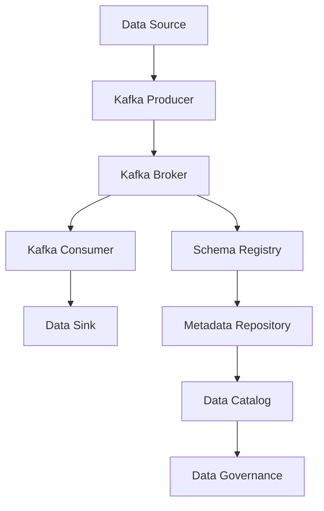

## 6.4.6 Metadata Management Tools and Practices

### Introduction

Metadata plays a crucial role in the effective management and utilization of data within Apache Kafka environments. As data flows through Kafka, metadata provides the necessary context, ensuring that data is well-documented, easily understood, and effectively governed. This section delves into the importance of metadata, explores tools for capturing and storing metadata, and outlines best practices for maintaining up-to-date metadata. Additionally, it highlights the role of metadata in data lineage and governance and provides strategies for automating metadata collection and updates.

### Understanding Metadata in Kafka

**Metadata** is data that describes other data, providing context and meaning. In Kafka environments, metadata includes information about data schemas, data sources, data transformations, and data destinations. It is essential for:

- **Data Discovery**: Helping users find and understand data.
- **Data Governance**: Ensuring data quality, compliance, and security.
- **Data Lineage**: Tracking data flow and transformations.
- **Data Integration**: Facilitating seamless data exchange between systems.

### Importance of Metadata in Kafka Environments

Metadata is vital for several reasons:

1. **Data Quality and Consistency**: Metadata ensures that data is consistent and adheres to defined standards, reducing errors and improving data quality.
2. **Compliance and Security**: Metadata helps in tracking data usage and access, ensuring compliance with regulations such as GDPR and CCPA.
3. **Operational Efficiency**: Metadata enables efficient data management, reducing the time and effort required to locate and understand data.
4. **Enhanced Collaboration**: Metadata provides a common understanding of data, facilitating collaboration among teams.

### Tools for Capturing and Storing Metadata

Several tools are available for capturing and storing metadata in Kafka environments. These tools help manage metadata effectively, ensuring that it is accessible and up-to-date.

#### Schema Registry

The [Schema Registry]( "Schema Registry") is a critical component of the Kafka ecosystem, providing a centralized repository for managing data schemas. It supports schema evolution and ensures that producers and consumers adhere to the defined schemas.

- **Features**:
  - **Schema Versioning**: Supports multiple versions of schemas, allowing for backward and forward compatibility.
  - **Schema Validation**: Ensures that data conforms to the defined schema, preventing schema-breaking changes.
  - **Integration with Kafka**: Seamlessly integrates with Kafka producers and consumers, providing schema information at runtime.

#### Metadata Repositories

Metadata repositories store metadata about data assets, providing a centralized location for managing metadata. They support metadata discovery, lineage tracking, and governance.

- **Examples**:
  - **Apache Atlas**: An open-source metadata management and data governance tool that integrates with Kafka to provide metadata discovery and lineage tracking.
  - **AWS Glue Data Catalog**: A fully managed metadata repository that integrates with AWS services, including Kafka, to provide metadata management and governance.

#### Data Catalogs

Data catalogs provide a searchable inventory of data assets, enabling users to discover and understand data. They support metadata management, data lineage, and governance.

- **Examples**:
  - **Alation**: A data catalog that provides metadata management, data discovery, and governance features.
  - **Collibra**: A data governance platform that includes a data catalog for managing metadata and ensuring data quality.

### Best Practices for Maintaining Up-to-Date Metadata

Maintaining up-to-date metadata is essential for ensuring data quality and governance. Here are some best practices:

1. **Automate Metadata Collection**: Use tools and scripts to automate the collection and updating of metadata, reducing manual effort and ensuring accuracy.
2. **Implement Change Management Processes**: Establish processes for managing changes to metadata, ensuring that updates are reviewed and approved.
3. **Regularly Review and Update Metadata**: Schedule regular reviews of metadata to ensure that it is accurate and up-to-date.
4. **Involve Stakeholders**: Engage stakeholders in the metadata management process to ensure that metadata meets their needs and requirements.

### Role of Metadata in Data Lineage and Governance

Metadata plays a crucial role in data lineage and governance, providing the context and information needed to track data flow and transformations.

#### Data Lineage

Data lineage tracks the flow of data from its source to its destination, capturing transformations and processing steps along the way. Metadata provides the necessary information to build and maintain data lineage, enabling:

- **Impact Analysis**: Understanding the impact of changes to data sources or transformations.
- **Root Cause Analysis**: Identifying the source of data quality issues.
- **Compliance**: Demonstrating compliance with data regulations by providing a clear audit trail of data processing.

#### Data Governance

Data governance ensures that data is managed and used in a way that meets organizational policies and regulatory requirements. Metadata supports data governance by providing:

- **Data Cataloging**: A comprehensive inventory of data assets, enabling data discovery and management.
- **Access Control**: Information about data access and usage, supporting security and compliance.
- **Data Quality**: Metadata about data quality metrics and standards, ensuring data accuracy and consistency.

### Strategies for Automating Metadata Collection and Updates

Automating metadata collection and updates is essential for maintaining accurate and up-to-date metadata. Here are some strategies:

1. **Integrate Metadata Tools with Data Pipelines**: Use tools that integrate with data pipelines to automatically capture and update metadata as data flows through the system.
2. **Use APIs for Metadata Management**: Leverage APIs provided by metadata management tools to automate metadata collection and updates.
3. **Implement Event-Driven Metadata Updates**: Use Kafka events to trigger metadata updates, ensuring that metadata is updated in real-time as data changes.
4. **Leverage Machine Learning for Metadata Enrichment**: Use machine learning algorithms to automatically enrich metadata, improving its accuracy and completeness.

### Code Examples

To illustrate the concepts discussed, let's explore some code examples in Java, Scala, Kotlin, and Clojure.

#### Java Example: Using Schema Registry

```java
import io.confluent.kafka.schemaregistry.client.CachedSchemaRegistryClient;
import io.confluent.kafka.schemaregistry.client.SchemaRegistryClient;
import io.confluent.kafka.schemaregistry.client.rest.exceptions.RestClientException;
import org.apache.avro.Schema;

import java.io.IOException;

public class SchemaRegistryExample {
    public static void main(String[] args) throws IOException, RestClientException {
        String schemaRegistryUrl = "http://localhost:8081";
        SchemaRegistryClient schemaRegistryClient = new CachedSchemaRegistryClient(schemaRegistryUrl, 100);

        String subject = "example-subject";
        Schema.Parser parser = new Schema.Parser();
        Schema schema = parser.parse("{\"type\":\"record\",\"name\":\"ExampleRecord\",\"fields\":[{\"name\":\"field1\",\"type\":\"string\"}]}");

        int schemaId = schemaRegistryClient.register(subject, schema);
        System.out.println("Schema registered with ID: " + schemaId);
    }
}
```

#### Scala Example: Using Apache Atlas

```scala
import org.apache.atlas.AtlasClientV2
import org.apache.atlas.model.instance.AtlasEntity
import org.apache.atlas.model.instance.AtlasEntity.AtlasEntityWithExtInfo

object AtlasExample {
  def main(args: Array[String]): Unit = {
    val atlasClient = new AtlasClientV2(Array("http://localhost:21000"), Array("admin", "admin"))

    val entity = new AtlasEntity("kafka_topic")
    entity.setAttribute("name", "example-topic")
    entity.setAttribute("description", "An example Kafka topic")

    val entityWithExtInfo = new AtlasEntityWithExtInfo(entity)
    val createdEntity = atlasClient.createEntity(entityWithExtInfo)
    println(s"Entity created with GUID: ${createdEntity.getGuid}")
  }
}
```

#### Kotlin Example: Automating Metadata Updates

```kotlin
import io.confluent.kafka.schemaregistry.client.CachedSchemaRegistryClient
import io.confluent.kafka.schemaregistry.client.SchemaRegistryClient
import org.apache.avro.Schema

fun main() {
    val schemaRegistryUrl = "http://localhost:8081"
    val schemaRegistryClient: SchemaRegistryClient = CachedSchemaRegistryClient(schemaRegistryUrl, 100)

    val subject = "example-subject"
    val schema = Schema.Parser().parse("""{"type":"record","name":"ExampleRecord","fields":[{"name":"field1","type":"string"}]}""")

    val schemaId = schemaRegistryClient.register(subject, schema)
    println("Schema registered with ID: $schemaId")
}
```

#### Clojure Example: Metadata Management with Kafka

```clojure
(ns kafka.metadata
  (:require [clj-http.client :as client]))

(defn register-schema [schema-registry-url subject schema]
  (let [response (client/post (str schema-registry-url "/subjects/" subject "/versions")
                              {:body (json/write-str {:schema schema})
                               :headers {"Content-Type" "application/vnd.schemaregistry.v1+json"}})]
    (println "Schema registered with ID:" (:id (json/read-str (:body response))))))

(def schema-registry-url "http://localhost:8081")
(def subject "example-subject")
(def schema "{\"type\":\"record\",\"name\":\"ExampleRecord\",\"fields\":[{\"name\":\"field1\",\"type\":\"string\"}]}")

(register-schema schema-registry-url subject schema)
```

### Visualizing Metadata Management

To better understand metadata management in Kafka, let's visualize the process using a flowchart.



**Caption**: This flowchart illustrates the flow of data and metadata in a Kafka environment, highlighting the integration of Schema Registry, Metadata Repository, and Data Catalog for effective metadata management.

### Conclusion

Metadata management is a critical aspect of data governance and lineage in Apache Kafka environments. By leveraging tools such as Schema Registry, metadata repositories, and data catalogs, organizations can ensure that metadata is well-documented, easily accessible, and up-to-date. Implementing best practices and automation strategies further enhances metadata management, supporting data quality, compliance, and operational efficiency.

## Test Your Knowledge: Metadata Management in Apache Kafka Quiz



### What is the primary role of metadata in Kafka environments?

- [x] Providing context and meaning to data
- [ ] Storing data in Kafka topics
- [ ] Managing Kafka brokers
- [ ] Configuring Kafka producers

> **Explanation:** Metadata provides context and meaning to data, helping users understand and manage data effectively.

### Which tool is commonly used for managing data schemas in Kafka?

- [x] Schema Registry
- [ ] Apache Atlas
- [ ] AWS Glue
- [ ] Alation

> **Explanation:** Schema Registry is used for managing data schemas in Kafka, providing schema versioning and validation.

### What is a key benefit of automating metadata collection?

- [x] Reducing manual effort and ensuring accuracy
- [ ] Increasing data volume
- [ ] Enhancing data encryption
- [ ] Improving network speed

> **Explanation:** Automating metadata collection reduces manual effort and ensures that metadata is accurate and up-to-date.

### How does metadata support data lineage?

- [x] By tracking data flow and transformations
- [ ] By encrypting data at rest
- [ ] By compressing data
- [ ] By balancing Kafka partitions

> **Explanation:** Metadata supports data lineage by tracking data flow and transformations, providing a clear audit trail.

### Which practice is essential for maintaining up-to-date metadata?

- [x] Regularly reviewing and updating metadata
- [ ] Increasing Kafka broker count
- [ ] Disabling schema validation
- [ ] Reducing data retention period

> **Explanation:** Regularly reviewing and updating metadata ensures that it remains accurate and relevant.

### What is the role of a metadata repository?

- [x] Storing metadata about data assets
- [ ] Storing Kafka messages
- [ ] Managing Kafka consumer groups
- [ ] Configuring Kafka topics

> **Explanation:** A metadata repository stores metadata about data assets, providing a centralized location for metadata management.

### Which tool provides a searchable inventory of data assets?

- [x] Data Catalog
- [ ] Kafka Connect
- [ ] Kafka Streams
- [ ] Zookeeper

> **Explanation:** A data catalog provides a searchable inventory of data assets, enabling data discovery and management.

### What is a common use case for data lineage?

- [x] Impact analysis and compliance
- [ ] Data encryption
- [ ] Network optimization
- [ ] Topic partitioning

> **Explanation:** Data lineage is commonly used for impact analysis and compliance, providing a clear audit trail of data processing.

### Which strategy can be used for automating metadata updates?

- [x] Integrating metadata tools with data pipelines
- [ ] Increasing Kafka topic replication
- [ ] Disabling schema validation
- [ ] Reducing data retention period

> **Explanation:** Integrating metadata tools with data pipelines automates metadata updates, ensuring real-time accuracy.

### True or False: Metadata is only important for data discovery.

- [ ] True
- [x] False

> **Explanation:** Metadata is important for data discovery, governance, lineage, and integration, providing context and meaning to data.


