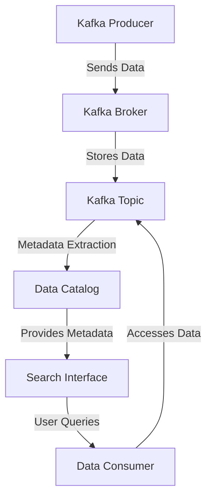

## 6.4.7 Ensuring Data Discoverability

In the modern data-driven enterprise, ensuring data discoverability is crucial for maximizing the value of data assets. Apache Kafka, as a distributed streaming platform, plays a pivotal role in real-time data processing and integration. However, the vast amounts of data flowing through Kafka can lead to challenges in data discoverability, resulting in data silos and underutilized resources. This section explores strategies for making data in Kafka easily discoverable, promoting reuse and collaboration while maintaining governance controls.

### Understanding the Challenges of Data Silos and Lack of Discoverability

Data silos occur when data is isolated within departments or systems, making it difficult for other parts of the organization to access and leverage it. This lack of discoverability can lead to several issues:

- **Redundancy and Inconsistency**: Different teams may collect and store the same data independently, leading to redundancy and potential inconsistencies.
- **Inefficient Resource Utilization**: Valuable data may go unused because potential users are unaware of its existence or cannot access it.
- **Hindered Collaboration**: Teams may struggle to collaborate effectively without a shared understanding of available data assets.
- **Compliance Risks**: Without proper governance, organizations may face compliance risks related to data privacy and security.

To address these challenges, organizations must implement robust strategies for cataloging, indexing, and managing Kafka data assets.

### Strategies for Cataloging and Indexing Kafka Data Assets

Effective cataloging and indexing of Kafka data assets are foundational to ensuring data discoverability. Here are some strategies to consider:

#### 1. Implementing a Data Catalog

A data catalog serves as a centralized repository that provides metadata about data assets, making them easier to discover and understand. Key features of a data catalog include:

- **Metadata Management**: Capture and manage metadata such as data source, schema, data owner, and usage history.
- **Search and Discovery**: Enable users to search for data assets using keywords, tags, and filters.
- **Data Lineage**: Track the flow of data through Kafka, providing visibility into data transformations and dependencies.

#### 2. Leveraging Metadata Tagging

Metadata tagging involves associating descriptive tags with data assets to facilitate search and discovery. Consider the following best practices:

- **Standardized Tagging**: Develop a standardized taxonomy for tags to ensure consistency across the organization.
- **Automated Tagging**: Use automated tools to apply tags based on data characteristics and usage patterns.
- **User-Generated Tags**: Allow users to add custom tags to data assets, capturing additional context and insights.

#### 3. Utilizing Search Interfaces

Search interfaces provide a user-friendly way for individuals to discover and access Kafka data assets. Key considerations include:

- **Intuitive User Experience**: Design search interfaces that are easy to navigate and use, with features like autocomplete and faceted search.
- **Advanced Search Capabilities**: Support advanced search queries, including boolean operators and wildcard searches.
- **Integration with Existing Tools**: Integrate search interfaces with existing data tools and platforms to streamline workflows.

### Importance of Access Controls and Security

Ensuring data discoverability must be balanced with robust access controls and security measures to protect sensitive information. Consider the following strategies:

#### 1. Role-Based Access Control (RBAC)

RBAC restricts access to data assets based on user roles, ensuring that individuals only have access to the data they need. Key components include:

- **Role Definitions**: Define roles based on job functions and responsibilities.
- **Permission Assignment**: Assign permissions to roles, specifying which data assets can be accessed and what actions can be performed.
- **Audit Trails**: Maintain audit logs to track access and modifications to data assets.

#### 2. Data Encryption

Encrypting data both at rest and in transit is essential for protecting sensitive information. Consider the following:

- **Encryption Standards**: Use industry-standard encryption algorithms to secure data.
- **Key Management**: Implement robust key management practices to ensure the security of encryption keys.

#### 3. Compliance with Data Regulations

Ensure that data discoverability efforts comply with relevant data protection regulations, such as GDPR and CCPA. Key considerations include:

- **Data Minimization**: Limit the collection and retention of personal data to what is necessary for specific purposes.
- **User Consent**: Obtain and manage user consent for data processing activities.

### Fostering a Data-Driven Culture Through Discoverability

Promoting a data-driven culture within an organization requires more than just technical solutions. It involves fostering an environment where data is valued and leveraged for decision-making. Consider the following strategies:

#### 1. Encouraging Data Literacy

Data literacy refers to the ability to read, understand, and work with data. To promote data literacy:

- **Training and Education**: Provide training programs and resources to help employees develop data skills.
- **Data Champions**: Identify and empower data champions within the organization to advocate for data-driven practices.

#### 2. Promoting Collaboration and Sharing

Encourage collaboration and sharing of data assets across teams and departments. Consider the following:

- **Cross-Functional Teams**: Establish cross-functional teams to work on data projects and initiatives.
- **Incentives for Sharing**: Provide incentives for teams and individuals who contribute to data sharing and collaboration efforts.

#### 3. Aligning Data Discoverability with Business Goals

Ensure that data discoverability efforts align with the organization's business goals and objectives. Consider the following:

- **Strategic Alignment**: Align data initiatives with strategic priorities and key performance indicators (KPIs).
- **Continuous Improvement**: Regularly assess and improve data discoverability efforts to ensure they meet evolving business needs.

### Practical Applications and Real-World Scenarios

To illustrate the importance of data discoverability, consider the following real-world scenarios:

#### Scenario 1: Enhancing Customer Insights

A retail company uses Kafka to process customer transaction data in real-time. By implementing a data catalog and metadata tagging, the company can easily discover and analyze customer behavior patterns, leading to improved marketing strategies and personalized customer experiences.

#### Scenario 2: Streamlining Supply Chain Operations

A manufacturing company leverages Kafka to integrate data from various supply chain systems. By ensuring data discoverability, the company can quickly identify bottlenecks and optimize operations, resulting in increased efficiency and reduced costs.

#### Scenario 3: Supporting Regulatory Compliance

A financial services firm uses Kafka to process transaction data for compliance reporting. By implementing robust access controls and encryption, the firm can ensure data discoverability while maintaining compliance with regulatory requirements.

### Code Examples

To demonstrate the implementation of data discoverability strategies, consider the following code examples in Java, Scala, Kotlin, and Clojure.

#### Java Example: Metadata Tagging

```java
import org.apache.kafka.clients.producer.ProducerRecord;
import org.apache.kafka.common.header.Header;
import org.apache.kafka.common.header.internals.RecordHeader;

import java.nio.charset.StandardCharsets;
import java.util.List;

public class MetadataTaggingExample {
    public static void main(String[] args) {
        ProducerRecord<String, String> record = new ProducerRecord<>("topic", "key", "value");
        List<Header> headers = List.of(
            new RecordHeader("tag", "customer-data".getBytes(StandardCharsets.UTF_8)),
            new RecordHeader("department", "marketing".getBytes(StandardCharsets.UTF_8))
        );
        headers.forEach(record::headers::add);
        // Send the record to Kafka
    }
}
```

#### Scala Example: Metadata Tagging

```scala
import org.apache.kafka.clients.producer.ProducerRecord
import org.apache.kafka.common.header.internals.RecordHeader
import java.nio.charset.StandardCharsets

object MetadataTaggingExample extends App {
  val record = new ProducerRecord[String, String]("topic", "key", "value")
  val headers = List(
    new RecordHeader("tag", "customer-data".getBytes(StandardCharsets.UTF_8)),
    new RecordHeader("department", "marketing".getBytes(StandardCharsets.UTF_8))
  )
  headers.foreach(record.headers.add)
  // Send the record to Kafka
}
```

#### Kotlin Example: Metadata Tagging

```kotlin
import org.apache.kafka.clients.producer.ProducerRecord
import org.apache.kafka.common.header.internals.RecordHeader
import java.nio.charset.StandardCharsets

fun main() {
    val record = ProducerRecord("topic", "key", "value")
    val headers = listOf(
        RecordHeader("tag", "customer-data".toByteArray(StandardCharsets.UTF_8)),
        RecordHeader("department", "marketing".toByteArray(StandardCharsets.UTF_8))
    )
    headers.forEach { record.headers().add(it) }
    // Send the record to Kafka
}
```

#### Clojure Example: Metadata Tagging

```clojure
(require '[clojure.java.io :as io])
(import '[org.apache.kafka.clients.producer ProducerRecord]
        '[org.apache.kafka.common.header.internals RecordHeader])

(defn create-record []
  (let [record (ProducerRecord. "topic" "key" "value")
        headers [(RecordHeader. "tag" (.getBytes "customer-data" "UTF-8"))
                 (RecordHeader. "department" (.getBytes "marketing" "UTF-8"))]]
    (doseq [header headers]
      (.add (.headers record) header))
    ;; Send the record to Kafka
    record))
```

### Visualizing Data Discoverability

To better understand the concept of data discoverability, consider the following diagram illustrating the flow of data and metadata in a Kafka-based system.



**Diagram Caption**: This diagram illustrates the flow of data and metadata in a Kafka-based system, highlighting the role of the data catalog and search interface in ensuring data discoverability.

### References and Links

- [Apache Kafka Documentation](https://kafka.apache.org/documentation/)
- [Confluent Documentation](https://docs.confluent.io/)
- [Data Catalogs: A Comprehensive Guide](https://www.datacatalogs.com/)
- [GDPR Compliance and Data Governance](https://gdpr.eu/)
- [CCPA Compliance Guide](https://oag.ca.gov/privacy/ccpa)

## Test Your Knowledge: Data Discoverability in Apache Kafka



### What is a primary challenge of data silos?

- [x] Redundancy and inconsistency
- [ ] Increased collaboration
- [ ] Enhanced data security
- [ ] Simplified data governance

> **Explanation:** Data silos lead to redundancy and inconsistency as different teams may collect and store the same data independently.

### Which of the following is a feature of a data catalog?

- [x] Metadata management
- [ ] Data encryption
- [ ] Network optimization
- [ ] Load balancing

> **Explanation:** A data catalog provides metadata management, enabling users to discover and understand data assets.

### What is the purpose of metadata tagging?

- [x] To facilitate search and discovery
- [ ] To encrypt data
- [ ] To balance network load
- [ ] To manage user permissions

> **Explanation:** Metadata tagging helps in facilitating search and discovery by associating descriptive tags with data assets.

### How does role-based access control (RBAC) enhance data security?

- [x] By restricting access based on user roles
- [ ] By encrypting data at rest
- [ ] By optimizing network performance
- [ ] By managing metadata

> **Explanation:** RBAC enhances data security by restricting access to data assets based on user roles.

### What is a benefit of promoting data literacy in an organization?

- [x] Improved decision-making
- [ ] Increased data redundancy
- [ ] Simplified network architecture
- [ ] Enhanced data encryption

> **Explanation:** Promoting data literacy leads to improved decision-making as employees can better understand and work with data.

### Which strategy helps in aligning data discoverability with business goals?

- [x] Strategic alignment
- [ ] Data encryption
- [ ] Network optimization
- [ ] Load balancing

> **Explanation:** Strategic alignment ensures that data discoverability efforts align with the organization's business goals and objectives.

### What is a key consideration for ensuring compliance with data regulations?

- [x] User consent management
- [ ] Network load balancing
- [ ] Data redundancy
- [ ] Metadata tagging

> **Explanation:** User consent management is crucial for ensuring compliance with data regulations like GDPR and CCPA.

### How can a search interface enhance data discoverability?

- [x] By providing an intuitive user experience
- [ ] By encrypting data
- [ ] By optimizing network performance
- [ ] By managing user permissions

> **Explanation:** A search interface enhances data discoverability by providing an intuitive user experience for finding data assets.

### What is a real-world application of data discoverability?

- [x] Enhancing customer insights
- [ ] Increasing data redundancy
- [ ] Simplifying network architecture
- [ ] Enhancing data encryption

> **Explanation:** Data discoverability can enhance customer insights by making it easier to analyze customer behavior patterns.

### True or False: Data discoverability efforts should be aligned with business goals.

- [x] True
- [ ] False

> **Explanation:** Aligning data discoverability efforts with business goals ensures that they support the organization's strategic priorities.



By implementing these strategies, organizations can ensure that data in Kafka is easily discoverable, promoting reuse and collaboration while maintaining governance controls. This not only maximizes the value of data assets but also fosters a data-driven culture that supports informed decision-making and innovation.
