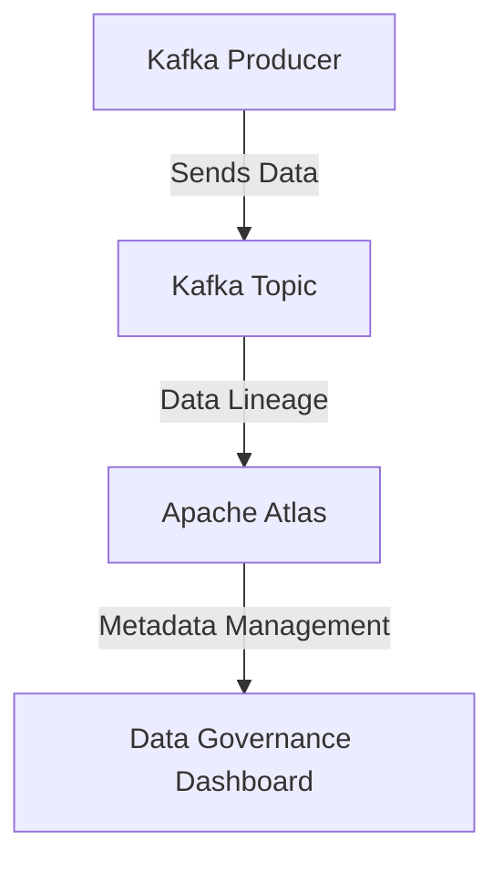

## 6.4 Data Governance and Lineage in Kafka

### Introduction

In the realm of distributed streaming systems, **data governance** and **data lineage** are paramount for ensuring data quality, compliance, and operational efficiency. Apache Kafka, as a leading platform for real-time data processing, necessitates robust governance practices to manage the vast amounts of data flowing through its pipelines. This section delves into the concepts of data governance and lineage, their significance in Kafka environments, and strategies for effective implementation.

### Understanding Data Governance and Lineage

**Data Governance** refers to the overall management of data availability, usability, integrity, and security in an enterprise. It encompasses policies, processes, and standards that ensure data is managed effectively throughout its lifecycle.

**Data Lineage** is the process of tracking the origin, movement, and transformation of data across systems. It provides a visual map of data flow, helping organizations understand how data is processed and transformed over time.

#### Importance in Distributed Streaming Systems

In distributed streaming systems like Kafka, data governance and lineage are crucial for several reasons:

1. **Compliance**: Regulations such as GDPR and CCPA require organizations to have clear visibility and control over their data. Data lineage helps demonstrate compliance by providing traceability of data movement and transformations.

2. **Data Quality**: Ensuring data quality is essential for making informed business decisions. Data governance frameworks help maintain data accuracy and consistency across Kafka streams.

3. **Operational Efficiency**: Understanding data flow and transformations can optimize data processing pipelines, reducing latency and improving system performance.

4. **Security**: Data governance ensures that sensitive data is protected and access is controlled, preventing unauthorized use or breaches.

### Tools and Frameworks for Tracking Data Lineage in Kafka

Several tools and frameworks can be integrated with Kafka to track data lineage and enhance governance:

#### Apache Atlas

Apache Atlas is a scalable and extensible set of core foundational governance services that enable enterprises to meet their compliance requirements. It provides a framework for modeling metadata, managing data lineage, and ensuring data governance.

- **Integration with Kafka**: Apache Atlas can be integrated with Kafka to capture metadata and lineage information. It provides a comprehensive view of data flow across Kafka topics, producers, and consumers.

*Diagram 1: Integration of Apache Atlas with Kafka for Data Lineage Tracking*

#### Confluent Control Center

Confluent Control Center is a management and monitoring tool for Apache Kafka. It provides capabilities for monitoring data flow, managing Kafka clusters, and ensuring data governance.

- **Features**: It offers features such as real-time monitoring, alerting, and visualization of data lineage, helping organizations maintain control over their Kafka environments.

#### LinkedIn's DataHub

DataHub is an open-source metadata platform for the modern data stack. It provides a centralized platform for managing metadata, tracking data lineage, and ensuring data governance.

- **Kafka Integration**: DataHub can be integrated with Kafka to capture metadata and lineage information, providing a unified view of data flow across the organization.

### Strategies for Integrating Kafka with Data Governance Platforms

Integrating Kafka with data governance platforms requires careful planning and execution. Here are some strategies to consider:

1. **Define Data Policies**: Establish clear data governance policies that outline data management practices, roles, and responsibilities. Ensure these policies are aligned with organizational goals and regulatory requirements.

2. **Leverage Schema Registry**: Use [1.3.3 Schema Registry]( "Schema Registry") to enforce data schemas and ensure data consistency across Kafka topics. This helps maintain data quality and traceability.

3. **Implement Metadata Management**: Use tools like Apache Atlas or DataHub to capture and manage metadata across Kafka streams. This provides a comprehensive view of data flow and transformations.

4. **Automate Data Lineage Tracking**: Automate the process of capturing and tracking data lineage using tools like Confluent Control Center. This reduces manual effort and ensures accurate lineage information.

5. **Integrate with Data Governance Tools**: Integrate Kafka with existing data governance tools to leverage their capabilities for managing data policies, tracking lineage, and ensuring compliance.

### Compliance Considerations for Regulations like GDPR and CCPA

Compliance with regulations such as GDPR and CCPA is a critical aspect of data governance. These regulations mandate organizations to have clear visibility and control over their data. Here are some compliance considerations for Kafka environments:

1. **Data Subject Rights**: Ensure that data subjects can exercise their rights, such as the right to access, rectify, or delete their data. Implement mechanisms to track and manage these requests across Kafka streams.

2. **Data Minimization**: Collect and process only the data necessary for specific purposes. Use data governance frameworks to enforce data minimization policies across Kafka topics.

3. **Data Security**: Implement robust security measures to protect sensitive data. Use encryption, access controls, and monitoring tools to safeguard data in Kafka environments.

4. **Data Breach Notification**: Establish processes for detecting and responding to data breaches. Ensure that data lineage information is available to identify affected data and notify relevant parties.

5. **Data Transfer**: Ensure that data transfers comply with regulatory requirements. Use data governance tools to track and manage data transfers across Kafka streams.

### Best Practices for Maintaining Data Governance in Kafka Deployments

Maintaining data governance in Kafka deployments requires a combination of policies, processes, and tools. Here are some best practices to consider:

1. **Establish a Data Governance Framework**: Develop a comprehensive data governance framework that outlines data management practices, roles, and responsibilities. Ensure this framework is aligned with organizational goals and regulatory requirements.

2. **Use Data Lineage Tools**: Implement tools like Apache Atlas or DataHub to capture and manage data lineage across Kafka streams. This provides a comprehensive view of data flow and transformations.

3. **Enforce Data Quality Standards**: Use [6.1 Schema Design Strategies]( "Schema Design Strategies") to enforce data quality standards across Kafka topics. This helps maintain data accuracy and consistency.

4. **Monitor Data Flow**: Use monitoring tools like Confluent Control Center to track data flow and detect anomalies. This helps ensure data governance policies are being followed.

5. **Regularly Review and Update Policies**: Regularly review and update data governance policies to ensure they remain relevant and effective. This helps address changing regulatory requirements and organizational goals.

6. **Train and Educate Stakeholders**: Provide training and education to stakeholders on data governance practices and tools. This helps ensure everyone understands their roles and responsibilities in maintaining data governance.

### Conclusion

Data governance and lineage are critical components of managing data in Apache Kafka environments. By implementing robust governance frameworks, leveraging tools for tracking data lineage, and ensuring compliance with regulations, organizations can maintain control over their data and optimize their Kafka deployments. As data continues to grow in volume and complexity, effective data governance will become increasingly important for ensuring data quality, compliance, and operational efficiency.

## Test Your Knowledge: Data Governance and Lineage in Kafka Quiz



### What is the primary purpose of data governance in Kafka environments?

- [x] To manage data availability, usability, integrity, and security
- [ ] To increase data processing speed
- [ ] To reduce storage costs
- [ ] To enhance user interface design

> **Explanation:** Data governance ensures that data is managed effectively throughout its lifecycle, focusing on availability, usability, integrity, and security.

### Which tool provides a framework for modeling metadata and managing data lineage in Kafka?

- [x] Apache Atlas
- [ ] Apache Flink
- [ ] Apache Spark
- [ ] Apache Hive

> **Explanation:** Apache Atlas provides a scalable and extensible set of core foundational governance services, including metadata modeling and data lineage management.

### What is a key benefit of implementing data lineage in Kafka?

- [x] Demonstrating compliance with regulations
- [ ] Increasing data storage capacity
- [ ] Reducing network latency
- [ ] Enhancing graphical user interfaces

> **Explanation:** Data lineage helps organizations demonstrate compliance with regulations by providing traceability of data movement and transformations.

### Which regulation requires organizations to have clear visibility and control over their data?

- [x] GDPR
- [ ] PCI DSS
- [ ] SOX
- [ ] HIPAA

> **Explanation:** GDPR mandates organizations to have clear visibility and control over their data, ensuring data protection and privacy.

### What is a best practice for maintaining data governance in Kafka deployments?

- [x] Establishing a comprehensive data governance framework
- [ ] Increasing the number of Kafka brokers
- [ ] Reducing the number of Kafka topics
- [ ] Enhancing the graphical user interface

> **Explanation:** Establishing a comprehensive data governance framework ensures that data management practices, roles, and responsibilities are clearly defined and aligned with organizational goals.

### Which tool can be used to monitor data flow and detect anomalies in Kafka environments?

- [x] Confluent Control Center
- [ ] Apache Hadoop
- [ ] Apache Cassandra
- [ ] Apache Storm

> **Explanation:** Confluent Control Center provides capabilities for monitoring data flow, managing Kafka clusters, and ensuring data governance.

### What is a compliance consideration for regulations like GDPR and CCPA in Kafka environments?

- [x] Ensuring data subject rights can be exercised
- [ ] Increasing data processing speed
- [ ] Reducing storage costs
- [ ] Enhancing user interface design

> **Explanation:** Compliance with regulations like GDPR and CCPA requires organizations to ensure that data subject rights can be exercised, such as the right to access, rectify, or delete data.

### Which tool can be integrated with Kafka to capture metadata and lineage information?

- [x] DataHub
- [ ] Apache Flink
- [ ] Apache Spark
- [ ] Apache Hive

> **Explanation:** DataHub is an open-source metadata platform that can be integrated with Kafka to capture metadata and lineage information.

### What is a strategy for integrating Kafka with data governance platforms?

- [x] Automating data lineage tracking
- [ ] Increasing the number of Kafka brokers
- [ ] Reducing the number of Kafka topics
- [ ] Enhancing the graphical user interface

> **Explanation:** Automating data lineage tracking reduces manual effort and ensures accurate lineage information, facilitating integration with data governance platforms.

### True or False: Data governance is only important for compliance purposes.

- [ ] True
- [x] False

> **Explanation:** Data governance is important not only for compliance but also for ensuring data quality, operational efficiency, and security.



By understanding and implementing data governance and lineage in Kafka, organizations can ensure compliance, maintain data quality, and optimize their data processing pipelines. This section provides the foundational knowledge and practical strategies needed to achieve these goals.
