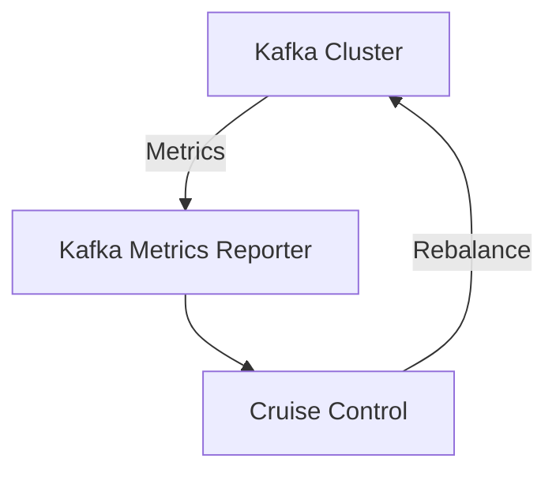
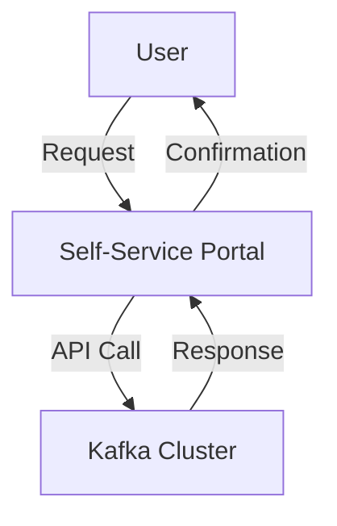

## 6.5.2 Tools for Topic Management

In the realm of Apache Kafka, managing topics efficiently is crucial for maintaining a scalable and robust data streaming platform. This section delves into the various tools and frameworks available to aid in Kafka topic management, focusing on automation, integration with CI/CD pipelines, and the benefits of self-service portals. We will explore both open-source and commercial solutions, providing practical examples and insights into their application in real-world scenarios.

### Introduction to Kafka Topic Management

Kafka topics are the fundamental units of data organization within a Kafka cluster. They serve as the conduits through which data flows, and managing them effectively is vital for ensuring data integrity, performance, and scalability. As organizations scale their Kafka deployments, the complexity of managing topics increases, necessitating the use of specialized tools and frameworks.

### Open-Source Tools for Topic Management

#### Kafka Topic Command

The Kafka Topic Command is a built-in tool that provides basic functionalities for managing Kafka topics. It allows users to create, delete, list, and describe topics within a Kafka cluster. This command-line tool is essential for administrators who need to perform quick and straightforward operations on topics.

**Example Usage:**

```bash
# Create a new topic
kafka-topics.sh --create --topic my-topic --bootstrap-server localhost:9092 --partitions 3 --replication-factor 2

# List all topics
kafka-topics.sh --list --bootstrap-server localhost:9092

# Describe a topic
kafka-topics.sh --describe --topic my-topic --bootstrap-server localhost:9092
```

**Benefits:**
- Simple and quick to use for basic topic management tasks.
- No additional setup required beyond Kafka installation.

**Limitations:**
- Lacks advanced features such as monitoring and automated scaling.
- Requires manual intervention for complex operations.

#### LinkedIn's Cruise Control

Cruise Control is an open-source tool developed by LinkedIn to automate the management of Kafka clusters. It provides features for load balancing, partition reassignment, and topic management, making it a powerful tool for maintaining optimal cluster performance.

**Key Features:**
- Automated partition rebalancing to ensure even load distribution.
- Topic anomaly detection and resolution.
- Integration with Kafka's metrics to provide insights into cluster health.

**Example Integration:**



**Caption**: Cruise Control integrates with Kafka's metrics to automate partition rebalancing and topic management.

**Benefits:**
- Reduces manual effort in managing cluster performance.
- Provides a comprehensive view of cluster health and topic distribution.

**Limitations:**
- Requires additional setup and configuration.
- May introduce complexity in environments with strict security requirements.

**Further Reading**: [Kafka Cruise Control](https://github.com/linkedin/cruise-control)

### Commercial Tools for Topic Management

#### Confluent Control Center

Confluent Control Center is a commercial tool that offers a graphical interface for managing Kafka clusters, including topic management. It provides real-time monitoring, alerting, and management capabilities, making it suitable for enterprise environments.

**Key Features:**
- Visual dashboards for monitoring topic performance and health.
- Automated alerting for topic-related issues.
- Integration with Confluent's ecosystem for enhanced functionality.

**Benefits:**
- User-friendly interface for non-technical users.
- Comprehensive monitoring and alerting capabilities.

**Limitations:**
- Requires a commercial license.
- May not be suitable for small-scale deployments due to cost.

### Integrating Topic Management into CI/CD Pipelines

Automating Kafka topic management within CI/CD pipelines can significantly enhance the efficiency and reliability of data streaming applications. By integrating topic management tasks into CI/CD workflows, organizations can ensure consistent and error-free deployments.

**Steps for Integration:**

1. **Define Topic Configuration as Code**: Use configuration files or scripts to define topic properties such as partitions and replication factors.

2. **Automate Topic Creation and Deletion**: Incorporate scripts into CI/CD pipelines to automate the creation and deletion of topics during deployment.

3. **Monitor and Validate**: Use automated tests to validate topic configurations and monitor their performance post-deployment.

**Example CI/CD Pipeline Integration:**

```yaml
stages:
  - setup
  - deploy
  - test

setup:
  script:
    - ./scripts/setup-kafka-topics.sh

deploy:
  script:
    - ./scripts/deploy-application.sh

test:
  script:
    - ./scripts/test-kafka-topics.sh
```

**Benefits:**
- Ensures consistency and reduces human error in topic management.
- Facilitates rapid deployment and scaling of Kafka applications.

### Self-Service Portals for Topic Provisioning

Self-service portals empower teams to manage Kafka topics without requiring direct intervention from administrators. These portals provide a user-friendly interface for creating, modifying, and deleting topics, streamlining the process and reducing bottlenecks.

**Key Features:**
- Role-based access control to ensure security and compliance.
- Audit logs for tracking changes and ensuring accountability.
- Integration with existing IT infrastructure for seamless operation.

**Benefits:**
- Reduces the workload on Kafka administrators.
- Enhances agility by allowing teams to manage their own topics.

**Example Implementation:**



**Caption**: A self-service portal allows users to manage Kafka topics through a user-friendly interface.

### Conclusion

Effective Kafka topic management is essential for maintaining a scalable and reliable data streaming platform. By leveraging the tools and frameworks discussed in this section, organizations can automate common tasks, integrate topic management into CI/CD pipelines, and empower teams through self-service portals. These practices not only enhance operational efficiency but also ensure that Kafka deployments remain robust and adaptable to changing business needs.

## Test Your Knowledge: Mastering Kafka Topic Management Tools



### Which tool is primarily used for basic Kafka topic management tasks?

- [x] Kafka Topic Command
- [ ] Cruise Control
- [ ] Confluent Control Center
- [ ] Jenkins

> **Explanation:** The Kafka Topic Command is a built-in tool for basic topic management tasks such as creating, listing, and describing topics.

### What is a key feature of LinkedIn's Cruise Control?

- [x] Automated partition rebalancing
- [ ] Graphical user interface
- [ ] Self-service portal
- [ ] CI/CD integration

> **Explanation:** Cruise Control automates partition rebalancing to ensure even load distribution across the Kafka cluster.

### How can Kafka topic management be integrated into CI/CD pipelines?

- [x] By automating topic creation and deletion
- [ ] By using a graphical interface
- [ ] By manually configuring topics
- [ ] By using self-service portals

> **Explanation:** Automating topic creation and deletion within CI/CD pipelines ensures consistent and error-free deployments.

### What is a benefit of using self-service portals for topic provisioning?

- [x] Reduces workload on Kafka administrators
- [ ] Provides automated partition rebalancing
- [ ] Offers a commercial license
- [ ] Requires manual intervention

> **Explanation:** Self-service portals empower teams to manage Kafka topics independently, reducing the workload on administrators.

### Which of the following is a commercial tool for Kafka topic management?

- [x] Confluent Control Center
- [ ] Kafka Topic Command
- [ ] Cruise Control
- [ ] Jenkins

> **Explanation:** Confluent Control Center is a commercial tool that offers a graphical interface for managing Kafka clusters.

### What is the primary limitation of the Kafka Topic Command?

- [x] Lacks advanced features
- [ ] Requires a commercial license
- [ ] Provides automated alerting
- [ ] Offers a graphical interface

> **Explanation:** The Kafka Topic Command lacks advanced features such as monitoring and automated scaling.

### What is a key benefit of integrating topic management into CI/CD pipelines?

- [x] Ensures consistency and reduces human error
- [ ] Provides a graphical interface
- [ ] Requires manual intervention
- [ ] Offers a commercial license

> **Explanation:** Integrating topic management into CI/CD pipelines ensures consistent and error-free deployments.

### What is a key feature of Confluent Control Center?

- [x] Visual dashboards for monitoring
- [ ] Automated partition rebalancing
- [ ] Self-service portal
- [ ] CI/CD integration

> **Explanation:** Confluent Control Center offers visual dashboards for monitoring topic performance and health.

### Which tool provides a user-friendly interface for non-technical users?

- [x] Confluent Control Center
- [ ] Kafka Topic Command
- [ ] Cruise Control
- [ ] Jenkins

> **Explanation:** Confluent Control Center provides a graphical interface that is user-friendly for non-technical users.

### True or False: Self-service portals for topic provisioning require direct intervention from administrators.

- [ ] True
- [x] False

> **Explanation:** Self-service portals empower teams to manage Kafka topics independently, reducing the need for direct intervention from administrators.



By mastering these tools and techniques, you can ensure that your Kafka deployments are efficient, scalable, and aligned with your organization's data streaming needs.
