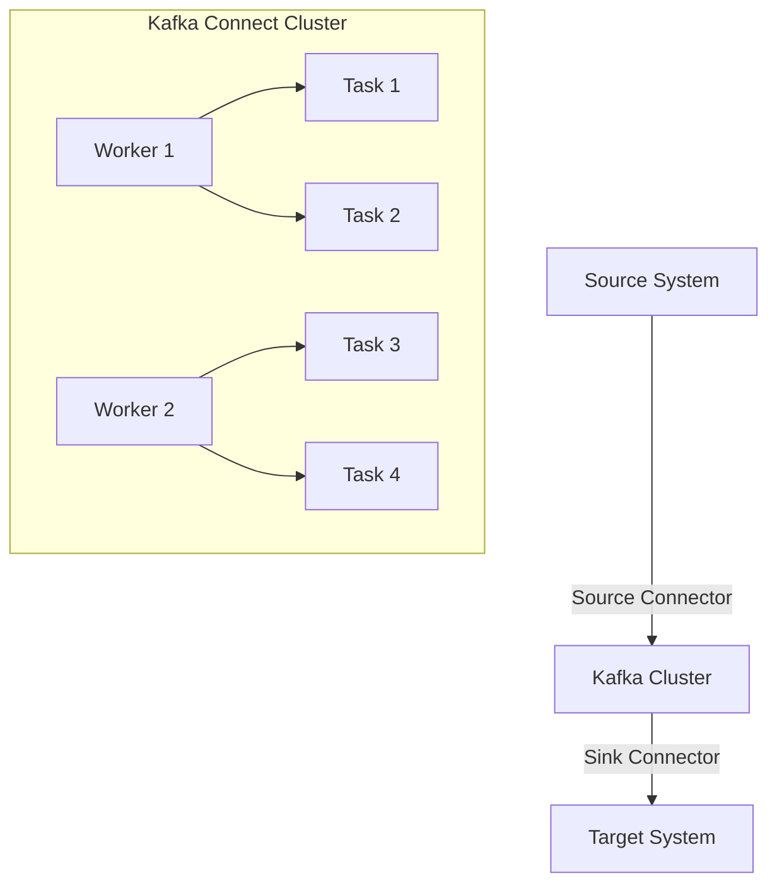

## 7.1.1.1 Connect Architecture and Components

Apache Kafka Connect is a powerful tool designed to simplify the integration of Kafka with various data systems. It provides a scalable and fault-tolerant framework for streaming data between Kafka and other systems, such as databases, key-value stores, search indexes, and file systems. This section delves into the architecture of Kafka Connect, explaining its core components and how they interact to enable effective data integration.

### Key Components of Kafka Connect

Kafka Connect is built around several key components: connectors, tasks, and workers. Understanding these components is crucial to leveraging Kafka Connect effectively.

#### Connectors

Connectors are the high-level abstractions that define how data should be moved between Kafka and another system. They come in two types:

- **Source Connectors**: These are responsible for pulling data from an external system into Kafka. For example, a source connector might read data from a database and write it to a Kafka topic.
- **Sink Connectors**: These push data from Kafka to an external system. For instance, a sink connector might read data from a Kafka topic and write it to a data warehouse.

Each connector is configured with specific parameters that define its behavior, such as the Kafka topics to read from or write to, the external system's connection details, and any transformation logic to apply to the data.

#### Tasks

Tasks are the units of work that perform the actual data movement. A connector can be broken down into multiple tasks to parallelize data processing and improve throughput. Each task is responsible for a subset of the data handled by the connector. For example, a source connector reading from a database might have multiple tasks, each responsible for reading from a different table or partition.

#### Workers

Workers are the processes that execute connectors and tasks. They can run in two modes:

- **Standalone Mode**: In this mode, a single worker runs all connectors and tasks. This is suitable for development and testing environments but lacks scalability and fault tolerance.
- **Distributed Mode**: In this mode, multiple workers collaborate to execute connectors and tasks. This mode provides scalability and fault tolerance, as tasks can be distributed across multiple workers, and if one worker fails, another can take over its tasks.

### Kafka Connect Architecture

The architecture of Kafka Connect is designed to be scalable and fault-tolerant. It achieves this through its distributed mode, which allows multiple workers to share the load of executing connectors and tasks.



**Diagram**: This diagram illustrates the Kafka Connect architecture, showing how source and sink connectors interact with a Kafka cluster, and how tasks are distributed across multiple workers in a distributed mode.

### Standalone vs. Distributed Mode

The choice between standalone and distributed mode depends on the use case and environment.

- **Standalone Mode**: This mode is simpler to set up and manage, making it ideal for development and testing. However, it is limited to a single worker, which means it cannot scale beyond the capacity of that worker and lacks fault tolerance.

- **Distributed Mode**: This mode is more complex to set up but offers significant advantages in production environments. It allows for horizontal scaling by adding more workers, and it provides fault tolerance by redistributing tasks if a worker fails.

### Scalability and Fault Tolerance

Kafka Connect achieves scalability and fault tolerance through its distributed architecture. By distributing tasks across multiple workers, Kafka Connect can handle large volumes of data and continue operating even if some workers fail.

- **Scalability**: Adding more workers to a Kafka Connect cluster allows it to handle more tasks and process more data. This horizontal scaling is crucial for large-scale data integration scenarios.

- **Fault Tolerance**: In distributed mode, if a worker fails, its tasks are automatically reassigned to other workers. This ensures that data processing continues without interruption.

### Practical Applications and Real-World Scenarios

Kafka Connect is widely used in various industries for real-time data integration. Some common use cases include:

- **Data Ingestion**: Streaming data from databases, message queues, or file systems into Kafka for real-time processing and analytics.
- **Data Export**: Moving processed data from Kafka to data warehouses, search indexes, or other storage systems for further analysis and reporting.
- **Data Synchronization**: Keeping data in sync between different systems, such as replicating data from a primary database to a backup system.

### Code Examples

To illustrate the use of Kafka Connect, let's look at some code examples in Java, Scala, Kotlin, and Clojure.

#### Java Example

```java
import org.apache.kafka.connect.source.SourceConnector;
import org.apache.kafka.connect.source.SourceTask;

public class MySourceConnector extends SourceConnector {
    @Override
    public void start(Map<String, String> props) {
        // Initialize the connector with the provided properties
    }

    @Override
    public Class<? extends Task> taskClass() {
        return MySourceTask.class;
    }

    @Override
    public List<Map<String, String>> taskConfigs(int maxTasks) {
        // Return configurations for each task
        return Collections.singletonList(Collections.emptyMap());
    }

    @Override
    public void stop() {
        // Clean up resources
    }

    @Override
    public ConfigDef config() {
        return new ConfigDef();
    }

    @Override
    public String version() {
        return "1.0";
    }
}
```

#### Scala Example

```scala
import org.apache.kafka.connect.source.{SourceConnector, SourceTask}

class MySourceConnector extends SourceConnector {
  override def start(props: java.util.Map[String, String]): Unit = {
    // Initialize the connector with the provided properties
  }

  override def taskClass(): Class[_ <: SourceTask] = classOf[MySourceTask]

  override def taskConfigs(maxTasks: Int): java.util.List[java.util.Map[String, String]] = {
    // Return configurations for each task
    java.util.Collections.singletonList(java.util.Collections.emptyMap())
  }

  override def stop(): Unit = {
    // Clean up resources
  }

  override def config(): ConfigDef = new ConfigDef()

  override def version(): String = "1.0"
}
```

#### Kotlin Example

```kotlin
import org.apache.kafka.connect.source.SourceConnector
import org.apache.kafka.connect.source.SourceTask

class MySourceConnector : SourceConnector() {
    override fun start(props: Map<String, String>) {
        // Initialize the connector with the provided properties
    }

    override fun taskClass(): Class<out SourceTask> = MySourceTask::class.java

    override fun taskConfigs(maxTasks: Int): List<Map<String, String>> {
        // Return configurations for each task
        return listOf(emptyMap())
    }

    override fun stop() {
        // Clean up resources
    }

    override fun config(): ConfigDef = ConfigDef()

    override fun version(): String = "1.0"
}
```

#### Clojure Example

```clojure
(ns my-source-connector
  (:import [org.apache.kafka.connect.source SourceConnector SourceTask]
           [java.util Map List Collections]))

(defn -start [this props]
  ;; Initialize the connector with the provided properties
  )

(defn -taskClass [this]
  MySourceTask)

(defn -taskConfigs [this maxTasks]
  ;; Return configurations for each task
  (Collections/singletonList (Collections/emptyMap)))

(defn -stop [this]
  ;; Clean up resources
  )

(defn -config [this]
  (ConfigDef.))

(defn -version [this]
  "1.0")
```

### Conclusion

Kafka Connect is a versatile and powerful tool for integrating Kafka with a wide range of data systems. Its architecture, based on connectors, tasks, and workers, provides a scalable and fault-tolerant framework for real-time data integration. By understanding the components and architecture of Kafka Connect, you can effectively leverage it to build robust data pipelines.

### Knowledge Check

To reinforce your understanding of Kafka Connect architecture and components, try answering the following questions.

## Test Your Knowledge: Kafka Connect Architecture Quiz



### What are the two types of connectors in Kafka Connect?

- [x] Source and Sink
- [ ] Producer and Consumer
- [ ] Input and Output
- [ ] Publisher and Subscriber

> **Explanation:** Kafka Connect uses source connectors to pull data into Kafka and sink connectors to push data from Kafka to other systems.

### In which mode does Kafka Connect provide scalability and fault tolerance?

- [x] Distributed Mode
- [ ] Standalone Mode
- [ ] Single Node Mode
- [ ] Cluster Mode

> **Explanation:** Distributed mode allows Kafka Connect to scale horizontally and provides fault tolerance by distributing tasks across multiple workers.

### What is the role of a worker in Kafka Connect?

- [x] To execute connectors and tasks
- [ ] To manage Kafka topics
- [ ] To produce and consume messages
- [ ] To store data in Kafka

> **Explanation:** Workers are responsible for executing connectors and tasks in Kafka Connect.

### How does Kafka Connect achieve fault tolerance?

- [x] By redistributing tasks if a worker fails
- [ ] By using redundant connectors
- [ ] By storing data in multiple Kafka topics
- [ ] By using backup servers

> **Explanation:** In distributed mode, if a worker fails, its tasks are automatically reassigned to other workers, ensuring continuous data processing.

### Which component of Kafka Connect is responsible for the actual data movement?

- [x] Tasks
- [ ] Connectors
- [ ] Workers
- [ ] Brokers

> **Explanation:** Tasks are the units of work that perform the actual data movement in Kafka Connect.

### What is a key advantage of using Kafka Connect in distributed mode?

- [x] Horizontal scalability
- [ ] Simplicity of setup
- [ ] Lower resource usage
- [ ] Faster data processing

> **Explanation:** Distributed mode allows Kafka Connect to scale horizontally by adding more workers.

### What is the primary function of a source connector?

- [x] To pull data from an external system into Kafka
- [ ] To push data from Kafka to an external system
- [ ] To manage Kafka topics
- [ ] To execute tasks

> **Explanation:** Source connectors are responsible for pulling data from external systems into Kafka.

### What is the purpose of the `taskConfigs` method in a connector?

- [x] To return configurations for each task
- [ ] To initialize the connector
- [ ] To clean up resources
- [ ] To define the connector's version

> **Explanation:** The `taskConfigs` method returns configurations for each task that the connector will execute.

### In Kafka Connect, what is a common use case for sink connectors?

- [x] Exporting data from Kafka to data warehouses
- [ ] Importing data from databases to Kafka
- [ ] Managing Kafka clusters
- [ ] Monitoring Kafka performance

> **Explanation:** Sink connectors are commonly used to export data from Kafka to data warehouses or other storage systems.

### True or False: Standalone mode in Kafka Connect is suitable for production environments.

- [ ] True
- [x] False

> **Explanation:** Standalone mode lacks scalability and fault tolerance, making it unsuitable for production environments.


