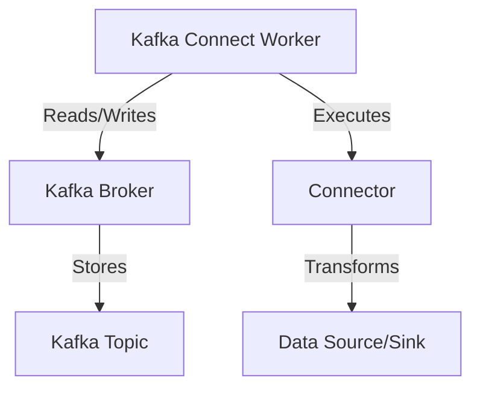

## 7.1.1.2 Setup and Configuration

Setting up and configuring Kafka Connect is a critical step in integrating Apache Kafka with various data sources and sinks. This guide provides a detailed walkthrough of the installation process, configuration options, and deployment considerations for both standalone and distributed modes. By the end of this section, you will have a comprehensive understanding of how to effectively set up Kafka Connect in different environments.

### Introduction to Kafka Connect Setup

Kafka Connect is a powerful tool for streaming data between Apache Kafka and other systems. It simplifies the process of building and managing data pipelines, making it an essential component for real-time data integration. This section will guide you through the setup and configuration of Kafka Connect, ensuring you can leverage its full potential in your data architecture.

### Installation of Kafka Connect

#### Prerequisites

Before installing Kafka Connect, ensure that you have the following prerequisites:

- **Java Development Kit (JDK)**: Kafka Connect requires Java 8 or later. Ensure that the JDK is installed and configured on your system.
- **Apache Kafka**: Kafka Connect is part of the Kafka distribution. Download and install the latest version of Apache Kafka from the [official website](https://kafka.apache.org/downloads).
- **Zookeeper**: Although Kafka is moving towards the KRaft architecture, ZooKeeper is still required for older versions. Ensure ZooKeeper is installed and running if needed.

#### Installation Steps

1. **Download Apache Kafka**: Obtain the latest Kafka distribution from the [Apache Kafka Downloads page](https://kafka.apache.org/downloads).

2. **Extract the Kafka Archive**: Unzip the downloaded Kafka archive to a directory of your choice. This directory will be referred to as `KAFKA_HOME`.

3. **Start ZooKeeper**: If using ZooKeeper, navigate to the `KAFKA_HOME` directory and start ZooKeeper using the following command:

    ```bash
    bin/zookeeper-server-start.sh config/zookeeper.properties
    ```

4. **Start Kafka Broker**: In a new terminal, start the Kafka broker:

    ```bash
    bin/kafka-server-start.sh config/server.properties
    ```

5. **Verify Installation**: Ensure that both ZooKeeper and Kafka broker are running without errors.

### Configuration of Kafka Connect Workers

Kafka Connect can be run in two modes: standalone and distributed. Each mode has its own configuration requirements and use cases.

#### Standalone Mode

Standalone mode is suitable for development and testing environments where simplicity is preferred over scalability and fault tolerance.

- **Configuration File**: The standalone configuration file is typically located at `config/connect-standalone.properties`.

- **Key Configuration Options**:
  - `bootstrap.servers`: Specifies the Kafka brokers to connect to.
  - `key.converter` and `value.converter`: Define the serialization format for keys and values (e.g., Avro, JSON, String).
  - `offset.storage.file.filename`: Specifies the file to store offset data.

- **Example Configuration**:

    ```properties
    bootstrap.servers=localhost:9092
    key.converter=org.apache.kafka.connect.json.JsonConverter
    value.converter=org.apache.kafka.connect.json.JsonConverter
    offset.storage.file.filename=/tmp/connect.offsets
    ```

#### Distributed Mode

Distributed mode is designed for production environments, offering scalability and fault tolerance by distributing tasks across multiple worker nodes.

- **Configuration File**: The distributed configuration file is typically located at `config/connect-distributed.properties`.

- **Key Configuration Options**:
  - `bootstrap.servers`: Specifies the Kafka brokers to connect to.
  - `group.id`: Defines the consumer group ID for the Connect cluster.
  - `config.storage.topic`, `offset.storage.topic`, `status.storage.topic`: Specify the Kafka topics for storing configuration, offsets, and status.

- **Example Configuration**:

    ```properties
    bootstrap.servers=localhost:9092
    group.id=connect-cluster
    key.converter=org.apache.kafka.connect.json.JsonConverter
    value.converter=org.apache.kafka.connect.json.JsonConverter
    config.storage.topic=connect-configs
    offset.storage.topic=connect-offsets
    status.storage.topic=connect-status
    ```

### Deployment Considerations

#### Development Environment

In a development environment, you can run Kafka Connect in standalone mode for simplicity. This setup allows you to quickly test connectors and configurations without the overhead of managing a distributed cluster.

- **Advantages**: Easy to set up and manage, suitable for local testing.
- **Limitations**: Not fault-tolerant or scalable, single point of failure.

#### Production Environment

For production deployments, distributed mode is recommended. This mode provides high availability and scalability by distributing tasks across multiple worker nodes.

- **Advantages**: Fault-tolerant, scalable, supports dynamic rebalancing of tasks.
- **Considerations**:
  - **Resource Allocation**: Ensure sufficient resources (CPU, memory) are allocated to each worker node.
  - **Network Configuration**: Optimize network settings for low latency and high throughput.
  - **Monitoring and Logging**: Implement monitoring and logging to track the health and performance of the Connect cluster.

### Common Pitfalls and Troubleshooting Tips

- **Connector Configuration Errors**: Ensure that connector configurations are valid and compatible with the Kafka Connect version.
- **Network Issues**: Verify network connectivity between Kafka Connect workers and Kafka brokers.
- **Resource Constraints**: Monitor system resources to prevent bottlenecks and ensure optimal performance.
- **Offset Management**: Regularly check offset storage to prevent data loss or duplication.

### Example Configuration Files

Below are example configuration files for both standalone and distributed modes:

#### Standalone Configuration

```properties
# Standalone mode configuration
bootstrap.servers=localhost:9092
key.converter=org.apache.kafka.connect.json.JsonConverter
value.converter=org.apache.kafka.connect.json.JsonConverter
offset.storage.file.filename=/tmp/connect.offsets
```

#### Distributed Configuration

```properties
# Distributed mode configuration
bootstrap.servers=localhost:9092
group.id=connect-cluster
key.converter=org.apache.kafka.connect.json.JsonConverter
value.converter=org.apache.kafka.connect.json.JsonConverter
config.storage.topic=connect-configs
offset.storage.topic=connect-offsets
status.storage.topic=connect-status
```

### Visualizing Kafka Connect Architecture

To better understand the architecture of Kafka Connect, consider the following diagram illustrating the data flow and components involved:



**Diagram Description**: This diagram shows the interaction between Kafka Connect workers, Kafka brokers, connectors, and data sources/sinks. Workers execute connectors that read from or write to Kafka topics, facilitating data integration.

### References and Further Reading

- [Apache Kafka Documentation](https://kafka.apache.org/documentation/)
- [Confluent Documentation](https://docs.confluent.io/)
- [Kafka Connect User Guide](https://kafka.apache.org/documentation/#connect)

### Knowledge Check

To reinforce your understanding of Kafka Connect setup and configuration, consider the following questions and exercises:

1. **What are the key differences between standalone and distributed modes in Kafka Connect?**
2. **How would you configure a Kafka Connect worker to use Avro serialization?**
3. **What are the common pitfalls when deploying Kafka Connect in a production environment?**
4. **Experiment with modifying the configuration files to use different converters and observe the changes.**

### Conclusion

Setting up and configuring Kafka Connect is a crucial step in building robust data integration pipelines. By understanding the installation process, configuration options, and deployment considerations, you can effectively leverage Kafka Connect to integrate data across diverse systems. Remember to monitor and optimize your setup to ensure high performance and reliability.

## Test Your Knowledge: Kafka Connect Setup and Configuration Quiz



### What is the primary purpose of Kafka Connect?

- [x] To stream data between Kafka and other systems
- [ ] To manage Kafka brokers
- [ ] To provide a user interface for Kafka
- [ ] To store Kafka topics

> **Explanation:** Kafka Connect is designed to facilitate data integration by streaming data between Kafka and various data sources and sinks.

### Which mode of Kafka Connect is suitable for production environments?

- [ ] Standalone mode
- [x] Distributed mode
- [ ] Single-node mode
- [ ] Cluster mode

> **Explanation:** Distributed mode is recommended for production environments due to its scalability and fault tolerance.

### What is the role of the `bootstrap.servers` configuration in Kafka Connect?

- [x] It specifies the Kafka brokers to connect to
- [ ] It defines the storage location for offsets
- [ ] It sets the logging level for Kafka Connect
- [ ] It configures the network protocol used by Kafka Connect

> **Explanation:** The `bootstrap.servers` configuration specifies the Kafka brokers that Kafka Connect will connect to for data streaming.

### How can you ensure fault tolerance in a Kafka Connect deployment?

- [x] Use distributed mode with multiple worker nodes
- [ ] Run Kafka Connect in standalone mode
- [ ] Disable offset storage
- [ ] Use a single Kafka broker

> **Explanation:** Distributed mode with multiple worker nodes provides fault tolerance by distributing tasks across the cluster.

### What is a common pitfall when configuring Kafka Connect?

- [x] Incorrect connector configurations
- [ ] Using JSON serialization
- [ ] Running Kafka Connect on Linux
- [ ] Using multiple connectors

> **Explanation:** Incorrect connector configurations can lead to errors and data integration issues.

### Which configuration file is used for standalone mode?

- [x] connect-standalone.properties
- [ ] connect-distributed.properties
- [ ] server.properties
- [ ] zookeeper.properties

> **Explanation:** The `connect-standalone.properties` file is used to configure Kafka Connect in standalone mode.

### What is the purpose of the `offset.storage.topic` configuration in distributed mode?

- [x] To specify the Kafka topic for storing offsets
- [ ] To define the key serialization format
- [ ] To set the logging level
- [ ] To configure the network protocol

> **Explanation:** The `offset.storage.topic` configuration specifies the Kafka topic where offsets are stored in distributed mode.

### How can you monitor the performance of a Kafka Connect cluster?

- [x] Implement monitoring and logging
- [ ] Disable logging
- [ ] Use standalone mode
- [ ] Run on a single node

> **Explanation:** Monitoring and logging are essential for tracking the health and performance of a Kafka Connect cluster.

### What is the advantage of using JSON converters in Kafka Connect?

- [x] They provide a human-readable format
- [ ] They offer the highest performance
- [ ] They are the only supported format
- [ ] They require no configuration

> **Explanation:** JSON converters provide a human-readable format, making it easier to debug and understand data.

### True or False: Kafka Connect can only be used with Apache Kafka.

- [x] True
- [ ] False

> **Explanation:** Kafka Connect is specifically designed to integrate with Apache Kafka, streaming data between Kafka and other systems.


