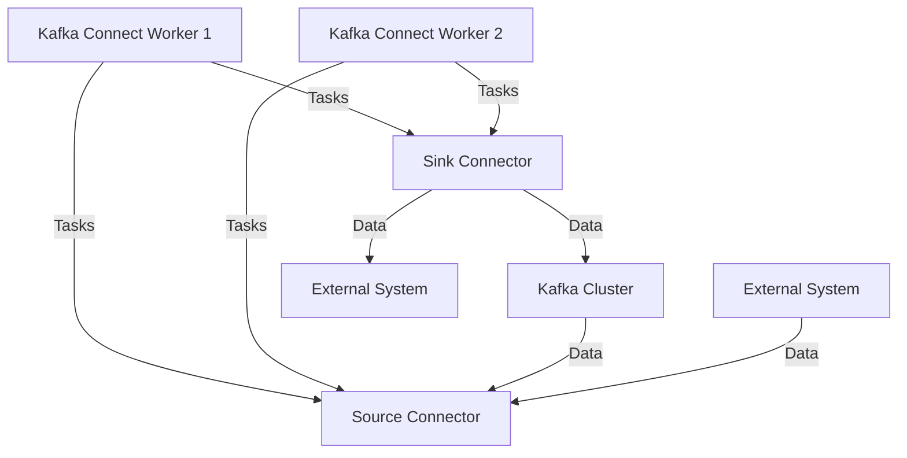

## 7.1.2.2 Configuration and Deployment

In this section, we delve into the intricacies of configuring and deploying Kafka Connect source and sink connectors. This guide is tailored for expert software engineers and enterprise architects who aim to harness the full potential of Kafka Connect in their data integration strategies. We will explore how to define connector configurations, deploy them in standalone and distributed modes, and manage them using the REST API. Additionally, we will cover best practices for updating and restarting connectors to ensure seamless data flow.

### Defining Connector Configurations

Connector configurations are crucial for defining how a connector interacts with Kafka and external systems. These configurations are typically specified in properties files, which include key-value pairs that dictate the behavior of the connector.

#### Key Configuration Properties

1. **Connector Class**: Specifies the Java class for the connector.
   - Example: `connector.class=org.apache.kafka.connect.file.FileStreamSinkConnector`

2. **Tasks Max**: Defines the maximum number of tasks that should be created for this connector.
   - Example: `tasks.max=1`

3. **Topics**: Lists the topics that the connector should read from or write to.
   - Example: `topics=my_topic`

4. **Key and Value Converters**: Specify the converters for the key and value of the messages.
   - Example: 
     ```properties
     key.converter=org.apache.kafka.connect.storage.StringConverter
     value.converter=org.apache.kafka.connect.storage.StringConverter
     ```

5. **Additional Properties**: Depending on the connector, additional properties may be required. For instance, a JDBC source connector might need database connection details.

#### Example Configuration for a File Sink Connector

```properties
name=file-sink-connector
connector.class=org.apache.kafka.connect.file.FileStreamSinkConnector
tasks.max=1
file=/tmp/output.txt
topics=my_topic
key.converter=org.apache.kafka.connect.storage.StringConverter
value.converter=org.apache.kafka.connect.storage.StringConverter
```

### Deploying Connectors

Kafka Connect supports two deployment modes: standalone and distributed. Each mode has its use cases and benefits.

#### Standalone Mode

Standalone mode is suitable for simple use cases, such as testing or small-scale deployments, where a single worker node is sufficient.

- **Configuration**: In standalone mode, both the worker and connector configurations are specified in a single properties file.
- **Execution**: Run the connector using the Kafka Connect standalone script.
  ```bash
  connect-standalone.sh connect-standalone.properties file-sink-connector.properties
  ```

#### Distributed Mode

Distributed mode is ideal for production environments, offering scalability and fault tolerance by distributing the workload across multiple worker nodes.

- **Configuration**: Worker configurations are separate from connector configurations. Workers communicate with each other to balance the load.
- **Execution**: Deploy connectors using the REST API to submit configurations to the Kafka Connect cluster.

### Monitoring and Managing Connectors

Kafka Connect provides a REST API for managing connectors, which allows you to create, configure, and monitor connectors programmatically.

#### Using the REST API

1. **Create a Connector**: Send a POST request with the connector configuration.
   ```bash
   curl -X POST -H "Content-Type: application/json" --data '{"name": "file-sink-connector", "config": {...}}' http://localhost:8083/connectors
   ```

2. **List Connectors**: Retrieve a list of all connectors.
   ```bash
   curl -X GET http://localhost:8083/connectors
   ```

3. **Get Connector Status**: Check the status of a specific connector.
   ```bash
   curl -X GET http://localhost:8083/connectors/file-sink-connector/status
   ```

4. **Update a Connector**: Modify the configuration of an existing connector.
   ```bash
   curl -X PUT -H "Content-Type: application/json" --data '{"config": {...}}' http://localhost:8083/connectors/file-sink-connector/config
   ```

5. **Delete a Connector**: Remove a connector from the cluster.
   ```bash
   curl -X DELETE http://localhost:8083/connectors/file-sink-connector
   ```

### Best Practices for Updating and Restarting Connectors

1. **Version Control**: Maintain version control of connector configurations to track changes and roll back if necessary.

2. **Incremental Updates**: Apply configuration changes incrementally to minimize disruption.

3. **Graceful Restarts**: Use the REST API to pause and resume connectors for updates, ensuring minimal data loss.

4. **Monitoring**: Continuously monitor connector performance and logs to detect issues early.

5. **Testing**: Test configuration changes in a staging environment before applying them to production.

### Practical Applications and Real-World Scenarios

Kafka Connect is widely used in various industries for integrating disparate data systems. Here are a few scenarios where configuring and deploying connectors is crucial:

- **Data Ingestion**: Use source connectors to ingest data from databases, message queues, or file systems into Kafka for real-time processing.
- **Data Export**: Deploy sink connectors to export processed data from Kafka to data warehouses, search indexes, or other storage systems.
- **ETL Pipelines**: Integrate Kafka Connect with ETL processes to streamline data transformation and loading.

### Code Examples

To illustrate the configuration and deployment process, let's explore code examples in multiple languages.

#### Java Example

```java
import org.apache.kafka.connect.runtime.ConnectorConfig;
import java.util.Properties;

public class KafkaConnectorConfig {
    public static void main(String[] args) {
        Properties props = new Properties();
        props.put("name", "file-sink-connector");
        props.put("connector.class", "org.apache.kafka.connect.file.FileStreamSinkConnector");
        props.put("tasks.max", "1");
        props.put("file", "/tmp/output.txt");
        props.put("topics", "my_topic");
        props.put("key.converter", "org.apache.kafka.connect.storage.StringConverter");
        props.put("value.converter", "org.apache.kafka.connect.storage.StringConverter");

        // Deploy the connector using the Kafka Connect API
        // Example code for deploying the connector
    }
}
```

#### Scala Example

```scala
import java.util.Properties

object KafkaConnectorConfig {
  def main(args: Array[String]): Unit = {
    val props = new Properties()
    props.put("name", "file-sink-connector")
    props.put("connector.class", "org.apache.kafka.connect.file.FileStreamSinkConnector")
    props.put("tasks.max", "1")
    props.put("file", "/tmp/output.txt")
    props.put("topics", "my_topic")
    props.put("key.converter", "org.apache.kafka.connect.storage.StringConverter")
    props.put("value.converter", "org.apache.kafka.connect.storage.StringConverter")

    // Deploy the connector using the Kafka Connect API
    // Example code for deploying the connector
  }
}
```

#### Kotlin Example

```kotlin
import java.util.Properties

fun main() {
    val props = Properties().apply {
        put("name", "file-sink-connector")
        put("connector.class", "org.apache.kafka.connect.file.FileStreamSinkConnector")
        put("tasks.max", "1")
        put("file", "/tmp/output.txt")
        put("topics", "my_topic")
        put("key.converter", "org.apache.kafka.connect.storage.StringConverter")
        put("value.converter", "org.apache.kafka.connect.storage.StringConverter")
    }

    // Deploy the connector using the Kafka Connect API
    // Example code for deploying the connector
}
```

#### Clojure Example

```clojure
(defn configure-connector []
  (let [props (java.util.Properties.)]
    (.put props "name" "file-sink-connector")
    (.put props "connector.class" "org.apache.kafka.connect.file.FileStreamSinkConnector")
    (.put props "tasks.max" "1")
    (.put props "file" "/tmp/output.txt")
    (.put props "topics" "my_topic")
    (.put props "key.converter" "org.apache.kafka.connect.storage.StringConverter")
    (.put props "value.converter" "org.apache.kafka.connect.storage.StringConverter")
    ;; Deploy the connector using the Kafka Connect API
    ;; Example code for deploying the connector
    ))
```

### Visualizing Kafka Connect Deployment

To better understand the deployment process, let's visualize the architecture of a Kafka Connect cluster in distributed mode.



**Caption**: This diagram illustrates a Kafka Connect cluster in distributed mode, where multiple workers handle tasks for source and sink connectors, interacting with a Kafka cluster and external systems.

### References and Links

- [Apache Kafka Documentation](https://kafka.apache.org/documentation/)
- [Confluent Documentation](https://docs.confluent.io/)
- [Kafka Connect REST API](https://docs.confluent.io/platform/current/connect/references/restapi.html)

### Knowledge Check

To reinforce your understanding of configuring and deploying Kafka Connectors, try answering the following questions.

## Test Your Knowledge: Kafka Connect Configuration and Deployment Quiz



### What is the primary purpose of connector configurations in Kafka Connect?

- [x] To define how a connector interacts with Kafka and external systems.
- [ ] To manage Kafka broker settings.
- [ ] To configure Kafka topic partitions.
- [ ] To set up Kafka consumer groups.

> **Explanation:** Connector configurations specify how a connector should interact with Kafka and external systems, including properties like connector class, tasks, and topics.

### Which deployment mode is recommended for production environments in Kafka Connect?

- [ ] Standalone mode
- [x] Distributed mode
- [ ] Local mode
- [ ] Cluster mode

> **Explanation:** Distributed mode is recommended for production environments as it offers scalability and fault tolerance by distributing the workload across multiple worker nodes.

### How can you create a connector using the Kafka Connect REST API?

- [x] By sending a POST request with the connector configuration to the Connect REST endpoint.
- [ ] By editing the Kafka broker configuration file.
- [ ] By using the Kafka command-line tools.
- [ ] By modifying the Kafka consumer properties.

> **Explanation:** Connectors can be created using the REST API by sending a POST request with the configuration to the Connect REST endpoint.

### What is a best practice for updating Kafka Connectors?

- [x] Apply configuration changes incrementally to minimize disruption.
- [ ] Restart the entire Kafka cluster.
- [ ] Delete and recreate the connector.
- [ ] Ignore monitoring and logs.

> **Explanation:** Applying configuration changes incrementally helps minimize disruption and ensures a smooth transition.

### Which of the following is a key configuration property for a Kafka Connector?

- [x] connector.class
- [ ] broker.id
- [ ] zookeeper.connect
- [ ] log.retention.hours

> **Explanation:** The `connector.class` property specifies the Java class for the connector, which is essential for its configuration.

### What is the role of the Kafka Connect REST API?

- [x] To manage connectors programmatically, including creation, configuration, and monitoring.
- [ ] To configure Kafka broker settings.
- [ ] To manage Kafka consumer groups.
- [ ] To set up Kafka topic partitions.

> **Explanation:** The Kafka Connect REST API allows for programmatic management of connectors, including their creation, configuration, and monitoring.

### How can you monitor the status of a specific connector?

- [x] By sending a GET request to the Connect REST API for the connector's status.
- [ ] By checking the Kafka broker logs.
- [ ] By using the Kafka command-line tools.
- [ ] By editing the Kafka consumer properties.

> **Explanation:** The status of a specific connector can be monitored by sending a GET request to the Connect REST API for that connector's status.

### What is the benefit of using version control for connector configurations?

- [x] To track changes and roll back if necessary.
- [ ] To increase Kafka broker throughput.
- [ ] To reduce Kafka topic partitions.
- [ ] To manage Kafka consumer offsets.

> **Explanation:** Version control helps track changes in connector configurations and allows for easy rollback if necessary.

### Which command is used to run a connector in standalone mode?

- [x] connect-standalone.sh
- [ ] kafka-server-start.sh
- [ ] connect-distributed.sh
- [ ] kafka-console-consumer.sh

> **Explanation:** The `connect-standalone.sh` script is used to run a connector in standalone mode.

### True or False: Kafka Connect can only be deployed in distributed mode.

- [ ] True
- [x] False

> **Explanation:** Kafka Connect can be deployed in both standalone and distributed modes, depending on the use case and environment.



By mastering the configuration and deployment of Kafka Connectors, you can effectively integrate Kafka with various data systems, ensuring seamless data flow and real-time processing capabilities.
