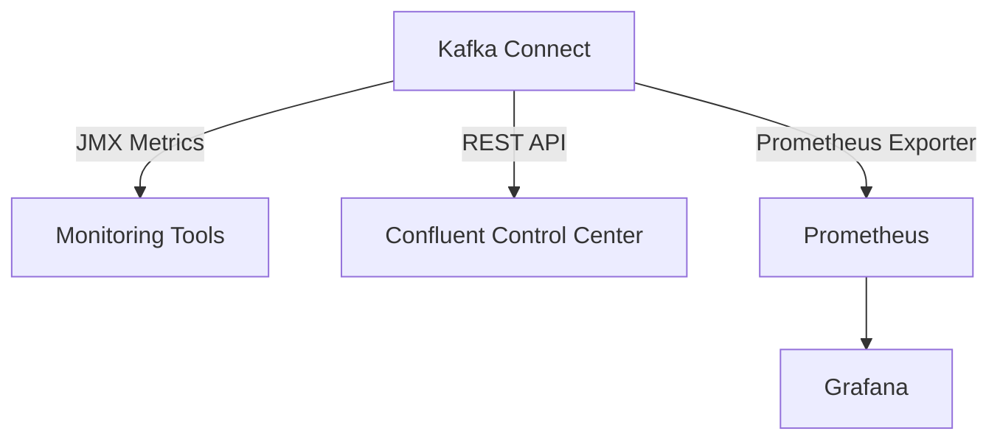

## 7.1.2.3 Managing Connectors

Managing connectors in Apache Kafka is a critical aspect of ensuring the smooth operation of data pipelines. This section delves into the operational aspects of managing connectors, focusing on scaling, rebalancing, monitoring, and handling errors. By mastering these areas, you can optimize the performance and reliability of your Kafka Connect deployments.

### Monitoring Connector Status and Performance

Monitoring is essential for maintaining the health and performance of Kafka connectors. It involves tracking various metrics and logs to ensure connectors are operating as expected.

#### Key Metrics to Monitor

- **Task Count**: The number of tasks currently running for a connector. This metric helps in understanding the load distribution.
- **Task State**: Indicates whether a task is running, paused, or failed.
- **Throughput**: Measures the rate of data flow through the connector, typically in records per second.
- **Error Rate**: The number of errors encountered by the connector over time.
- **Lag**: The delay in processing data, especially important for source connectors.

#### Tools for Monitoring

- **Confluent Control Center**: Provides a comprehensive UI for monitoring Kafka Connect clusters, offering insights into connector performance and health.
- **Prometheus and Grafana**: These tools can be integrated with Kafka Connect to visualize metrics and set up alerts.
- **JMX Metrics**: Kafka Connect exposes metrics via JMX, which can be collected and analyzed using various monitoring tools.



*Diagram: Integration of Kafka Connect with monitoring tools for comprehensive performance tracking.*

### Scaling Connectors by Adjusting the Number of Tasks

Scaling connectors is crucial for handling varying loads and ensuring efficient data processing. This involves adjusting the number of tasks associated with a connector.

#### Strategies for Scaling

- **Dynamic Task Allocation**: Adjust the number of tasks based on the current load. This can be automated using custom scripts or tools.
- **Horizontal Scaling**: Deploy additional Kafka Connect workers to distribute the load across more nodes.
- **Task Configuration**: Modify the `tasks.max` property in the connector configuration to increase or decrease the number of tasks.

#### Example: Scaling a Connector in Java

```java
import org.apache.kafka.connect.connector.Connector;
import java.util.HashMap;
import java.util.Map;

public class ConnectorScalingExample {
    public static void main(String[] args) {
        Map<String, String> config = new HashMap<>();
        config.put("name", "my-connector");
        config.put("connector.class", "org.apache.kafka.connect.file.FileStreamSinkConnector");
        config.put("tasks.max", "10"); // Scale to 10 tasks

        Connector connector = new FileStreamSinkConnector();
        connector.start(config);
    }
}
```

*Java code example demonstrating how to configure a connector with a specific number of tasks.*

### Handling Connector Failures and Retries

Connector failures can disrupt data pipelines, making it essential to have strategies for handling errors and implementing retries.

#### Common Failure Scenarios

- **Network Issues**: Temporary network failures can cause connectors to lose connectivity.
- **Data Format Errors**: Incompatible data formats can lead to processing errors.
- **Resource Constraints**: Insufficient resources can cause connectors to fail under load.

#### Error Handling Strategies

- **Retry Policies**: Configure connectors to automatically retry operations on failure. Use exponential backoff to avoid overwhelming the system.
- **Dead Letter Queues**: Redirect failed records to a separate topic for later analysis and reprocessing.
- **Alerting and Notifications**: Set up alerts to notify administrators of connector failures.

```scala
import org.apache.kafka.connect.errors.RetriableException

class CustomConnector extends Connector {
    override def start(props: util.Map[String, String]): Unit = {
        try {
            // Connector logic
        } catch {
            case e: RetriableException =>
                // Handle retriable exception
        }
    }
}
```

*Scala code example illustrating how to handle retriable exceptions in a custom connector.*

### Tools for Managing Connectors

Several tools can assist in managing Kafka connectors, providing features for configuration, monitoring, and error handling.

#### Confluent Control Center

- **Features**: Offers a graphical interface for managing connectors, monitoring performance, and configuring alerts.
- **Integration**: Seamlessly integrates with Kafka Connect, providing real-time insights into connector operations.

#### REST API

- **Usage**: Kafka Connect provides a REST API for managing connectors programmatically. This API can be used to create, update, and delete connectors, as well as to retrieve status information.

```kotlin
import khttp.get

fun getConnectorStatus(connectorName: String): String {
    val response = get("http://localhost:8083/connectors/$connectorName/status")
    return response.text
}

fun main() {
    println(getConnectorStatus("my-connector"))
}
```

*Kotlin code example demonstrating how to use the Kafka Connect REST API to retrieve connector status.*

### Recommendations for Logging and Alerting

Effective logging and alerting are vital for diagnosing issues and ensuring timely responses to connector failures.

#### Logging Best Practices

- **Log Levels**: Use appropriate log levels (INFO, WARN, ERROR) to capture relevant information without overwhelming the log files.
- **Structured Logging**: Implement structured logging to facilitate easier parsing and analysis of log data.

#### Alerting Strategies

- **Threshold-Based Alerts**: Set up alerts based on specific thresholds for key metrics, such as error rates or lag.
- **Anomaly Detection**: Use machine learning models to detect anomalies in connector performance and trigger alerts.

### Conclusion

Managing connectors in Apache Kafka involves a combination of monitoring, scaling, and error handling strategies. By leveraging tools like Confluent Control Center and the Kafka Connect REST API, you can optimize connector performance and ensure reliable data processing. Implementing robust logging and alerting mechanisms further enhances the resilience of your Kafka Connect deployments.

## Test Your Knowledge: Advanced Kafka Connector Management Quiz



### What is the primary tool for monitoring Kafka Connect clusters?

- [x] Confluent Control Center
- [ ] Apache Zookeeper
- [ ] Kafka Streams
- [ ] Apache Flink

> **Explanation:** Confluent Control Center provides a comprehensive UI for monitoring Kafka Connect clusters, offering insights into connector performance and health.

### Which metric is crucial for understanding the load distribution of a connector?

- [x] Task Count
- [ ] Error Rate
- [ ] Throughput
- [ ] Lag

> **Explanation:** Task Count indicates the number of tasks currently running for a connector, helping in understanding the load distribution.

### How can you scale a Kafka connector?

- [x] By adjusting the `tasks.max` property
- [ ] By increasing the number of brokers
- [ ] By adding more topics
- [ ] By reducing the replication factor

> **Explanation:** Scaling a Kafka connector involves adjusting the `tasks.max` property to increase or decrease the number of tasks.

### What is a common strategy for handling connector failures?

- [x] Implementing retry policies
- [ ] Increasing the number of partitions
- [ ] Reducing the number of consumers
- [ ] Disabling logging

> **Explanation:** Implementing retry policies is a common strategy for handling connector failures, allowing operations to be retried automatically.

### Which tool can be used for programmatically managing Kafka connectors?

- [x] Kafka Connect REST API
- [ ] Apache NiFi
- [ ] Apache Beam
- [ ] Apache Camel

> **Explanation:** The Kafka Connect REST API can be used for programmatically managing connectors, including creating, updating, and deleting them.

### What is the purpose of a dead letter queue in Kafka Connect?

- [x] To store failed records for later analysis
- [ ] To increase throughput
- [ ] To reduce lag
- [ ] To balance load

> **Explanation:** A dead letter queue stores failed records for later analysis and reprocessing, helping to manage errors effectively.

### Which logging practice is recommended for easier parsing and analysis?

- [x] Structured Logging
- [ ] Verbose Logging
- [ ] Minimal Logging
- [ ] Random Logging

> **Explanation:** Structured Logging is recommended for easier parsing and analysis of log data.

### What is the benefit of using threshold-based alerts?

- [x] They notify administrators of specific metric thresholds being exceeded
- [ ] They reduce the number of tasks
- [ ] They increase the number of partitions
- [ ] They disable logging

> **Explanation:** Threshold-based alerts notify administrators when specific metric thresholds are exceeded, allowing for timely responses to issues.

### Which tool can be integrated with Kafka Connect for visualizing metrics?

- [x] Grafana
- [ ] Apache Flink
- [ ] Apache Camel
- [ ] Apache NiFi

> **Explanation:** Grafana can be integrated with Kafka Connect to visualize metrics and set up alerts.

### True or False: Kafka Connect does not support dynamic task allocation.

- [ ] True
- [x] False

> **Explanation:** Kafka Connect supports dynamic task allocation, allowing the number of tasks to be adjusted based on the current load.



By mastering the management of Kafka connectors, you can ensure the robustness and efficiency of your data pipelines, making them resilient to changes in load and capable of handling errors gracefully.
