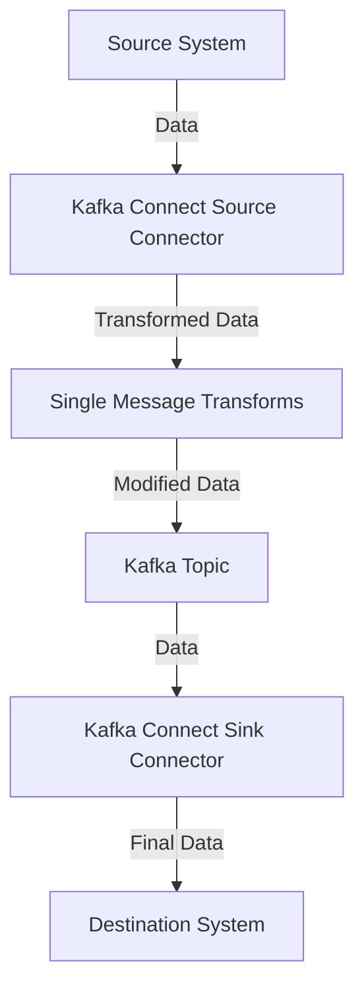

## 7.1.4.1 Built-in SMTs

### Introduction to Single Message Transforms (SMTs)

Single Message Transforms (SMTs) are a powerful feature of Kafka Connect that allows you to modify individual messages as they pass through a Kafka Connect pipeline. They are essential for data transformation tasks, enabling you to adjust message content without altering the source or sink systems. SMTs can be applied to both source and sink connectors, providing flexibility in how data is processed and integrated.

### Role of SMTs in Data Transformation

SMTs play a crucial role in data transformation by allowing you to:

- **Modify Message Content**: Change the structure or content of messages to fit the requirements of downstream systems.
- **Filter Messages**: Remove unwanted messages based on specific criteria.
- **Enrich Data**: Add additional information to messages, such as timestamps or metadata.
- **Route Messages**: Direct messages to different topics or partitions based on their content.

### Common Built-in SMTs

Kafka Connect provides several built-in SMTs that cover a wide range of transformation needs. Here, we will explore some of the most commonly used SMTs, including `MaskField`, `InsertField`, and `RegexRouter`.

#### MaskField SMT

**Purpose**: The `MaskField` SMT is used to mask sensitive information in messages, such as personally identifiable information (PII) or payment details. This is crucial for maintaining data privacy and compliance with regulations like GDPR.

**Configuration Example**:

```json
{
  "transforms": "mask",
  "transforms.mask.type": "org.apache.kafka.connect.transforms.MaskField$Value",
  "transforms.mask.fields": "creditCardNumber",
  "transforms.mask.replacement": "****"
}
```

**Explanation**: In this example, the `MaskField` SMT is configured to replace the `creditCardNumber` field with asterisks, effectively masking the sensitive data.

#### InsertField SMT

**Purpose**: The `InsertField` SMT allows you to add new fields to a message. This can be useful for adding metadata, such as a timestamp or a unique identifier.

**Configuration Example**:

```json
{
  "transforms": "insert",
  "transforms.insert.type": "org.apache.kafka.connect.transforms.InsertField$Value",
  "transforms.insert.static.field": "source",
  "transforms.insert.static.value": "KafkaConnect"
}
```

**Explanation**: This configuration adds a new field named `source` with a static value of `KafkaConnect` to each message, providing additional context about the data's origin.

#### RegexRouter SMT

**Purpose**: The `RegexRouter` SMT is used to route messages to different topics based on a regular expression pattern. This is particularly useful for organizing data into topic hierarchies.

**Configuration Example**:

```json
{
  "transforms": "route",
  "transforms.route.type": "org.apache.kafka.connect.transforms.RegexRouter",
  "transforms.route.regex": "^(.*)-raw$",
  "transforms.route.replacement": "$1-processed"
}
```

**Explanation**: This example routes messages from topics ending in `-raw` to corresponding topics ending in `-processed`, effectively managing data flow between raw and processed data streams.

### Using SMTs in Connector Configurations

To use SMTs in your Kafka Connect configurations, you need to specify them in the connector's configuration file. Here is a step-by-step guide on how to integrate SMTs into your connector setup:

1. **Define the SMTs**: Specify the SMTs you want to use in the `transforms` property of your connector configuration.

2. **Configure Each SMT**: For each SMT, define its type and any necessary parameters, such as fields to transform or regular expressions to apply.

3. **Apply SMTs**: Ensure that the SMTs are applied in the correct order, as the sequence can affect the final output.

**Example Connector Configuration**:

```json
{
  "name": "my-connector",
  "connector.class": "org.apache.kafka.connect.file.FileStreamSourceConnector",
  "tasks.max": "1",
  "file": "/path/to/input/file",
  "topic": "my-topic",
  "transforms": "mask,insert,route",
  "transforms.mask.type": "org.apache.kafka.connect.transforms.MaskField$Value",
  "transforms.mask.fields": "creditCardNumber",
  "transforms.mask.replacement": "****",
  "transforms.insert.type": "org.apache.kafka.connect.transforms.InsertField$Value",
  "transforms.insert.static.field": "source",
  "transforms.insert.static.value": "KafkaConnect",
  "transforms.route.type": "org.apache.kafka.connect.transforms.RegexRouter",
  "transforms.route.regex": "^(.*)-raw$",
  "transforms.route.replacement": "$1-processed"
}
```

### Limitations and Performance Considerations

While SMTs are powerful, they come with certain limitations and performance considerations:

- **Limited Scope**: SMTs are designed for simple transformations. Complex logic may require custom transformations or processing outside of Kafka Connect.
- **Performance Impact**: Each SMT adds processing overhead. It's important to balance the number of SMTs with performance requirements.
- **Order of Execution**: The order in which SMTs are applied can affect the outcome. Careful planning is needed to ensure transformations are applied correctly.

### Practical Applications and Real-World Scenarios

SMTs are widely used in various real-world scenarios, such as:

- **Data Masking for Compliance**: Organizations use `MaskField` to anonymize sensitive data before it reaches analytics platforms.
- **Metadata Enrichment**: `InsertField` is often used to add context to messages, such as the source system or processing timestamp.
- **Dynamic Routing**: `RegexRouter` helps in dynamically routing messages to appropriate topics based on their content, aiding in efficient data organization.

### Code Examples in Multiple Languages

To illustrate the use of SMTs, let's explore code examples in Java, Scala, Kotlin, and Clojure.

#### Java Example

```java
import org.apache.kafka.connect.transforms.InsertField;
import org.apache.kafka.connect.transforms.MaskField;
import org.apache.kafka.connect.transforms.RegexRouter;

// Example configuration for InsertField SMT
InsertField.Value<SourceRecord> insertField = new InsertField.Value<>();
insertField.configure(Map.of("static.field", "source", "static.value", "KafkaConnect"));

// Example configuration for MaskField SMT
MaskField.Value<SourceRecord> maskField = new MaskField.Value<>();
maskField.configure(Map.of("fields", "creditCardNumber", "replacement", "****"));

// Example configuration for RegexRouter SMT
RegexRouter<SourceRecord> regexRouter = new RegexRouter<>();
regexRouter.configure(Map.of("regex", "^(.*)-raw$", "replacement", "$1-processed"));
```

#### Scala Example

```scala
import org.apache.kafka.connect.transforms.{InsertField, MaskField, RegexRouter}

// Example configuration for InsertField SMT
val insertField = new InsertField.Value[SourceRecord]()
insertField.configure(Map("static.field" -> "source", "static.value" -> "KafkaConnect"))

// Example configuration for MaskField SMT
val maskField = new MaskField.Value[SourceRecord]()
maskField.configure(Map("fields" -> "creditCardNumber", "replacement" -> "****"))

// Example configuration for RegexRouter SMT
val regexRouter = new RegexRouter[SourceRecord]()
regexRouter.configure(Map("regex" -> "^(.*)-raw$", "replacement" -> "$1-processed"))
```

#### Kotlin Example

```kotlin
import org.apache.kafka.connect.transforms.InsertField
import org.apache.kafka.connect.transforms.MaskField
import org.apache.kafka.connect.transforms.RegexRouter

// Example configuration for InsertField SMT
val insertField = InsertField.Value<SourceRecord>()
insertField.configure(mapOf("static.field" to "source", "static.value" to "KafkaConnect"))

// Example configuration for MaskField SMT
val maskField = MaskField.Value<SourceRecord>()
maskField.configure(mapOf("fields" to "creditCardNumber", "replacement" to "****"))

// Example configuration for RegexRouter SMT
val regexRouter = RegexRouter<SourceRecord>()
regexRouter.configure(mapOf("regex" to "^(.*)-raw$", "replacement" to "$1-processed"))
```

#### Clojure Example

```clojure
(import '[org.apache.kafka.connect.transforms InsertField MaskField RegexRouter])

;; Example configuration for InsertField SMT
(def insert-field (InsertField$Value.))
(.configure insert-field {"static.field" "source", "static.value" "KafkaConnect"})

;; Example configuration for MaskField SMT
(def mask-field (MaskField$Value.))
(.configure mask-field {"fields" "creditCardNumber", "replacement" "****"})

;; Example configuration for RegexRouter SMT
(def regex-router (RegexRouter.))
(.configure regex-router {"regex" "^(.*)-raw$", "replacement" "$1-processed"})
```

### Visualizing SMTs in Kafka Connect

To better understand how SMTs fit into the Kafka Connect architecture, consider the following diagram:



**Caption**: This diagram illustrates the flow of data through Kafka Connect, highlighting the role of SMTs in transforming messages between the source and destination systems.

### Conclusion

Built-in SMTs in Kafka Connect offer a versatile and efficient way to transform data as it flows through your integration pipelines. By understanding and leveraging these tools, you can enhance data processing, ensure compliance, and improve the overall efficiency of your Kafka-based systems. However, it's important to be mindful of their limitations and performance implications, ensuring that your configurations are optimized for your specific use case.

## Test Your Knowledge: Mastering Built-in SMTs in Kafka Connect



### What is the primary purpose of Single Message Transforms (SMTs) in Kafka Connect?

- [x] To modify individual messages as they pass through connectors.
- [ ] To manage Kafka cluster configurations.
- [ ] To monitor Kafka Connect performance.
- [ ] To store messages in Kafka topics.

> **Explanation:** SMTs are used to transform individual messages in Kafka Connect pipelines, allowing for data modification without altering source or sink systems.

### Which built-in SMT is used to mask sensitive information in messages?

- [x] MaskField
- [ ] InsertField
- [ ] RegexRouter
- [ ] ValueToKey

> **Explanation:** The `MaskField` SMT is specifically designed to mask sensitive data, such as PII, in messages.

### How does the InsertField SMT enhance message content?

- [x] By adding new fields to messages.
- [ ] By removing unwanted fields from messages.
- [ ] By routing messages to different topics.
- [ ] By compressing message data.

> **Explanation:** The `InsertField` SMT adds new fields to messages, which can include metadata or other contextual information.

### What is the function of the RegexRouter SMT?

- [x] To route messages to different topics based on regex patterns.
- [ ] To mask sensitive data in messages.
- [ ] To add static fields to messages.
- [ ] To convert message formats.

> **Explanation:** The `RegexRouter` SMT uses regular expressions to route messages to different topics, facilitating dynamic data organization.

### Which of the following is a limitation of using SMTs?

- [x] They are designed for simple transformations and may not handle complex logic.
- [ ] They can only be used with sink connectors.
- [ ] They require custom coding for each transformation.
- [ ] They cannot be used with cloud-based Kafka deployments.

> **Explanation:** SMTs are intended for straightforward transformations; complex logic may require custom solutions or external processing.

### What is a potential performance consideration when using multiple SMTs?

- [x] Each SMT adds processing overhead, which can impact performance.
- [ ] SMTs automatically optimize performance.
- [ ] SMTs reduce the need for connector configurations.
- [ ] SMTs eliminate the need for data validation.

> **Explanation:** Using multiple SMTs can increase processing overhead, so it's important to balance transformation needs with performance requirements.

### In what order should SMTs be applied in a connector configuration?

- [x] The order specified in the configuration affects the final output.
- [ ] SMTs are applied in alphabetical order.
- [ ] SMTs are applied randomly.
- [ ] The order does not matter.

> **Explanation:** The sequence of SMTs in the configuration determines how transformations are applied, affecting the final message output.

### Which SMT would you use to add a timestamp to each message?

- [x] InsertField
- [ ] MaskField
- [ ] RegexRouter
- [ ] ValueToKey

> **Explanation:** The `InsertField` SMT can be used to add a timestamp or other static fields to messages, enriching the data with additional context.

### What is a common use case for the RegexRouter SMT?

- [x] Organizing data into topic hierarchies based on content.
- [ ] Masking sensitive information.
- [ ] Adding metadata to messages.
- [ ] Compressing message data.

> **Explanation:** The `RegexRouter` SMT is commonly used to route messages to specific topics based on their content, aiding in data organization.

### True or False: SMTs can only be applied to source connectors in Kafka Connect.

- [ ] True
- [x] False

> **Explanation:** SMTs can be applied to both source and sink connectors, providing flexibility in how data is transformed within Kafka Connect pipelines.



By mastering the use of built-in SMTs, you can significantly enhance your Kafka Connect deployments, ensuring efficient and compliant data processing across your enterprise systems.
