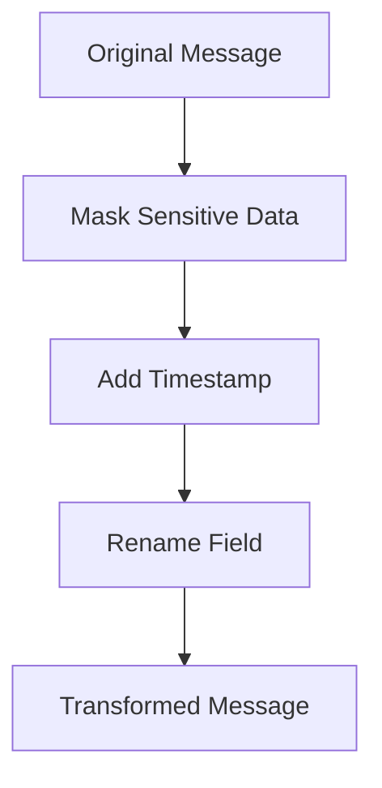

## 7.1.4.3 Chaining and Ordering SMTs

Single Message Transforms (SMTs) in Kafka Connect are powerful tools for modifying messages as they pass through connectors. By chaining multiple SMTs, you can perform complex data transformations, but the order in which these transformations are applied is crucial. This section delves into the configuration, significance, and practical applications of chaining and ordering SMTs, providing expert insights into optimizing data transformation processes.

### Introduction to Chaining and Ordering SMTs

#### Understanding SMTs

Single Message Transforms (SMTs) are lightweight transformations applied to individual messages in Kafka Connect. They allow you to modify message content, structure, or metadata without altering the underlying data source or sink. SMTs are configured in the connector's configuration file and can be applied to both source and sink connectors.

#### Importance of Chaining and Ordering

When multiple SMTs are applied to a message, they are executed in the order they are listed in the connector configuration. This order can significantly impact the final outcome of the data transformation. Understanding how to effectively chain and order SMTs is essential for achieving the desired transformation results and optimizing performance.

### Configuring Multiple SMTs in a Connector

To configure multiple SMTs in a Kafka Connect connector, you specify them in the connector's configuration file. Each SMT is defined with a unique name, class, and any necessary configuration parameters. The order of SMTs in the configuration file determines the sequence of their execution.

#### Example Configuration

Consider a scenario where you want to apply three SMTs to transform incoming messages:

1. **Mask sensitive data**.
2. **Add a timestamp**.
3. **Rename a field**.

Here is how you might configure these SMTs in a connector:

```json
{
  "name": "my-connector",
  "config": {
    "connector.class": "org.apache.kafka.connect.file.FileStreamSourceConnector",
    "tasks.max": "1",
    "file": "/path/to/input/file",
    "topic": "my-topic",
    "transforms": "mask,timestamp,rename",
    "transforms.mask.type": "org.apache.kafka.connect.transforms.MaskField$Value",
    "transforms.mask.fields": "creditCardNumber",
    "transforms.timestamp.type": "org.apache.kafka.connect.transforms.InsertField$Value",
    "transforms.timestamp.timestamp.field": "timestamp",
    "transforms.rename.type": "org.apache.kafka.connect.transforms.ReplaceField$Value",
    "transforms.rename.renames": "oldFieldName:newFieldName"
  }
}
```

In this configuration, the `mask` SMT is applied first, followed by `timestamp`, and finally `rename`. This order ensures that sensitive data is masked before any additional fields are added or renamed.

### Significance of SMT Order

The order of SMTs can affect both the functionality and performance of your data transformation pipeline. Here are some key considerations:

#### Functional Impact

- **Data Dependency**: Some transformations depend on the results of previous transformations. For example, if you rename a field before masking it, the mask transformation might fail if it references the old field name.
- **Logical Flow**: Ensure that the logical flow of transformations aligns with your data processing requirements. For instance, adding a timestamp before filtering out records based on time criteria ensures that all records have a timestamp for comparison.

#### Performance Considerations

- **Efficiency**: Applying computationally expensive transformations early can reduce the load on subsequent transformations by filtering or modifying data upfront.
- **Resource Utilization**: Consider the resource implications of each transformation. For example, transformations that increase message size (e.g., adding fields) should be applied judiciously to avoid excessive memory usage.

### Examples of SMT Orderings and Their Effects

Let's explore some practical examples to illustrate how different SMT orderings can impact the outcome of data transformations.

#### Example 1: Filtering and Enrichment

Suppose you have two SMTs: one to filter out messages based on a condition and another to enrich messages with additional data. The order of these SMTs can lead to different results:

- **Order 1: Filter -> Enrich**

  ```json
  "transforms": "filter,enrich",
  "transforms.filter.type": "org.apache.kafka.connect.transforms.Filter",
  "transforms.filter.condition": "value.field > 100",
  "transforms.enrich.type": "org.apache.kafka.connect.transforms.InsertField$Value",
  "transforms.enrich.static.field": "source",
  "transforms.enrich.static.value": "sensorA"
  ```

  In this order, only messages with `value.field > 100` are enriched with the `source` field.

- **Order 2: Enrich -> Filter**

  ```json
  "transforms": "enrich,filter",
  "transforms.enrich.type": "org.apache.kafka.connect.transforms.InsertField$Value",
  "transforms.enrich.static.field": "source",
  "transforms.enrich.static.value": "sensorA",
  "transforms.filter.type": "org.apache.kafka.connect.transforms.Filter",
  "transforms.filter.condition": "value.field > 100"
  ```

  Here, all messages are enriched with the `source` field, but only those with `value.field > 100` are retained.

#### Example 2: Field Manipulation

Consider a scenario where you need to rename a field and then mask it:

- **Order 1: Rename -> Mask**

  ```json
  "transforms": "rename,mask",
  "transforms.rename.type": "org.apache.kafka.connect.transforms.ReplaceField$Value",
  "transforms.rename.renames": "oldFieldName:newFieldName",
  "transforms.mask.type": "org.apache.kafka.connect.transforms.MaskField$Value",
  "transforms.mask.fields": "newFieldName"
  ```

  This order ensures that the field is renamed before masking, allowing the mask transformation to apply correctly.

- **Order 2: Mask -> Rename**

  ```json
  "transforms": "mask,rename",
  "transforms.mask.type": "org.apache.kafka.connect.transforms.MaskField$Value",
  "transforms.mask.fields": "oldFieldName",
  "transforms.rename.type": "org.apache.kafka.connect.transforms.ReplaceField$Value",
  "transforms.rename.renames": "oldFieldName:newFieldName"
  ```

  In this order, the mask transformation might fail if it cannot find the `oldFieldName` after renaming.

### Performance Considerations for Chaining SMTs

When chaining SMTs, it's important to consider the performance implications of each transformation. Here are some tips to optimize performance:

#### Minimize Redundant Transformations

Avoid applying transformations that do not contribute to the final data structure or content. Redundant transformations can increase processing time and resource consumption.

#### Prioritize Lightweight Transformations

Apply lightweight transformations early in the chain to quickly reduce the data volume or complexity before applying more resource-intensive transformations.

#### Monitor Resource Usage

Use monitoring tools to track the resource usage of your Kafka Connect cluster. Identify transformations that consume excessive CPU or memory and optimize or reorder them as needed.

### Debugging Complex SMT Configurations

Debugging complex SMT configurations can be challenging, especially when multiple transformations interact in unexpected ways. Here are some strategies to simplify the debugging process:

#### Use Logging

Enable detailed logging for your Kafka Connect connectors to capture the input and output of each SMT. This can help you identify where transformations are failing or producing unexpected results.

#### Test Incrementally

Test each SMT individually before chaining them together. This allows you to verify that each transformation works as expected and simplifies troubleshooting.

#### Visualize Transformation Chains

Create diagrams to visualize the sequence of transformations and their effects on the data. This can help you understand the flow of data through the transformation pipeline and identify potential issues.



*Figure 1: Example of a transformation chain with SMTs.*

### Conclusion

Chaining and ordering SMTs in Kafka Connect is a powerful technique for achieving complex data transformations. By carefully configuring the order of SMTs and considering their functional and performance implications, you can optimize your data processing pipelines for efficiency and accuracy. Use the strategies and examples provided in this section to master the art of chaining and ordering SMTs, and explore the full potential of Kafka Connect in your integration projects.

### References and Further Reading

- [Apache Kafka Documentation](https://kafka.apache.org/documentation/)
- [Confluent Documentation](https://docs.confluent.io/)
- [Kafka Connect SMTs](https://kafka.apache.org/documentation/#connect_transforms)

## Test Your Mastery of Chaining and Ordering SMTs in Kafka Connect



### What is the primary purpose of chaining SMTs in Kafka Connect?

- [x] To perform complex data transformations by applying multiple SMTs in sequence.
- [ ] To increase the speed of data processing.
- [ ] To reduce the number of connectors needed.
- [ ] To simplify connector configuration.

> **Explanation:** Chaining SMTs allows for complex data transformations by applying multiple transformations in a specific order.

### Why is the order of SMTs important in Kafka Connect?

- [x] Because the order determines the sequence of transformations and affects the final data output.
- [ ] Because it affects the number of connectors required.
- [ ] Because it changes the data source.
- [ ] Because it impacts the Kafka topic configuration.

> **Explanation:** The order of SMTs affects how data is transformed and the final outcome, making it crucial for achieving desired results.

### Which of the following is a performance consideration when chaining SMTs?

- [x] Apply lightweight transformations early to reduce data volume.
- [ ] Always apply the most complex transformation first.
- [ ] Use as many SMTs as possible to ensure thorough data processing.
- [ ] Avoid using logging to reduce overhead.

> **Explanation:** Applying lightweight transformations early can reduce data volume and complexity, optimizing performance.

### What is a recommended strategy for debugging complex SMT configurations?

- [x] Enable detailed logging to capture input and output of each SMT.
- [ ] Disable logging to improve performance.
- [ ] Apply all SMTs at once to see the final result.
- [ ] Use only one SMT to simplify debugging.

> **Explanation:** Detailed logging helps identify where transformations fail or produce unexpected results, aiding in debugging.

### In the example configuration, what is the purpose of the "mask" SMT?

- [x] To mask sensitive data fields in the message.
- [ ] To add a timestamp to the message.
- [ ] To rename fields in the message.
- [ ] To filter messages based on a condition.

> **Explanation:** The "mask" SMT is used to mask sensitive data fields, ensuring data privacy.

### How can you test SMTs incrementally?

- [x] Test each SMT individually before chaining them together.
- [ ] Apply all SMTs at once and check the final output.
- [ ] Use a single SMT for all transformations.
- [ ] Avoid testing to save time.

> **Explanation:** Testing each SMT individually helps verify their functionality and simplifies troubleshooting.

### What is a potential consequence of applying a computationally expensive SMT early in the chain?

- [x] It can reduce the load on subsequent transformations by filtering or modifying data upfront.
- [ ] It can increase the complexity of later transformations.
- [ ] It can lead to data loss.
- [ ] It can simplify the connector configuration.

> **Explanation:** Applying expensive SMTs early can optimize the transformation process by reducing data volume for later stages.

### What tool can help visualize the sequence of transformations in an SMT chain?

- [x] Diagrams or flowcharts.
- [ ] Text editors.
- [ ] Command-line interfaces.
- [ ] Database management systems.

> **Explanation:** Diagrams or flowcharts can help visualize and understand the flow of data through the transformation pipeline.

### What is the effect of the "rename" SMT in the example configuration?

- [x] It renames a field in the message.
- [ ] It masks sensitive data fields.
- [ ] It adds a timestamp to the message.
- [ ] It filters messages based on a condition.

> **Explanation:** The "rename" SMT changes the name of a specified field in the message.

### True or False: The order of SMTs does not affect the final data output.

- [ ] True
- [x] False

> **Explanation:** The order of SMTs is crucial as it determines the sequence of transformations, directly impacting the final data output.


