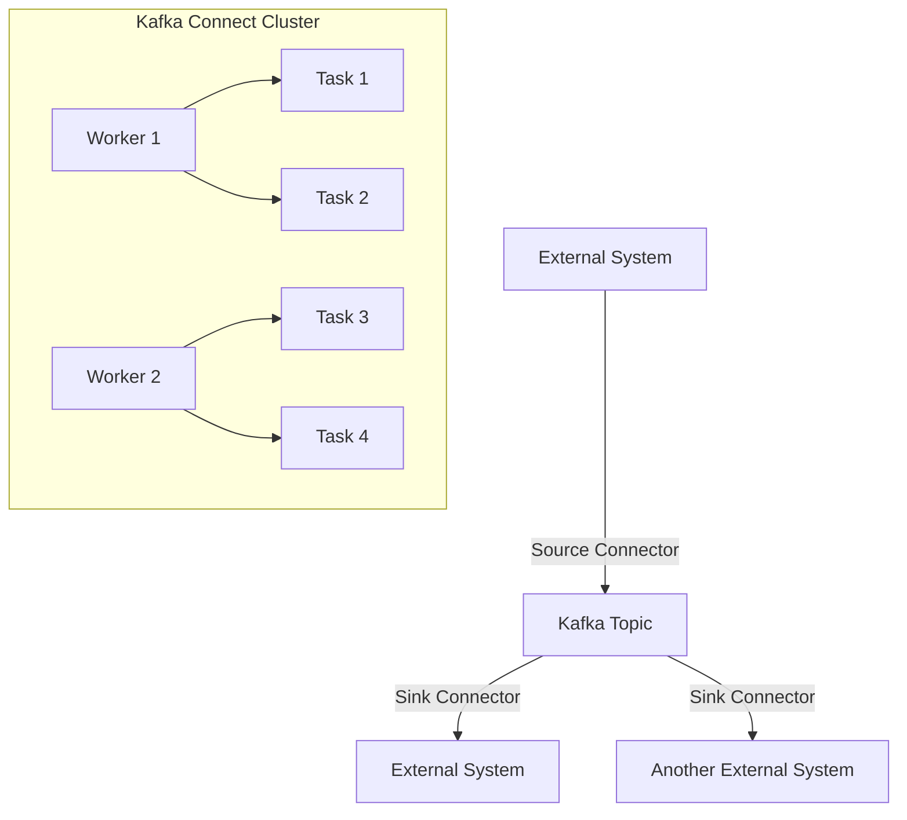

## 7.1 Integration Patterns with Kafka Connect

### Introduction to Kafka Connect

Apache Kafka Connect is a robust framework designed to facilitate the integration of Kafka with a wide array of external systems. It serves as a bridge, enabling seamless data flow between Kafka and other data stores, databases, and applications. Kafka Connect is part of the broader Kafka ecosystem, which includes [Kafka Streams API]( "Kafka Streams API") and [Schema Registry]( "Schema Registry"), and plays a crucial role in building scalable and fault-tolerant data pipelines.

### Architecture and Components of Kafka Connect

Kafka Connect's architecture is designed for scalability and fault tolerance. It consists of several key components:

- **Connectors**: These are the core components that facilitate data integration. Connectors are divided into two types:
  - **Source Connectors**: These ingest data from external systems into Kafka topics.
  - **Sink Connectors**: These export data from Kafka topics to external systems.

- **Tasks**: Each connector can be divided into multiple tasks, which are the units of work that perform the actual data transfer. Tasks enable parallelism and scalability.

- **Workers**: Kafka Connect runs on a cluster of worker nodes. Workers can be configured in standalone or distributed mode. In distributed mode, workers can share the load and provide fault tolerance.

- **Configuration**: Connectors are configured using JSON files that specify the connector class, tasks, and other parameters.

- **REST API**: Kafka Connect provides a REST API for managing connectors, tasks, and configurations.

#### Diagram: Kafka Connect Architecture



**Caption**: The diagram illustrates the Kafka Connect architecture, showing how source and sink connectors interact with Kafka topics and external systems.

### Benefits of Using Kafka Connect

Kafka Connect offers several advantages for integrating external systems:

- **Scalability**: Kafka Connect can scale horizontally by adding more workers, allowing it to handle large volumes of data.

- **Fault Tolerance**: In distributed mode, Kafka Connect provides fault tolerance by redistributing tasks among available workers if a worker fails.

- **Extensibility**: Kafka Connect supports a wide range of connectors for various data sources and sinks. Custom connectors can also be developed to meet specific requirements.

- **Ease of Use**: With its REST API and configuration management, Kafka Connect simplifies the deployment and management of data pipelines.

- **Data Transformation**: Kafka Connect supports Single Message Transforms (SMTs) for data transformation, allowing data to be modified as it flows through the pipeline.

### Common Integration Scenarios

Kafka Connect is used in various integration scenarios, including:

#### 1. Database Integration

Kafka Connect can be used to stream data from databases into Kafka using source connectors. For example, the Debezium connector can capture change data from databases like MySQL, PostgreSQL, and MongoDB, and stream it into Kafka topics.

#### 2. Data Warehousing

Sink connectors can be used to export data from Kafka topics to data warehouses such as Amazon Redshift, Google BigQuery, or Snowflake, enabling real-time analytics and reporting.

#### 3. Cloud Storage

Kafka Connect can integrate with cloud storage services like Amazon S3, Google Cloud Storage, and Azure Blob Storage, allowing data to be archived or processed further.

#### 4. IoT Data Processing

Kafka Connect can ingest data from IoT devices and sensors, enabling real-time processing and analytics of IoT data streams.

#### 5. Legacy System Integration

Kafka Connect can be used to integrate with legacy systems that do not natively support Kafka, enabling modernization of data architectures.

### Best Practices for Deploying and Managing Connectors

To ensure efficient and reliable data integration with Kafka Connect, consider the following best practices:

- **Use Distributed Mode**: For production environments, use distributed mode to take advantage of fault tolerance and scalability.

- **Monitor Connector Performance**: Use monitoring tools to track the performance of connectors and tasks. Monitor metrics such as task throughput, error rates, and resource utilization.

- **Optimize Task Configuration**: Configure an appropriate number of tasks for each connector to balance load and maximize throughput.

- **Implement Data Transformation**: Use SMTs to transform data as needed, such as filtering fields, renaming fields, or changing data formats.

- **Secure Data Transfers**: Use SSL/TLS encryption and authentication mechanisms to secure data transfers between Kafka Connect and external systems.

- **Regularly Update Connectors**: Keep connectors up to date with the latest versions to benefit from performance improvements and bug fixes.

### Developing Custom Connectors

In some cases, existing connectors may not meet specific integration requirements. Kafka Connect allows for the development of custom connectors. The process involves:

1. **Defining the Connector**: Implement the `Connector` interface to define the connector's behavior.

2. **Implementing Tasks**: Implement the `Task` interface to define the logic for data transfer.

3. **Configuring the Connector**: Define configuration properties for the connector and tasks.

4. **Testing and Deployment**: Test the custom connector thoroughly and deploy it in a distributed Kafka Connect cluster.

#### Sample Code: Custom Source Connector in Java

```java
import org.apache.kafka.connect.source.SourceConnector;
import org.apache.kafka.connect.source.SourceTask;
import org.apache.kafka.connect.connector.Task;
import java.util.List;
import java.util.Map;

public class CustomSourceConnector extends SourceConnector {
    @Override
    public String version() {
        return "1.0";
    }

    @Override
    public void start(Map<String, String> props) {
        // Initialize connector
    }

    @Override
    public Class<? extends Task> taskClass() {
        return CustomSourceTask.class;
    }

    @Override
    public List<Map<String, String>> taskConfigs(int maxTasks) {
        // Return configurations for tasks
        return null;
    }

    @Override
    public void stop() {
        // Clean up resources
    }
}

class CustomSourceTask extends SourceTask {
    @Override
    public String version() {
        return "1.0";
    }

    @Override
    public void start(Map<String, String> props) {
        // Initialize task
    }

    @Override
    public List<SourceRecord> poll() throws InterruptedException {
        // Fetch data and return SourceRecords
        return null;
    }

    @Override
    public void stop() {
        // Clean up resources
    }
}
```

**Explanation**: This Java code snippet demonstrates a basic structure for a custom source connector. The `CustomSourceConnector` class defines the connector, while the `CustomSourceTask` class handles data fetching and conversion into `SourceRecord` objects.

### Conclusion

Kafka Connect is a powerful tool for integrating Kafka with a variety of external systems. By understanding its architecture, components, and best practices, you can effectively leverage Kafka Connect to build scalable and reliable data pipelines. For more detailed information, refer to the [Apache Kafka Connect documentation](https://kafka.apache.org/documentation/#connect).

## Test Your Knowledge: Kafka Connect Integration Patterns Quiz



### What is the primary role of Kafka Connect in data integration?

- [x] To facilitate streaming data between Kafka and external systems.
- [ ] To manage Kafka brokers and clusters.
- [ ] To provide a user interface for Kafka administration.
- [ ] To store Kafka topic configurations.

> **Explanation:** Kafka Connect is designed to integrate Kafka with external systems, enabling data to flow seamlessly between them.

### Which component of Kafka Connect is responsible for performing the actual data transfer?

- [ ] Connectors
- [x] Tasks
- [ ] Workers
- [ ] REST API

> **Explanation:** Tasks are the units of work in Kafka Connect that perform the actual data transfer.

### What is the advantage of using Kafka Connect in distributed mode?

- [x] It provides fault tolerance and scalability.
- [ ] It simplifies configuration management.
- [ ] It reduces network latency.
- [ ] It enhances data security.

> **Explanation:** Distributed mode allows Kafka Connect to distribute tasks across multiple workers, providing fault tolerance and scalability.

### Which of the following is a common use case for Kafka Connect?

- [x] Streaming data from databases into Kafka.
- [ ] Managing Kafka topic partitions.
- [ ] Monitoring Kafka cluster health.
- [ ] Configuring Kafka security settings.

> **Explanation:** Kafka Connect is commonly used to stream data from databases and other systems into Kafka.

### What is the purpose of Single Message Transforms (SMTs) in Kafka Connect?

- [x] To transform data as it flows through the pipeline.
- [ ] To manage connector configurations.
- [ ] To monitor task performance.
- [ ] To secure data transfers.

> **Explanation:** SMTs are used to modify data as it flows through Kafka Connect, such as filtering or renaming fields.

### How can Kafka Connect ensure secure data transfers?

- [x] By using SSL/TLS encryption and authentication mechanisms.
- [ ] By configuring additional worker nodes.
- [ ] By using a standalone mode.
- [ ] By implementing custom connectors.

> **Explanation:** SSL/TLS encryption and authentication mechanisms are used to secure data transfers in Kafka Connect.

### What should be considered when developing a custom connector?

- [x] Implementing the Connector and Task interfaces.
- [ ] Configuring Kafka broker settings.
- [ ] Monitoring Kafka topic performance.
- [ ] Using Kafka Streams API.

> **Explanation:** Custom connectors require implementing the Connector and Task interfaces to define their behavior and logic.

### Which of the following is a benefit of using Kafka Connect?

- [x] Extensibility through custom connectors.
- [ ] Simplified Kafka broker management.
- [ ] Enhanced Kafka topic security.
- [ ] Reduced Kafka cluster latency.

> **Explanation:** Kafka Connect is extensible, allowing for the development of custom connectors to meet specific integration needs.

### What is the role of workers in Kafka Connect?

- [x] To run tasks and manage connectors.
- [ ] To store Kafka topic data.
- [ ] To provide a user interface for configuration.
- [ ] To monitor Kafka cluster health.

> **Explanation:** Workers in Kafka Connect run tasks and manage connectors, enabling data integration.

### True or False: Kafka Connect can only be used with databases.

- [ ] True
- [x] False

> **Explanation:** Kafka Connect can integrate with a wide range of systems, not just databases, including cloud storage, data warehouses, and IoT devices.


