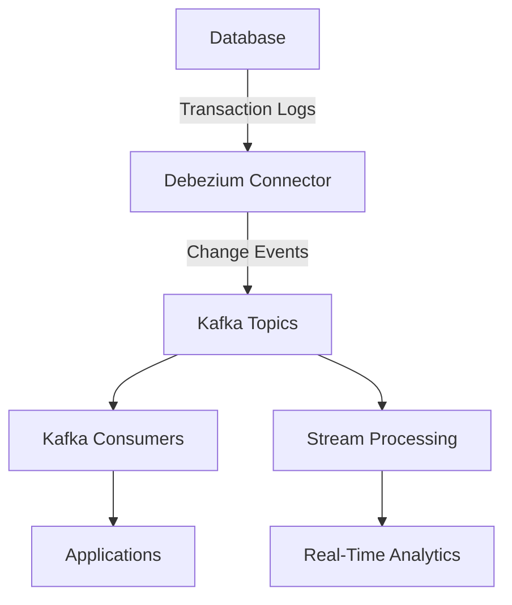

## 7.2.1 Change Data Capture with Debezium

Change Data Capture (CDC) is a crucial technique for capturing and streaming changes in databases in real-time. Debezium, an open-source CDC platform, plays a pivotal role in this process by integrating seamlessly with Apache Kafka to provide a robust and scalable solution for real-time data streaming. This section delves into the intricacies of using Debezium with Kafka, offering expert insights into its setup, integration, and best practices for maintaining data consistency and handling schema evolution.

### Introduction to Debezium

Debezium is an open-source platform that provides a reliable and scalable solution for capturing changes in databases and streaming them in real-time. It is built on top of Kafka Connect, a framework for connecting Kafka with external systems, making it an ideal choice for integrating databases with Kafka. Debezium supports a wide range of databases, including MySQL, PostgreSQL, MongoDB, and more, enabling organizations to leverage real-time data streaming across diverse data sources.

#### Role of Debezium in Change Data Capture

Debezium captures changes in databases by reading the transaction logs, which record all changes made to the data. This approach ensures that all changes are captured accurately and efficiently, without impacting the performance of the source database. By streaming these changes to Kafka topics, Debezium enables real-time data processing and integration with other systems, facilitating event-driven architectures and real-time analytics.

### Integrating Debezium with Kafka Connect

Debezium leverages Kafka Connect to integrate with Kafka, providing a seamless and scalable solution for streaming database changes. Kafka Connect is a framework that simplifies the process of connecting Kafka with external systems, offering a range of connectors for various data sources and sinks. Debezium connectors are built on top of Kafka Connect, allowing for easy integration and management of database change streams.

#### Setting Up Debezium Connectors

Setting up Debezium connectors involves configuring Kafka Connect to capture changes from the source database and stream them to Kafka topics. The following steps outline the process for setting up Debezium connectors for various databases:

1. **Install Kafka and Kafka Connect**: Ensure that Kafka and Kafka Connect are installed and running. Refer to the [Kafka Documentation](https://kafka.apache.org/documentation/) for installation instructions.

2. **Download Debezium Connectors**: Download the Debezium connectors for the desired database from the [Debezium website](https://debezium.io/).

3. **Configure Kafka Connect**: Configure Kafka Connect with the necessary settings for the Debezium connector. This includes specifying the database connection details, Kafka topic configurations, and other relevant settings.

4. **Deploy the Connector**: Deploy the Debezium connector to Kafka Connect, ensuring that it is properly configured to capture changes from the source database.

5. **Monitor and Manage the Connector**: Use Kafka Connect's management tools to monitor and manage the Debezium connector, ensuring that it is running smoothly and capturing changes accurately.

### Considerations for Schema Evolution and Data Consistency

When using Debezium for CDC, it is important to consider the implications of schema evolution and data consistency. Schema evolution refers to changes in the database schema, such as adding or removing columns, which can impact the data captured by Debezium. To handle schema evolution effectively, it is crucial to use a schema registry, such as the [Confluent Schema Registry]( "Schema Registry"), to manage and enforce schema changes.

Data consistency is another critical consideration when using Debezium for CDC. Ensuring that the data captured by Debezium is consistent with the source database is essential for maintaining data integrity and accuracy. This can be achieved by configuring Debezium to capture changes in a consistent and reliable manner, using techniques such as idempotent processing and exactly-once semantics.

### Practical Applications and Real-World Scenarios

Debezium's integration with Kafka enables a wide range of practical applications and real-world scenarios, including:

- **Event-Driven Microservices**: Debezium can be used to capture changes in databases and stream them to Kafka, enabling event-driven microservices architectures. This allows for real-time processing and integration of data across microservices, enhancing scalability and flexibility.

- **Real-Time Analytics**: By streaming database changes to Kafka, Debezium enables real-time analytics and data processing. This allows organizations to gain insights from their data in real-time, improving decision-making and operational efficiency.

- **Data Synchronization**: Debezium can be used to synchronize data between different systems, ensuring that changes in one system are reflected in others. This is particularly useful for maintaining consistency across distributed systems and applications.

### Code Examples

To illustrate the integration of Debezium with Kafka, the following code examples demonstrate how to set up and configure Debezium connectors for various databases. These examples are provided in Java, Scala, Kotlin, and Clojure, showcasing language-specific features and idioms.

#### Java Example

```java
import org.apache.kafka.connect.json.JsonConverter;
import org.apache.kafka.connect.runtime.ConnectorConfig;
import org.apache.kafka.connect.runtime.WorkerConfig;
import org.apache.kafka.connect.storage.FileOffsetBackingStore;

import java.util.HashMap;
import java.util.Map;

public class DebeziumConnectorExample {
    public static void main(String[] args) {
        Map<String, String> props = new HashMap<>();
        props.put(WorkerConfig.BOOTSTRAP_SERVERS_CONFIG, "localhost:9092");
        props.put(ConnectorConfig.NAME_CONFIG, "debezium-connector");
        props.put("connector.class", "io.debezium.connector.mysql.MySqlConnector");
        props.put("database.hostname", "localhost");
        props.put("database.port", "3306");
        props.put("database.user", "user");
        props.put("database.password", "password");
        props.put("database.server.id", "184054");
        props.put("database.server.name", "dbserver1");
        props.put("database.whitelist", "inventory");
        props.put("database.history.kafka.bootstrap.servers", "localhost:9092");
        props.put("database.history.kafka.topic", "schema-changes.inventory");

        JsonConverter keyConverter = new JsonConverter();
        JsonConverter valueConverter = new JsonConverter();
        FileOffsetBackingStore offsetBackingStore = new FileOffsetBackingStore();

        // Initialize and start the connector
        // ...
    }
}
```

#### Scala Example

```scala
import org.apache.kafka.connect.json.JsonConverter
import org.apache.kafka.connect.runtime.{ConnectorConfig, WorkerConfig}
import org.apache.kafka.connect.storage.FileOffsetBackingStore

object DebeziumConnectorExample extends App {
  val props = Map(
    WorkerConfig.BOOTSTRAP_SERVERS_CONFIG -> "localhost:9092",
    ConnectorConfig.NAME_CONFIG -> "debezium-connector",
    "connector.class" -> "io.debezium.connector.mysql.MySqlConnector",
    "database.hostname" -> "localhost",
    "database.port" -> "3306",
    "database.user" -> "user",
    "database.password" -> "password",
    "database.server.id" -> "184054",
    "database.server.name" -> "dbserver1",
    "database.whitelist" -> "inventory",
    "database.history.kafka.bootstrap.servers" -> "localhost:9092",
    "database.history.kafka.topic" -> "schema-changes.inventory"
  )

  val keyConverter = new JsonConverter()
  val valueConverter = new JsonConverter()
  val offsetBackingStore = new FileOffsetBackingStore()

  // Initialize and start the connector
  // ...
}
```

#### Kotlin Example

```kotlin
import org.apache.kafka.connect.json.JsonConverter
import org.apache.kafka.connect.runtime.ConnectorConfig
import org.apache.kafka.connect.runtime.WorkerConfig
import org.apache.kafka.connect.storage.FileOffsetBackingStore

fun main() {
    val props = mapOf(
        WorkerConfig.BOOTSTRAP_SERVERS_CONFIG to "localhost:9092",
        ConnectorConfig.NAME_CONFIG to "debezium-connector",
        "connector.class" to "io.debezium.connector.mysql.MySqlConnector",
        "database.hostname" to "localhost",
        "database.port" to "3306",
        "database.user" to "user",
        "database.password" to "password",
        "database.server.id" to "184054",
        "database.server.name" to "dbserver1",
        "database.whitelist" to "inventory",
        "database.history.kafka.bootstrap.servers" to "localhost:9092",
        "database.history.kafka.topic" to "schema-changes.inventory"
    )

    val keyConverter = JsonConverter()
    val valueConverter = JsonConverter()
    val offsetBackingStore = FileOffsetBackingStore()

    // Initialize and start the connector
    // ...
}
```

#### Clojure Example

```clojure
(ns debezium.connector.example
  (:import [org.apache.kafka.connect.json JsonConverter]
           [org.apache.kafka.connect.runtime ConnectorConfig WorkerConfig]
           [org.apache.kafka.connect.storage FileOffsetBackingStore]))

(defn start-connector []
  (let [props {WorkerConfig/BOOTSTRAP_SERVERS_CONFIG "localhost:9092"
               ConnectorConfig/NAME_CONFIG "debezium-connector"
               "connector.class" "io.debezium.connector.mysql.MySqlConnector"
               "database.hostname" "localhost"
               "database.port" "3306"
               "database.user" "user"
               "database.password" "password"
               "database.server.id" "184054"
               "database.server.name" "dbserver1"
               "database.whitelist" "inventory"
               "database.history.kafka.bootstrap.servers" "localhost:9092"
               "database.history.kafka.topic" "schema-changes.inventory"}
        key-converter (JsonConverter.)
        value-converter (JsonConverter.)
        offset-backing-store (FileOffsetBackingStore.)]

    ;; Initialize and start the connector
    ;; ...
    ))
```

### Visualizing the Integration

To better understand the integration of Debezium with Kafka, the following diagram illustrates the data flow and architecture of a typical Debezium setup:



**Caption**: This diagram depicts the flow of data from a source database through Debezium to Kafka topics, where it can be consumed by applications and processed in real-time.

### Key Considerations and Best Practices

When implementing Debezium for CDC, it is important to consider the following best practices:

- **Monitor Connector Performance**: Regularly monitor the performance of Debezium connectors to ensure they are capturing changes efficiently and without impacting the source database.

- **Handle Schema Changes Gracefully**: Use a schema registry to manage schema changes and ensure that downstream consumers can handle schema evolution without errors.

- **Ensure Data Consistency**: Configure Debezium to capture changes in a consistent manner, using techniques such as idempotent processing and exactly-once semantics to maintain data integrity.

- **Optimize Resource Usage**: Tune the configuration of Kafka Connect and Debezium connectors to optimize resource usage and minimize latency.

### Knowledge Check

To reinforce your understanding of Change Data Capture with Debezium, consider the following questions and challenges:

- How does Debezium capture changes in databases, and what are the benefits of using this approach?
- What are the key steps involved in setting up a Debezium connector for a MySQL database?
- How can schema evolution be managed effectively when using Debezium for CDC?
- What are some common challenges and best practices for ensuring data consistency with Debezium?

### Conclusion

Debezium provides a powerful and flexible solution for capturing and streaming database changes in real-time, enabling organizations to build scalable and responsive data architectures. By integrating with Kafka, Debezium facilitates seamless data integration and processing, supporting a wide range of applications and use cases. By following best practices and leveraging the capabilities of Debezium and Kafka, organizations can unlock the full potential of real-time data streaming and drive innovation in their data-driven initiatives.

### Further Reading and Resources

- [Debezium Documentation](https://debezium.io/documentation/)
- [Apache Kafka Documentation](https://kafka.apache.org/documentation/)
- [Confluent Schema Registry]( "Schema Registry")

## Test Your Knowledge: Change Data Capture with Debezium Quiz



### What is the primary role of Debezium in a data architecture?

- [x] Capturing and streaming database changes in real-time
- [ ] Managing Kafka topics and partitions
- [ ] Providing a user interface for Kafka management
- [ ] Encrypting data at rest

> **Explanation:** Debezium is an open-source platform designed to capture and stream changes in databases in real-time, facilitating integration with Kafka.

### Which framework does Debezium use to integrate with Kafka?

- [x] Kafka Connect
- [ ] Kafka Streams
- [ ] Apache Flink
- [ ] Apache Beam

> **Explanation:** Debezium leverages Kafka Connect to integrate with Kafka, providing a seamless solution for streaming database changes.

### What is a key consideration when handling schema evolution with Debezium?

- [x] Using a schema registry to manage and enforce schema changes
- [ ] Disabling schema validation
- [ ] Ignoring schema changes
- [ ] Manually updating all consumers

> **Explanation:** A schema registry is essential for managing schema changes and ensuring that downstream consumers can handle schema evolution without errors.

### How does Debezium capture changes in databases?

- [x] By reading the transaction logs
- [ ] By querying the database periodically
- [ ] By using triggers on the database tables
- [ ] By monitoring database queries

> **Explanation:** Debezium captures changes by reading the transaction logs, which record all changes made to the data, ensuring accurate and efficient capture.

### What are some benefits of using Debezium for CDC?

- [x] Real-time data streaming
- [x] Event-driven architectures
- [ ] Increased database load
- [ ] Manual data synchronization

> **Explanation:** Debezium enables real-time data streaming and supports event-driven architectures, enhancing scalability and flexibility.

### Which databases are supported by Debezium?

- [x] MySQL
- [x] PostgreSQL
- [ ] Oracle
- [ ] Microsoft Access

> **Explanation:** Debezium supports a wide range of databases, including MySQL and PostgreSQL, among others.

### What is a common use case for Debezium and Kafka integration?

- [x] Real-time analytics
- [ ] Batch processing
- [ ] Static data reporting
- [ ] Manual data entry

> **Explanation:** Debezium and Kafka integration is commonly used for real-time analytics, enabling organizations to gain insights from their data in real-time.

### What is the purpose of Kafka Connect in the context of Debezium?

- [x] To simplify the process of connecting Kafka with external systems
- [ ] To provide a graphical user interface for Kafka
- [ ] To encrypt data in transit
- [ ] To manage Kafka consumer groups

> **Explanation:** Kafka Connect simplifies the process of connecting Kafka with external systems, providing a framework for integrating Debezium connectors.

### How can data consistency be ensured when using Debezium for CDC?

- [x] Configuring Debezium for idempotent processing and exactly-once semantics
- [ ] Disabling data validation
- [ ] Ignoring data inconsistencies
- [ ] Manually correcting data errors

> **Explanation:** Configuring Debezium for idempotent processing and exactly-once semantics ensures data consistency and integrity.

### True or False: Debezium can be used to synchronize data between different systems.

- [x] True
- [ ] False

> **Explanation:** Debezium can be used to synchronize data between different systems, ensuring that changes in one system are reflected in others.



---
