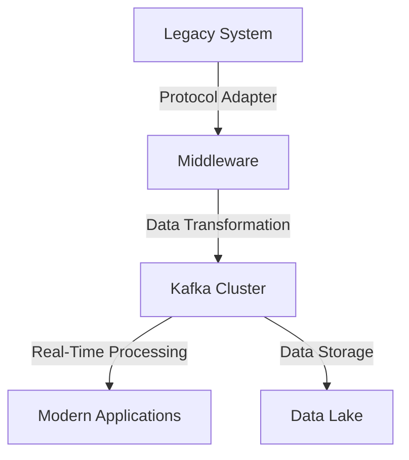

## 7.2.3 Connecting Legacy Systems

Integrating Apache Kafka with legacy systems presents unique challenges due to the inherent differences in technology stacks, data formats, and communication protocols. Legacy systems often lack native support for modern data streaming protocols, necessitating creative solutions to bridge the gap. This section explores various techniques and strategies for connecting Kafka with legacy systems, ensuring seamless data flow and enabling incremental migration to modern architectures.

### Common Integration Challenges

Legacy systems, often built on outdated technologies, pose several integration challenges:

1. **Protocol Mismatch**: Legacy systems may use proprietary or outdated communication protocols that are incompatible with Kafka's modern streaming protocols.
2. **Data Format Incompatibility**: Data formats used by legacy systems may not align with the serialization formats supported by Kafka, such as Avro, JSON, or Protobuf.
3. **Limited Extensibility**: Legacy systems may have limited capabilities for extending or modifying their architecture to support new integration points.
4. **Performance Constraints**: Older systems may not handle the high throughput and low latency demands of real-time data streaming.
5. **Security Concerns**: Ensuring secure data transmission and access control when integrating with legacy systems can be challenging.

### Integration Options

To overcome these challenges, several integration options can be employed:

#### Custom Connectors and Adapters

Custom connectors and adapters can be developed to facilitate communication between Kafka and legacy systems. These components act as intermediaries, translating data and protocols to ensure compatibility.

- **Custom Connectors**: Develop custom Kafka Connect connectors tailored to the specific requirements of the legacy system. This involves implementing the Kafka Connect API to handle data ingestion and transformation.
- **Adapters**: Create adapters that convert legacy protocols and data formats into Kafka-compatible formats. Adapters can be implemented as standalone services or embedded within existing applications.

**Java Example of a Custom Connector:**

```java
import org.apache.kafka.connect.connector.Task;
import org.apache.kafka.connect.source.SourceConnector;
import java.util.List;
import java.util.Map;

public class LegacySystemConnector extends SourceConnector {
    @Override
    public void start(Map<String, String> props) {
        // Initialize connection to the legacy system
    }

    @Override
    public Class<? extends Task> taskClass() {
        return LegacySystemTask.class;
    }

    @Override
    public List<Map<String, String>> taskConfigs(int maxTasks) {
        // Define task configurations
        return null;
    }

    @Override
    public void stop() {
        // Clean up resources
    }

    @Override
    public String version() {
        return "1.0";
    }
}
```

#### Middleware Solutions

Middleware can serve as a bridge between Kafka and legacy systems, providing a layer of abstraction that handles protocol translation, data transformation, and message routing.

- **Enterprise Service Bus (ESB)**: Use an ESB to integrate Kafka with legacy systems, leveraging its capabilities for protocol mediation and message transformation.
- **Message Queues**: Employ message queues like JMS (Java Message Service) as intermediaries to buffer and transform messages between Kafka and legacy systems.

**Scala Example Using JMS as an Intermediary:**

```scala
import javax.jms._
import org.apache.kafka.clients.producer.{KafkaProducer, ProducerRecord}
import java.util.Properties

object JmsToKafkaBridge {
  def main(args: Array[String]): Unit = {
    val connectionFactory = new ActiveMQConnectionFactory("tcp://localhost:61616")
    val connection = connectionFactory.createConnection()
    connection.start()

    val session = connection.createSession(false, Session.AUTO_ACKNOWLEDGE)
    val queue = session.createQueue("LegacyQueue")
    val consumer = session.createConsumer(queue)

    val kafkaProps = new Properties()
    kafkaProps.put("bootstrap.servers", "localhost:9092")
    kafkaProps.put("key.serializer", "org.apache.kafka.common.serialization.StringSerializer")
    kafkaProps.put("value.serializer", "org.apache.kafka.common.serialization.StringSerializer")
    val producer = new KafkaProducer[String, String](kafkaProps)

    consumer.setMessageListener(new MessageListener {
      override def onMessage(message: Message): Unit = {
        message match {
          case textMessage: TextMessage =>
            val text = textMessage.getText
            val record = new ProducerRecord[String, String]("KafkaTopic", text)
            producer.send(record)
          case _ => println("Received non-text message")
        }
      }
    })
  }
}
```

### Data Formats and Encoding

When integrating Kafka with legacy systems, consider the following data format and encoding strategies:

- **Data Transformation**: Transform legacy data formats into Kafka-compatible formats using tools like Apache NiFi or custom transformation logic.
- **Schema Evolution**: Utilize schema registries to manage and evolve data schemas, ensuring backward compatibility with legacy data formats.
- **Encoding Standards**: Adopt encoding standards such as Avro, Protobuf, or JSON to facilitate data exchange between Kafka and legacy systems.

### Incremental Migration Strategies

Migrating from legacy systems to modern architectures can be a complex process. Consider the following strategies for incremental migration:

1. **Phased Approach**: Gradually migrate components of the legacy system to Kafka, starting with non-critical components to minimize risk.
2. **Hybrid Architecture**: Implement a hybrid architecture where Kafka coexists with legacy systems, allowing for a gradual transition.
3. **Data Replication**: Use Kafka Connect to replicate data from legacy systems to Kafka, enabling real-time data processing without disrupting existing operations.
4. **Pilot Projects**: Conduct pilot projects to validate integration approaches and identify potential issues before full-scale migration.

### Practical Applications and Real-World Scenarios

Integrating Kafka with legacy systems is crucial in various industries, including finance, healthcare, and manufacturing. Real-world scenarios include:

- **Financial Services**: Integrating Kafka with legacy trading systems to enable real-time market data processing and analytics.
- **Healthcare**: Connecting Kafka with legacy electronic health record (EHR) systems to facilitate real-time patient data exchange and analysis.
- **Manufacturing**: Using Kafka to integrate with legacy manufacturing execution systems (MES) for real-time monitoring and optimization of production processes.

### Visualizing Integration Architectures

To better understand the integration of Kafka with legacy systems, consider the following architecture diagram:



**Diagram Description**: This diagram illustrates a typical architecture for integrating Kafka with legacy systems. A protocol adapter translates legacy protocols, and middleware handles data transformation before sending it to the Kafka cluster. The Kafka cluster enables real-time processing and data storage, supporting modern applications.

### Key Takeaways

- **Custom Connectors and Adapters**: Develop custom solutions to bridge protocol and data format gaps between Kafka and legacy systems.
- **Middleware Solutions**: Utilize middleware like ESBs and message queues to facilitate integration.
- **Data Transformation and Encoding**: Ensure data compatibility through transformation and encoding strategies.
- **Incremental Migration**: Adopt phased migration strategies to minimize risk and ensure a smooth transition to modern architectures.

### Knowledge Check

To reinforce your understanding of integrating Kafka with legacy systems, consider the following questions and exercises:

1. **What are the common challenges when integrating Kafka with legacy systems?**
2. **Describe the role of custom connectors in bridging protocol gaps.**
3. **How can middleware solutions facilitate integration with legacy systems?**
4. **What strategies can be employed for incremental migration to modern architectures?**
5. **Provide an example of using JMS as an intermediary for Kafka integration.**

By addressing these questions and exploring the provided examples, you can deepen your understanding of integrating Kafka with legacy systems and apply these concepts to real-world scenarios.

---

## Test Your Knowledge: Advanced Kafka Integration with Legacy Systems Quiz



### What is a common challenge when integrating Kafka with legacy systems?

- [x] Protocol mismatch
- [ ] High throughput
- [ ] Low latency
- [ ] Modern data formats

> **Explanation:** Legacy systems often use outdated protocols that are incompatible with Kafka's modern streaming protocols, leading to protocol mismatch challenges.

### Which component can be developed to facilitate communication between Kafka and legacy systems?

- [x] Custom connectors
- [ ] Kafka Streams
- [ ] Schema Registry
- [ ] Zookeeper

> **Explanation:** Custom connectors can be developed to handle data ingestion and transformation, enabling communication between Kafka and legacy systems.

### How can middleware solutions aid in integrating Kafka with legacy systems?

- [x] By providing protocol translation and message routing
- [ ] By increasing data throughput
- [ ] By reducing data latency
- [ ] By eliminating the need for data transformation

> **Explanation:** Middleware solutions like ESBs can handle protocol translation and message routing, facilitating integration with legacy systems.

### What is a strategy for incremental migration to modern architectures?

- [x] Phased approach
- [ ] Immediate cutover
- [ ] Complete system overhaul
- [ ] Data deletion

> **Explanation:** A phased approach allows for gradual migration of components, minimizing risk and ensuring a smooth transition to modern architectures.

### Which of the following is an example of using JMS as an intermediary for Kafka integration?

- [x] Using JMS to buffer and transform messages between Kafka and legacy systems
- [ ] Using JMS to replace Kafka
- [ ] Using JMS to store Kafka topics
- [ ] Using JMS to manage Kafka clusters

> **Explanation:** JMS can be used as an intermediary to buffer and transform messages, facilitating integration between Kafka and legacy systems.

### What role does data transformation play in integrating Kafka with legacy systems?

- [x] Ensures data compatibility
- [ ] Increases data latency
- [ ] Reduces data throughput
- [ ] Eliminates the need for middleware

> **Explanation:** Data transformation ensures compatibility between legacy data formats and Kafka-compatible formats, enabling seamless integration.

### Which encoding standards can be adopted to facilitate data exchange between Kafka and legacy systems?

- [x] Avro
- [x] Protobuf
- [ ] XML
- [ ] CSV

> **Explanation:** Avro and Protobuf are encoding standards that facilitate data exchange between Kafka and legacy systems by providing efficient serialization formats.

### What is a benefit of using a hybrid architecture when integrating Kafka with legacy systems?

- [x] Allows for gradual transition
- [ ] Requires immediate cutover
- [ ] Eliminates the need for legacy systems
- [ ] Reduces data security

> **Explanation:** A hybrid architecture allows Kafka to coexist with legacy systems, enabling a gradual transition to modern architectures.

### How can schema registries aid in integrating Kafka with legacy systems?

- [x] By managing and evolving data schemas
- [ ] By storing Kafka topics
- [ ] By managing Kafka clusters
- [ ] By eliminating the need for data transformation

> **Explanation:** Schema registries manage and evolve data schemas, ensuring backward compatibility with legacy data formats.

### True or False: Middleware solutions can eliminate the need for custom connectors when integrating Kafka with legacy systems.

- [ ] True
- [x] False

> **Explanation:** While middleware solutions can facilitate integration, custom connectors may still be needed to handle specific data ingestion and transformation requirements.


